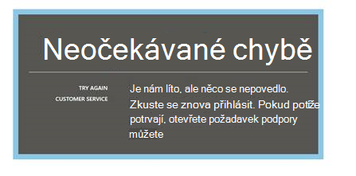
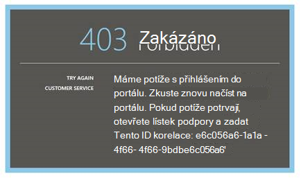
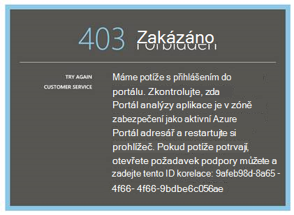
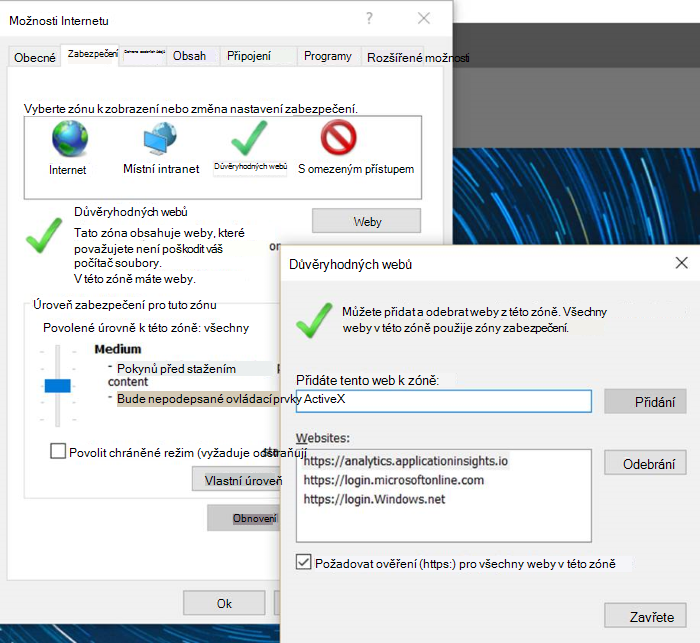
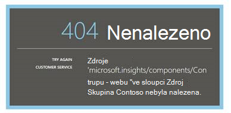
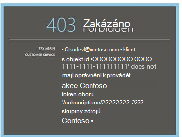
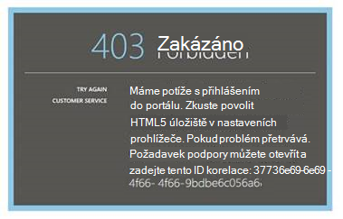
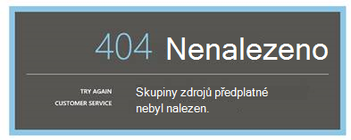
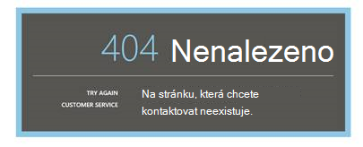

<properties 
    pageTitle="Poradce při potížích s analýzy – nástroj výkonné vyhledávání aplikace přehledy | Microsoft Azure" 
    description="Máte problémy s aplikací přehledy analýzy? Začněte tady. " 
    services="application-insights" 
    documentationCenter=""
    authors="alancameronwills" 
    manager="douge"/>

<tags 
    ms.service="application-insights" 
    ms.workload="tbd" 
    ms.tgt_pltfrm="ibiza" 
    ms.devlang="na" 
    ms.topic="article" 
    ms.date="07/11/2016" 
    ms.author="awills"/>

# Poradce při potížích s analýzy v aplikaci přehledy

Máte problémy s [aplikací přehledy analýzy](app-insights-analytics.md)? Začněte tady. Technologie pro analýzu je nástroj výkonné hledání přehledy aplikace Visual Studio.

## Omezení

* V současné době jsou omezené těsně nad týden minulých dat výsledků dotazu.
* Testování v prohlížečích: nejnovější verze chromu, okraje a Internet Explorer.

## Rozšíření známé kompatibilní prohlížeče

* Ghostery

Zakázání rozšíření nebo použijte jiný prohlížeč.

##"Neočekávané chybě"

Při portálu runtime – neošetřené výjimce došlo k interní chybě.

* Vymazat mezipaměť prohlížeče. 

## 403... Zkuste znovu načíst

Ověřování souvisejících (během ověřování nebo access token generování) došlo k chybě. Na portálu pravděpodobně způsob, jak obnovit beze změny nastavení prohlížeče.

* Ověřte [Povolit cookies třetích stran](#cookies) v prohlížeči. 

## 403... ověření zóny zabezpečení

Ověřování souvisejících (během ověřování nebo access token generování) došlo k chybě. Na portálu pravděpodobně způsob, jak obnovit beze změny nastavení prohlížeče.

1. Ověřte [Povolit cookies třetích stran](#cookies) v prohlížeči. 

2. Použijete Oblíbené položky, záložku nebo uložený odkaz k otevření portálu technologie pro analýzu? Jste přihlášení pomocí jiného pověření, než se vyvolají jste uložili na odkaz?

2. Zkuste použít v soukromé nebo okno prohlížeče okně (po zavření všechna okna). Budete muset zadat svoje přihlašovací údaje. 

2. Otevřete jiné okno (obyčejný) prohlížeče a přejděte na [Azure](https://portal.azure.com). Odhlaste se. Otevřete odkaz a přihlaste se pomocí správné přihlašovací údaje.

2. Okraje a Internet Explorer uživatelé dostali k této chybě, když důvěryhodné zóny nastavení nejsou podporovaná.

    Ověřte, jestli [portál technologie pro analýzu](https://analytics.applicationinsights.io) a [Azure Active Directory portál](https://portal.azure.com) jsou ve stejném zóny zabezpečení:

 * V Internet Exploreru otevřete **Možnosti Internetu** **zabezpečení**, **Důvěryhodné weby**, **weby**:

    

    V seznamu webů Pokud některý z následujících adres URL jsou však započítávány, zkontrolujte, že ostatní jsou však započítávány také:

    https://Analytics.applicationinsights.IO 
   https://Login.microsoftonline.com 
   https://Login.Windows.NET

## 404 … Zdroje nenašlo se.

Prostředek aplikace odstranila přehledy aplikace a už není dostupná. Tomu může dojít, pokud jste soubor uložili adresu URL na stránku analýzy.

## 403 … Povolení

Nemáte oprávnění k otevření aplikace v analýzy.

* Jste získali od někoho jiného na odkaz? Požádejte je, abyste měli jistotu, že se nacházíte v [čteček nebo přispěvatelů pro tuto skupinu zdrojů](app-insights-resources-roles-access-control.md).
* Jste uložili na odkaz pomocí různých přihlašovacích údajů? Otevřete [Azure portálu](https://portal.azure.com)odhlásit a pak to zkuste tento odkaz znovu poskytující správné přihlašovací údaje.

## 403... Úložiště HTML5

Náš portálem používá HTML5 localStorage a sessionStorage.

* Chrome: Nastavení ochrany osobních údajů, nastavení obsahu.
* Internet Explorer: Možnosti Internetu, Upřesnit, zabezpečení, povolit úložiště DOM.

## 404 … Předplatné nenašlo se.

Adresa URL je neplatný. 

* Otevřete aplikaci zdroje [Aplikace přehledy](https://portal.azure.com)portálu. Pak můžete pomocí tlačítka analýzy.

## 404 … neexistuje stránky

Adresa URL je neplatný.

* Otevřete aplikaci zdroje [Aplikace přehledy](https://portal.azure.com)portálu. Pak můžete pomocí tlačítka analýzy.

## Povolit cookies třetích stran

  Přečtěte si, [jak zakázat cookies třetích stran](http://www.digitalcitizen.life/how-disable-third-party-cookies-all-major-browsers), ale Všimněte si, že je třeba **Povolit** je.

## Pokud všechno ostatní selže    

[Kontaktujte nás](app-insights-get-dev-support.md).
 
[AZURE.INCLUDE [app-insights-analytics-footer](../../includes/app-insights-analytics-footer.md)]

