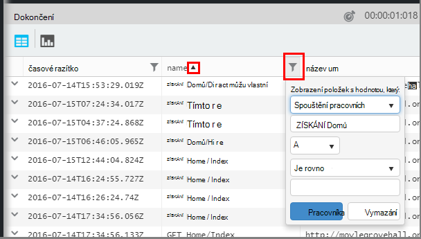

<properties 
    pageTitle="Použití technologie pro analýzu – nástroj výkonné vyhledávání aplikace přehledy | Microsoft Azure" 
    description="Použití analýzy, nástroj výkonné diagnostiky hledání přehledy aplikace. " 
    services="application-insights" 
    documentationCenter=""
    authors="danhadari" 
    manager="douge"/>

<tags 
    ms.service="application-insights" 
    ms.workload="tbd" 
    ms.tgt_pltfrm="ibiza" 
    ms.devlang="na" 
    ms.topic="article" 
    ms.date="10/21/2016" 
    ms.author="awills"/>

# Použití technologie pro analýzu v aplikaci přehledy

[Technologie pro analýzu](app-insights-analytics.md) je funkce výkonné vyhledávání [Aplikace přehledy](app-insights-overview.md). Tyto stránky popisují dotazovací jazyk analýzy.

* **[Podívejte se na úvodní video](https://applicationanalytics-media.azureedge.net/home_page_video.mp4)**.
* **[Vyzkoušení analýzy na naše simulovaný data](https://analytics.applicationinsights.io/demo)** při aplikace není odesílání dat pro přehledy aplikaci ještě.

## Otevřít analýzy

Z vaší aplikaci domácí zdrojů v aplikaci přehledy klikněte na analýza.

Kurz vložené nabízí několik dalších rad o tom, co můžete dělat.

Je [zde rozsáhlejší prohlídku](app-insights-analytics-tour.md).

## Dotaz vaší telemetrie

### Vytvořit dotaz

Začněte s názvy tabulek uvedená na levé straně (nebo operátory [oblasti](app-insights-analytics-reference.md#range-operator) nebo [unie](app-insights-analytics-reference.md#union-operator) ). Použití `|` a vytvořte příležitost [operátorů](app-insights-analytics-reference.md#queries-and-operators). Technologie IntelliSense výzvu operátory a některé prvky výrazu, které můžete použít.

Podívejte se na [Přehled sad language technologie pro analýzu](app-insights-analytics-tour.md) a [reference jazyka](app-insights-analytics-reference.md).

### Spuštění dotazu

1. Jeden řádek konce můžete použít v dotazu.
2. Umístěte kurzor uvnitř nebo na konci dotaz, který chcete spustit.
3. Klikněte na Přejít na spusťte dotaz.
4. V dotazu, nevkládejte prázdné řádky. Můžete mít několik samostatnému dotazů v dotazu tabulátory oddělte je prázdné řádky. Spustí pouze z nich kurzor.

### Uložení dotazu

1. Uložení aktuálního souboru dotazu.
2. Otevřete soubor uložený dotaz.
3. Vytvoření nového souboru dotazu.

## Zobrazit podrobnosti

Rozbalte položku všechny řádky ve výsledcích zobrazíte jeho úplný seznam vlastností. Dál můžete rozbalit některé z vlastností hodnota strukturovaných – například, vlastní rozměry nebo zásobníku zobrazení na výjimku.

 

## Uspořádání výsledků

Můžete řadit, filtrovat, stránkování a seskupit výsledky z dotazu.

> [AZURE.NOTE] Řazení, seskupení a filtrování v prohlížeči není znovu spustit dotaz. Jsou pouze uspořádat výsledky, které byly vrácené svého posledního dotazu. 
> 
> Provádět tyto úkoly na serveru před výsledky jsou vráceny, napište svůj dotaz operátory [řazení](app-insights-analytics-reference.md#sort-operator) [sumarizovat](app-insights-analytics-reference.md#summarize-operator) a [kde](app-insights-analytics-reference.md#where-operator) .

Vyberte sloupce, které chcete vidět, přetáhněte záhlaví sloupce změníte jejich uspořádání a změna velikosti sloupců přetažením jeho okraje.

### Řazení a filtrování položek

Seřaďte výsledky kliknutím na záhlaví sloupce. Znovu seřadit jiným způsobem a klepněte na tlačítko u jiného času se vrátit k původní pořadí vrácených v dotazu.

Pokud chcete hledání zpřesnit pomocí na ikonu filtru.

### Seskupit položky

Pokud chcete řadit podle víc než jednoho sloupce, použijte seskupení. Ji nejprve povolit a potom přetáhněte záhlaví sloupců do pole nad tabulkou.

### Chybějící některé výsledky?

Existuje limit asi 10 kB řádků na výsledky z portálu. Upozornění se zobrazí, když přejdete myší limit. Pokud k tomu dojde, řazení výsledků v tabulce vždy se nezobrazí všechny skutečné první nebo poslední výsledky. 

Je vhodné, chcete-li předejít zasažení limit. Použijte operátory, jako je:

* [Pokud časové razítko > ago(3d)](app-insights-analytics-reference.md#where-operator)
* [100 nejvyšších tak, že časové razítko](app-insights-analytics-reference.md#top-operator) 
* [Prohlédněte 100](app-insights-analytics-reference.md#take-operator)
* [Souhrn](app-insights-analytics-reference.md#summarize-operator) 

## Diagramy

Vyberte typ diagramu, který budete chtít:

Pokud ještě několika sloupců typů vpravo můžete x a y osy a sloupec rozměry rozdělení výsledky podle.

Ve výchozím nastavení výsledky jsou zobrazena jako tabulku a vyberete diagram ručně. Ale můžete použít [vykreslování směrnice](app-insights-analytics-reference.md#render-directive) na konci dotazu vyberte diagramu.

## Připnout do řídicího panelu

Připnutí diagramu nebo tabulky do jedné ze svého [sdíleného řídicí panely](app-insights-dashboards.md) – jenom klikněte na kód pin. (Možná potřebujete [upgrade že aplikace pro uživatele ceny balíček](app-insights-pricing.md) pro tuto funkci zapnout.) 

To znamená, že přepnete společně řídicího panelu pomáhá sledovat se výkonu a použití te000126961 webové služby, můžete zahrnout jsou složité analýzy vedle jiné metriky. 

Pokud má čtyři nebo méně sloupce můžete připnout tabulky na řídicím panelu. Jsou zobrazeny pouze horních řádků sedm.

#### Aktualizace řídicího panelu

Graf připnuté na řídicí panel je automaticky aktualizován opětovným spuštěním dotazu zhruba každých půl hodiny.

#### Automatické zjednodušení

V některých případech použijí určitých zjednodušení do grafu se při připnout do řídicího panelu.

Když pin graf zobrazující spoustu samostatné intervalů (obvykle pruhového grafu), méně vyplněné intervaly se automaticky seskupené do jednoho intervalu: "jiné". Tento dotaz:

    requests | summarize count_search = count() by client_CountryOrRegion

Prohledá analýzy takto:

ale pokud připnete do řídicího panelu, vypadá takto:

## Export do aplikace Excel

Po opakovaném spuštění dotazu, můžete si stáhnout soubor CSV. Klikněte na **Exportovat do Excelu**.

## Export do Power BI

Umístěte kurzor na místo v dotazu a vyberte **Export do Power BI**.

Spuštění dotazu v Power BI. Můžete nastavit tak aktualizovat podle plánu.

S licencí Power BI můžete vytvořit řídicí panely, které přenést data z nejrůznějších zdrojů.

[Další informace o exportu k Power BI](app-insights-export-power-bi.md)

[AZURE.INCLUDE [app-insights-analytics-footer](../../includes/app-insights-analytics-footer.md)]

