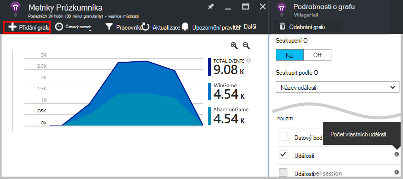
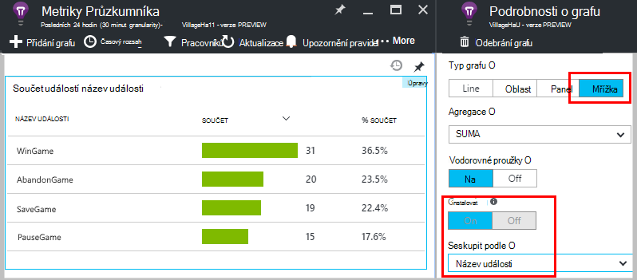
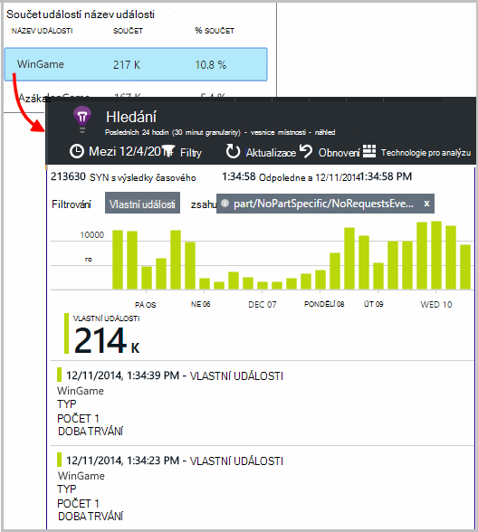
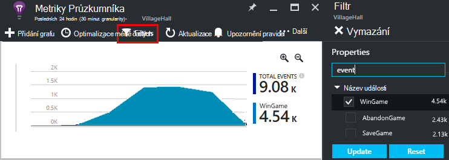
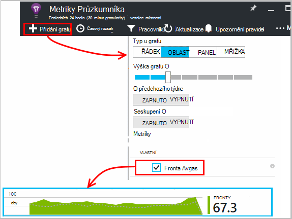
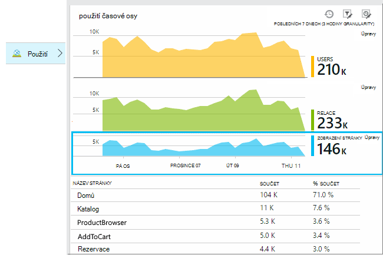
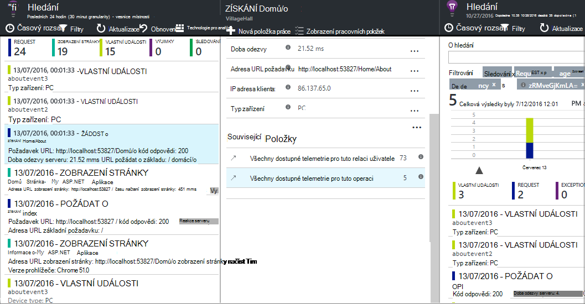
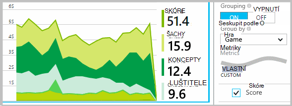
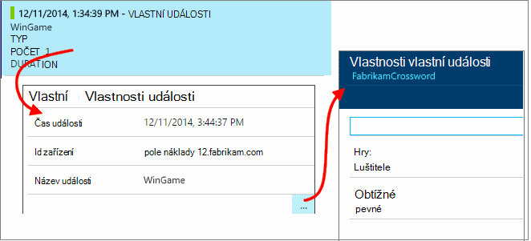
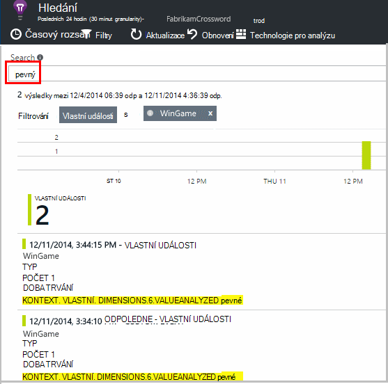

<properties 
    pageTitle="Rozhraní API aplikace přehledy pro vlastní události a metriky | Microsoft Azure" 
    description="Vložení několika řádky kódu zařízení nebo plochy aplikace, webovou stránku nebo službu ke sledování použití a Diagnostika problémů s." 
    services="application-insights"
    documentationCenter="" 
    authors="alancameronwills" 
    manager="douge"/>
 
<tags 
    ms.service="application-insights" 
    ms.workload="tbd" 
    ms.tgt_pltfrm="ibiza" 
    ms.devlang="multiple" 
    ms.topic="article" 
    ms.date="10/19/2016" 
    ms.author="awills"/>

# <a name="application-insights-api-for-custom-events-and-metrics"></a>Rozhraní API aplikace přehledy pro vlastní události a metriky 

*Přehledy aplikace je v náhledu.*

Vložení několika řádky kódu v aplikaci, pokud chcete zjistit, co uživatelé dělají s ním nebo lépe diagnostikovat potíže. Odeslání telemetrie ze zařízení a desktop weboví klienti a webových serverů. Základní telemetrie [Přehledy aplikace Visual Studio](app-insights-overview.md) rozhraní API můžete odeslat vlastní události a metriky a vlastní verzích standardní telemetrie. Toto rozhraní API je se stejným rozhraním API, používaná standardní kolekcí dat aplikace přehledy.

## <a name="api-summary"></a>Rozhraní API souhrn

Rozhraní API je jednotné na všech platformách kromě několik malé varianty.

Metoda | Použít pro
---|---
[`TrackPageView`](#page-views) | Stránky, obrazovky, listy nebo formulářů
[`TrackEvent`](#track-event) | Akce uživatelů a dalších událostí. Slouží ke sledování chování uživatele nebo ke sledování výkonu.
[`TrackMetric`](#track-metric) | Měření výkonu například fronty délky nesouvisí s zvláštní události
[`TrackException`](#track-exception)|Přihlaste se výjimky pro diagnostiku. Trasovat jejich vzniku vzhledem k jiné události a zkontrolovat vrstvě.
[`TrackRequest`](#track-request)| Přihlaste se četnost a dobu trvání požadavky serveru pro analýzu výkonu.
[`TrackTrace`](#track-trace)|Diagnostickém protokolu zprávy. Můžete získat protokoly 3rd výrobce.
[`TrackDependency`](#track-dependency)|Přihlaste se dobu trvání a volání externích součástí, na kterých aplikace závisí.

Můžete [připojit vlastnosti a metriky](#properties) nejčastěji tyto telemetrie volání. 


## <a name="prep"></a>Než začnete

Pokud jste to ještě neudělali:

* Přidání SDK přehledy aplikace do projektu:
 * [Projektu ASP.NET][greenbrown]
 * [Java projektu][java] 
 * [JavaScript v každé webové stránky][client]   

* Ve vašem zařízení nebo webový server kódu patří:

    *C#:*`using Microsoft.ApplicationInsights;`

    *VB:*`Imports Microsoft.ApplicationInsights`

    *Java:*`import com.microsoft.applicationinsights.TelemetryClient;`

## <a name="construct-a-telemetryclient"></a>Vytvářet TelemetryClient

Vytvořit instanci TelemetryClient (s výjimkou JavaScriptu na webových stránkách):

*C#:* 

    private TelemetryClient telemetry = new TelemetryClient();

*VB:* 

    Private Dim telemetry As New TelemetryClient

*Java*

    private TelemetryClient telemetry = new TelemetryClient();

TelemetryClient je XLL s podporou vlákna.

Doporučujeme použít instanci `TelemetryClient` u každého modulu aplikace. Například, může mít jednu `TelemetryClient` ve vaší webové služby a nahlaste příchozí požadavků http a druhý třída middleware se sestava obchodní logiky události. Můžete nastavit vlastnosti `TelemetryClient.Context.User.Id` ke sledování uživatele a relace, nebo `TelemetryClient.Context.Device.Id` k identifikaci počítače. Tyto informace se připojuje k všechny události odeslaný instance.


## <a name="track-event"></a>Sledování událostí

V aplikaci přehledy je nastavit jako *vlastní události* datový bod, které můžete zobrazit i v [Průzkumníku metriky] [ metrics] jako souhrnné počet a také jako jednotlivé výskyty [Diagnostiky]hledání[diagnostic]. (Není ve spojení s MVC nebo jiných framework "události.") 

Vložení TrackEvent volání v kódu počítat jak často uživatelé vyberte konkrétní funkci, jak často se dosažení konkrétní cílů, nebo možná provést určité typy chybu. 

Herní aplikace odešlete události pokaždé, když uživatel wins hry: 

*JavaScript*

    appInsights.trackEvent("WinGame");

*C#*
    
    telemetry.TrackEvent("WinGame");

*JAZYKA VISUAL BASIC*


    telemetry.TrackEvent("WinGame")

*Java*

    telemetry.trackEvent("WinGame");


### <a name="view-your-events-in-the-azure-portal"></a>Zobrazit události na portálu Azure

Chcete-li zobrazit počet události, otevřete zásuvné [Metriky Průzkumníka](app-insights-metrics-explorer.md) , přidat nový graf a vyberte události.  



Pokud chcete porovnat počty různé události, nastavil typ grafu a mřížka skupiny název události:




V mřížce klikejte na tlačítko název události zobrazíte jednotlivých výskytů dané události.



Klikněte na kterýkoliv výskyt zobrazíte více podrobností.

Zaměření na určitých událostech v hledání nebo míru Průzkumník nastavte filtr zásuvné názvy událostí, které vás zajímá:



## <a name="track-metric"></a>Sledování míru

Pomocí TrackMetric odesílat metriky, které nejsou přiřazené k zvláštní události. Délka fronty může například sledovat v pravidelných intervalech. 

Metriky jsou zobrazeny jako statistické grafy v metrických Průzkumník Windows, ale na rozdíl od události, se nedají vyhledávat jednotlivé výskyty diagnostiky hledání.

Musí být metrických hodnoty > = 0 správně zobrazovat.


*JavaScript*

    appInsights.trackMetric("Queue", queue.Length);

*C#*

    telemetry.TrackMetric("Queue", queue.Length);

*JAZYKA VISUAL BASIC*

    telemetry.TrackMetric("Queue", queue.Length)

*Java*

    telemetry.trackMetric("Queue", queue.Length);

Ve skutečnosti to můžete udělat v vlákna pozadí:

*C#*

    private void Run() {
     var appInsights = new TelemetryClient();
     while (true) {
      Thread.Sleep(60000);
      appInsights.TrackMetric("Queue", queue.Length);
     }
    }


Pokud chcete zobrazit výsledky, spusťte Průzkumníka metriky a přidejte nový graf. Nastavte, aby zobrazení vašeho míru.



Existují některá [omezení počtu metriky](#limits) můžete použít.

## <a name="page-views"></a>Zobrazení stránky

V zařízení nebo webovou stránku aplikaci telemetrie zobrazení stránky jsou odeslány ve výchozím nastavení při načtení každý obrazovky nebo stránky Ale můžete změnit tak, aby sledování zobrazení stránky na další nebo jiný čas. Například v aplikaci, která zobrazí karty nebo listy, můžete sledovat "stránka" při každém otevření nové zásuvné. 



Uživatelů a relací odesílaly jako vlastnosti spolu s zobrazení stránky, tak po telemetrie zobrazení stránky poutavější grafy uživatele a relace.

#### <a name="custom-page-views"></a>Zobrazení vlastní stránky

*JavaScript*

    appInsights.trackPageView("tab1");

*C#*

    telemetry.TrackPageView("GameReviewPage");

*JAZYKA VISUAL BASIC*

    telemetry.TrackPageView("GameReviewPage")


Pokud ještě několika karty v rámci jiné stránky HTML je příliš zadejte adresu URL:

    appInsights.trackPageView("tab1", "http://fabrikam.com/page1.htm");

#### <a name="timing-page-views"></a>Zobrazení stránky časování

Ve výchozím nastavení časy hlášené jako "Stránka zobrazení zatížení time" jsou měřeno od, když prohlížeč odesílá pozvánce na schůzku, dokud se nazývá události načtení stránky v prohlížeči.

Místo toho můžete buď:

* Nastavte explicitní dobu trvání v rámci hovoru [trackPageView](https://github.com/Microsoft/ApplicationInsights-JS/blob/master/API-reference.md#trackpageview) .
 * `appInsights.trackPageView("tab1", null, null, null, durationInMilliseconds);`
* Použití zobrazení stránky časování volání `startTrackPage` a `stopTrackPage`.

*JavaScript*

    // To start timing a page:
    appInsights.startTrackPage("Page1");

... 

    // To stop timing and log the page:
    appInsights.stopTrackPage("Page1", url, properties, measurements);

Název použijete jako první parametr přidruží spuštění a ukončení volání. Ve výchozím nastavení názvu aktuální stránky. 

Výsledný stránky zatížení doby trvání zobrazenou v Průzkumníku míru jsou odvozeny od interval mezi spuštění a ukončení volání. Je pro vás jaké interval skutečně čas.

## <a name="track-request"></a>Žádost o sledování

Lze pomocí serveru SDK protokolu HTTP žádosti. 

Můžete také volat ho sami Pokud chcete, aby napodobily požadavky v kontextu, kdy nemáte k dispozici modulu webových služeb systém.

*C#*

    // At start of processing this request:

    // Operation Id and Name are attached to all telemetry and help you identify
    // telemetry associated with one request:
    telemetry.Context.Operation.Id = Guid.NewGuid().ToString();
    telemetry.Context.Operation.Name = requestName;
    
    var stopwatch = System.Diagnostics.Stopwatch.StartNew();

    // ... process the request ...

    stopwatch.Stop();
    telemetry.TrackRequest(requestName, DateTime.Now,
       stopwatch.Elapsed, 
       "200", true);  // Response code, success


## <a name="operation-context"></a>Operace kontextu

Položky telemetrie můžete spojenou společně pomocí programovém připojování k nim společná operace ID. Standardní požadavek sledování modul to dělá výjimky a dalších událostí odeslané během zpracování požadavku HTTP. [Hledání](app-insights-diagnostic-search.md) a [technologie pro analýzu](app-insights-analytics.md)můžete použít ID snadno najít všechny události spojené s žádostí o. 

Nejjednodušší způsob, jak nastavit ID je kontext operace můžete nastavit pomocí tohoto vzoru:

    // Establish an operation context and associated telemetry item:
    using (var operation = telemetry.StartOperation<RequestTelemetry>("operationName"))
    {
        // Telemetry sent in here will use the same operation ID.
        ...
        telemetry.TrackEvent(...); // or other Track* calls
        ...
        // Set properties of containing telemetry item - for example:
        operation.Telemetry.ResponseCode = "200";
        
        // Optional: explicitly send telemetry item:
        telemetry.StopOperation(operation);

    } // When operation is disposed, telemetry item is sent.

I nastavit operace kontext, `StartOperation` vytvoří položku telemetrie typu a odešle, když vyřadit operace nebo explicitně volat `StopOperation`. Pokud používáte `RequestTelemetry` psaní telemetrie poté jeho trvání je nastavte se časový interval mezi spuštění a ukončení.

Nemůžou být vnořená kontexty operace. Pokud je už operace kontext, je jeho ID přidružený všechny obsažené položek, včetně položky vytvořené pomocí StartOperation.

Do pole hledání v kontextu operace slouží k vytvoření seznamu související položky:




## <a name="track-exception"></a>Sledování výjimce

Odeslání výjimky pro přehledy aplikace: [spočítat][metrics], jako údaje o četnosti problém; a [prozkoumání jednotlivé výskyty][diagnostic]. Zprávy obsahovat trasování vrstvě.

*C#*

    try
    {
        ...
    }
    catch (Exception ex)
    {
       telemetry.TrackException(ex);
    }

*JavaScript*

    try
    {
       ...
    }
    catch (ex)
    {
       appInsights.trackException(ex);
    }

SDK zachytit mnoho výjimky automaticky, abyste se nemuseli vždy volání TrackException explicitně.

* Technologie ASP.NET: [kódu zachytit výjimky](app-insights-asp-net-exceptions.md)
* [Výjimky spadají do automaticky](app-insights-java-get-started.md#exceptions-and-request-failures) J2EE:
* JavaScript: Zachycených automaticky. Pokud chcete zakázat automatické kolekce, přidání řádku do fragment kódu pro vložení na webových stránkách:

    ```
    ({
      instrumentationKey: "your key"
      , disableExceptionTracking: true
    })
    ```


## <a name="track-trace"></a>Přehled sledování 

Slouží k lépe diagnostikovat potíže tak, že navigace s popisem cesty záznam přehledy aplikace. Můžete odeslat diagnostické dat a zkontrolovat [diagnostiky]hledání[diagnostic]. 

 

[Přihlaste se adaptéry] [ trace] použít toto rozhraní API k odeslání protokolů třetích stran k portálu.


*C#*

    telemetry.TrackTrace(message, SeverityLevel.Warning, properties);


Můžete vyhledávat obsah zprávy, ale (na rozdíl od nemovitostí s hodnotou), filtrovat nelze ji.

Omezení velikosti na `message` výrazně vyšší než limit na vlastnosti.
Výhodou TrackTrace je relativně dlouhých data můžete umístit do zprávy. Můžete třeba kódovat datech příspěvek.  


Kromě toho můžete přidat úroveň závažnosti do zprávy. A podobně jako jiné telemetrie můžete přidat nemovitostí s hodnotou, které mohou být užitečné filtru nebo hledání pro různé sady trasování. Příklad:


    var telemetry = new Microsoft.ApplicationInsights.TelemetryClient();
    telemetry.TrackTrace("Slow database response",
                   SeverityLevel.Warning,
                   new Dictionary<string,string> { {"database", db.ID} });

To, vám umožní [vyhledávání][diagnostic], snadno odfiltrovat všech zpráv úroveň konkrétní závažnosti týkající se určitého databáze.

## <a name="track-dependency"></a>Sledování závislostí

Pomocí tohoto hovoru můžete sledovat doby odezvy a úspěšnosti volání externí část kódu. Výsledky se zobrazí v grafech závislost na portálu. 

```C#

            var success = false;
            var startTime = DateTime.UtcNow;
            var timer = System.Diagnostics.Stopwatch.StartNew();
            try
            {
                success = dependency.Call();
            }
            finally
            {
                timer.Stop();
                telemetry.TrackDependency("myDependency", "myCall", startTime, timer.Elapsed, success);
            }
```

Myslete na to, že server SDK zahrnout [závislost modul](app-insights-dependencies.md) , který zjistí a sleduje určitých závislost volá automaticky – třeba k databázím a rozhraní REST API. Budete muset nainstalovat agent na serveru být modulu práce. Pokud chcete sledovat hovory, které nejsou zachyceny automatické sledování nebo pokud nechcete, aby nainstalovat agent použijete tento hovor.

Vypnout modulu standardní závislostí sledování, úpravy [ApplicationInsights.config](app-insights-configuration-with-applicationinsights-config.md) a odstranění odkaz na `DependencyCollector.DependencyTrackingTelemetryModule`.


## <a name="flushing-data"></a>Vyčištění dat

Za normálních okolností SDK odešle data v některých případech rozhodli minimalizovat vliv na uživatele. Však v některých případech můžete chtít vyprázdněte vyrovnávací paměť – například, pokud používáte v SDK v aplikaci, která vypne.

*C#*

    telemetry.Flush();

    // Allow some time for flushing before shutdown.
    System.Threading.Thread.Sleep(1000);

Všimněte si, že funkce asynchronní [serveru telemetrie kanál](https://www.nuget.org/packages/Microsoft.ApplicationInsights.WindowsServer.TelemetryChannel/), ale synchronní, pokud se rozhodnete sdělit nám kanál v paměti nebo [trvalý kanál](app-insights-api-filtering-sampling.md#persistence-channel).


## <a name="authenticated-users"></a>Ověřených uživatelů

Ve web appu uživatelé jsou ve výchozím nastavení označenými souborů cookie. Uživatel může mají být spočítány víckrát by přístup k aplikaci z jiného počítače nebo prohlížeče nebo odstraňování souborů cookie. 

Ale pokud uživatelé přihlásit k aplikaci, můžete získat přesnější počet nastavením id ověřeného uživatele v prohlížeči kódu:

*JavaScript*

```JS
    // Called when my app has identified the user.
    function Authenticated(signInId) {
      var validatedId = signInId.replace(/[,;=| ]+/g, "_");
      appInsights.setAuthenticatedUserContext(validatedId);
      ...
    }
```

V kterými webové aplikace MVC, například:

*Razor*

        @if (Request.IsAuthenticated)
        {
            <script>
                appInsights.setAuthenticatedUserContext("@User.Identity.Name
                   .Replace("\\", "\\\\")"
                   .replace(/[,;=| ]+/g, "_"));
            </script>
        }

Není nutné použít aktuální přihlašovací jméno uživatele. Pouze musí být id, které jsou jedinečné pro daného uživatele. Nesmí obsahovat mezery ani znaky `,;=|`. 

Id uživatele je také nastavit v cookie relace a odeslaných na server. Pokud server SDK nainstalovaný, id ověřený uživatel odešle jako součást vlastností kontextu klienta a serveru telemetrie tak, aby se daly filtrovat a hledání na něj.

Pokud aplikace skupiny uživatelů do účty, můžete také předáte identifikátor účtu (plus pár stejné omezení znaků).


      appInsights.setAuthenticatedUserContext(validatedId, accountId);

Vytvoření grafu, který počítá **Uživatelé ověřený** a **uživatelských účtů**v [Průzkumníkovi metriky](app-insights-metrics-explorer.md). 

Také je možné [Hledat] [ diagnostic] klienta datových bodů s konkrétní uživatelská jména a účty.

## <a name="properties"></a>Filtrování, hledání a segmentech dat s vlastnostmi

Můžete připojit k události vlastnosti a měření (a také metriky, stránky zobrazení, výjimky a jiných telemetrickými daty).

**Vlastnosti** jsou zobrazené hodnoty řetězce, které můžete použít k filtrování telemetrie v sestavy využití. Například pokud aplikace obsahuje několik hry, budete chtít připojit název hry pro každou událost tak, aby bylo vidět her, které jsou více Oblíbené. 

Existuje limit asi 1 kB na délka řetězce. (Pokud chcete odeslat velké množství dat, použijte parametr zprávy [TrackTrace](#track-trace).)

**Metriky** jsou číselné hodnoty, které lze zobrazit graficky. Můžete například zjistit, zda je postupné zvýšení skóre, které vaše hráče dosažení. Grafy mohou být rozdělené vlastnosti odeslaným pomocí události, tak, aby mohl samostatné nebo do skládaného grafy pro různé hry.

Musí být metrických hodnoty > = 0 správně zobrazovat.


Existují některá [omezení počtu vlastnosti, hodnot nemovitostí a metriky](#limits) , které můžete použít.


*JavaScript*

    appInsights.trackEvent
      ("WinGame",
         // String properties:
         {Game: currentGame.name, Difficulty: currentGame.difficulty},
         // Numeric metrics:
         {Score: currentGame.score, Opponents: currentGame.opponentCount}
         );

    appInsights.trackPageView
        ("page name", "http://fabrikam.com/pageurl.html",
          // String properties:
         {Game: currentGame.name, Difficulty: currentGame.difficulty},
         // Numeric metrics:
         {Score: currentGame.score, Opponents: currentGame.opponentCount}
         );
          

*C#*

    // Set up some properties and metrics:
    var properties = new Dictionary <string, string> 
       {{"game", currentGame.Name}, {"difficulty", currentGame.Difficulty}};
    var metrics = new Dictionary <string, double>
       {{"Score", currentGame.Score}, {"Opponents", currentGame.OpponentCount}};

    // Send the event:
    telemetry.TrackEvent("WinGame", properties, metrics);


*JAZYKA VISUAL BASIC*

    ' Set up some properties:
    Dim properties = New Dictionary (Of String, String)
    properties.Add("game", currentGame.Name)
    properties.Add("difficulty", currentGame.Difficulty)

    Dim metrics = New Dictionary (Of String, Double)
    metrics.Add("Score", currentGame.Score)
    metrics.Add("Opponents", currentGame.OpponentCount)

    ' Send the event:
    telemetry.TrackEvent("WinGame", properties, metrics)


*Java*
    
    Map<String, String> properties = new HashMap<String, String>();
    properties.put("game", currentGame.getName());
    properties.put("difficulty", currentGame.getDifficulty());
    
    Map<String, Double> metrics = new HashMap<String, Double>();
    metrics.put("Score", currentGame.getScore());
    metrics.put("Opponents", currentGame.getOpponentCount());
    
    telemetry.trackEvent("WinGame", properties, metrics);


> [AZURE.NOTE] Dávejte pozor, abyste protokolu identifikovatelné osobní údaje v dialogovém okně Vlastnosti.

**Pokud jste použili metriky**, spusťte Průzkumníka metriky a vyberte metriky z vlastní skupiny:


*Pokud se nezobrazuje váš metrické nebo nadpisem vlastní nenaleznete, zavřete zásuvné výběru a opakujte později. Někdy může trvat hodinu pro metriky agregován prostřednictvím kanálu.*

**Pokud jste použili vlastnosti a metriky**segmentu míru tak, že vlastnost:





**V diagnostiky hledání**, můžete zobrazit vlastnosti a metriky jednotlivé výskyty události.





Zobrazíte výskyty události s hodnotou nemovitosti konkrétní pomocí vyhledávacího pole.




[Další informace o hledaných výrazů][diagnostic].

#### <a name="alternative-way-to-set-properties-and-metrics"></a>Alternativní způsob, jak nastavit vlastnosti a metriky

Pokud je pohodlnější, získáte parametry události v samostatném objektu:

    var event = new EventTelemetry();

    event.Name = "WinGame";
    event.Metrics["processingTime"] = stopwatch.Elapsed.TotalMilliseconds;
    event.Properties["game"] = currentGame.Name;
    event.Properties["difficulty"] = currentGame.Difficulty;
    event.Metrics["Score"] = currentGame.Score;
    event.Metrics["Opponents"] = currentGame.Opponents.Length;

    telemetry.TrackEvent(event);

> [AZURE.WARNING] Není opětovné použití stejné instanci položku telemetrie (`event` v tomto příkladu) zavolat Track*() tisknutím. To může způsobit telemetrie k odeslání nesprávná konfigurace.


## <a name="timed"></a>Události časování

Někdy se podíváte graf, jak dlouho k provedení určité akce. Například, možná budete chtít zjistit, jak dlouho uživatelé dělat vzít v úvahu volby hry. Toto je užitečné příklady použití parametru měrných jednotek.


*C#*

    var stopwatch = System.Diagnostics.Stopwatch.StartNew();

    // ... perform the timed action ...

    stopwatch.Stop();

    var metrics = new Dictionary <string, double>
       {{"processingTime", stopwatch.Elapsed.TotalMilliseconds}};

    // Set up some properties:
    var properties = new Dictionary <string, string> 
       {{"signalSource", currentSignalSource.Name}};

    // Send the event:
    telemetry.TrackEvent("SignalProcessed", properties, metrics);


## <a name="defaults"></a>Výchozí vlastnosti pro vlastní telemetrie

Pokud chcete nastavit výchozí hodnoty vlastností pro některé vlastní události, které jste napsali, můžete nastavit v TelemetryClient. Jsou připojeny ke každé položky telemetrie odeslané z tohoto klienta. 

*C#*

    using Microsoft.ApplicationInsights.DataContracts;

    var gameTelemetry = new TelemetryClient();
    gameTelemetry.Context.Properties["Game"] = currentGame.Name;
    // Now all telemetry will automatically be sent with the context property:
    gameTelemetry.TrackEvent("WinGame");
    
*JAZYKA VISUAL BASIC*

    Dim gameTelemetry = New TelemetryClient()
    gameTelemetry.Context.Properties("Game") = currentGame.Name
    ' Now all telemetry will automatically be sent with the context property:
    gameTelemetry.TrackEvent("WinGame")

*Java*

    import com.microsoft.applicationinsights.TelemetryClient;
    import com.microsoft.applicationinsights.TelemetryContext;
    ...


    TelemetryClient gameTelemetry = new TelemetryClient();
    TelemetryContext context = gameTelemetry.getContext();
    context.getProperties().put("Game", currentGame.Name);
    
    gameTelemetry.TrackEvent("WinGame");


    
Volání jednotlivé telemetrie můžete přepsat výchozí hodnoty v jejich vlastnost slovníky.

**JavaScript u webových klientů**, [použijte inicializátory telemetrie JavaScript](#js-initializer).

**Chcete-li přidat vlastnosti, budou všechny telemetrie** včetně data z standardní kolekce moduly [implementace `ITelemetryInitializer` ](app-insights-api-filtering-sampling.md#add-properties).


## <a name="sampling-filtering-and-processing-telemetry"></a>Odběr, filtrování a zpracování telemetrie 

Můžete napsat kód zpracuje vaše telemetrie odesílá ze sady SDK. Zpracování obsahuje údaje o odesílaným z moduly standardní telemetrie například závislost shromažďování a kolekce žádost HTTP.

* [Přidat vlastnosti](app-insights-api-filtering-sampling.md#add-properties) telemetrie implementací `ITelemetryInitializer` – například přidat verze čísel nebo hodnoty se vypočítávají z jiné vlastnosti. 
* [Filtrování](app-insights-api-filtering-sampling.md#filtering) můžete změnit kliknutím na zahodit telemetrie před odesláním ze sady SDK implementací `ITelemetryProcesor`. Můžete určit, co se neodesílal nebo zrušit, ale je potřeba vzít v úvahu vliv na váš metriky. V závislosti na tom, jak zrušit položky může dojít ke ztrátě umožňuje přecházet mezi související položky.
* [Odběr](app-insights-api-filtering-sampling.md#sampling) je sbalený řešení snížit množství dat odeslaných z aplikace k portálu. Stejně tak beze změny zobrazeného metriky a beze změny možnost diagnostikovat potíže přechod mezi související položky například výjimek, požadavky a zobrazení stránky.

[Víc se uč](app-insights-api-filtering-sampling.md)


## <a name="disabling-telemetry"></a>Zakázání telemetrie

**Dynamicky zastavit a spustit** kolekci a předávání telemetrie:

*C#*

```C#

    using  Microsoft.ApplicationInsights.Extensibility;

    TelemetryConfiguration.Active.DisableTelemetry = true;
```

**Zakázání vybrané standardní kolekcí** – například výkonnosti, požadavky HTTP závislosti - odstranit nebo poznámky, příslušných řádků v [ApplicationInsights.config][config]. Může to uděláte, například pokud chcete odeslat TrackRequest data.

## <a name="debug"></a>Režimu Vývojář

Během ladění, je vhodné mít vaše telemetrie expedována prostřednictvím kanálu tak, aby se okamžitě zobrazí výsledky. Můžete taky získat další zprávy, které vám pomůžou trasovat problémy s telemetrie. Vypněte ho ve výrobním, jak je to může zpomalovat aplikace.


*C#*
    
    TelemetryConfiguration.Active.TelemetryChannel.DeveloperMode = true;

*JAZYKA VISUAL BASIC*

    TelemetryConfiguration.Active.TelemetryChannel.DeveloperMode = True


## <a name="ikey"></a>Nastavit klíč přístrojového vybavení pro vybranou vlastní telemetrie

*C#*
    
    var telemetry = new TelemetryClient();
    telemetry.InstrumentationKey = "---my key---";
    // ...


## <a name="dynamic-ikey"></a>Klíč dynamické přístrojového vybavení

Vyhněte se společným nahoru telemetrie z vývoj, test a výrobní prostředí, můžete [vytvořit samostatné aplikace přehledy prostředky] [ create] a změnit jejich klíče v závislosti prostředí.

Místo zobrazuje klávesu přístrojového vybavení z konfiguračního souboru, můžete nastavit tak v kódu. V metodu inicializace, například global.aspx.cs služby ASP.NET nastavte klíč:

*C#*

    protected void Application_Start()
    {
      Microsoft.ApplicationInsights.Extensibility.
        TelemetryConfiguration.Active.InstrumentationKey = 
          // - for example -
          WebConfigurationManager.Settings["ikey"];
      ...

*JavaScript*

    appInsights.config.instrumentationKey = myKey; 


Ve webových stránek můžete nastavit z webového serveru státu, nikoli doslova kódování do skriptu. Například na webové stránce generovaného v aplikaci pro ASP.NET:

*JavaScript v Razor*

    <script type="text/javascript">
    // Standard Application Insights web page script:
    var appInsights = window.appInsights || function(config){ ...
    // Modify this part:
    }({instrumentationKey:  
      // Generate from server property:
      @Microsoft.ApplicationInsights.Extensibility.
         TelemetryConfiguration.Active.InstrumentationKey"
    }) // ...


## <a name="telemetrycontext"></a>TelemetryContext

TelemetryClient má místní vlastnost, která obsahuje počet hodnot, které jsou odesílány spolu s všechny telemetrickými daty. Běžným způsobem se nastavují standardní telemetrie moduly, ale můžete taky nastavit je sami. Příklad:

    telemetry.Context.Operation.Name = "MyOperationName";

Pokud jste nastavili některou z těchto hodnot sami, zvažte příslušný řádek odebráním [ApplicationInsights.config][config]tak, aby vaše hodnoty a standardní hodnoty není nepřehledné.

* **Součásti** Určuje aplikace a jeho verzi
* **Zařízení** Údaje o zařízení, na kterém běží aplikace (ve webových aplikacích, tady je server nebo klientského zařízení, ze kterého se odesílá telemetrie)
* **InstrumentationKey** Určuje zdrojů aplikace přehledy v Azure, kde se má zobrazit telemetrie. Obvykle převzít z ApplicationInsights.config
* **Umístění** Určuje zeměpisné polohy zařízení.
* **Operace** Ve webových aplikacích, aktuální žádost HTTP. V dalších typů aplikace nastavíte takto událostí skupiny společně.
 * **ID**: vygenerovaných hodnota, která koreluje různé události, takže když kontrolujete kterékoliv události v diagnostiky hledání, můžete najít "související položky"
 * **Název**: identifikátor, obvykle adresu URL žádost HTTP. 
 * **SyntheticSource**: Pokud null ani prázdné, tento řetězec označuje, zdroji žádosti o označen jako testu robot nebo web. Ve výchozím nastavení se vyloučené ze výpočty v Průzkumníku metriky.
* **Vlastnosti** Vlastnosti, které jsou odeslány pomocí všechny telemetrickými daty. Lze přepsat v jednotlivých sledování * volání.
* **Relace** Určuje relaci. Id nastavenou vygenerované hodnoty, které se změní, když uživatel nebyla aktivní určitou dobu.
* **Uživatel** Informace o uživateli. 

## <a name="limits"></a>Omezení


[AZURE.INCLUDE [application-insights-limits](../../includes/application-insights-limits.md)]

*Jak se vyhnout zasažení limit rychlosti dat?*

* Použití [odběr](app-insights-sampling.md).

*Jak dlouho bude data k dispozici?*

* Přečtěte si téma [uchovávání dat a osobních údajů][data].


## <a name="reference-docs"></a>Odkaz dokumenty

* [Přehled technologie ASP.NET](https://msdn.microsoft.com/library/dn817570.aspx)
* [Přehled jazyka Java](http://dl.windowsazure.com/applicationinsights/javadoc/)
* [Odkaz JavaScript](https://github.com/Microsoft/ApplicationInsights-JS/blob/master/API-reference.md)
* [Android SDK](https://github.com/Microsoft/ApplicationInsights-Android)
* [iOS SDK](https://github.com/Microsoft/ApplicationInsights-iOS)


## <a name="sdk-code"></a>Kód SDK

* [Základní ASP.NET SDK](https://github.com/Microsoft/ApplicationInsights-dotnet)
* [ASP.NET 5](https://github.com/Microsoft/ApplicationInsights-aspnet5)
* [Balíčky systému Windows Server](https://github.com/Microsoft/applicationInsights-dotnet-server)
* [Java SDK](https://github.com/Microsoft/ApplicationInsights-Java)
* [JavaScript SDK](https://github.com/Microsoft/ApplicationInsights-JS)
* [Všechny platformy](https://github.com/Microsoft?utf8=%E2%9C%93&query=applicationInsights)

## <a name="questions"></a>Otázky

* *K čemu výjimky může vyvolat Track_() hovory?*
    
    Žádná. Nemusíte zalomení v zkuste skutečné klauzulí. Pokud v SDK zjistí problémy, ho bude přihlásit zprávy, které se zobrazí výstup konzoly ladění a – pokud zprávy zobrazí prostřednictvím - diagnostiky hledání.


* *Existuje rozhraní REST API pro získání dat z portálu?*

    Ano, brzy k dispozici. Použití mezitím [Nepřetržitý exportu](app-insights-export-telemetry.md).

## <a name="next"></a>Další kroky


[Hledání událostí a protokolování][diagnostic]

[Ukázky a návody](app-insights-code-samples.md)

[Řešení potíží][qna]


<!--Link references-->

[client]: app-insights-javascript.md
[config]: app-insights-configuration-with-applicationinsights-config.md
[create]: app-insights-create-new-resource.md
[data]: app-insights-data-retention-privacy.md
[diagnostic]: app-insights-diagnostic-search.md
[exceptions]: app-insights-asp-net-exceptions.md
[greenbrown]: app-insights-asp-net.md
[java]: app-insights-java-get-started.md
[metrics]: app-insights-metrics-explorer.md
[qna]: app-insights-troubleshoot-faq.md
[trace]: app-insights-search-diagnostic-logs.md

 
