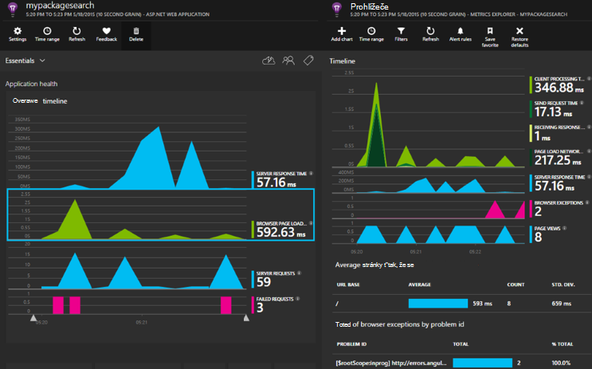

<properties 
    pageTitle="Aplikace přehledy pro základní technologie ASP.NET" 
    description="Sledovat webových aplikací pro dostupnost, výkonu a využití." 
    services="application-insights" 
    documentationCenter=".net"
    authors="alancameronwills" 
    manager="douge"/>

<tags 
    ms.service="application-insights" 
    ms.workload="tbd" 
    ms.tgt_pltfrm="ibiza" 
    ms.devlang="na" 
    ms.topic="article" 
    ms.date="08/30/2016" 
    ms.author="awills"/>

# Aplikace přehledy pro základní technologie ASP.NET

[Přehledy aplikace Visual Studio](app-insights-overview.md) můžete sledovat webové aplikace pro dostupnost, výkonu a využití. Zpětnou vazbu, získáte informace o výkon a efektivitu aplikace v přírody můžete můžete kvalifikovaně o směru návrhu v jednotlivých životního cyklu vývoje.

Musíte mít předplatné s [Microsoft Azure](http://azure.com). Přihlaste se pomocí účtu Microsoft, který může mít pro Windows, XBox Live nebo jiných cloudovým službám společnosti Microsoft. Tým může mít předplatné organizační na Azure: Požádejte vlastníka, aby vás přidal do pomocí účtu Microsoft.

## Začínáme

Pokračujte v [příručce Začínáme](https://github.com/Microsoft/ApplicationInsights-aspnetcore/wiki/Getting-Started).

## Použití aplikace přehledy

Přihlaste se k [portálu Microsoft Azure](https://portal.azure.com) a přejděte k prostředku vytvořili sledování aplikace.

V samostatném okně prohlížeče použijte aplikaci určitou dobu. Zobrazí se data zobrazená v grafech přehledy aplikace. (Možná bude potřeba klikněte na aktualizovat.) Bude pouze malé množství dat během vyvíjíte, ale tyto grafy skutečně poutavější při publikování aplikace a mít většího počtu uživatelů. 

Na stránce přehled zobrazuje grafy výkonu budete pravděpodobně mohly zajímat: doba odezvy serveru času načtení stránky a počet neúspěšných požadavků. Klikněte na libovolnou grafu zobrazíte další grafy a data.

Zobrazení na portálu spadají do dvou hlavních kategorií:

* [Metriky Explorer](app-insights-metrics-explorer.md) zobrazuje grafů a tabulek metriky a počty, například doby odezvy, selhání nebo metriky sami vytvoříte pomocí rozhraní [API](app-insights-api-custom-events-metrics.md). Filtrování a segmentech data podle nemovitostí s hodnotou získat lepší znalost aplikace a její uživatele.
* [Hledání Explorer](app-insights-diagnostic-search.md) uvádí jednotlivé události, jako je třeba specifických požadavků výjimek, protokolu trasování událostem nebo jste sami vytvořili pomocí rozhraní [API](app-insights-api-custom-events-metrics.md). Filtrování a hledání v události a navigace mezi prozkoumejte problémy související události.
* [Technologie pro analýzu](app-insights-analytics.md) umožňuje spouštění dotazů SQL profesionálové přes svůj telemetrie a je výkonný nástroj pro analýzu a diagnostiky.

## Upozornění

* Automaticky získat [Aktivní diagnostický výstrahy](app-insights-proactive-diagnostics.md) informování o neobvyklých změnami selhání a jiných metriky.
* Nastavit [dostupnost testy](app-insights-monitor-web-app-availability.md) testování webu neustále z umístění Celosvětová dostupnost a najděte e-mailů hned všechny úspěšný.
* Nastavení [upozornění metrických](app-insights-monitor-web-app-availability.md) vědět, pokud metriky doby odezvy ATP výjimce sazby přejděte vnější přijatelné omezení.

## Získat další telemetrie

* [Přidat telemetrie na webové stránky](app-insights-javascript.md) sledovat použití stránky a výkonu.
* [Sledování závislosti](app-insights-dependencies.md) zobrazíte, pokud ostatní, SQL nebo jiných externích zdrojů jsou zpomalovat můžete.
* [Použití rozhraní API](app-insights-api-custom-events-metrics.md) odeslat vlastní událostí a metriky podrobnější zobrazení výkonu a využití vaše aplikace.
* [Dostupnost testů](app-insights-monitor-web-app-availability.md) zkontrolujte svoji aplikaci neustále z celého světa. 

## Otevřít zdroj

[Čtení a přispívání do kód](https://github.com/Microsoft/ApplicationInsights-aspnetcore#recent-updates)

