<properties 
    pageTitle="Závislost typu sledování v aplikaci přehledy" 
    description="Analýzu použití, dostupnost místní nebo webové aplikace Microsoft Azure s přehledy aplikace." 
    services="application-insights" 
    documentationCenter=".net"
    authors="alancameronwills" 
    manager="douge"/>

<tags 
    ms.service="application-insights" 
    ms.workload="tbd" 
    ms.tgt_pltfrm="ibiza" 
    ms.devlang="na" 
    ms.topic="article" 
    ms.date="10/24/2016" 
    ms.author="awills"/>


# <a name="set-up-application-insights-dependency-tracking"></a>Nastavení aplikace přehledy: sledování závislostí


[AZURE.INCLUDE [app-insights-selector-get-started-dotnet](../../includes/app-insights-selector-get-started-dotnet.md)]


*Závislost typu* je komponentu externí, která se nazývá aplikace. Je to obvykle službu s názvem pomocí HTTP, databázi nebo systému souborů. Ve Visual Studiu aplikace přehledy můžete snadno zorientujete v jak dlouho aplikace čeká závislostí a jak často hovoru závislost přestane.

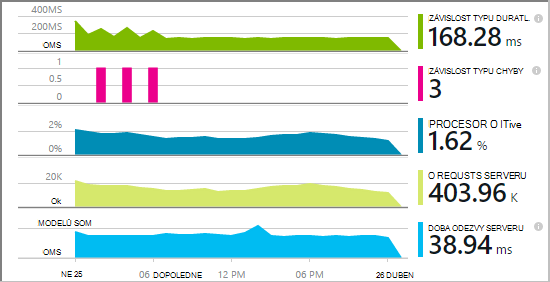

Sledování mimo pole závislost aktuálně hlásí hovory na tyto typy závislostí:

* TECHNOLOGIE ASP.NET
 * Databáze SQL
 * Technologie ASP.NET a služby WCF používající protokolu HTTP vazby
 * Místní nebo vzdálené volání HTTP
 * Azure DocumentDb tabulky, úložiště objektů blob a fronty
* Java
 * Volání k databázi přes ovladač [JDBC](http://docs.oracle.com/javase/7/docs/technotes/guides/jdbc/) ATP MySQL, SQL Server, PostgreSQL SQLite.
* JavaScriptu na webových stránkách - protokoly [webovou stránku SDK](app-insights-javascript.md) automaticky Ajax volání jako závislostí.

Můžete napsat SDK hovory ke sledování jiných závislosti pomocí rozhraní [TrackDependency API](app-insights-api-custom-events-metrics.md#track-dependency).


## <a name="to-set-up-dependency-monitoring"></a>Nastavit sledování závislostí

Je třeba [Microsoft Azure](http://azure.com) předplatné.

### <a name="if-your-app-runs-on-your-iis-server"></a>Pokud aplikace spustí na serveru IIS

Pokud webovou aplikaci běží na .NET 4.6 nebo novější, můžete buď [instalace SDK přehledy aplikace](app-insights-asp-net.md) v aplikaci, nebo když si nainstalujete aplikaci přehledy sledování stavu. Nemusíte obojí.

V opačném instalace sledování stavu přehledy aplikace na serveru:

1. Na serveru IIS, web přihlášení s oprávněními správce.
2. Stáhněte si a spusťte [Instalační služby systému sledování stavu](http://go.microsoft.com/fwlink/?LinkId=506648).
4. V dialogovém okně Průvodce Přihlaste se k Microsoft Azure.

    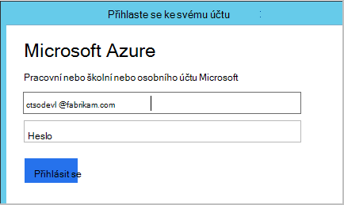

    *Chyby připojení? Viz [Poradce při potížích](#troubleshooting).*

5. Vyberte nainstalované webové aplikace nebo web, který chcete sledovat, a konfigurace prostředků, ve kterém chcete výsledky zobrazit v portálu přehledy aplikace.

    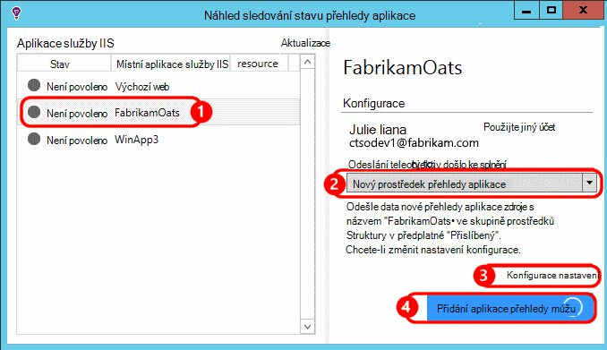

    Za normálních okolností rozhodnete konfigurace nový zdroj a [pole Skupina zdroje][roles].

    V opačném použít existující zdroj Pokud jste už nastavili [testuje web] [ availability] pro váš web nebo [webový klient sledování][client].

6. Restartujte službu IIS.

    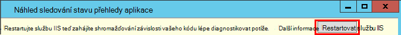

    Na krátkou chvíli se přerušilo webové služby.

6. Všimněte si, že ApplicationInsights.config byly vloženy do webové aplikace, které chcete sledovat.

    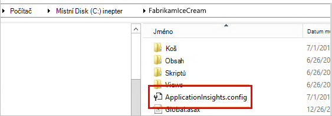

   Existují také některé změny web.config.

#### <a name="want-to-reconfigure-later"></a>Chcete (opětovné) nakonfigurovat později?

Po dokončení průvodce můžete znovu nakonfigurujete agent kdykoli budete chtít. Můžete taky použít toto Pokud jste si nainstalovali agent, ale došlo některé problémy s počáteční instalace.

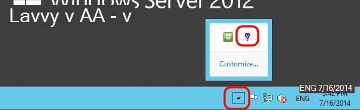


### <a name="if-your-app-runs-as-an-azure-web-app"></a>Pokud je aplikace spuštěný jako webovou aplikaci Azure

V Ovládacích panelech webovou aplikaci Azure přidáte rozšíření přehledy aplikace.

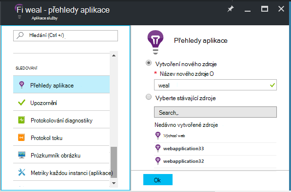


### <a name="if-its-an-azure-cloud-services-project"></a>Pokud je projekt služby Azure cloud services

[Přidání skripty pro web a pracovní role](app-insights-cloudservices.md#dependencies). Nebo když si [nainstalujete .NET framework 4.6 nebo novější](../cloud-services/cloud-services-dotnet-install-dotnet.md).

## <a name="diagnosis"></a>Diagnostika problémů s výkonem závislostí

K posouzení výkonu požadavky na serveru, otevřete zásuvné výkonu a posuňte se dolů na pohled na mřížky požadavky:

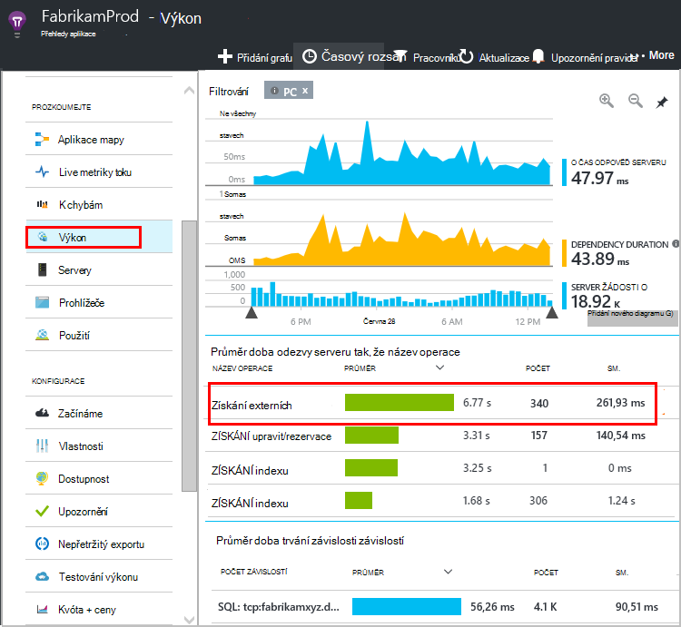

Začátek jednu trvá příliš dlouho. Zjistěme, pokud jsme můžete zjistit, kde dobu strávenou.

Klikněte na daném řádku zobrazíte individuální žádost události:


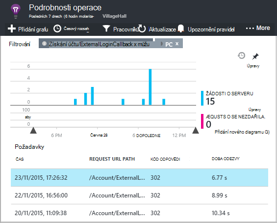

Klikněte na všechny instance dlouho probíhajících kontrolovat dál.

Posuňte se dolů na volání vzdálené závislost týkající se tohoto požadavku:


Vypadá jako většina obsluze čas, který tuto žádost uplynul při volání do místní služby. 


Vyberte tento řádek získat další informace:

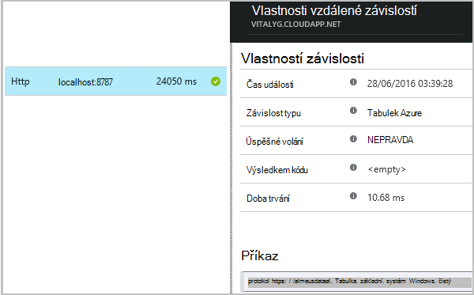

Podrobnosti obsahuje dostatečné informace diagnostikovat potíže.


V různých případu bez závislost volání dlouho, ale přepnutím do zobrazení časové osy je vidět, kde zpoždění došlo v naší interní zpracování:


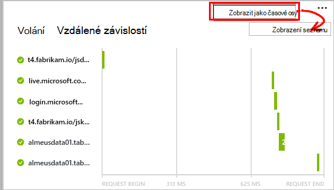


## <a name="failures"></a>K chybám

Pokud jsou neúspěšných požadavků, klikněte na graf.

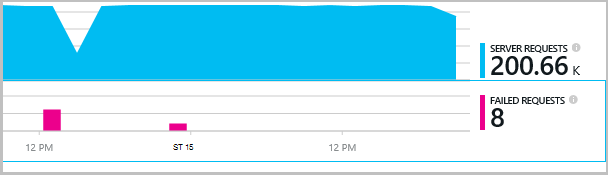

Klikněte na prostřednictvím typ požadavku a instance žádost o nezdařeném uložení volání pro vzdálené závislost.


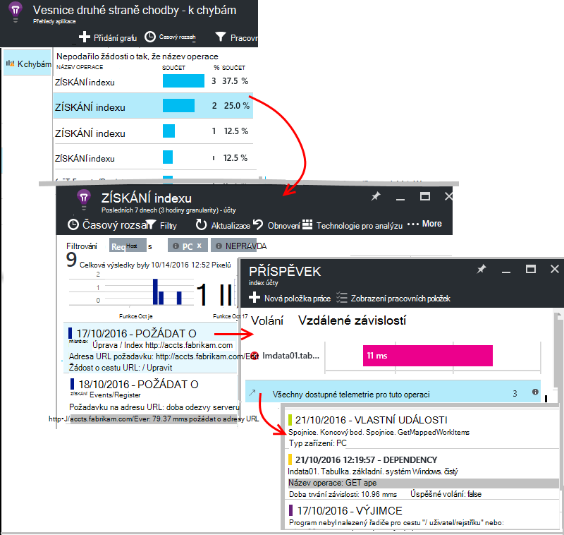


## <a name="custom-dependency-tracking"></a>Vlastní závislost sledování

Standardní modul závislost sledování automaticky zjistí externí závislosti například databází a rozhraní REST API. Ale může být vhodné některé další součásti zpracovávaly stejnou výzvu. 

Můžete zadat kód, který odešle informace o závislostech pomocí stejného [Rozhraní API TrackDependency](app-insights-api-custom-events-metrics.md#track-dependency) používaný standardní moduly.

Například tvořit kódu s sestavení, co jste nenapsali sami může čas všechny volání, pokud chcete zjistit, jaký příspěvek umožňuje doby odezvy. Pokud chcete, aby tato data zobrazí v závislosti grafů v aplikaci přehledy, pošlete ho `TrackDependency`.

```C#

            var startTime = DateTime.UtcNow;
            var timer = System.Diagnostics.Stopwatch.StartNew();
            try
            {
                success = dependency.Call();
            }
            finally
            {
                timer.Stop();
                telemetry.TrackDependency("myDependency", "myCall", startTime, timer.Elapsed, success);
            }
```

Pokud chcete vypnout modulu Sledování standardní závislostí, odeberte odkaz na DependencyTrackingTelemetryModule [ApplicationInsights.config](app-insights-configuration-with-applicationinsights-config.md).

## <a name="troubleshooting"></a>Řešení potíží

*Závislost typu úspěch označení vždy zobrazuje hodnotu true nebo false.*

* Upgradujte na nejnovější verzi sady SDK. Pokud vaše verze .NET je menší než 4.6, nainstalujte [Sledování stavu](app-insights-monitor-performance-live-website-now.md).

## <a name="next-steps"></a>Další kroky

- [Výjimky](app-insights-asp-net-exceptions.md)
- [Uživatel a dat][client]
- [Dostupnost](app-insights-monitor-web-app-availability.md)


<!--Link references-->

[api]: app-insights-api-custom-events-metrics.md
[apikey]: app-insights-api-custom-events-metrics.md#ikey
[availability]: app-insights-monitor-web-app-availability.md
[azure]: ../insights-perf-analytics.md
[client]: app-insights-javascript.md
[diagnostic]: app-insights-diagnostic-search.md
[metrics]: app-insights-metrics-explorer.md
[netlogs]: app-insights-asp-net-trace-logs.md
[portal]: http://portal.azure.com/
[qna]: app-insights-troubleshoot-faq.md
[redfield]: app-insights-asp-net-dependencies.md
[roles]: app-insights-resources-roles-access-control.md

 
