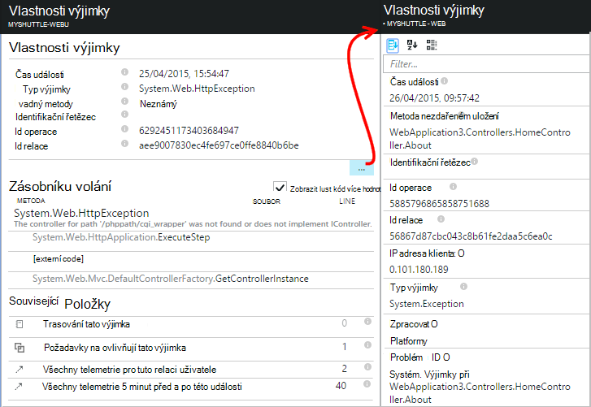

<properties 
    pageTitle="Diagnostika selhání a výjimky v aplikacích ASP.NET s přehledy aplikace" 
    description="Zachycení výjimky z aplikací ASP.NET spolu s telemetrie žádost." 
    services="application-insights" 
    documentationCenter=".net"
    authors="alancameronwills" 
    manager="douge"/>

<tags 
    ms.service="application-insights" 
    ms.workload="tbd" 
    ms.tgt_pltfrm="ibiza" 
    ms.devlang="na" 
    ms.topic="article" 
    ms.date="10/27/2016" 
    ms.author="awills"/>


# <a name="set-up-application-insights-diagnose-exceptions"></a>Nastavení aplikace přehledy: Diagnostika výjimky

[AZURE.INCLUDE [app-insights-selector-get-started-dotnet](../../includes/app-insights-selector-get-started-dotnet.md)]


Sledováním aplikace s [Přehledy aplikace Visual Studio][start], neúspěšných požadavků můžete porovnat s výjimky a dalších událostí u klienta a serveru, tak, aby mohli rychle Diagnostika příčin.

Sledování aplikace ASP.NET, budete muset [Přidat aplikaci přehledy SDK] [ greenbrown] aplikace nebo [nainstalovat sledování stavu na serveru IIS][redfield], nebo, pokud je aplikace webovou aplikaci Azure, přidejte [Rozšíření přehledy aplikace](app-insights-azure-web-apps.md).

## <a name="diagnosing-exceptions-using-visual-studio"></a>Diagnostika výjimky pomocí aplikace Visual Studio

Otevřete aplikaci řešení ve Visual Studiu pomoct s ladění.

Spusťte aplikaci na serveru nebo v počítači vývoj pomocí F5.

Otevřete okno aplikace přehledy hledání ve Visual Studiu a nastavte ji zobrazíte události z aplikace. Při ladění, můžete to uděláte to kliknutím na tlačítko přehledy aplikace.


Všimněte si, že můžete filtrovat sestavě zobrazíte jen výjimky. 

*Žádné výjimky zobrazující? V tématu [zachytit výjimky](#exceptions).*

Klikněte na sestavu výjimky zobrazíte jeho zásobníku.


Klikněte na odkaz řádek v zásobníku otevřete příslušný soubor.  

## <a name="diagnosing-failures-using-the-azure-portal"></a>Diagnostikování selhání pomocí portálu Azure

Z aplikace přehledy přehled aplikace dlaždici selhání zobrazuje grafy výjimek se neúspěšně požadavků HTTP společně s seznam žádost adresy URL, které způsobují nejčastěji používané k chybám.


Proklikejte se jeden z typů žádost o nezdařeném uložení v seznamu na jednotlivé výskyty chyby. Odtud klikněte na tlačítko prostřednictvím výjimky nebo všechna data sledování přidružená:


**Můžete taky** můžete začít úplně od seznamu výjimek, který můžete najdete další dolů zásuvné k chybám. Zachovat kliknete, až se dostanete na jednotlivé výjimky.


*Žádné výjimky zobrazující? V tématu [zachytit výjimky](#exceptions).*

Odtud můžete se podívat na zásobníku a podrobné vlastnosti jednotlivé výjimky a najít související protokolu sledování nebo jiné události.




[Další informace o diagnostiky hledání][diagnostic].


## <a name="dependency-failures"></a>Závislost typu chyby

*Závislost typu* je služba, která aplikace zavolá, obvykle prostřednictvím rozhraní REST API nebo připojení k databázi. [Sledování stavu přehledy aplikace] [ redfield] automaticky sleduje různé typy závislostí volání a měření délka hovoru a úspěšně nebo neúspěšně. 

K získání závislost typu dat, budete muset [nainstalovat sledování stavu] [ redfield] na serveru IIS nebo pokud je aplikace webovou aplikaci Azure, použijte [Rozšíření přehledy aplikace](app-insights-azure-web-apps.md). 

Selhalo volání závislosti, najdete na zásuvné selhání a také najdete je v části související položky v žádosti o informace a podrobnosti o výjimce.

*Žádná závislost selhání? To je dobré. Ale můžete ověřit, že se zobrazuje závislost typu dat, otevřete zásuvné výkonu a podívejte se na dobu trvání závislost typu grafu.*

 

## <a name="custom-tracing-and-log-data"></a>Vlastní sledování a dat protokolu

Získáte dat diagnostiky specifické pro aplikaci můžete vložte kód odeslat vlastní telemetrickými daty. Toto zobrazení diagnostiky hledání vedle žádost, zobrazení a dalších dat automaticky shromažďují. 

Máte několik možností:

* [TrackEvent()](app-insights-api-custom-events-metrics.md#track-event) se obvykle používá pro sledování použití vzorky, ale data, která se pošle také se zobrazí v části vlastní události diagnostiky hledání. Události jsou s názvem a mohou obsahovat vlastnosti řetězce a číselné metriky, ve kterém můžete [filtrovat diagnostiky hledání][diagnostic].
* [TrackTrace()](app-insights-api-custom-events-metrics.md#track-trace) můžete odeslat delší data například informace o příspěvek.
* [TrackException()](#exceptions) odešle trasování vrstvě. [Další informace o výjimky](#exceptions).
* Pokud už používáte rámec protokolování jako Log4Net nebo NLog, můžete provést tyto akce [zaznamenat jsou protokoly] [ netlogs] a zobrazit je v diagnostiky hledání vedle žádosti a výjimce data.

Zobrazíte tyto události otevřít [hledání][diagnostic]Otevřít filtr a pak zvolte vlastní události, sledování nebo výjimku.


> [AZURE.NOTE] Pokud aplikace vygeneruje spoustu telemetrie, modulu adaptivní odběr automaticky snížit hlasitost odesílané tak, že zástupce část události na portálu. Zvláštní události, které jsou součástí stejnou operaci budou vybrané nebo vybraná jako skupinu, takže je můžete přecházet mezi související události. [Informace o odběr.](app-insights-sampling.md)

### <a name="how-to-see-request-post-data"></a>Postup najdete v článku žádost o příspěvek dat

Podrobnosti o žádosti nezahrnujte data poslané na vaši aplikaci distribuovali hovoru příspěvek. Aby byly tyto informace uvedeny:

* [Instalace SDK] [ greenbrown] v aplikaci project.
* Vložení kódu v aplikaci pro volání [Microsoft.ApplicationInsights.TrackTrace()][api]. Odeslání dat příspěvek v parametru zprávy. Takže byste měli zkusit odeslání jenom základních dat je polích povolenou velikost.
* Při zkoumání žádost o nezdařeném uložení najděte přidruženou trasování.  


## <a name="exceptions"></a>Zachycení výjimky a související diagnostiky data

Nejdřív se nezobrazí v portálu všech výjimek, jež vést k chybám v aplikaci. Zobrazí se požadované výjimky prohlížeče (Pokud používáte [JavaScript SDK] [ client] na webových stránkách). Ale většina serveru výjimky vztahují IIS a máte k zápisu trochu kódu neuvidíte.

Můžeš:

* Sestava výjimky **protokolu výjimky explicitně** vložením kód v obslužné rutiny výjimek.
* **Zachycení výjimky automaticky** nakonfigurováním ASP.NET framework. Nezbytné doplňky se liší pro různé typy rámce.

## <a name="reporting-exceptions-explicitly"></a>Vytváření sestav výjimky explicitně

Nejjednodušší způsob je vložit volání TrackException() obslužné rutiny výjimky.

JavaScript

    try 
    { ...
    }
    catch (ex)
    {
      appInsights.trackException(ex, "handler loc",
        {Game: currentGame.Name, 
         State: currentGame.State.ToString()});
    }

C#

    var telemetry = new TelemetryClient();
    ...
    try 
    { ...
    }
    catch (Exception ex)
    {
       // Set up some properties:
       var properties = new Dictionary <string, string> 
         {{"Game", currentGame.Name}};

       var measurements = new Dictionary <string, double>
         {{"Users", currentGame.Users.Count}};

       // Send the exception telemetry:
       telemetry.TrackException(ex, properties, measurements);
    }

JAZYKA VISUAL BASIC

    Dim telemetry = New TelemetryClient
    ...
    Try
      ...
    Catch ex as Exception
      ' Set up some properties:
      Dim properties = New Dictionary (Of String, String)
      properties.Add("Game", currentGame.Name)

      Dim measurements = New Dictionary (Of String, Double)
      measurements.Add("Users", currentGame.Users.Count)
  
      ' Send the exception telemetry:
      telemetry.TrackException(ex, properties, measurements)
    End Try

Vlastnosti a naměřené hodnoty parametrů jsou volitelné, ale jsou vhodné k [filtrování a přidání] [ diagnostic] dodatečné informace. Například pokud máte aplikaci, mohlo by umožnit spuštění několik hry může nenajdete všechny sestavy výjimce související určitá hra. Můžete přidat tolik položek podle potřeby do každého slovníku.

## <a name="browser-exceptions"></a>Výjimky prohlížeče

Většina výjimek prohlížeče jsou uvedeny.

Pokud webová stránka obsahuje skript soubory ze sítě pro doručování obsahu nebo jiných domén, ujistěte se, značky script obsahuje atribut ```crossorigin="anonymous"```, a server odešle [CORS záhlaví](http://enable-cors.org/). To vám umožní získat zásobníku a podrobností neošetřené JavaScript výjimky z těchto zdrojů.

## <a name="web-forms"></a>Webového formuláře

Pro webové formuláře budou moct shromažďovat výjimky při bez přesměrování nakonfigurována CustomErrors modul HTTP.

Ale pokud máte aktivní přesměrování přidat následující řádky Application_Error funkce Global.asax.cs. (Pokud ještě nemáte jeden, přidejte soubor Global.asax.)

*C#*

    void Application_Error(object sender, EventArgs e)
    {
      if (HttpContext.Current.IsCustomErrorEnabled && Server.GetLastError  () != null)
      {
         var ai = new TelemetryClient(); // or re-use an existing instance

         ai.TrackException(Server.GetLastError());
      }
    }


## <a name="mvc"></a>MVC

Pokud je konfigurace [CustomErrors](https://msdn.microsoft.com/library/h0hfz6fc.aspx) `Off`, budou k dispozici pro [Modul HTTP](https://msdn.microsoft.com/library/ms178468.aspx) shromažďovat výjimky. Ale pokud je `RemoteOnly` (výchozí), nebo `On`, budou výjimku zaškrtnuté a nedostupné pro přehledy aplikace získat informace o automaticky. Můžete opravit přepsání [System.Web.Mvc.HandleErrorAttribute tříd](http://msdn.microsoft.com/library/system.web.mvc.handleerrorattribute.aspx)a použití změněné předmětu, jak je znázorněno pro různé verze MVC pod ([zdroj github](https://github.com/AppInsightsSamples/Mvc2UnhandledExceptions/blob/master/MVC2App/Controllers/AiHandleErrorAttribute.cs)):

    using System;
    using System.Web.Mvc;
    using Microsoft.ApplicationInsights;

    namespace MVC2App.Controllers
    {
      [AttributeUsage(AttributeTargets.Class | AttributeTargets.Method, Inherited = true, AllowMultiple = true)] 
      public class AiHandleErrorAttribute : HandleErrorAttribute
      {
        public override void OnException(ExceptionContext filterContext)
        {
            if (filterContext != null && filterContext.HttpContext != null && filterContext.Exception != null)
            {
                //If customError is Off, then AI HTTPModule will report the exception
                if (filterContext.HttpContext.IsCustomErrorEnabled)
                {   //or reuse instance (recommended!). see note above  
                    var ai = new TelemetryClient();
                    ai.TrackException(filterContext.Exception);
                } 
            }
            base.OnException(filterContext);
        }
      }
    }

#### <a name="mvc-2"></a>MVC 2

Nahraďte atribut HandleError nového atributu v seznamu svého zařízení.

    namespace MVC2App.Controllers
    {
       [AiHandleError]
       public class HomeController : Controller
       {
    ...

[Ukázka](https://github.com/AppInsightsSamples/Mvc2UnhandledExceptions)

#### <a name="mvc-3"></a>MVC 3

Registrace `AiHandleErrorAttribute` jako globální filtr v Global.asax.cs:

    public class MyMvcApplication : System.Web.HttpApplication
    {
      public static void RegisterGlobalFilters(GlobalFilterCollection filters)
      {
         filters.Add(new AiHandleErrorAttribute());
      }
     ...

[Ukázka](https://github.com/AppInsightsSamples/Mvc3UnhandledExceptionTelemetry)


#### <a name="mvc-4-mvc5"></a>MVC 4, MVC5

Registrace AiHandleErrorAttribute jako globální filtr v FilterConfig.cs:

    public class FilterConfig
    {
      public static void RegisterGlobalFilters(GlobalFilterCollection filters)
      {
        // Default replaced with the override to track unhandled exceptions
        filters.Add(new AiHandleErrorAttribute());
      }
    }

[Ukázka](https://github.com/AppInsightsSamples/Mvc5UnhandledExceptionTelemetry)

## <a name="web-api-1x"></a>Webového rozhraní API 1.x


Přepište System.Web.Http.Filters.ExceptionFilterAttribute:

    using System.Web.Http.Filters;
    using Microsoft.ApplicationInsights;

    namespace WebAPI.App_Start
    {
      public class AiExceptionFilterAttribute : ExceptionFilterAttribute
      {
        public override void OnException(HttpActionExecutedContext actionExecutedContext)
        {
            if (actionExecutedContext != null && actionExecutedContext.Exception != null)
            {  //or reuse instance (recommended!). see note above 
                var ai = new TelemetryClient();
                ai.TrackException(actionExecutedContext.Exception);    
            }
            base.OnException(actionExecutedContext);
        }
      }
    }

Můžete přidat tento změněné atribut na konkrétní řadiče nebo ho přidat do globální filtr konfigurace ve třídě WebApiConfig: 

    using System.Web.Http;
    using WebApi1.x.App_Start;

    namespace WebApi1.x
    {
      public static class WebApiConfig
      {
        public static void Register(HttpConfiguration config)
        {
            config.Routes.MapHttpRoute(name: "DefaultApi", routeTemplate: "api/{controller}/{id}",
                defaults: new { id = RouteParameter.Optional });
            ...
            config.EnableSystemDiagnosticsTracing();

            // Capture exceptions for Application Insights:
            config.Filters.Add(new AiExceptionFilterAttribute());
        }
      }
    }

[Ukázka](https://github.com/AppInsightsSamples/WebApi_1.x_UnhandledExceptions)

Existuje celá řada případy, které nejde zpracovat filtry výjimek. Příklad:

* Výjimky vyvolání z konstruktory řadiče domény. 
* Výjimky vyvolání z popisovače zpráv. 
* Výjimky vyvolání během směrování. 
* Výjimky vyvolání během obsahu serializace odpověď. 

## <a name="web-api-2x"></a>Webového rozhraní API 2.x

Přidání implementace IExceptionLogger:

    using System.Web.Http.ExceptionHandling;
    using Microsoft.ApplicationInsights;

    namespace ProductsAppPureWebAPI.App_Start
    {
      public class AiExceptionLogger : ExceptionLogger
      {
        public override void Log(ExceptionLoggerContext context)
        {
            if (context !=null && context.Exception != null)
            {//or reuse instance (recommended!). see note above 
                var ai = new TelemetryClient();
                ai.TrackException(context.Exception);
            }
            base.Log(context);
        }
      }
    }

Přidáte ke službám v WebApiConfig:

    using System.Web.Http;
    using System.Web.Http.ExceptionHandling;
    using ProductsAppPureWebAPI.App_Start;

    namespace WebApi2WithMVC
    {
      public static class WebApiConfig
      {
        public static void Register(HttpConfiguration config)
        {
            // Web API configuration and services

            // Web API routes
            config.MapHttpAttributeRoutes();

            config.Routes.MapHttpRoute(
                name: "DefaultApi",
                routeTemplate: "api/{controller}/{id}",
                defaults: new { id = RouteParameter.Optional }
            );
            config.Services.Add(typeof(IExceptionLogger), new AiExceptionLogger()); 
        }
      }
  }

[Ukázka](https://github.com/AppInsightsSamples/WebApi_2.x_UnhandledExceptions)

Jako alternativa můžete:

2. Nahraďte pouze ExceptionHandler vlastní provádění IExceptionHandler. Říká se tomu pouze po pořád moct zvolte zprávy které odpovědí (při připojení není přerušena například) rámec 
3. Filtry výjimek (jak je popsáno v části řadiči rozhraní API webových 1.x výše) – ne s názvem ve všech případech.


## <a name="wcf"></a>WCF

Přidejte blok předmětu, který rozšiřuje atribut a implementuje IErrorHandler a IServiceBehavior.

    using System;
    using System.Collections.Generic;
    using System.Linq;
    using System.ServiceModel.Description;
    using System.ServiceModel.Dispatcher;
    using System.Web;
    using Microsoft.ApplicationInsights;

    namespace WcfService4.ErrorHandling
    {
      public class AiLogExceptionAttribute : Attribute, IErrorHandler, IServiceBehavior
      {
        public void AddBindingParameters(ServiceDescription serviceDescription,
            System.ServiceModel.ServiceHostBase serviceHostBase,
            System.Collections.ObjectModel.Collection<ServiceEndpoint> endpoints,
            System.ServiceModel.Channels.BindingParameterCollection bindingParameters)
        {
        }

        public void ApplyDispatchBehavior(ServiceDescription serviceDescription, 
            System.ServiceModel.ServiceHostBase serviceHostBase)
        {
            foreach (ChannelDispatcher disp in serviceHostBase.ChannelDispatchers)
            {
                disp.ErrorHandlers.Add(this);
            }
        }

        public void Validate(ServiceDescription serviceDescription, 
            System.ServiceModel.ServiceHostBase serviceHostBase)
        {
        }

        bool IErrorHandler.HandleError(Exception error)
        {//or reuse instance (recommended!). see note above 
            var ai = new TelemetryClient();

            ai.TrackException(error);
            return false;
        }

        void IErrorHandler.ProvideFault(Exception error, 
            System.ServiceModel.Channels.MessageVersion version, 
            ref System.ServiceModel.Channels.Message fault)
        {
        }
      }
    }

Přidejte atribut implementací služby:

    namespace WcfService4
    {
        [AiLogException]
        public class Service1 : IService1 
        { 
         ...

[Ukázka](https://github.com/AppInsightsSamples/WCFUnhandledExceptions)

## <a name="exception-performance-counters"></a>Výjimky výkonnosti

Pokud máte [nainstalovanou sledování stavu] [ redfield] na serveru, můžete získat grafu míry výjimky měřeno .NET. Jedná se o zpracování a neošetřené .NET výjimky.

Otevřete Průzkumníka míru zásuvné, přidat nový graf a vyberte **výjimky sazba**, zařazený do kategorie výkonnosti. 

.NET framework vzorec vypočítá počítání výjimky v intervalu a vydělí délku intervalu. 

Všimněte si, že bude liší od "Výjimky" počet vypočítány pomocí portálu aplikace přehledy roven TrackException sestavy. Intervalů se liší a SDK neodesílá TrackException sestav pro všechny zpracování a neošetřené výjimky.

<!--Link references-->

[api]: app-insights-api-custom-events-metrics.md
[client]: app-insights-javascript.md
[diagnostic]: app-insights-diagnostic-search.md
[greenbrown]: app-insights-asp-net.md
[netlogs]: app-insights-asp-net-trace-logs.md
[redfield]: app-insights-monitor-performance-live-website-now.md
[start]: app-insights-overview.md

 
