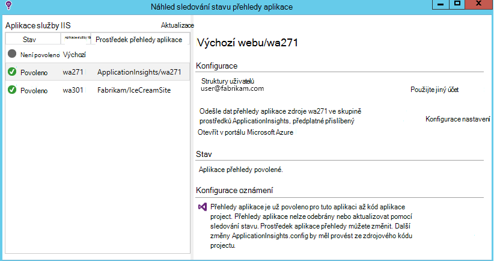
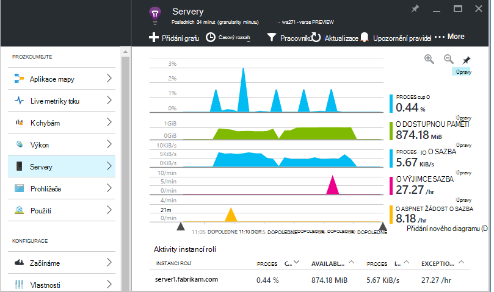
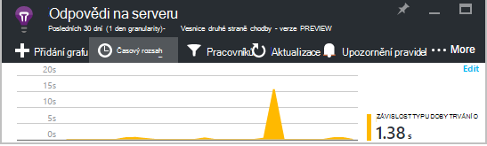
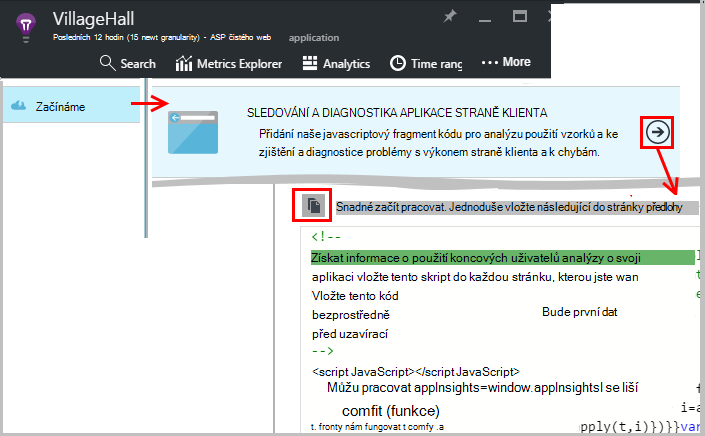
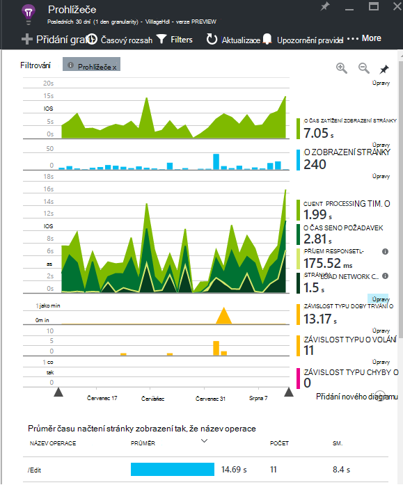
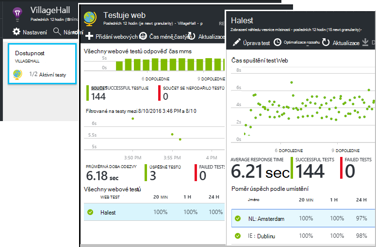
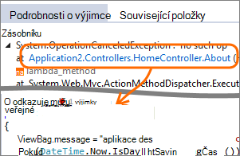
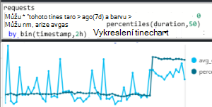
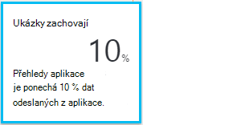

<properties 
    pageTitle="Ještě víc využít možnosti aplikace přehledy | Microsoft Azure" 
    description="Po Začínáme s aplikací přehledy, tady je souhrn funkcí, které můžete prozkoumat." 
    services="application-insights" 
    documentationCenter=".net"
    authors="alancameronwills" 
    manager="douge"/>

<tags 
    ms.service="application-insights" 
    ms.workload="tbd" 
    ms.tgt_pltfrm="ibiza" 
    ms.devlang="na" 
    ms.topic="article" 
    ms.date="10/27/2016" 
    ms.author="awills"/>

# <a name="more-telemetry-from-application-insights"></a>Další telemetrie z aplikace přehledy

Po [přidali aplikace přehledy kódu ASP.NET](app-insights-asp-net.md)existuje pár věcí, které můžete udělat, abyste získejte ještě víc telemetrie. 

## <a name="if-your-app-runs-on-your-iis-server-"></a>Pokud aplikace spustí na serveru IIS...

Pokud aplikace je hostitelem služby IIS servery na ovládací prvek, nainstalujte sledování stavu přehledy aplikace na serverech. Pokud je už nainstalovaná, nemusíte nic dělat.

1. Na každém webovém serveru IIS Přihlaste se pomocí přihlašovacích údajů správce.
2. Stáhněte si a spusťte [Instalační služby systému sledování stavu](http://go.microsoft.com/fwlink/?LinkId=506648).
3. V dialogovém okně Průvodce Přihlaste se k Microsoft Azure.

Nemusíte udělat něco jiného, ale můžete potvrdit, že sledování aktivované řešení aplikace.



(Také můžete sledování stavu [Povolit sledování za běhu](app-insights-monitor-performance-live-website-now.md), i když jste se vlastně nástroje aplikace ve Visual Studiu.)

### <a name="what-do-you-get"></a>Co se získat?

Sledování stavu nainstalovaného na počítačích serverů, zobrazí se některé další telemetrie:

* Závislost typu telemetrie (SQL volání a ostatní aplikace, které udělali) pro .NET 4.5 aplikace. (Novějších verzích .NET, sledování stavu není potřeba pro závislost telemetrie.) 
* Trasování zásobníku výjimce zobrazit více podrobností.
* Výkonnosti. V aplikaci přehledy tyto čítače zobrazí v zásuvné servery. 



Chcete-li zobrazit více nebo méně údaje, [Upravit grafy](app-insights-metrics-explorer.md). Není-li čítač výkonu, které chcete v sadě dostupné, můžete [Přidat sadu shromážděná modulu čítače výkonu](app-insights-performance-counters.md).

## <a name="if-its-an-azure-web-app-"></a>Pokud je Azure webovou aplikaci...

Pokud je aplikace spuštěný jako Azure webovou aplikaci, přejděte na Azure ovládací panely aplikace nebo OM a otevřete zásuvné přehledy aplikace. 

### <a name="what-do-you-get"></a>Co se získat?

* Trasování zásobníku výjimky zobrazit více podrobností.
* Závislost typu telemetrie (SQL volání a ostatní aplikace, které udělali) pro .NET 4,5 aplikace. (Novějších verzích .NET přípona není potřeba pro závislost telemetrie.) 



(Také můžete tento způsob, jak [Povolit sledování za běhu výkonu](app-insights-monitor-performance-live-website-now.md), i když jste se vlastně nástroje aplikace ve Visual Studiu.)

## <a name="client-side-monitoring"></a>Sledování straně klienta

Instalaci SDK, která odešle telemetrickými daty ze serveru (back-end) aplikace. Teď můžete přidat sledování klienta. To vám poskytne dat na uživatele, relace, zobrazení stránky a výjimky nebo selhání probíhajících v prohlížeči. Budete taky moct vlastního kódu můžete sledovat, jak uživatelé pracovat s aplikací, až na úroveň podrobné kliknutí a stisknutím kláves.

Přidání aplikace přehledy javascriptový fragment kódu na každou webovou stránku získat telemetrie z prohlížeče klienta.

1. V Azure otevřete aplikaci přehledy zdrojů aplikace.
2. Začínáme na straně klienta monitoru, otevřete a zkopírujte je fragment kódu.
3. Vložte ho, aby se nezobrazoval v vedoucí každou webovou stránku – obvykle, že můžete to udělat vložením do stránky rozložení předlohy.



Všimněte si, že kód obsahuje klíč přístrojového vybavení, který identifikuje aplikace zdroje.

### <a name="what-do-you-get"></a>Co se získat?

* Můžete napsat JavaScript [vlastní telemetrie z webové stránky](app-insights-api-custom-events-metrics.md), například sledování kliknutí na tlačítko Odeslat.
* V [analýzy](app-insights-analytics.md), data v `pageViews` a AJAX dat v `dependencies`. 
* [Klient výkon a použití zásad správy informací](app-insights-javascript.md) v zásuvné prohlížeče.




[Další informace o sledování webovou stránku.](app-insights-web-track-usage.md)


## <a name="track-application-version"></a>Sledování verzí aplikace

Ujistěte se, `buildinfo.config` je generováno aplikací MSBuild obrázku. V souboru .csproj přidáte:  

```XML

    <PropertyGroup>
      <GenerateBuildInfoConfigFile>true</GenerateBuildInfoConfigFile>    <IncludeServerNameInBuildInfo>true</IncludeServerNameInBuildInfo>
    </PropertyGroup> 
```

Když má stav Tvůrce dotazů, modulu webové aplikace přehledy automaticky přidá **verze aplikace** jako vlastnost jednotlivé položky telemetrie. Která vám umožní filtrovat podle verzí při provádění [diagnostiky hledání](app-insights-diagnostic-search.md) nebo při [prohlížení metriky](app-insights-metrics-explorer.md). 

Všimněte si, že číslo verze sestavení je generováno pouze pomocí MS Build není sestavení Vývojář ve Visual Studiu.


## <a name="availability-web-tests"></a>Dostupnost webových testů

Odešlou webovou aplikaci HTTP v pravidelných intervalech z celého světa. Jsme upozorňovat na odpověď máte pomalé nebo nedůvěryhodných.

V aplikaci přehledy prostředků aplikace klikněte na dlaždici dostupnost pro přidání, úprava a zobrazení webových testů.

Můžete přidat více testů spuštěný na několika místech.



[Víc se uč](app-insights-monitor-web-app-availability.md)

## <a name="custom-telemetry-and-logging"></a>Vlastní telemetrie a protokolování

Balíčky aplikace přehledech, které jste přidali do vašeho kódu poskytují rozhraní API, které můžete zavolat z aplikace.

* [Vytvoření vlastní události a metriky](app-insights-api-custom-events-metrics.md), například k určení počtu obchodní události nebo sledovat výkon.
* [Zachycení protokolu trasování](app-insights-asp-net-trace-logs.md) z Log4Net, NLog nebo System.Diagnostics.Trace.
* [Filtr, upravit, nebo rozšířit](app-insights-api-filtering-sampling.md) standardní telemetrie odeslaných z aplikace pro psaní Telemetrie procesorů. 


## <a name="powerful-analysis-and-presentation"></a>Výkonné analýzy a prezentace

Existuje hodně způsoby, které můžete prozkoumat data. Pokud jste nedávno spustili s přehledy aplikace, podívejte se na tyto články:

||
|---|---
|[**Diagnostiky hledání například dat**](app-insights-visual-studio.md)<br/>Hledání a filtrování události jako je třeba žádosti o výjimek, závislost hovory, protokolu trasování a zobrazení stránky. Ve Visual Studiu přejděte do kódu z trasování vrstvě.|
|[**Metriky Explorer souhrnných dat**](app-insights-metrics-explorer.md)<br/>Prozkoumání, filtrování a segmentech souhrnná data například sazby požadavky, selhání a výjimky; Doba odezvy, načítáním stránek.|
|[**Řídicí panely**](app-insights-dashboards.md#dashboards)<br/>Kombinovat data z více zdrojů a sdílejte s ostatními. Velké více součást aplikace a odstranění nepřetržitý zobrazení v místu týmu.  |
|[**Live metriky toku**](app-insights-metrics-explorer.md#live-metrics-stream)<br/>Když nasadíte nové sestavení, podívejte se na tyto ukazatele výkonu v reálném čase aby zkontrolovala, jestli že všechno funguje očekávaným způsobem.|
|[**Technologie pro analýzu**](app-insights-analytics.md)<br/>Přijetí robustním dotazy týkající se výkonu a využití vaše aplikace pomocí výkonných dotazovací jazyk.|
|[**Ruční a Automatické upozornění**](app-insights-alerts.md)<br/>Automatické upozornění přizpůsobit vaše aplikace běžné vzorce telemetrie a aktivační události při něco mimo běžnému modelu. Upozornění jde nastavit taky na konkrétní úrovně vlastní nebo standardní metriky.|

## <a name="data-management"></a>Správa dat

|||
|---|---|
|[**Nepřetržitý exportu**](app-insights-export-telemetry.md)<br/>Zkopírujte všechny telemetrie do úložiště tak, že můžete analyzovat vlastní způsobem.|
|**Přístup k datům rozhraní API**<br/>Již brzy.|
|[**Analytický nástroj vzorkování**](app-insights-sampling.md)<br/>Snižuje rychlost dat a vám pomáhá zůstat ve mezích ceny osy.|