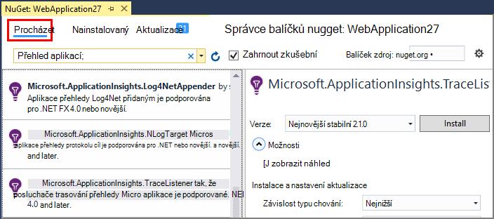
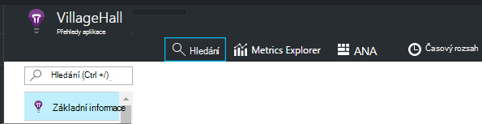
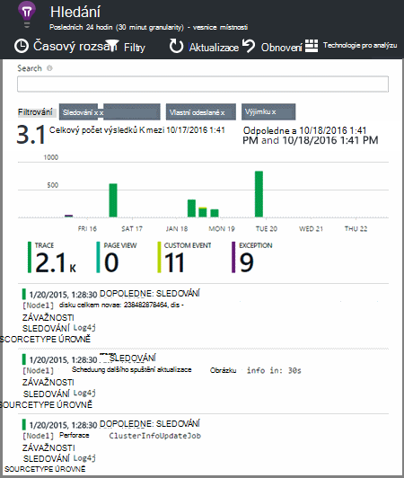

<properties 
    pageTitle="Prozkoumání .NET sledování protokolů v aplikaci přehledy" 
    description="Hledání protokoly vytvořený pomocí trasování, NLog nebo Log4Net." 
    services="application-insights" 
    documentationCenter=".net"
    authors="alancameronwills" 
    manager="douge"/>

<tags 
    ms.service="application-insights" 
    ms.workload="tbd" 
    ms.tgt_pltfrm="ibiza" 
    ms.devlang="na" 
    ms.topic="article" 
    ms.date="07/21/2016" 
    ms.author="awills"/>
 
# <a name="explore-net-trace-logs-in-application-insights"></a>Prozkoumání .NET sledování protokolů v aplikaci přehledy  

Pokud používáte NLog log4Net nebo System.Diagnostics.Trace pro diagnostiku trasování v aplikaci ASP.NET můžete mít protokolů odeslané interpretace [aplikace Visual Studio][start], kde můžete prozkoumat a hledat. V protokolech bude sloučeny se ostatní telemetrie pocházejících z aplikace, tak, aby identifikovat trasování přidružený k obsluze každý požadavek uživatele a sladit s jinými události a výjimce sestavy.


> [AZURE.NOTE] Potřebujete modulu zachycení protokolu? Je užitečné adaptér pro zaznamenávající stisknutí kláves 3rd stran, ale pokud už nepoužíváte NLog, log4Net nebo System.Diagnostics.Trace, zvažte možnost právě volání [Aplikace přehledy TrackTrace()](app-insights-api-custom-events-metrics.md#track-trace) přímo.


## <a name="install-logging-on-your-app"></a>Instalace protokolování v aplikaci

Nainstalujte zvolené protokolování framework v projektu. Výsledkem by mělo být položka v app.config nebo web.config.

Pokud používáte System.Diagnostics.Trace, potřebujete přidat položky do web.config:

```XML

    <configuration>
     <system.diagnostics>
       <trace autoflush="false" indentsize="4">
         <listeners>
           <add name="myListener" 
             type="System.Diagnostics.TextWriterTraceListener" 
             initializeData="TextWriterOutput.log" />
           <remove name="Default" />
         </listeners>
       </trace>
     </system.diagnostics>
   </configuration>
```

## <a name="configure-application-insights-to-collect-logs"></a>Konfigurace aplikace přehledy pro shromáždit protokoly

**[Přidání aplikace přehledy do projektu](app-insights-asp-net.md)** Pokud můžete, ještě neudělali. Zobrazí se možnost zahrnout kolekcí protokolu.

Nebo **Konfigurovat přehledy aplikace** kliknutím pravým tlačítkem na projektu v Průzkumníku řešení. Vyberte možnost **kolekce trasování konfigurovat**.

*Aplikace přehledy nabídky nebo protokolu kolekcí možnost bez?* Vyzkoušejte [řešení potíží](#troubleshooting).


## <a name="manual-installation"></a>Ruční instalace

Tento způsob použijte, pokud typ projektu není podporovaný instalační program aplikace přehledy (například Windows desktop projekt). 

1. Pokud budete chtít používat log4Net nebo NLog, nainstalujte ji do projektu. 
2. V Průzkumníku projektu klikněte pravým tlačítkem myši a zvolte **Spravovat balíčků NuGet**.
3. Vyhledejte "Aplikace přehledy"

    

4. Vyberte příslušný balíček – jeden z:
  + Microsoft.ApplicationInsights.TraceListener (k zaznamenání System.Diagnostics.Trace volání)
  + Microsoft.ApplicationInsights.NLogTarget
  + Microsoft.ApplicationInsights.Log4NetAppender

Balíček NuGet nainstaluje potřebné sestavení a také upraví web.config nebo app.config.

## <a name="insert-diagnostic-log-calls"></a>Vložení diagnostickém protokolu volání

Pokud používáte System.Diagnostics.Trace, budou typické hovoru:

    System.Diagnostics.Trace.TraceWarning("Slow response - database01");

Pokud raději používáte log4net nebo NLog:

    logger.Warn("Slow response - database01");


## <a name="using-the-trace-api-directly"></a>Pomocí sledování rozhraní API přímo

Sledování aplikací přehledy rozhraní API můžete volat přímo. Protokolování adaptéry použít toto rozhraní API. 

Příklad:

    var telemetry = new Microsoft.ApplicationInsights.TelemetryClient();
    telemetry.TrackTrace("Slow response - database01");

Výhodou TrackTrace je relativně dlouhých data můžete umístit do zprávy. Můžete třeba kódovat datech příspěvek. 

Kromě toho můžete přidat úroveň závažnosti do zprávy. A podobně jako jiné telemetrie můžete přidat nemovitostí s hodnotou, které mohou být užitečné filtru nebo hledání pro různé sady trasování. Příklad:


    var telemetry = new Microsoft.ApplicationInsights.TelemetryClient();
    telemetry.TrackTrace("Slow database response",
                   SeverityLevel.Warning,
                   new Dictionary<string,string> { {"database", db.ID} });

To, vám umožní [vyhledávání][diagnostic], snadno odfiltrovat všech zpráv úroveň konkrétní závažnosti týkající se určitého databáze.

## <a name="explore-your-logs"></a>Prozkoumání protokolů

Spusťte aplikaci, buď v režimu ladění nebo nasadit živou.

Ve vaší aplikace zásuvné přehled portálu [aplikace přehledy][portal], klikněte na [vyhledávání][diagnostic].





Je to možné, například:

* Filtrování v trasování protokolu nebo na položky s specifické vlastnosti
* Zkontrolujte určité položky podrobně.
* Vyhledání dalších telemetrie týkající se stejným žádosti uživatele (to znamená s stejné OperationId) 
* Konfiguraci tato stránka Uložit jako oblíbené položky

> [AZURE.NOTE] **Analytický nástroj vzorkování.** Pokud používáte aplikaci přehledy SDK 2.0.0-beta3 verze technologie ASP.NET nebo novější aplikace odešle velké množství dat, může funkce adaptivní odběr ovládání a odeslat jenom procento vaší telemetrie. [Další informace o odběr.](app-insights-sampling.md)

## <a name="next-steps"></a>Další kroky

[Diagnostika selhání a výjimky technologie ASP.NET][exceptions]

[Další informace o hledání][diagnostic].


## <a name="troubleshooting"></a>Řešení potíží

### <a name="how-do-i-do-this-for-java"></a>Jak můžu udělat to jazyka Java?

Pomocí [jazyka Java protokolu adaptéry](app-insights-java-trace-logs.md).

### <a name="theres-no-application-insights-option-on-the-project-context-menu"></a>Žádným způsobem přehledy aplikace na místní nabídku projektu

* Kontrola nástroje přehledy aplikace je nainstalovaných v tomto počítači vývoj. Rozšíření a aktualizace, vyhledejte ve Visual Studiu nabídku Nástroje nástroje přehledy aplikací. V opačném případě na kartě instalované otevřete kartu Online a nainstalovat ho.
* Může to být typ projektu není podporován aplikací přehledy nástroje. Použití [Ruční instalace](#manual-installation).

### <a name="no-log-adapter-option-in-the-configuration-tool"></a>Možnost bez protokolu adaptér v nástroji Konfigurace

* Budete muset nejdřív nainstalovat framework protokolování.
* Pokud používáte System.Diagnostics.Trace, nezapomeňte [nakonfigurovali ji v `web.config` ](https://msdn.microsoft.com/library/system.diagnostics.eventlogtracelistener.aspx).
* Máte máte nejnovější verzi aplikace přehledy nástroje? V nabídce aplikace Visual Studio **Nástroje** vyberte **rozšíření a aktualizace**a otevřete kartu **aktualizace** . Pokud aplikace přehledy nástroje existuje, klikněte na aktualizovat ho.


### <a name="emptykey"></a>Dojde k chybě "přístrojového vybavení klíč nemůže být prázdné"

Vypadá to jste nainstalovali balíček protokolování adaptér Nuget bez instalace aplikace přehledy.

V Průzkumníku klikněte pravým tlačítkem myši `ApplicationInsights.config` a zvolte **Update aplikace přehledy**. Zobrazí se dialog s vyzývá k přihlášení k Azure a vytvořte prostředek přehledy aplikace nebo znovu použít existující úrovně. Která by měla opravný nástroj fix it.

### <a name="i-can-see-traces-in-diagnostic-search-but-not-the-other-events"></a>Můžu v tématu trasování v diagnostiky hledání, ale ne další události

Někdy se může trvat dlouho u všech událostí a požadavky na získání průchod kanálem k odesílání.

### <a name="limits"></a>Jaká data se zachovají?

Až 500 události sekundu z jednotlivých aplikací. Události uchovávají pro sedmi dnů.

### <a name="im-not-seeing-some-of-the-log-entries-that-i-expect"></a>Se nezobrazují některé položky protokolu, které mám očekávat

Pokud používáte aplikaci přehledy SDK 2.0.0-beta3 verze technologie ASP.NET nebo novější aplikace odešle velké množství dat, může funkce adaptivní odběr pracovat a odeslat jenom procento vaší telemetrie. [Další informace o odběr.](app-insights-sampling.md)

## <a name="add"></a>Další kroky

* [Nastavení dostupnost a rychlostí reakce testů][availability]
* [Řešení potíží][qna]


<!--Link references-->

[availability]: app-insights-monitor-web-app-availability.md
[diagnostic]: app-insights-diagnostic-search.md
[exceptions]: app-insights-asp-net-exceptions.md
[portal]: https://portal.azure.com/
[qna]: app-insights-troubleshoot-faq.md
[start]: app-insights-overview.md

 
