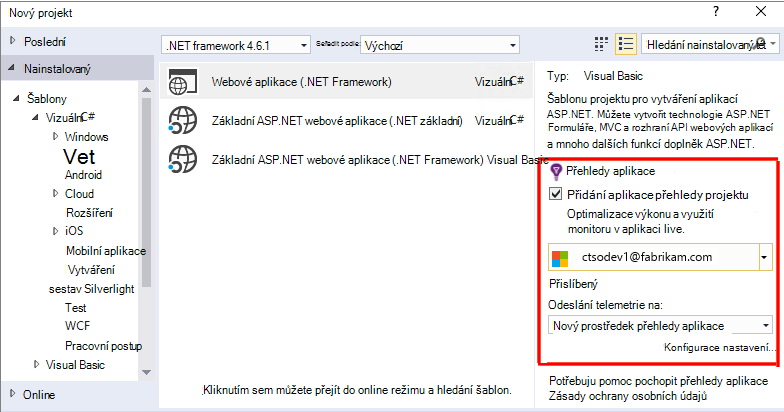
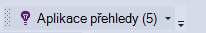
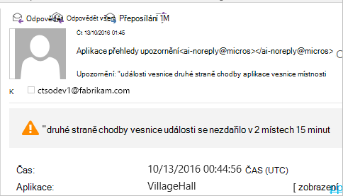

<properties 
    pageTitle="Nastavení služby web analytics aplikace pro ASP.NET s aplikací přehledy | Microsoft Azure" 
    description="Konfigurace výkon, dostupnost a analýz použití pro váš web ASP.NET hostované místní nebo Azure." 
    services="application-insights" 
    documentationCenter=".net"
    authors="NumberByColors" 
    manager="douge"/>

<tags 
    ms.service="application-insights" 
    ms.workload="tbd" 
    ms.tgt_pltfrm="ibiza" 
    ms.devlang="na" 
    ms.topic="get-started-article" 
    ms.date="10/13/2016" 
    ms.author="awills"/>


# <a name="set-up-application-insights-for-aspnet"></a>Nastavení aplikace přehledy pro ASP.NET

[Přehledy aplikace Visual Studio](app-insights-overview.md) sleduje živou aplikaci tak, aby vám pomohou [zjistit a diagnostikovat potíže s výkonem a výjimky](app-insights-detect-triage-diagnose.md)a [Seznamte se s použití aplikace](app-insights-overview-usage.md).  To funguje pro aplikace, které jsou hostované na serverech IIS vlastní místní nebo v cloudu VMs i Azure webových aplikacích.


## <a name="before-you-start"></a>Než začnete

Potřebuješ:

* Visual Studio 2013 aktualizace 3 nebo novější. Dál je lepší.
* Předplatné [Microsoft Azure](http://azure.com). Pokud váš tým nebo organizace má předplatné Azure, vlastník můžete přidat můžete k ní pomocí svého [účtu Microsoft](http://live.com). 

Existují alternativní články Pokud vás zajímají visiové:

* [Nastavení web appu za běhu](app-insights-monitor-performance-live-website-now.md)
* [Azure Cloudovým službám](app-insights-cloudservices.md)

## <a name="ide"></a>1. přidat aplikaci přehledy SDK


### <a name="if-its-a-new-project"></a>Pokud se jedná o nový projekt...

Zkontrolujte, že aplikace přehledy zaškrtnuté při vytváření nového projektu ve Visual Studiu. 





### <a name="-or-if-its-an-existing-project"></a>... nebo pokud je existujícího projektu

Klikněte pravým tlačítkem myši na projekt v Průzkumníku řešení a zvolte **Přidat Telemetrie přehledy aplikace** nebo **Konfigurovat přehledy aplikace**.


* Základní ASP.NET projektu? – [Postupujte podle těchto pokynů vyřešíte několik řádků kódu](https://github.com/Microsoft/ApplicationInsights-aspnetcore/wiki/Getting-Started#add-application-insights-instrumentation-code-to-startupcs). 


## <a name="run"></a>2. spuštění aplikace

Spusťte aplikaci s F5 a vyzkoušet si: Otevřete různých stránkách generovat některé telemetrie.

Ve Visual Studiu zobrazí počet události, které jste odhlášeni. 



## <a name="3-see-your-telemetry"></a>3. v tématu vaší telemetrie...

### <a name="-in-visual-studio"></a>ve Visual Studiu …

Otevřete okno přehledy aplikace Visual Studio: klikněte na tlačítko přehledy aplikace, nebo klikněte pravým tlačítkem myši v okně Průzkumník projektu:


Toto zobrazení ukazuje telemetrie generovaného v aplikaci na straně serveru. Experimentovat s filtry a klikněte na kterékoli události zobrazíte více podrobností.

[Další informace o nástrojích přehledy aplikace ve Visual Studiu](app-insights-visual-studio.md).

<a name="monitor"></a> 
### <a name="-in-the-portal"></a>na portálu...

Pokud jste se rozhodli *Instalace SDK pouze,* uvidíte taky telemetrie v portálu webové aplikace přehledy. 

Na portálu obsahuje další grafy analytické nástroje a řídicí panely než Visual Studio. 


Otevřete aplikaci přehledy zdroje [Azure portálu](https://portal.azure.com/).


Na portálu otevře v zobrazení telemetrie z aplikace:

* První telemetrie se zobrazí v [živé metriky proudu](app-insights-metrics-explorer.md#live-metrics-stream).
* Jednotlivé události se zobrazují v **hledání** (1). Dat může trvat několik minut. Abyste mohli vidět vlastností klikněte na kterékoli události. 
* Souhrnné metriky se zobrazí v grafech (2). Může trvat jednu až dvě pro data umístěná tady minuty. Klikněte na graf otevřete zásuvné s více podrobností.

[Další informace o používání aplikace přehledy Azure portálu](app-insights-dashboards.md).

## <a name="4-publish-your-app"></a>4. aplikace pro publikování

Publikování aplikace serveru IIS nebo Azure. Podívejte se na [živou toku metriky](app-insights-metrics-explorer.md#live-metrics-stream) aby zkontrolovala, jestli že všechno, co je spuštěný hladce.

Zobrazí se vaše telemetrie vytváření na portálu přehledy aplikace, kde můžete sledovat metriky, prohledávat vaše telemetrie a nastavit [řídicí panely](app-insights-dashboards.md). Můžete také výkonné [analýzy dotazu jazyka](app-insights-analytics.md) pro účely analýzy využití a výkon nebo najít konkrétní události. 

Můžete taky dál analyzovat telemetrie ve [Visual Studiu](app-insights-visual-studio.md) pomocí nástrojů, jako jsou diagnostiky hledání a [trendy](app-insights-visual-studio-trends.md).

> [AZURE.NOTE] Pokud aplikace odešle dost telemetrie postup [omezení](app-insights-pricing.md#limits-summary), automatické [Analytický nástroj vzorkování](app-insights-sampling.md) přepne. Analytický nástroj vzorkování snižuje počet telemetrie odesílaným z aplikace při zachování vzájemném vztahu data pro účely diagnostiky.


##<a name="land"></a>K čemu přidat přehledy aplikace?

Aplikace přehledy rozešle telemetrie z aplikace pro přehledy aplikace portál (což je hostovaný v Microsoft Azure):


Takže příkaz nebyla tři položky:

1. Přidání balíček aplikace přehledy Web SDK NuGet do projektu. Chcete zobrazit ve Visual Studiu, klikněte pravým tlačítkem myši projektu a zvolte spravovat balíčků NuGet.
2. Vytvoření aplikace přehledy zdroje na [portálu Azure](https://portal.azure.com/). Toto je, kde uvidíte vaše data. Načte *přístrojového vybavení klíč* , který identifikuje zdroje.
3. Vloží klíč přístrojového vybavení v `ApplicationInsights.config`tak, aby v SDK můžete poslat telemetrie k portálu.

Pokud chcete, můžete udělat tyto kroky ručně [ASP.NET 4](app-insights-windows-services.md) nebo [ASP.NET základní](https://github.com/Microsoft/ApplicationInsights-aspnetcore/wiki/Getting-Started).

### <a name="to-upgrade-to-future-sdk-versions"></a>Upgrade na budoucí verze SDK

Upgrade na [novou verzi SDK](https://github.com/Microsoft/ApplicationInsights-dotnet-server/releases), znovu otevřete Správce balíčků NuGet a filtrovat podle nainstalované balíky. Vyberte Microsoft.ApplicationInsights.Web a zvolte Upgrade.

Pokud jste provedli jakékoli úpravy ApplicationInsights.config, uložte jeho kopii před upgradem a poté sloučit změny do nové verze.

## <a name="add-more-telemetry"></a>Přidání další telemetrie

### <a name="web-pages-and-single-page-apps"></a>Webové stránky a jednostránkové aplikace

1. [Přidat javascriptový fragment kódu](app-insights-javascript.md) do webové stránky a částečné nahoru prohlížeče a použití listy s daty o zobrazení stránky, načítáním, výjimky prohlížeče, AJAX volání výkonu počty uživatele a relace.
2. [Vlastní události kódu](app-insights-api-custom-events-metrics.md) počet, čas nebo míra akcemi uživatele.

### <a name="dependencies-exceptions-and-performance-counters"></a>Závislosti, výjimky a výkonnosti

[Sledování stavu instalace](app-insights-monitor-performance-live-website-now.md) na všech počítačích serverů získat další telemetrie o svoji aplikaci. Je to, co se zobrazí:

* [Výkonnosti](app-insights-performance-counters.md) - 
procesoru, paměti, disk a jiných výkonnosti týkající se aplikace. 
* [Výjimky](app-insights-asp-net-exceptions.md) - podrobnější telemetrie určitými výjimkami.
* [Závislosti](app-insights-asp-net-dependencies.md) - volání rozhraní REST API nebo SQL služeb. Zjistěte, jestli pomalé odpovědi externích součástmi způsobují problémy s výkonem v aplikaci. (Pokud aplikace spuštěna na .NET 4.6, nemusíte sledování stavu získat tento telemetrie.)

### <a name="diagnostic-code"></a>Diagnostické kód

Máte potíže? Pokud chcete do aplikace lépe diagnostikovat ho vložit kód, máte několik možností:

* [Zachycení protokolu trasování](app-insights-asp-net-trace-logs.md): Pokud už používáte Log4N, NLog nebo System.Diagnostics.Trace protokolování trasování událostí výstup můžete odeslaný interpretace aplikace, takže ji můžete porovnat s žádostí o, prohledávat ho a analyzovat. 
* [Vlastní události a metriky](app-insights-api-custom-events-metrics.md): použití TrackEvent() a TrackMetric() buď na serveru nebo kód webové stránky.
* [Značka telemetrie s další vlastnosti](app-insights-api-filtering-sampling.md#add-properties)

Pomocí [hledání](app-insights-diagnostic-search.md) můžete hledat a sladit zvláštní události a [technologie pro analýzu](app-insights-analytics.md) provádět výkonnější dotazů.

## <a name="alerts"></a>Upozornění

Můžete být prvním vědět, pokud aplikace problémy. (Není Počkejte, až obsahovat vaši uživatelé!) 

* [Vytvořit web testů](app-insights-monitor-web-app-availability.md) aby zkontrolovala, jestli že je váš web viditelný na webu.
* [Aktivní diagnostiky](app-insights-proactive-diagnostics.md) spustit automaticky (Pokud aplikace určité minimální množství přenosů). Nemusíte udělat nic, nastavíte je. Budou obsahovat Pokud aplikace má neobvyklé rychlost selhalo požadavků.
* [Nastavení metrických upozorňování](app-insights-alerts.md) upozornit, pokud metriky protíná prahovou hodnotu. Můžete nastavit je vlastní metrice tento kód můžete do aplikace.

Ve výchozím nastavení jsou vlastníkovi Azure předplatné odesláno oznámení. 



## <a name="version-and-release-tracking"></a>Verze a sledování

### <a name="track-application-version"></a>Sledování verzí aplikace

Ujistěte se, `buildinfo.config` je generováno aplikací MSBuild obrázku. V souboru .csproj přidáte:  

```XML

    <PropertyGroup>
      <GenerateBuildInfoConfigFile>true</GenerateBuildInfoConfigFile>    <IncludeServerNameInBuildInfo>true</IncludeServerNameInBuildInfo>
    </PropertyGroup> 
```

Když má stav Tvůrce dotazů, modulu webové aplikace přehledy automaticky přidá **verze aplikace** jako vlastnost jednotlivé položky telemetrie. Která vám umožní filtrovat podle verzí při provádění [diagnostiky hledání](app-insights-diagnostic-search.md) nebo při [prohlížení metriky](app-insights-metrics-explorer.md). 

Všimněte si, že číslo verze sestavení je generováno pouze pomocí MS Build není sestavení Vývojář ve Visual Studiu.

### <a name="release-annotations"></a>Uvolněte poznámky

Pokud používáte Visual Studio týmovou, můžete [získat značku poznámky](app-insights-annotations.md) přidali do grafů pokaždé, když uvolníte novou verzi.


## <a name="next-steps"></a>Další kroky

| | 
|---|---
|**[Práce s aplikací přehledy ve Visual Studiu](app-insights-visual-studio.md)**<br/>Ladění s telemetrie diagnostiky hledání, k podrobnostem do kódu.|
|**[Práce s portálem přehledy aplikace](app-insights-dashboards.md)**<br/>Řídicí panely, výkonné diagnostické nástroje a analytické nástroje, upozornění, live závislost mapu aplikace a telemetrie exportovat. |
|**[Přidání dalších dat](app-insights-asp-net-more.md)**<br/>Sledovat použití dostupnost, závislosti, výjimky. Integrace od protokolování rámce. Vytvářet vlastní telemetrie. | 


