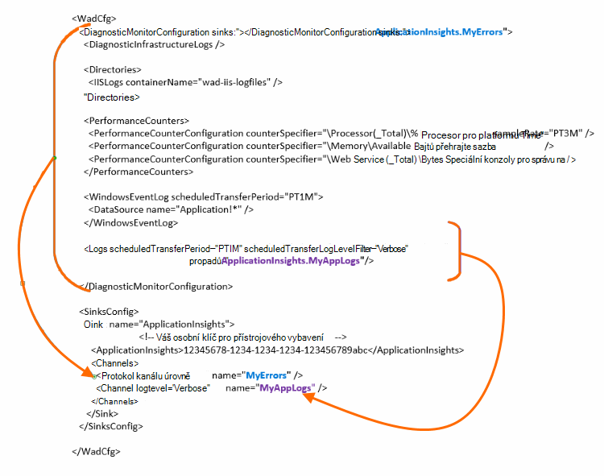

<properties
    pageTitle="Odeslat protokoly pro diagnostiku Azure interpretace aplikace"
    description="Konfigurace podrobné informace o protokolech diagnostiky Azure Cloud Services, které jsou odeslané na portál přehledy aplikace."
    services="application-insights"
    documentationCenter=".net"
    authors="sbtron"
    manager="douge"/>

<tags
    ms.service="application-insights"
    ms.workload="tbd"
    ms.tgt_pltfrm="ibiza"
    ms.devlang="na"
    ms.topic="article"
    ms.date="11/17/2015"
    ms.author="awills"/>

# <a name="configure-azure-diagnostic-logging-to-application-insights"></a>Konfigurace protokolování diagnostiky Azure interpretace aplikace

Při nastavení Cloudovým službám projektu nebo virtuálního počítače v Microsoft Azure [Azure můžete generovat diagnostickém protokolu](../vs-azure-tools-diagnostics-for-cloud-services-and-virtual-machines.md). Můžete mít takto odeslána interpretace aplikace tak, že můžete analyzovat spolu s diagnostic a použití telemetrie odeslaných z prostředí aplikace SDK přehledy aplikace. Protokol Azure zahrnuje události najdete v tématu správy aplikace například spustit, zastavit, dojde k chybě, jakož i výkonnosti. Protokol obsahuje taky volání v aplikaci System.Diagnostics.Trace.

Tento článek popisuje konfigurace diagnostiky snímku podrobně.

Potřebujete 2,8 SDK Azure nainstalovaný ve Visual Studiu.

## <a name="get-an-application-insights-resource"></a>Získání aplikace přehledy prostředku

Pro nejlepší prostředí, [Přidat SDK přehledy aplikace k jednotlivým rolím aplikace cloudové služby](app-insights-cloudservices.md)nebo [k libovolné aplikaci se spustí ve vaší OM](app-insights-overview.md). Potom můžete odeslat diagnostické data, která chcete analyzovat a zobrazí stejný zdroj přehledy aplikace.

Můžete taky Pokud nechcete používat SDK – například pokud aplikace nebude už live – můžete jenom [Vytvoření nového prostředku přehledy aplikace](app-insights-create-new-resource.md) na portálu Azure. Klikněte na **Diagnostika Azure** jako typ aplikace.


## <a name="send-azure-diagnostics-to-application-insights"></a>Odeslání Azure diagnostiky interpretace aplikace

Pokud je možné aktualizovat projekt aplikace, pak ve Visual Studiu vyberte každou roli, zvolte jeho vlastností a na kartě Konfigurace vyberte **Odeslat diagnostiky interpretace aplikace**.

Pokud už je aplikace live, pomocí Průzkumníka serveru nebo Průzkumníka Cloudovým službám Visual Studio otevřete dialogové okno Vlastnosti aplikace. Zaškrtněte políčko **Odeslat diagnostiky interpretace aplikace**.

V každém případě budete požádáni podrobné informace o zdroji přehledy aplikace, kterou jste vytvořili.

[Další informace o nastavení aplikace přehledy aplikace Cloudovým službám](app-insights-cloudservices.md).

## <a name="configuring-the-azure-diagnostics-adapter"></a>Konfigurace adaptér Azure diagnostiky

Jen pro čtení na Chcete-li vybrané části hovoru, který budete posílat přehledy aplikace. Ve výchozím nastavení všechno, co se odesílá, včetně: Microsoft Azure události. výkonnosti; sledování volání v aplikaci System.Diagnostics.Trace.

Azure Diagnostika jsou uložená data do tabulek Azure úložiště. Můžete však také kanálu všechny nebo podmnožinu dat pro přehledy aplikace nakonfigurováním "propadů" a "kanály" v konfiguraci při použití Azure diagnostiky rozšíření 1.5 nebo novější.

### <a name="configure-application-insights-as-a-sink"></a>Konfigurace aplikace přehledy jako jímka

Když použijete vlastnosti rolí "Odeslat data interpretace aplikace", SDK Azure (2,8 nebo novější) přidá `<SinksConfig>` prvek veřejný [Azure diagnostiky konfiguračního souboru](https://msdn.microsoft.com/library/azure/dn782207.aspx) role.

`<SinksConfig>`Definuje jímce další kde dat Azure diagnostiky odesílat.  Příklad `SinksConfig` vypadá takhle:

```xml

    <SinksConfig>
     <Sink name="ApplicationInsights">
      <ApplicationInsights>{Insert InstrumentationKey}</ApplicationInsights>
      <Channels>
        <Channel logLevel="Error" name="MyTopDiagData"  />
        <Channel logLevel="Verbose" name="MyLogData"  />
      </Channels>
     </Sink>
    </SinksConfig>

```

`ApplicationInsights` Element Určuje klíč přístrojového vybavení, který identifikuje přehledy aplikace zdroje, do kterého dat Azure diagnostiky odešle. Po výběru zdroje ho zadá automaticky na základě `APPINSIGHTS_INSTRUMENTATIONKEY` konfiguraci služby. (Pokud chcete nastavit ručně, optimálnímu klávesu Essentials rozevíracího seznamu prostředku.)

`Channels`Definujte data, která se pošle jímce. Kanál funguje jako filtr. `loglevel` Atribut vám umožní určit úroveň protokolování, který vám pošle kanál. Jsou dostupné hodnoty: `{Verbose, Information, Warning, Error, Critical}`.

### <a name="send-data-to-the-sink"></a>Odeslání dat do jímce

Odeslání dat pro přehledy aplikace dřez přidáním atribut propadů uzlu DiagnosticMonitorConfiguration. Přidání prvku propadů do jednotlivých uzlech Určuje, že data shromážděná z uzel a všechny uzel pod ní nechat zasílat jímce zadali.

Výchozí vytvořené v Azure SDK je například odeslání Azure diagnostiky dat:

```xml

    <DiagnosticMonitorConfiguration overallQuotaInMB="4096" sinks="ApplicationInsights">
```

Ale pokud chcete odeslat jenom protokolů chyb kvalifikovat názvu jímky s názvem kanálu:

```xml

    <DiagnosticMonitorConfiguration overallQuotaInMB="4096" sinks="ApplicationInsights.MyTopDiagdata">
```

Všimněte si, že Pracujeme s programem název jímka, která byla definována společně s název kanálu, která byla definována nad.

Pokud chcete poslat protokoly podrobného aplikace interpretace aplikace a pak přidejte propadů atributy, které mají `Logs` uzel.

```xml

    <Logs scheduledTransferPeriod="PT1M" scheduledTransferLogLevelFilter="Verbose" sinks="ApplicationInsights.MyLogData"/>
```

Mohou také obsahovat více umyvadel v konfiguraci na různých úrovních hierarchie. V takovém případě jímce uvedené na webu nejvyšší úrovně z hierarchie funguje jako globální nastavení a určenou na jednotlivé prvky elementu úkony jako přepíše globálního nastavení.

Tady je kompletní příklad veřejné konfiguračního souboru, který odešle všechny chyby na interpretaci aplikace (zadané v `DiagnosticMonitorConfiguration` uzel) a navíc úroveň protokoly pro protokoly aplikace (zadané v `Logs` uzel).

```xml

    <WadCfg>
     <DiagnosticMonitorConfiguration overallQuotaInMB="4096"
       sinks="ApplicationInsights.MyTopDiagData"> <!-- All info below sent to this channel -->
      <DiagnosticInfrastructureLogs />
      <PerformanceCounters>
        <PerformanceCounterConfiguration counterSpecifier="\Processor(_Total)\% Processor Time" sampleRate="PT3M" sinks="ApplicationInsights.MyLogData/>
        <PerformanceCounterConfiguration counterSpecifier="\Memory\Available MBytes" sampleRate="PT3M" />
        <PerformanceCounterConfiguration counterSpecifier="\Web Service(_Total)\Bytes Total/Sec" sampleRate="PT3M" />
      </PerformanceCounters>
      <WindowsEventLog scheduledTransferPeriod="PT1M">
        <DataSource name="Application!*" />
      </WindowsEventLog>
      <Logs scheduledTransferPeriod="PT1M" scheduledTransferLogLevelFilter="Verbose"
            sinks="ApplicationInsights.MyLogData"/>
       <!-- This specific info sent to this channel -->
     </DiagnosticMonitorConfiguration>

     <SinksConfig>
      <Sink name="ApplicationInsights">
        <ApplicationInsights>{Insert InstrumentationKey}</ApplicationInsights>
        <Channels>
          <Channel logLevel="Error" name="MyTopDiagData"  />
          <Channel logLevel="Verbose" name="MyLogData"  />
        </Channels>
      </Sink>
     </SinksConfig>
    </WadCfg>
```



Platí určitá omezení nějaká pomocí této funkce:

* Kanály jsou určeny pouze pro práci s typ protokolu a ne výkonnosti. Pokud zadáte kanálu čítač elementem výkonu budou ignorovat.
* Úroveň protokolování pro kanál nesmí překročit úroveň protokolování pro co shromážděny Azure diagnostiky. Příklad: Nelze shromažďovat protokolu chyb v elementu protokoly a odešlete podrobné protokoly synchronizační aplikace přehled. Atribut scheduledTransferLogLevelFilter musí vždy shromáždit rovna nebo další protokoly než protokoly chcete poslat jímka.
* Shromažďované Azure diagnostiky rozšíření všechna data objektů blob nelze odeslat interpretace aplikace. Příklad nic určené ve skupinovém rámečku uzel adresáře. Pro pád vypíše skutečné výpis pořád odešle se úložiště objektů blob a odešle pouze oznámení, že byl vytvořen výpis interpretace aplikace.

## <a name="related-topics"></a>Příbuzná témata

* [Sledování služby Azure Cloud Services s přehledy aplikace](app-insights-cloudservices.md)
* [Odesílání Azure diagnostiky interpretace aplikace pomocí prostředí PowerShell](app-insights-powershell-azure-diagnostics.md)
* [Azure diagnostiky konfigurační soubor](https://msdn.microsoft.com/library/azure/dn782207.aspx)
