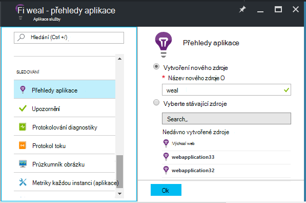
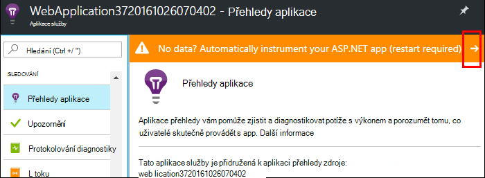
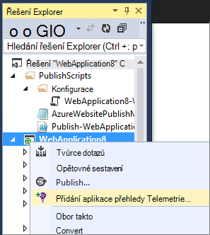
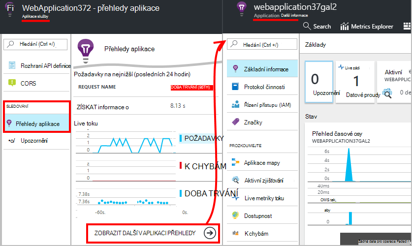
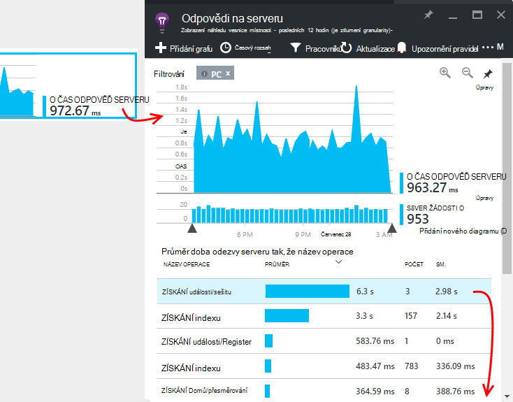
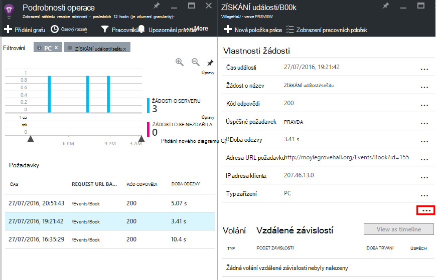

<properties
    pageTitle="Sledovat výkon Azure webové aplikace | Microsoft Azure"
    description="Aplikace sledování výkonu pro Azure webových aplikacích. Graf načítání a odpovědi na ně čas, informace o závislostech a nastavit upozornění na výkon."
    services="application-insights"
    documentationCenter=".net"
    authors="alancameronwills"
    manager="douge"/>

<tags
    ms.service="azure-portal"
    ms.workload="na"
    ms.tgt_pltfrm="na"
    ms.devlang="na"
    ms.topic="article"
    ms.date="10/24/2016"
    ms.author="awills"/>

# Sledovat výkon Azure web app

Na [Portálu Azure](https://portal.azure.com) můžete nastavit sledování výkonu aplikace pro [Azure webových aplikacích](../app-service-web/app-service-web-overview.md). [Přehledy aplikace Visual Studio](app-insights-overview.md) nástroje aplikace odešlete přehledy aplikace služby, kam se ukládají a analyzovat telemetrie o jejich aktivitách. Metrických grafů a nástroje hledání mohou sloužit k Diagnostika problémů, zvýšit výkon a posuďte použití.

## Doba běhu nebo vytvořit čas

Můžete nakonfigurovat sledování pomocí nastavení v aplikaci jedním ze dvou způsobů:

* **Spuštění** – můžete zvolit sledování rozšíření webové aplikace je již živou výkonu. Není nutné znovu vytvořit nebo znovu nainstalujete. Potřebujete standardní sady balíčků, které sledují doby odezvy úspěšnosti, výjimek, závislosti a tak dál. 
 
* **Vytvoření čas** - nainstalování sady v aplikaci ve vývoji. Tato možnost je další univerzální. Kromě stejné standardní balíčků můžete napsat kód můžete přizpůsobit telemetrie nebo odeslání vlastní telemetrie. Se můžete přihlásit konkrétní aktivity ani události záznam podle sémantiku domény aplikace. 

## Spuštění přístrojového vybavení času s přehledy aplikace

Pokud už používáte do webových aplikací v Azure, už se některé sledování: žádost a chyby sazeb. Přidání aplikace přehledy chtít ještě víc, například doby odezvy, sledování volání závislostí, inteligentní vyhledávání a výkonných analýz dotazu jazyka. 

1. **Vyberte aplikaci přehledy** Azure ovládacího panelu pro web app.

    

 * Pokud už nastavíte aplikace přehledy zdroje pro tuto aplikaci jiné cestou, zvolte k vytvoření nového zdroje.

2. **Nástroj webovou aplikaci** po instalaci aplikace přehledy. 

    

3. **Sledování aplikací**.  [Expore data](#explore-the-data).

Později můžete vytvořit a přeinstalujte aplikaci pomocí aplikace přehledy požadovaná.

*Jak odebrat aplikaci přehledy, nebo přepnout do odesílání na jiný prostředek?*

* V Azure otevřete ovládací prvek zásuvné web app a v části nástroje pro vývoj, otevřete **rozšíření**. Odstranění aplikace přehledy rozšíření. Pak v části sledování, zvolte přehledy aplikace a vytvořit nebo vybrat zdroje, které chcete.

## Vytvářet aplikace s přehledy aplikace

Aplikace přehledy můžete poskytnout podrobnější telemetrie instalací SDK do aplikace. Můžete zejména shromáždit protokoly trasování, [napsat vlastní telemetrie](../application-insights/app-insights-api-custom-events-metrics.md)a získat podrobnější výjimce sestavy.

1. **Ve Visual Studiu** (aktualizace 2013 2 nebo novější), přidání SDK přehledy aplikace do projektu.

    

    Pokud se zobrazí výzva k přihlášení, použijte přihlašovací údaje účtu Azure.

    Operace obsahuje dva efekty:

 1. Vytvoří aplikace přehledy zdroje v Azure, kam se ukládají, analyzovat a zobrazí telemetrie.
 2. Přidá balíček aplikace přehledy NuGet kódu a nakonfiguruje jej odešlete telemetrie Azure zdroje.

2. **Test telemetrie** spuštěním aplikace v počítači vývoj (F5).

3. **Publikování aplikace** Azure obvyklým způsobem. 

*Jak se dá přepnout odesílání na jiný zdroj přehledy aplikace?*

* Ve Visual Studiu, klikněte pravým tlačítkem myši projektu, zvolte **přehledy aplikace > Konfigurovat** a zvolte požadovaný prostředek. Získáte možnost vytvořit nový zdroj. Opětovné sestavení a přeinstalujte.

## Zkoumání dat

1. V aplikaci přehledy zásuvné váš web app ovládací panely, uvidíte Live metriky, který ukazuje žádosti o schůzku a chyb v rámci podruhé jednu nebo dvě z nich výskytu. Když máte publikování aplikace – se okamžitě zobrazí problémy je velmi užitečná zobrazení.

2. Klikněte na úplné aplikace přehledy zdroji.

    
    

    Můžete taky přejít tam buď přímo z navigace Azure zdroje.

2. Proklikejte grafu zobrazíte více podrobností:

    

    Můžete [Upravit metriky listy](../application-insights/app-insights-metrics-explorer.md).

3. Klikněte na na jednotlivé události najdete v článku a jejich vlastnosti:

    

    Všimněte si trojtečkou (...) odkaz zobrazíte všechny vlastnosti.

    Můžete [Upravit hledání](../application-insights/app-insights-diagnostic-search.md).

Pro složitější vyhledávání přes svůj telemetrie pomocí [technologie pro analýzu dotazu jazyka](../application-insights/app-insights-analytics-tour.md).

## Další kroky

* [Povolení Azure diagnostiky](app-insights-azure-diagnostics.md) nechat zasílat interpretace aplikace.
* [Sledování služby Stav metriky](../monitoring-and-diagnostics/insights-how-to-customize-monitoring.md) abyste měli jistotu, že vaše služba je k dispozici a citlivé.
* [Přijímání oznámení](../monitoring-and-diagnostics/insights-receive-alert-notifications.md) pokaždé, když dojde k provozní událostem nebo metriky křížové prahovou hodnotu.
* Pomocí [Aplikace přehledy JavaScript aplikace a webových stránek](app-insights-web-track-usage.md) klienta telemetrie z prohlížeče, které najdete na webovou stránku.
* [Nastavení dostupnost webových testů](app-insights-monitor-web-app-availability.md) byli upozorněni, pokud je váš web dolů.
