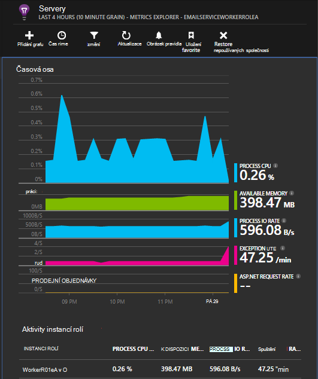

<properties
   pageTitle="Přehledy aplikace služby Azure mraků"
   description="Sledování váš web a pracovní role efektivně s přehledy aplikace"
   services="application-insights"
   documentationCenter=""
   authors="soubhagyadash"
   manager="douge"
   editor="alancameronwills"/>

<tags
   ms.service="application-insights"
   ms.devlang="na"
   ms.tgt_pltfrm="ibiza"
   ms.topic="article"
   ms.workload="tbd"
   ms.date="03/02/2016"
   ms.author="sdash"/>

# <a name="application-insights-for-azure-cloud-services"></a>Přehledy aplikace služby Azure cloudu


*Přehledy aplikace je v náhledu*

[Aplikace služby cloudu společnosti Microsoft Azure](https://azure.microsoft.com/services/cloud-services/) může být pod kontrolou [Přehledy aplikace Visual Studio] [ start] dostupnost, výkonu, selhání a použití. Zpětnou vazbu, získáte informace o výkon a efektivitu aplikace v přírody můžete můžete kvalifikovaně o směru návrhu v jednotlivých životního cyklu vývoje.


Musíte mít předplatné s [Microsoft Azure](http://azure.com). Přihlaste se pomocí účtu Microsoft, který může mít pro Windows, XBox Live nebo jiných cloudovým službám společnosti Microsoft. 


#### <a name="sample-application-instrumented-with-application-insights"></a>Ukázková aplikace vybaveno aplikace přehledy převodníkem

Podívejte se na této [ukázkové aplikace](https://github.com/Microsoft/ApplicationInsights-Home/tree/master/Samples/AzureEmailService) , ve kterém přehledy aplikace se přidá do cloudové služby rolemi dva pracovní hostované v Azure. 

Následující uvedeno, jak přizpůsobit vlastní projekt služby cloudu stejným způsobem.

## <a name="create-an-application-insights-resource-for-each-role"></a>Vytvoření aplikace přehledy zdroje pro každou roli

Aplikace přehledy zdroje je místo, kam analyzovat a zobrazí telemetrickými daty.  

1.  [Azure portál][portal], vytvoření nového prostředku přehledy aplikace. Typ aplikace zvolte ASP.NET aplikace. 

    

2.  Přepnout kopii klávesu přístrojového vybavení. Musíte to krátce ke konfiguraci SDK.

    


Obvykle je [vhodné vytvořit samostatné zdroje dat z každého webu a pracovní role](app-insights-separate-resources.md). 

Jako alternativu můžete může odešlete data ze všech rolí jediným zdroje, ale nastavte [vlastnost Výchozí] [ apidefaults] tak, aby filtrovat nebo seskupit výsledky každou roli.

## <a name="sdk"></a>Instalace SDK v každé aplikaci project


1. Ve Visual Studiu upravte balíčků NuGet projekt aplikace cloudu.

    


2. Role web přidáte balíček NuGet [Přehledy aplikace pro Web](http://www.nuget.org/packages/Microsoft.ApplicationInsights.Web) . Tato verze SDK obsahuje modulů kontroly, které Přidat kontext serveru například informace o rolích. Role pracovníka dosáhnete [Přehledy aplikace pro servery systému Windows](https://www.nuget.org/packages/Microsoft.ApplicationInsights.WindowsServer/).

    


3. Konfigurace SDK odeslání dat do aplikace přehledy zdroje.

    Nastavení klávesu přístrojového vybavení jako nastavení konfigurace v souboru `ServiceConfiguration.Cloud.cscfg`. ([Ukázkový kód](https://github.com/Microsoft/ApplicationInsights-Home/blob/master/Samples/AzureEmailService/AzureEmailService/ServiceConfiguration.Cloud.cscfg)).
 
    ```XML
     <Role name="WorkerRoleA"> 
      <Setting name="APPINSIGHTS_INSTRUMENTATIONKEY" value="YOUR IKEY" /> 
     </Role>
    ```
 
    Ve funkci vhodné spuštění nastavení klávesu přístrojového vybavení z nastavení konfigurace:

    ```C#
     TelemetryConfiguration.Active.InstrumentationKey = RoleEnvironment.GetConfigurationSettingValue("APPINSIGHTS_INSTRUMENTATIONKEY");
    ```

    Poznámky, se stejným názvem `APPINSIGHTS_INSTRUMENTATIONKEY` konfigurace nastavení použije Azure diagnostiky vytváření sestav. 


    To udělejte pro každou roli v aplikaci. Příklady:
 
 * [Web role](https://github.com/Microsoft/ApplicationInsights-Home/blob/master/Samples/AzureEmailService/MvcWebRole/Global.asax.cs#L27)
 * [Pracovní rolí](https://github.com/Microsoft/ApplicationInsights-Home/blob/master/Samples/AzureEmailService/WorkerRoleA/WorkerRoleA.cs#L232)
 * [Na webových stránkách](https://github.com/Microsoft/ApplicationInsights-Home/blob/master/Samples/AzureEmailService/MvcWebRole/Views/Shared/_Layout.cshtml#L13)   

4. Nastavte ApplicationInsights.config soubor vždy zkopírovat adresáři výstupu. 

    (V souboru config uvidíte zprávy s dotazem, umístěte klávesu přístrojového vybavení tam. Získáte cloudu je lepší ho nastavit ze souboru .cscfg. Zajistíte tím, že roli správně rozsahu na portálu.)


#### <a name="run-and-publish-the-app"></a>Spuštění a publikování v aplikaci

Spusťte aplikaci a přihlaste se k Azure. Otevřete aplikaci přehledy zdroje, který jste vytvořili a uvidíte jednotlivé datové body zobrazené v [hledání](app-insights-diagnostic-search.md)a souhrnná data v [Průzkumníku míru](app-insights-metrics-explorer.md). 

Přidání další telemetrie – najdete v článku níže – a pak publikovat aplikace zjištění názorů uživatelů živou diagnostic a použití. 


#### <a name="no-data"></a>Žádná data?

* Otevření [hledání] [ diagnostic] dlaždici, zobrazí se jednotlivé události.
* Používání aplikace otevření jiné stránky, aby vygeneruje některé telemetrie.
* Počkejte několik sekund, než a klikněte na aktualizovat.
* Viz [Poradce při potížích][qna].


## <a name="more-telemetry"></a>Další telemetrie

Níže zobrazení, jak lze získat další telemetrie z různé aspekty aplikace.


## <a name="track-requests-from-worker-roles"></a>Žádosti o sledování pracovní rolí

Modul požadavky v jednotlivých rolích web, se automaticky shromažďují data o požadavcích HTTP. Zobrazit [ukázkové MVCWebRole](https://github.com/Microsoft/ApplicationInsights-Home/tree/master/Samples/AzureEmailService/MvcWebRole) příklady, jak můžete změnit výchozí chování kolekce. 

Zachycení výkonu volání pracovníka role Tracking stejným způsobem jako požadavků HTTP. V aplikaci přehledy opatření typ telemetrie požadavku celku pojmenovaný server straně práce, kterou můžete vypršel časový limit a můžete nezávisle na sobě úspěšné nebo selže. Během požadavků HTTP jsou automaticky zachyceny SDK, můžete vložit vlastního kódu ke sledování požadavky k rolím kolegy.

Najdete v článku dva pracovní rolí ukázkové vybavit přístroji požadavky na sestavy: [WorkerRoleA](https://github.com/Microsoft/ApplicationInsights-Home/tree/master/Samples/AzureEmailService/WorkerRoleA) a [WorkerRoleB](https://github.com/Microsoft/ApplicationInsights-Home/tree/master/Samples/AzureEmailService/WorkerRoleB)

## <a name="azure-diagnostics"></a>Azure diagnostiky

[Diagnostika Azure](../vs-azure-tools-diagnostics-for-cloud-services-and-virtual-machines.md) data obsahují události správy roli, výkonnosti a protokoly aplikace. Můžete mít tyto odeslané interpretace aplikace tak, aby si mohli prohlédnout vedle zbytek vaší telemetrie usnadňuje Diagnostika problémů.

Azure diagnostiky jsou užitečné zejména pokud role neočekávaně selže nebo nejde spustit.

1. Klikněte pravým tlačítkem myši roli (není projekt!) otevřete jeho vlastnosti a vyberte **Povolit diagnostiky** **Odeslat diagnostiky interpretace aplikace**.

    

    **Nebo pokud je už publikované a spuštěna aplikace**, otevřete Průzkumníka serveru nebo v cloudu Explorer klikněte pravým tlačítkem na aplikaci a vyberte možnost stejné.

3.  Vyberte stejný zdroj přehledy aplikace jako svého telemetrie.

    Pokud chcete, můžete nastavit jiný zdroj v jiné službě konfigurace (cloudu, místní) jak udržet data vývoj nezávislý dynamických dat.

3. V případě potřeby [některé z Azure diagnostiky vynechat](app-insights-azure-diagnostics.md) , které chcete být přesměrované interpretace aplikace. Výchozí hodnota je vše.

### <a name="view-azure-diagnostic-events"></a>Zobrazit Azure diagnostické události

Kde lze najít Diagnostika:

* Výkonnosti jsou zobrazeny jako vlastní metriky. 
* Protokoly událostí Windows se zobrazují jako trasování a vlastní události.
* Aplikace protokoly, protokoly trasování událostí pro Windows a všechny diagnostiky infrastruktury zobrazí jako trasování.

Přečtěte si téma výkonnosti a počty události, spusťte [Průzkumníka metriky](app-insights-metrics-explorer.md) a přidat nový graf:


Použití [vyhledávání](app-insights-diagnostic-search.md) k prohledat různých protokoly trasování poslán Azure diagnostiky. Například pokud jste měli výjimku unhanded v roli, která způsobila roli selhat a odpadkového, že informace zobrazí se v aplikaci kanálu z protokolu událostí systému Windows. Pomocí funkce hledání můžete prohlédnout Chyba v protokolu událostí systému Windows a získat úplné zásobníku výjimky umožňuje najít hlavní příčinu problému.


## <a name="app-diagnostics"></a>Složka Doručená pošta aplikace Outlook

Azure diagnostiky automaticky obsahuje protokolu položky, které aplikace generuje pomocí System.Diagnostics.Trace. 

Ale pokud už používáte rámce Log4N nebo NLog, můžete to udělat taky [zachyťte trasování jeho protokolu][netlogs].

[Sledování vlastní události a metriky] [ api] na klienta nebo serveru nebo obojí, zobrazíte další informace o výkonu a využití aplikace.

## <a name="dependencies"></a>Závislosti

Aplikace přehledy SDK můžete vykázat jejich hovory, které aplikace umožňuje externím závislosti například rozhraní REST API a servery SQL. Toto oprávnění umožňuje najdete v článku jestli konkrétní závislost způsobuje pomalé odpovědi nebo k chybám.

Pokud vaše aplikace používá .NET framework 4.6 nebo novější, nemusíte udělat něco jiného. 

V opačném nastavte roli webové či pracovníka [Aplikace přehledy Agent](app-insights-monitor-performance-live-website-now.md) označovaná taky jako "sledování stavu".

Agent přehledy aplikace pomocí služby web či pracovníka role:

* Dodejte dva soubory a složky [AppInsightsAgent](https://github.com/Microsoft/ApplicationInsights-Home/tree/master/Samples/AzureEmailService/WorkerRoleA/AppInsightsAgent) v něm projektů role webové či pracovníka. Ujistěte se, a jejich vlastnosti sestavení tak, aby se vždy zkopírují do adresáře výstupu. Tyto soubory nainstalovat agenta.
* Přidejte spouštění úkolu CSDEF souboru jako znázorněno [zde](https://github.com/Microsoft/ApplicationInsights-Home/tree/master/Samples/AzureEmailService/AzureEmailService/ServiceDefinition.csdef#L18).
* Poznámka: *Pracovní role* vyžadovaly proměnné tři znázorněno [zde](https://github.com/Microsoft/ApplicationInsights-Home/tree/master/Samples/AzureEmailService/AzureEmailService/ServiceDefinition.csdef#L44). Tento krok není povinný pro web role.

### <a name="dependency-reports"></a>Závislost typu sestavy

Tady je příklad toho, co uvidíte v portálu přehledy aplikace:

* Formátovaný Diagnostika se automaticky vzájemném vztahu žádosti o schůzku a závislosti:

    

* Výkon roli web s informace o závislostech:

    

* Tady je snímek na žádosti a informace o závislostech pracovníka role:

    

## <a name="exceptions"></a>Výjimky

Návod, jak můžete shromažďovat neošetřené výjimky z různých webových aplikací typů naleznete v tématu [Sledování výjimky v aplikaci přehledy](app-insights-asp-net-exceptions.md) .

Ukázka webové role má řadiče MVC5 a webového rozhraní API 2. Neošetřené výjimky z 2 ukládány s takto:

* [AiHandleErrorAttribute](https://github.com/Microsoft/ApplicationInsights-Home/blob/master/Samples/AzureEmailService/MvcWebRole/Telemetry/AiHandleErrorAttribute.cs) nastavení [tady](https://github.com/Microsoft/ApplicationInsights-Home/blob/master/Samples/AzureEmailService/MvcWebRole/App_Start/FilterConfig.cs#L12) MVC5 řadiče
* [AiWebApiExceptionLogger](https://github.com/Microsoft/ApplicationInsights-Home/blob/master/Samples/AzureEmailService/MvcWebRole/Telemetry/AiWebApiExceptionLogger.cs) nastavení [tady](https://github.com/Microsoft/ApplicationInsights-Home/blob/master/Samples/AzureEmailService/MvcWebRole/App_Start/WebApiConfig.cs#L25) řadiče webového rozhraní API 2

Pro pracovní role dvěma způsoby můžete sledovat výjimky.

* TrackException(ex)
* Pokud jste přidali balíček aplikace přehledy sledování posluchače NuGet, můžete System.Diagnostics.Trace přihlásit výjimky. [Příklad kódu.](https://github.com/Microsoft/ApplicationInsights-Home/blob/master/Samples/AzureEmailService/WorkerRoleA/WorkerRoleA.cs#L107)

## <a name="performance-counters"></a>Výkonnosti

Následující čítače odebírají ve výchozím nastavení:

    * \Process(??APP_WIN32_PROC??)\% Procesor času
    * \Memory\Available bajtů
    * \.Čistého CLR Exceptions(??APP_CLR_PROC??)\# vyvolané vyvolané / s
    * \Process (??. APP_WIN32_PROC??) \Private bajtů
    * \Process (??. APP_WIN32_PROC??) Data \IO bajtů/sec
    * \Processor(_Total)\% Procesor času

Kromě toho takto taky odebírají pro web role:

    * \ASP.NET aplikací (??. APP_W3SVC_PROC??) \Requests/sec    
    * \ASP.NET aplikací (??. APP_W3SVC_PROC??) Čas spuštění \Request
    * \ASP.NET aplikací (??. APP_W3SVC_PROC??) \Requests ve frontě aplikace

Jako zachycujících [tady](https://github.com/Microsoft/ApplicationInsights-Home/blob/master/Samples/AzureEmailService/WorkerRoleA/ApplicationInsights.config#L14) můžete zadat další vlastní nebo výkonnosti jiných windows

  

## <a name="correlated-telemetry-for-worker-roles"></a>Vzájemném vztahu Telemetrie pro pracovní role

Je bohaté diagnostiky setkat i v případě, když najdete v článku co vedly k žádost o nezdařeném uložení nebo vysokou latenci. S rolemi web SDK automaticky nastaví korelace související telemetrie. Vlastní telemetrie inicializační pracovníka role slouží k nastavení běžných atribut kontextu Operation.Id pro všechny telemetrie docílit. To vám umožní zobrazíte, zda latence/selhání způsobila kvůli závislost nebo kódu, na první pohled. 

Tady je způsob:

* Nastavení Id korelace do CallContext jako znázorněno [zde](https://github.com/Microsoft/ApplicationInsights-Home/blob/master/Samples/AzureEmailService/WorkerRoleA/WorkerRoleA.cs#L36). V tomto případě používáme požádat o ID jako id korelace
* Přidání vlastní implementaci TelemetryInitializer, nastavené Operation.Id k correlationId výše uvedené. Ukazuje tento obrázek: [ItemCorrelationTelemetryInitializer](https://github.com/Microsoft/ApplicationInsights-Home/blob/master/Samples/AzureEmailService/WorkerRoleA/Telemetry/ItemCorrelationTelemetryInitializer.cs#L13)
* Přidání vlastní telemetrie inicializační. Může to uděláte v souboru ApplicationInsights.config nebo v kódu jako znázorněno [zde](https://github.com/Microsoft/ApplicationInsights-Home/blob/master/Samples/AzureEmailService/WorkerRoleA/WorkerRoleA.cs#L233)

Je to! Práce s portálem je už drátové k vám umožní sledovat všechny přidružené telemetrie na první pohled:


## <a name="client-telemetry"></a>Telemetrie klienta

[Přidání JavaScript SDK do webové stránky] [ client] prohlížečový telemetrie třeba počty zobrazení stránky, načítáním stránek, výjimky skript a chcete si umožňují napsat vlastní telemetrie skriptů stránky.

## <a name="availability-tests"></a>Dostupnost testů

[Nastavení webových testů] [ availability] zajistit zůstane aplikace live a citlivé.


## <a name="example"></a>Příklad

[V příkladu](https://github.com/Microsoft/ApplicationInsights-Home/tree/master/Samples/AzureEmailService) sleduje služba, která má web roli a dvě pracovníka role.

## <a name="exception-method-not-found-on-running-in-azure-cloud-services"></a>Výjimky "metoda nebyl nalezen" o spuštění cloudové služby Azure

Je vytvářet pro .NET 4.6? 4.6 nepodporuje automaticky role Azure Cloud Services. [Instalace 4.6 na každou roli](../cloud-services/cloud-services-dotnet-install-dotnet.md) před spuštěním aplikace.

## <a name="related-topics"></a>Příbuzná témata

* [Konfigurace odesílání Azure diagnostiky interpretace aplikace](app-insights-azure-diagnostics.md)
* [Odesílání Azure diagnostiky interpretace aplikace pomocí prostředí PowerShell](app-insights-powershell-azure-diagnostics.md)


[api]: app-insights-api-custom-events-metrics.md
[apidefaults]: app-insights-api-custom-events-metrics.md#default-properties
[apidynamicikey]: app-insights-separate-resources.md#dynamic-ikey
[availability]: app-insights-monitor-web-app-availability.md
[azure]: app-insights-azure.md
[client]: app-insights-javascript.md
[diagnostic]: app-insights-diagnostic-search.md
[netlogs]: app-insights-asp-net-trace-logs.md
[portal]: http://portal.azure.com/
[qna]: app-insights-troubleshoot-faq.md
[redfield]: app-insights-monitor-performance-live-website-now.md
[start]: app-insights-overview.md 
