<properties 
    pageTitle="Návod: exportujte telemetrie z aplikace přehledy do databáze SQL" 
    description="Neustále exportujte data aplikace přehledy SQL pomocí analýzy proudu." 
    services="application-insights" 
    documentationCenter=""
    authors="noamben" 
    manager="douge"/>

<tags 
    ms.service="application-insights" 
    ms.workload="tbd" 
    ms.tgt_pltfrm="ibiza" 
    ms.devlang="na" 
    ms.topic="article" 
    ms.date="03/06/2015" 
    ms.author="awills"/>
 
# <a name="walkthrough-export-to-sql-from-application-insights-using-stream-analytics"></a>Návod: Export do SQL z aplikace přehledy pomocí analýzy toku

Tento článek ukazuje přesouvání telemetrickými daty z [Přehledy aplikace Visual Studio] [ start] do databáze Azure SQL pomocí [Nepřetržitý exportovat] [ export] a [Azure toku analýzy](https://azure.microsoft.com/services/stream-analytics/). 

Nepřetržitý export slouží k přesunutí telemetrickými daty v úložišti Azure formátu JSON. Budete analyzovat objekty JSON pomocí analýzy toku Azure jsme vytvoření řádků v tabulce databáze.

(V obecnější rovině nepřetržitý exportovat je možné provést vlastní analýzu telemetrie aplikace odeslat do aplikace přehledy. Však může upravit a tato ukázka kódu pro další postupy s exportovaného telemetrie, například agregace dat.)

Začneme bude za předpokladu, že už máte aplikaci, kterou chcete sledovat.


V tomto příkladu použijeme data zobrazit stránky, ale stejným lze snadno rozšířit na jiné typy dat, například vlastní události a výjimky. 


## <a name="add-application-insights-to-your-application"></a>Přidání aplikace přehledy do aplikace


Jak začít:

1. [Nastavení aplikace přehledy pro webové stránky](app-insights-javascript.md). 

    (V tomto příkladu jsme se zaměřit na zpracování stránky zobrazení dat z prohlížeče klienta, ale můžete taky nastavit aplikace přehledy pro na straně serveru [Java](app-insights-java-get-started.md) nebo [ASP.NET](app-insights-asp-net.md) aplikace a proces žádost, závislost typu a dalších serveru telemetrie.)


5. Publikování aplikace a podívejte se na telemetrickými daty v aplikaci přehledy zdroje.


## <a name="create-storage-in-azure"></a>Vytvoření úložiště v Azure

Nepřetržitý exportovat vždy výstupní data s klientem Azure úložiště, je potřeba nejdřív vytvořit úložiště.

1. Vytvoření účtu úložiště ve vašem předplatném [Azure portál][portal].

    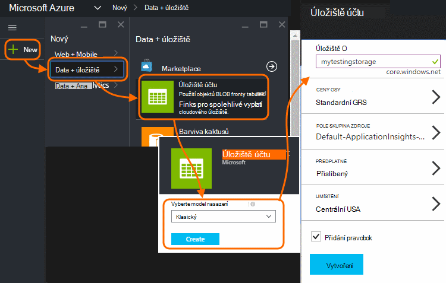

2. Vytvoření kontejneru

    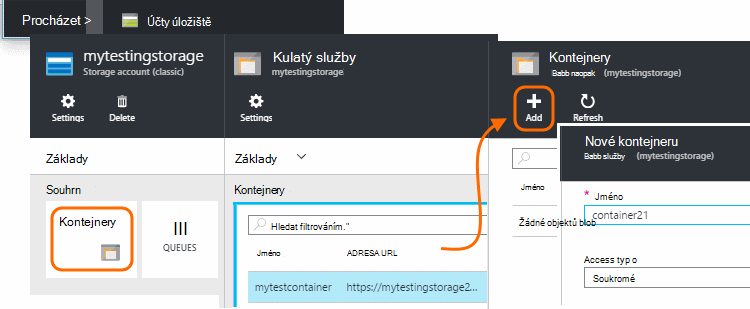

3. Zkopírujte přístupová klávesa úložiště

    Musíte ho brzy bude k dispozici pro nastavení vstupní ke službě analýzy proudu.

    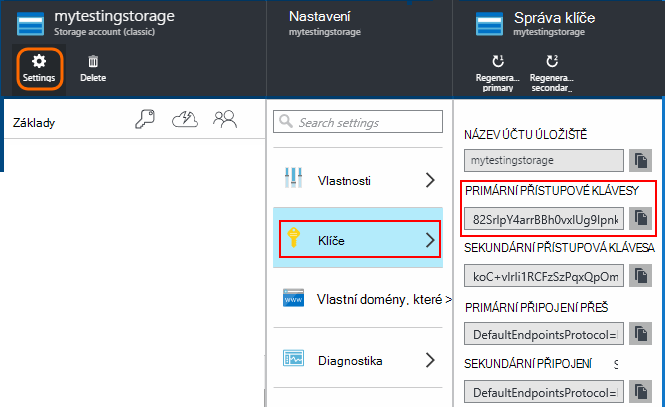

## <a name="start-continuous-export-to-azure-storage"></a>Zahájení nepřetržitý exportovat do Azure úložiště

1. V portálu Azure přejděte do aplikace přehledy zdroje, který jste vytvořili pro aplikaci.

    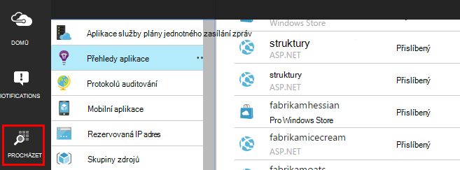

2. Vytvoření nepřetržitý exportovat.

    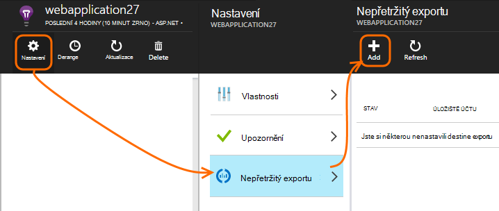


    Vyberte účet úložiště, který jste dříve vytvořili:

    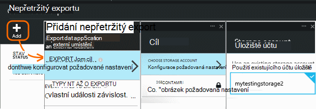
    
    Nastavte typy událostí, které chcete zobrazit:

    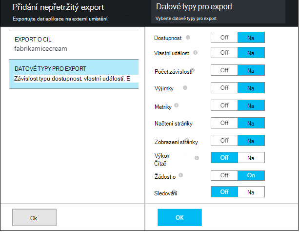


3. Informujte některá data nahromadit. Sednout zpět a zpřístupněte lidé pomocí aplikace určitou dobu. Telemetrie chodily a zobrazí se vám statistické grafy v [metrických explorer](app-insights-metrics-explorer.md) a jednotlivých událostí v [diagnostiky hledání](app-insights-diagnostic-search.md). 

    A navíc bude data exportovat do úložiště. 

4. Kontrola exportovaných data, buď na portálu - zvolte **Procházet**, vyberte úložiště účet a potom **kontejnery** - nebo ve Visual Studiu. Ve Visual Studiu, zvolte **zobrazení / cloudu Explorer**a otevřete Azure / úložiště. (Pokud už nemáte tato možnost nabídky, budete potřebovat k instalaci Azure SDK: Otevřete dialogové okno Nový projekt a Visual Basic / cloudu / stažení Microsoft Azure SDK pro .NET.)

    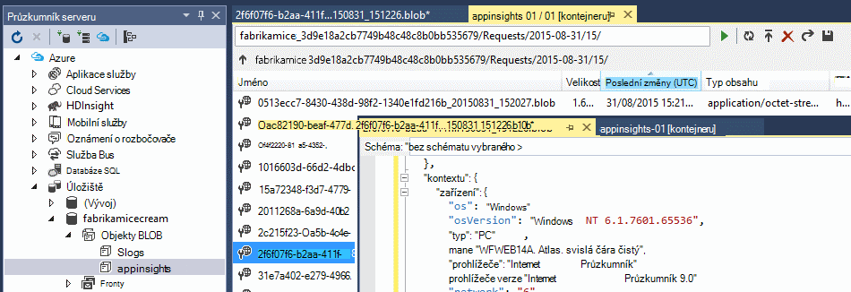

    Poznamenejte si běžné část názvu cesty, která je odvozena z klávesu application název a přístrojového vybavení. 

Události jsou došlo k objektů blob soubory ve formátu JSON zápisu. Každý soubor může obsahovat jedno nebo více událostí. Tak byste rádi číst data události a odfiltrovat pole, které chceme. Jsou všechny typy věci, které jsme může dělat s daty, ale naše plán dnes je přesouvat se pomocí analýzy toku dat k databázi SQL. Bude to snadný způsob spuštění spousty zajímavé dotazů.

## <a name="create-an-azure-sql-database"></a>Vytvoření databáze Azure SQL

Ještě jednou spuštění ze svého předplatného [Azure]portálu[portal], vytvoření databáze (a nový server, pokud už máte jednu) které budete psát data.

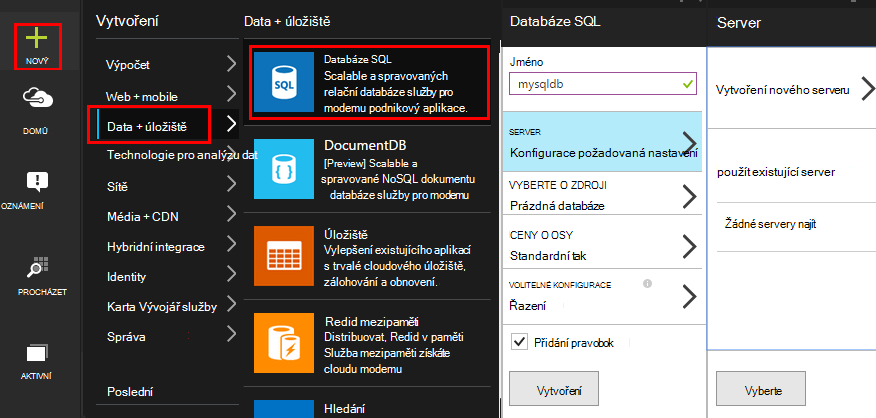


Zkontrolujte, že databázovém serveru umožňuje přístup k Azure služby:


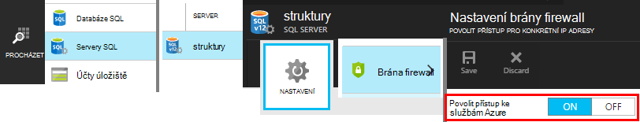

## <a name="create-a-table-in-azure-sql-db"></a>Vytvoření tabulky v databázi SQL Azure

Připojení k databázi vytvořenou v předchozí části nástrojem upřednostňovaný správy. V tomto návodu použijeme [Nástroje pro správu serveru SQL](https://msdn.microsoft.com/ms174173.aspx) (SSMS).

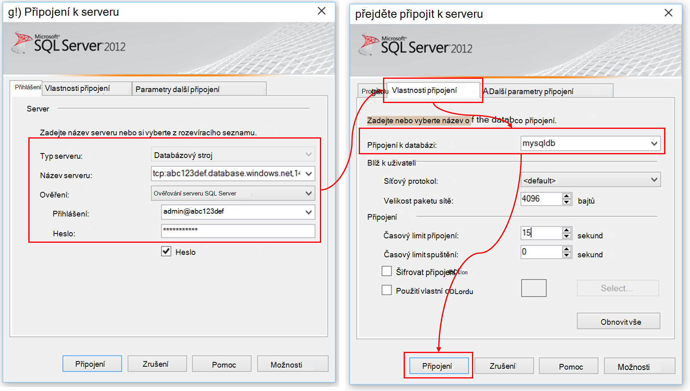

Vytvoří nový dotaz a provést následující T-SQL:

```SQL

CREATE TABLE [dbo].[PageViewsTable](
    [pageName] [nvarchar](max) NOT NULL,
    [viewCount] [int] NOT NULL,
    [url] [nvarchar](max) NULL,
    [urlDataPort] [int] NULL,
    [urlDataprotocol] [nvarchar](50) NULL,
    [urlDataHost] [nvarchar](50) NULL,
    [urlDataBase] [nvarchar](50) NULL,
    [urlDataHashTag] [nvarchar](max) NULL,
    [eventTime] [datetime] NOT NULL,
    [isSynthetic] [nvarchar](50) NULL,
    [deviceId] [nvarchar](50) NULL,
    [deviceType] [nvarchar](50) NULL,
    [os] [nvarchar](50) NULL,
    [osVersion] [nvarchar](50) NULL,
    [locale] [nvarchar](50) NULL,
    [userAgent] [nvarchar](max) NULL,
    [browser] [nvarchar](50) NULL,
    [browserVersion] [nvarchar](50) NULL,
    [screenResolution] [nvarchar](50) NULL,
    [sessionId] [nvarchar](max) NULL,
    [sessionIsFirst] [nvarchar](50) NULL,
    [clientIp] [nvarchar](50) NULL,
    [continent] [nvarchar](50) NULL,
    [country] [nvarchar](50) NULL,
    [province] [nvarchar](50) NULL,
    [city] [nvarchar](50) NULL
)

CREATE CLUSTERED INDEX [pvTblIdx] ON [dbo].[PageViewsTable]
(
    [eventTime] ASC
)WITH (PAD_INDEX = OFF, STATISTICS_NORECOMPUTE = OFF, SORT_IN_TEMPDB = OFF, DROP_EXISTING = OFF, ONLINE = OFF, ALLOW_ROW_LOCKS = ON, ALLOW_PAGE_LOCKS = ON)

```

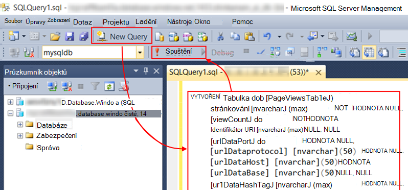

V tomto příkladu jsme jsou využívání dat z zobrazení stránky. Jiná data k dispozici zobrazíte prozkoumat JSON výstup a najdete v článku [export datového modelu](app-insights-export-data-model.md).

## <a name="create-an-azure-stream-analytics-instance"></a>Vytvoření instance analýzy toku Azure

[Klasický portál Azure](https://manage.windowsazure.com/)vyberte služby Azure toku analýzy a vytvořte nový projekt analýzy toku:


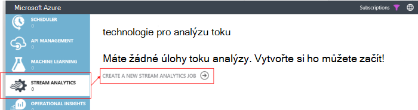


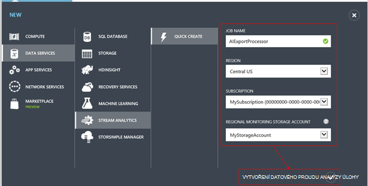

Po vytvoření nového projektu rozbalte její podrobnosti:

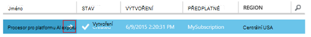

#### <a name="set-blob-location"></a>Nastavení objektů blob umístění

Nastavte, aby trvat vstup ze svého objektů blob nepřetržitý exportovat:

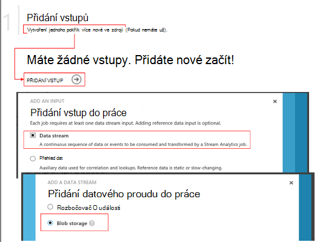

Teď musíte mít primární klíč přístup ze svého účtu úložiště, které bylo uvedeno dříve. Nastavte jako klíč účtu úložiště.

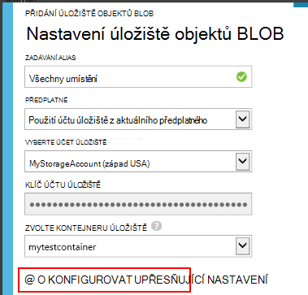

#### <a name="set-path-prefix-pattern"></a>Nastavení cesta předponu vzor 

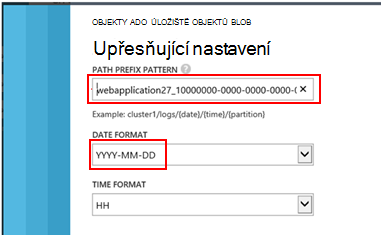

Ujistěte se, že nastavení formátu data **YYYY-MM-DD** (s **Typ čáry**).

Cesta předpona vzor Určuje, jak toku analýzy najde vstupních souborů v úložišti. Budete muset nastavit tak, aby odpovídala jak nepřetržitý Export jsou uložená data. Nastavte takto:

    webapplication27_12345678123412341234123456789abcdef0/PageViews/{date}/{time}

V tomto příkladu:

* `webapplication27`stejný název zdroje aplikace přehledy **všechny napsaných malými písmeny**. 
* `1234...`je klávesy přístrojového vybavení zobrazení aplikace přehledy zdroje **s pomlčky odebrány**. 
* `PageViews`je typ dat, která chcete analyzovat. Dostupné typy závisí na filtru nastavený ve exportovat nepřetržitý. Zkoumat data vyexportovat do najdete v článku dostupné typy a najdete v článku [export datového modelu](app-insights-export-data-model.md).
* `/{date}/{time}`vzorek zapsán doslova.

Zobrazíte jména a iKey příslušného zdroje aplikace přehledy otevřete Essentials na své stránce přehledu nebo otevřete nastavení.

#### <a name="finish-initial-setup"></a>Dokončení počáteční nastavení

Potvrďte formát serializace:

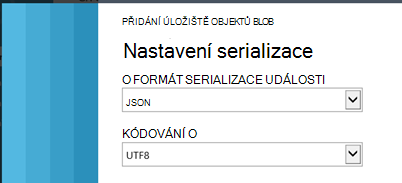

Zavřete průvodce a počkejte instalaci dokončete.

>[AZURE.TIP] Pomocí funkce Sample zkontrolujte, jestli máte nastavený vstupní cestě správně. Pokud dojde k chybě: Zkontrolujte, že je datový úložiště pro časový rozsah vzorku jste zvolili. Úprava vstupní definice a zaškrtněte políčko úložiště klienta, cestu předponu obnovit původní stav a datum formátu správně.

## <a name="set-query"></a>Nastavení dotazu

Otevření oddílu dotaz:

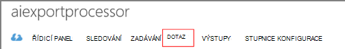

Nahrazení výchozího dotazu s:

```SQL

    SELECT flat.ArrayValue.name as pageName
    , flat.ArrayValue.count as viewCount
    , flat.ArrayValue.url as url
    , flat.ArrayValue.urlData.port as urlDataPort
    , flat.ArrayValue.urlData.protocol as urlDataprotocol
    , flat.ArrayValue.urlData.host as urlDataHost
    , flat.ArrayValue.urlData.base as urlDataBase
    , flat.ArrayValue.urlData.hashTag as urlDataHashTag
      ,A.context.data.eventTime as eventTime
      ,A.context.data.isSynthetic as isSynthetic
      ,A.context.device.id as deviceId
      ,A.context.device.type as deviceType
      ,A.context.device.os as os
      ,A.context.device.osVersion as osVersion
      ,A.context.device.locale as locale
      ,A.context.device.userAgent as userAgent
      ,A.context.device.browser as browser
      ,A.context.device.browserVersion as browserVersion
      ,A.context.device.screenResolution.value as screenResolution
      ,A.context.session.id as sessionId
      ,A.context.session.isFirst as sessionIsFirst
      ,A.context.location.clientip as clientIp
      ,A.context.location.continent as continent
      ,A.context.location.country as country
      ,A.context.location.province as province
      ,A.context.location.city as city
    INTO
      AIOutput
    FROM AIinput A
    CROSS APPLY GetElements(A.[view]) as flat


```

Všimněte si, že první několika vlastností určité stránky zobrazit data. Export ostatních typů telemetrie mají jiné vlastnosti. Zobrazit [podrobný odkaz datového modelu pro typy vlastností a hodnot.](app-insights-export-data-model.md)

## <a name="set-up-output-to-database"></a>Nastavení výstupu do databáze

Vyberte SQL jako výstup.

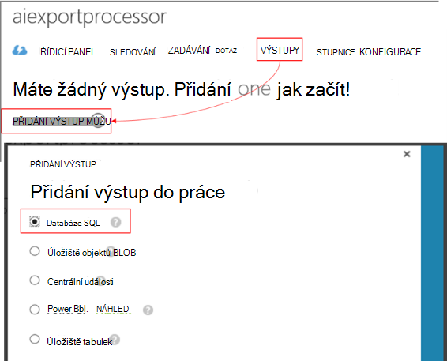

Určete databázi SQL.


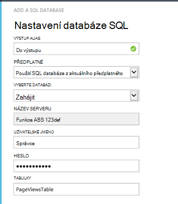

Zavřete průvodce a počkejte, oznámení, že je nastavené výstupu.

## <a name="start-processing"></a>Spuštění zpracování

Zahájení projektu na panelu akcí:

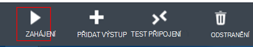

Rozhodnutí o zahájení zpracování dat ze nyní nebo začínat dřívější data. Je užitečné, pokud jste využili nepřetržitý exportovat spuštěná určitou dobu.


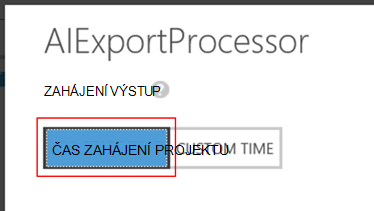

Po několika minutách vraťte se do nástroje pro správu serveru SQL a sledovat v toku dat. Příklad použití dotazu takto:

    SELECT TOP 100 *
    FROM [dbo].[PageViewsTable]


## <a name="related-articles"></a>Související články

* [Export do SQL pomocí roli kolegy](app-insights-code-sample-export-telemetry-sql-database.md)
* [Export do PowerBI pomocí technologie pro analýzu toku](app-insights-export-power-bi.md)
* [Podrobné porovnání datových modelů referenční informace pro typy vlastností a hodnoty.](app-insights-export-data-model.md)
* [Nepřetržitý exportovat do aplikace přehledy](app-insights-export-telemetry.md)
* [Přehledy aplikace](https://azure.microsoft.com/services/application-insights/)

<!--Link references-->

[diagnostic]: app-insights-diagnostic-search.md
[export]: app-insights-export-telemetry.md
[metrics]: app-insights-metrics-explorer.md
[portal]: http://portal.azure.com/
[start]: app-insights-overview.md

 