<properties 
    pageTitle="Ukázka kódu: Analýza dat vyexportovaný z aplikace přehledy" 
    description="Kód analýz telemetrie v aplikaci přehledy pomocí funkce nepřetržitý exportu. Uložení data do SQL." 
    services="application-insights" 
    documentationCenter=""
    authors="mazharmicrosoft" 
    manager="douge"/>

<tags 
    ms.service="application-insights" 
    ms.workload="tbd" 
    ms.tgt_pltfrm="ibiza" 
    ms.devlang="na" 
    ms.topic="article" 
    ms.date="01/05/2016" 
    ms.author="awills"/>
 
# Ukázka kódu: Analýza dat vyexportovaný z aplikace přehledy

Tento článek popisuje způsob zpracování dat JSON vyexportovaný z aplikace přehledy. Jako příklad jsme budete psát kód přesunout telemetrickými daty z [Přehledy aplikace Visual Studio] [ start] do databáze Azure SQL pomocí [Nepřetržitý exportovat][export]. (Můžete taky dosáhnout tento [pomocí technologie pro analýzu toku](app-insights-code-sample-export-sql-stream-analytics.md), ale náš cílem je zobrazit kód.) 

Nepřetržitý exportovat vaší telemetrie přejde do úložiště Azure ve formátu JSON, takže jsme budete psát některé kód pro analýzu JSON objekty a vytvoření řádků v tabulce databáze.

Nepřetržitý exportovat obecnější rovině je možné provést vlastní analýzy telemetrie aplikace odeslat interpretace aplikace. Tato ukázka kódu pro další postupy s exportovaného telemetrie může upravit.

Začneme bude za předpokladu, že už máte aplikaci, kterou chcete sledovat.

## Přidání aplikace přehledy SDK

Sledování aplikací, [přidejte SDK přehledy aplikace] [ start] aplikaci. Existují různé SDK a nástroje Pomocníka pro jiné platformy, IDEs a jazyky. Můžete sledovat webových stránek, Java nebo ASP.NET webových serverů a mobilní zařízení několika typů. Všechny SDK odešlete [přehledy aplikace portál]telemetrie[portal], kde můžete použít naše výkonné analýzy a diagnostických nástrojů a exportovat data k základnímu úložišti.

Jak začít:

1. Zřízení [účtu Microsoft Azure](https://azure.microsoft.com/pricing/).
2. [Azure portál][portal], přidání nového prostředku aplikace přehledy aplikace:

    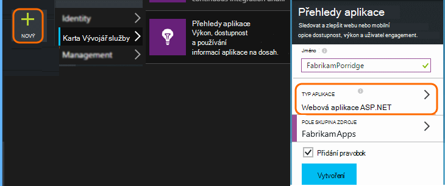

    (Předplatného a typ aplikace lišit.)
3. Otevřete rychlý Start najít nastavíte SDK pro příslušný typ aplikace.

    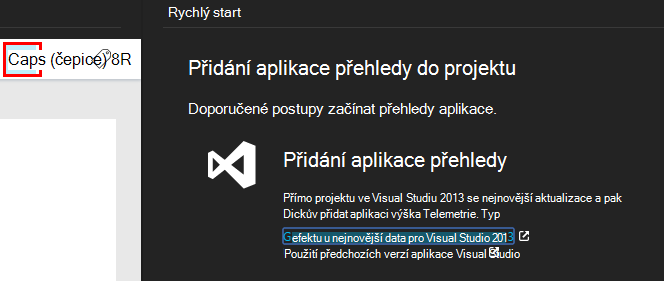

    Pokud nenajdete typ aplikace, podívejte se na [Začínáme] [ start] stránky.

4. V tomto příkladu probíhá sledování do webových aplikací, takže můžeme použít nástroje Azure ve Visual Studiu nainstalujete SDK. Jsme nedostane název naše aplikace přehledy zdroje:

    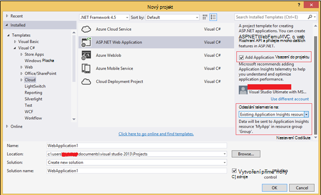

## Vytvoření úložiště v Azure

K účtu Azure úložiště ve formátu JSON vždy exportu dat z aplikace přehledy. Je od tohoto úložiště, kód bude číst data.

1. Vytvoření účtu "klasické" úložiště ve vašem předplatném [Azure portál][portal].

    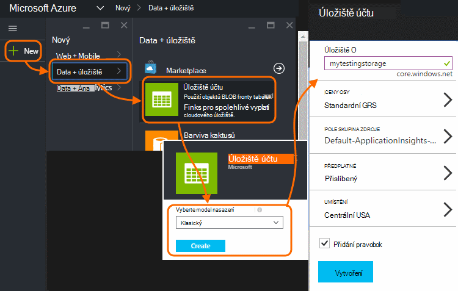

2. Vytvoření kontejneru

    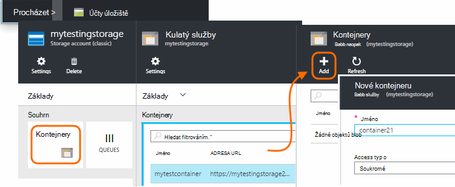

## Zahájení nepřetržitý exportovat do Azure úložiště

1. V portálu Azure přejděte do aplikace přehledy zdroje, který jste vytvořili pro aplikaci.

    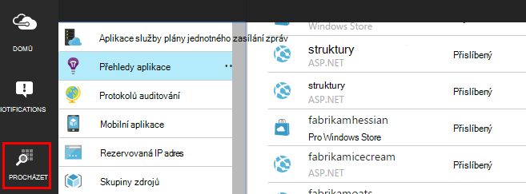

2. Vytvoření nepřetržitý exportovat.

    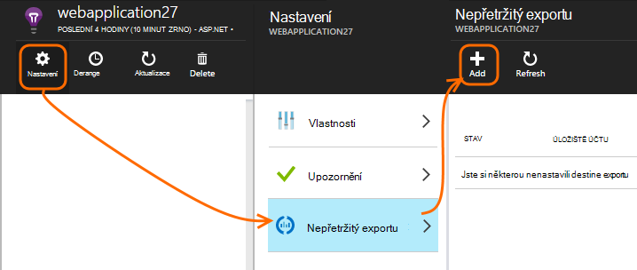

    Vyberte účet úložiště, který jste dříve vytvořili:

    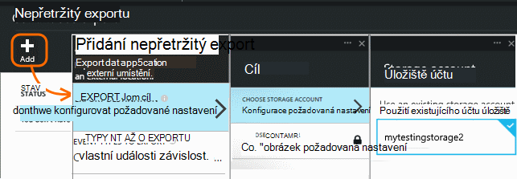
    
    Nastavte typy událostí, které chcete zobrazit:

    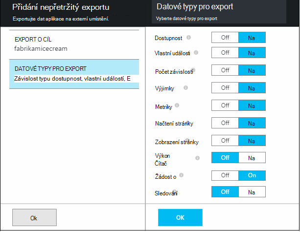

3. Informujte některá data nahromadit. Sednout zpět a zpřístupněte lidé pomocí aplikace určitou dobu. Telemetrie chodily a zobrazí se vám statistické grafy v [metrických explorer](app-insights-metrics-explorer.md) a jednotlivých událostí v [diagnostiky hledání](app-insights-diagnostic-search.md). 

    A navíc bude data exportovat do úložiště. 

4. Zkontrolujte exportovaná data. Ve Visual Studiu, zvolte **zobrazení / cloudu Explorer**a otevřete Azure / úložiště. (Pokud už nemáte tato možnost nabídky, budete potřebovat k instalaci Azure SDK: Otevřete dialogové okno Nový projekt a Visual Basic / cloudu / stažení Microsoft Azure SDK pro .NET.)

    

    Poznamenejte si běžné část názvu cesty, která je odvozena z klávesu application název a přístrojového vybavení. 

Události jsou došlo k objektů blob soubory ve formátu JSON zápisu. Každý soubor může obsahovat jedno nebo více událostí. Tak byste rádi čtení data události a filtrování rozložení polí, které chceme. Jsou všechny typy věci, které jsme může dělat s daty, ale ještě dnes je naše plán napsat některé kód pro přesunutí dat do databáze SQL. Bude to snadný způsob spuštění spousty zajímavé dotazů.

## Vytvoření databáze Azure SQL

V tomto příkladu jsme budete psát kód posunout dat do databáze.

Ještě jednou spuštění ze svého předplatného [Azure]portálu[portal], vytvoření databáze (a nový server, pokud už máte jednu) které budete psát data.

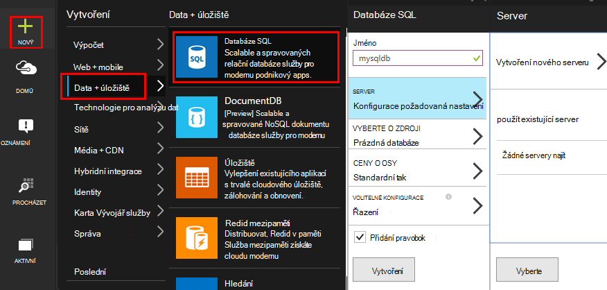

Zkontrolujte, že databázovém serveru umožňuje přístup k Azure služby:

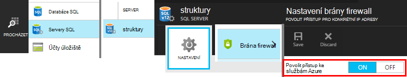

## Vytvoření pracovního role 

Teď na poslední můžeme [některé kód](https://sesitai.codeplex.com/) analyzovat JSON v exportovaného objektů BLOB a vytvoření záznamů v databázi. Když se obchodu exportovat do databáze jsou i v Azure, jsme spustíte bude kód v roli Azure pracovníka.

Tento kód automaticky extrahuje jakéhokoliv vlastnosti se účastní ve formátu JSON. Popisy vlastností najdete v článku [Export datového modelu](app-insights-export-data-model.md).

#### Vytvoření pracovníka role projektu

Ve Visual Studiu vytvořte nový projekt pracovníka role:

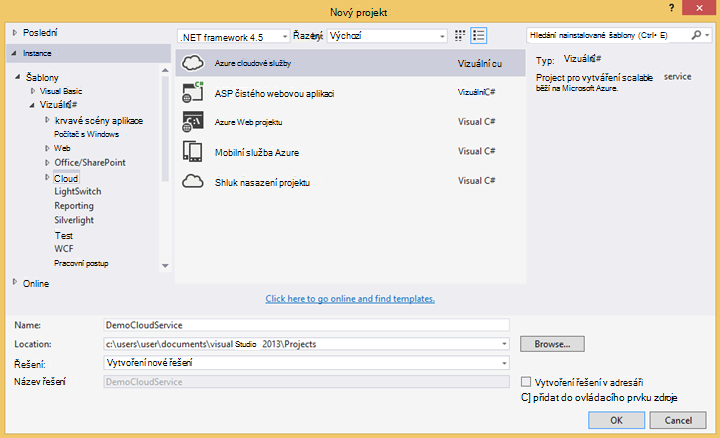

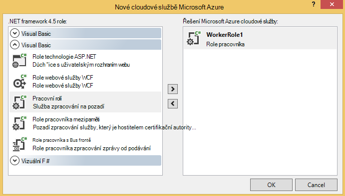

#### Připojení k účtu úložiště

V Azure získání připojovacího řetězce z vašeho účtu úložiště:

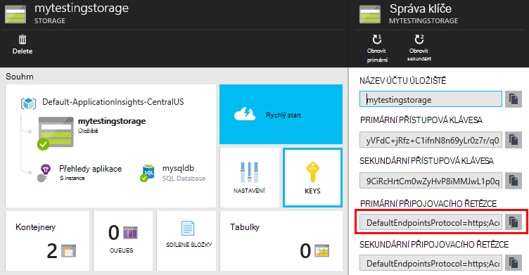

Ve Visual Studiu nastavení pracovních rolí pomocí připojovacího řetězce úložiště účtu:

#### Balíčky

V Průzkumníku klikněte pravým tlačítkem projektu pracovníka rolí a zvolte spravovat balíčků NuGet.
Vyhledat a nainstalovat tyto balíčky: 

 * EntityFramework 6.1.2 nebo později - použijeme tento generovat schématu DB tabulku na rychlé úpravy, na základě obsahu JSON v objektů blob.
 * JsonFx - použijeme to pro sloučení JSON a C# třídy vlastností.

Tento nástroj použijte ke generování C# třídy mimo naši jeden dokument JSON. Vyžaduje některé menší změny jako sloučení JSON polí do jednoho C# vlastnosti zapnout jednoho sloupce v tabulce DB (ex. urlData_port) 

 * [Generátor třídy JSON C#](http://jsonclassgenerator.codeplex.com/)

## Kód 

Tento kód můžete dát na `WorkerRole.cs`.

#### Importy

    using Microsoft.WindowsAzure.Storage;

    using Microsoft.WindowsAzure.Storage.Blob;

#### Získání připojovacího řetězce úložiště

    private static string GetConnectionString()
    {
      return Microsoft.WindowsAzure.CloudConfigurationManager.GetSetting("StorageConnectionString");
    }

#### Spuštění pracovníka v pravidelných intervalech

Nahrazení existující spuštění metodu a zvolte interval, kterému dáváte přednost. Je třeba alespoň jednu hodinu, protože funkce exportu dokončí jeden objekt JSON za hodinu.

    public override void Run()
    {
      Trace.TraceInformation("WorkerRole1 is running");

      while (true)
      {
        Trace.WriteLine("Sleeping", "Information");

        Thread.Sleep(86400000); //86400000=24 hours //1 hour=3600000
                
        Trace.WriteLine("Awake", "Information");

        ImportBlobtoDB();
      }
    }

#### Vložení všech objektů JSON jako řádek tabulky

    public void ImportBlobtoDB()
    {
      try
      {
        CloudStorageAccount account = CloudStorageAccount.Parse(GetConnectionString());

        var blobClient = account.CreateCloudBlobClient();
        var container = blobClient.GetContainerReference(FilterContainer);

        foreach (CloudBlobDirectory directory in container.ListBlobs())//Parent directory
        {
          foreach (CloudBlobDirectory subDirectory in directory.ListBlobs())//PageViewPerformance
          {
            foreach (CloudBlobDirectory dir in subDirectory.ListBlobs())//2015-01-31
            {
              foreach (CloudBlobDirectory subdir in dir.ListBlobs())//22
              {
                foreach (IListBlobItem item in subdir.ListBlobs())//3IAwm6u3-0.blob
                {
                  itemname = item.Uri.ToString();
                  ParseEachBlob(container, item);
                  AuditBlob(container, directory, subDirectory, dir, subdir, item);
                } //item loop
              } //subdir loop
            } //dir loop
          } //subDirectory loop
        } //directory loop
      }
      catch (Exception ex)
      {
        //handle exception
      }
    }

#### Analyzovat každý objektů blob

    private void ParseEachBlob(CloudBlobContainer container, IListBlobItem item)
    {
      try
      {
        var blob = container.GetBlockBlobReference(item.Parent.Prefix + item.Uri.Segments.Last());
    
        string json;
    
        using (var memoryStream = new MemoryStream())
        {
          blob.DownloadToStream(memoryStream);
          json = System.Text.Encoding.UTF8.GetString(memoryStream.ToArray());
    
          IEnumerable<string> entities = json.Split('\n').Where(s => !string.IsNullOrWhiteSpace(s));
    
          recCount = entities.Count();
          failureCount = 0; //resetting failure count
    
          foreach (var entity in entities)
          {
            var reader = new JsonFx.Json.JsonReader();
            dynamic output = reader.Read(entity);
    
            Dictionary<string, object> dict = new Dictionary<string, object>();
    
            GenerateDictionary((System.Dynamic.ExpandoObject)output, dict, "");
    
            switch (FilterType)
            {
              case "PageViewPerformance":
    
              if (dict.ContainsKey("clientPerformance"))
                {
                  GenerateDictionary(((System.Dynamic.ExpandoObject[])dict["clientPerformance"])[0], dict, "");
                }
    
              if (dict.ContainsKey("context_custom_dimensions"))
              {
                if (dict["context_custom_dimensions"].GetType() == typeof(System.Dynamic.ExpandoObject[]))
                {
                  GenerateDictionary(((System.Dynamic.ExpandoObject[])dict["context_custom_dimensions"])[0], dict, "");
                }
              }
    
            PageViewPerformance objPageViewPerformance = (PageViewPerformance)GetObject(dict);
    
            try
            {
              using (var db = new TelemetryContext())
              {
                db.PageViewPerformanceContext.Add(objPageViewPerformance);
                db.SaveChanges();
              }
            }
            catch (Exception ex)
            {
              failureCount++;
            }
            break;
    
            default:
            break;
          }
        }
      }
    }
    catch (Exception ex)
    {
      //handle exception 
    }
    }

#### Příprava slovník pro každý dokument JSON

    private void GenerateDictionary(System.Dynamic.ExpandoObject output, Dictionary<string, object> dict, string parent)
        {
            try
            {
                foreach (var v in output)
                {
                    string key = parent + v.Key;
                    object o = v.Value;

                    if (o.GetType() == typeof(System.Dynamic.ExpandoObject))
                    {
                        GenerateDictionary((System.Dynamic.ExpandoObject)o, dict, key + "_");
                    }
                    else
                    {
                        if (!dict.ContainsKey(key))
                        {
                            dict.Add(key, o);
                        }
                    }
                }
            }
            catch (Exception ex)
            {
            //handle exception 
            }
        }

#### CAST JSON dokument do C# třídy telemetrie vlastnosti objektu

     public object GetObject(IDictionary<string, object> d)
        {
            PropertyInfo[] props = null;
            object res = null;

            try
            {
                switch (FilterType)
                {
                    case "PageViewPerformance":

                        props = typeof(PageViewPerformance).GetProperties();
                        res = Activator.CreateInstance<PageViewPerformance>();
                        break;

                    default:
                        break;
                }

                for (int i = 0; i < props.Length; i++)
                {
                    if (props[i].CanWrite && d.ContainsKey(props[i].Name))
                    {
                        props[i].SetValue(res, d[props[i].Name], null);
                    }
                }
            }
            catch (Exception ex)
            {
            //handle exception 
            }

            return res;
        }

#### Soubor tříd PageViewPerformance generovaného mimo JSON dokumentu

    public class PageViewPerformance
    {
        [DatabaseGenerated(DatabaseGeneratedOption.Identity)]
        public Guid Id { get; set; }

        public string url { get; set; }

        public int urlData_port { get; set; }

        public string urlData_protocol { get; set; }

        public string urlData_host { get; set; }

        public string urlData_base { get; set; }

        public string urlData_hashTag { get; set; }

        public double total_value { get; set; }

        public double networkConnection_value { get; set; }

        public double sendRequest_value { get; set; }

        public double receiveRequest_value { get; set; }

        public double clientProcess_value { get; set; }

        public string name { get; set; }

        public string internal_data_id { get; set; }

        public string internal_data_documentVersion { get; set; }

        public DateTime? context_data_eventTime { get; set; }

        public string context_device_id { get; set; }

        public string context_device_type { get; set; }

        public string context_device_os { get; set; }

        public string context_device_osVersion { get; set; }

        public string context_device_locale { get; set; }

        public string context_device_userAgent { get; set; }

        public string context_device_browser { get; set; }

        public string context_device_browserVersion { get; set; }

        public string context_device_screenResolution_value { get; set; }

        public string context_user_anonId { get; set; }

        public string context_user_anonAcquisitionDate { get; set; }

        public string context_user_authAcquisitionDate { get; set; }

        public string context_user_accountAcquisitionDate { get; set; }

        public string context_session_id { get; set; }

        public bool context_session_isFirst { get; set; }

        public string context_operation_id { get; set; }

        public double context_location_point_lat { get; set; }

        public double context_location_point_lon { get; set; }

        public string context_location_clientip { get; set; }

        public string context_location_continent { get; set; }

        public string context_location_country { get; set; }

        public string context_location_province { get; set; }

        public string context_location_city { get; set; }
    }

#### DBcontext SQL interakce rámcem Entity

    public class TelemetryContext : DbContext
    {
        public DbSet<PageViewPerformance> PageViewPerformanceContext { get; set; }
        public TelemetryContext()
            : base("name=TelemetryContext")
        {
        }
    }

Přidání DB připojovací řetězec s názvem `TelemetryContext` v `app.config`.

## Schéma (pouze informace)

Toto je schématu pro tabulku, která vygeneruje pro Stránkové zobrazení.

> [AZURE.NOTE] Nemusíte spustit tento skript. Atributy v ve formátu JSON určit sloupce v tabulce.

    CREATE TABLE [dbo].[PageViewPerformances](
    [Id] [uniqueidentifier] NOT NULL,
    [url] [nvarchar](max) NULL,
    [urlData_port] [int] NOT NULL,
    [urlData_protocol] [nvarchar](max) NULL,
    [urlData_host] [nvarchar](max) NULL,
    [urlData_base] [nvarchar](max) NULL,
    [urlData_hashTag] [nvarchar](max) NULL,
    [total_value] [float] NOT NULL,
    [networkConnection_value] [float] NOT NULL,
    [sendRequest_value] [float] NOT NULL,
    [receiveRequest_value] [float] NOT NULL,
    [clientProcess_value] [float] NOT NULL,
    [name] [nvarchar](max) NULL,
    [User] [nvarchar](max) NULL,
    [internal_data_id] [nvarchar](max) NULL,
    [internal_data_documentVersion] [nvarchar](max) NULL,
    [context_data_eventTime] [datetime] NULL,
    [context_device_id] [nvarchar](max) NULL,
    [context_device_type] [nvarchar](max) NULL,
    [context_device_os] [nvarchar](max) NULL,
    [context_device_osVersion] [nvarchar](max) NULL,
    [context_device_locale] [nvarchar](max) NULL,
    [context_device_userAgent] [nvarchar](max) NULL,
    [context_device_browser] [nvarchar](max) NULL,
    [context_device_browserVersion] [nvarchar](max) NULL,
    [context_device_screenResolution_value] [nvarchar](max) NULL,
    [context_user_anonId] [nvarchar](max) NULL,
    [context_user_anonAcquisitionDate] [nvarchar](max) NULL,
    [context_user_authAcquisitionDate] [nvarchar](max) NULL,
    [context_user_accountAcquisitionDate] [nvarchar](max) NULL,
    [context_session_id] [nvarchar](max) NULL,
    [context_session_isFirst] [bit] NOT NULL,
    [context_operation_id] [nvarchar](max) NULL,
    [context_location_point_lat] [float] NOT NULL,
    [context_location_point_lon] [float] NOT NULL,
    [context_location_clientip] [nvarchar](max) NULL,
    [context_location_continent] [nvarchar](max) NULL,
    [context_location_country] [nvarchar](max) NULL,
    [context_location_province] [nvarchar](max) NULL,
    [context_location_city] [nvarchar](max) NULL,
    CONSTRAINT [PK_dbo.PageViewPerformances] PRIMARY KEY CLUSTERED 
    (
     [Id] ASC
    )WITH (PAD_INDEX = OFF, STATISTICS_NORECOMPUTE = OFF, IGNORE_DUP_KEY = OFF, ALLOW_ROW_LOCKS = ON, ALLOW_PAGE_LOCKS = ON) ON [PRIMARY]
    ) ON [PRIMARY] TEXTIMAGE_ON [PRIMARY]

    GO

    ALTER TABLE [dbo].[PageViewPerformances] ADD  DEFAULT (newsequentialid()) FOR [Id]
    GO

Chcete-li zobrazit v tomto příkladu v akci, [Stáhněte si](https://sesitai.codeplex.com/) kompletní kód pracovní změnit `app.config` nastavení a publikovat roli pracovníka Azure.

## Související články

* [Export do SQL pomocí roli kolegy](app-insights-code-sample-export-telemetry-sql-database.md)
* [Nepřetržitý exportovat do aplikace přehledy](app-insights-export-telemetry.md)
* [Přehledy aplikace](https://azure.microsoft.com/services/application-insights/)
* [Export datového modelu](app-insights-export-data-model.md)
* [Další příklady a návody](app-insights-code-samples.md)

<!--Link references-->

[diagnostic]: app-insights-diagnostic-search.md
[export]: app-insights-export-telemetry.md
[metrics]: app-insights-metrics-explorer.md
[portal]: http://portal.azure.com/
[start]: app-insights-overview.md

 
