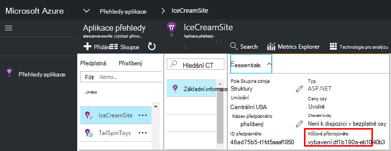

<properties 
    pageTitle="Vytvoření nového prostředku aplikace přehledy | Microsoft Azure" 
    description="Nastavení aplikace přehledy sledování pro novou živou aplikaci. Založené na webu přístup." 
    services="application-insights" 
    documentationCenter=""
    authors="alancameronwills" 
    manager="douge"/>

<tags 
    ms.service="application-insights" 
    ms.workload="tbd" 
    ms.tgt_pltfrm="ibiza" 
    ms.devlang="na" 
    ms.topic="article" 
    ms.date="08/26/2016" 
    ms.author="awills"/>

# Vytvoření aplikace přehledy zdroje

Přehledy aplikace Visual Studio zobrazí data o aplikaci Microsoft Azure *zdroje*. Vytvoření nového prostředku tedy část [Nastavení aplikace přehledy sledovat nové aplikace][start]. V mnoha případech to můžete provést automaticky integrovaném vývojovém prostředí a který je doporučené postupy, kde je k dispozici. Kromě toho ale v některých případech můžete vytvořit zdroj ručně.

Po vytvoření zdroje získat jeho klíč přístrojového vybavení a, který používá ke konfiguraci SDK v aplikaci. Telemetrie odeslána zdroji.

## Registrace k Microsoft Azure

Pokud jste ještě získali [Microsoft účet, si ho založit teď](http://live.com). (Pokud používáte služby, jako třeba Outlook.com, Onedrivu, Windows Phone a XBox Live, už máte účet Microsoft.)

Taky musíte předplatné [Microsoft Azure](http://azure.com). Pokud váš tým nebo organizace má předplatné Azure, vlastníka můžete do ní můžete přidat, pomocí svého Windows Live ID.

Nebo můžete vytvořit nové předplatné. Bezplatný účet můžete vyzkoušet všechno v Azure. Po uplynutí zkušebního období je možné systému průběžného financování předplatné vhodné, jak jste se nezapočítávají zdarma služby. 

Pokud už máte přístup k předplatnému, přihlaste se k aplikaci přehledy na [http://portal.azure.com](https://portal.azure.com)a používat účet Live ID přihlášení.

## Vytvoření aplikace přehledy zdroje
  

V [portal.azure.com](https://portal.azure.com)přidáte aplikaci přehledy zdroje:

* **Typ aplikace** ovlivňuje, co se zobrazí na zásuvné – přehled a vlastnosti dostupné v [metrických explorer][metrics]. Pokud nevidíte povahy aplikace, vyberte ASP.NET.
* **Pole Skupina zdroje** je snadno ovladatelné funkce pro správu vlastnosti jako řízení přístupu. Pokud jste již vytvořili další Azure zdroje, můžete umístit nový zdroj ve stejné skupině.
* **Předplatné** je účtu platby v Azure.
* Kde můžeme zajistit platnost dat je **umístění** . Momentálně je nelze změnit.
* **Přidat do startboard** umístí dlaždice rychlý přístup pro zdroj na Azure domovské stránce. Doporučené.

Po vytvoření aplikace otevře nový zásuvné. Toto je, kde se zobrazuje výkon a použití zásad správy informací o aplikaci. 

Chcete-li získat zpět do ní další čas přihlášení k Azure, vyhledejte pro dlaždici rychlého vaše aplikace na úvodní vývěsky (domovská obrazovka). Nebo klikněte na Procházet a vyhledejte jej.

## Kopírování klávesu přístrojového vybavení

Klíč přístrojového vybavení identifikuje prostředek, který jste vytvořili. Musíte a udělte tak SDK.

## Instalace SDK v aplikaci

Instalace aplikace přehledy SDK v aplikaci. Tento krok velkém závisí na typu aplikace. 

Konfigurace [SDK nainstalovaným v aplikaci]pomocí klávesy přístrojového vybavení[start].

Sada SDK obsahuje standardní moduly, které odesílají telemetrie aniž byste museli napsat jakýkoli kód. Sledování akcí uživatele nebo Diagnostika problémů s podrobnější [pomocí rozhraní API] [ api] odeslat vlastní telemetrie.

## V tématu telemetrickými daty

Zavřete zásuvné úvodní se vraťte do aplikace zásuvné Azure portálu.

Klikněte na dlaždici hledání najdete v článku [Diagnostiky hledání][diagnostic], kde se má zobrazit první události. 

Pokud jste očekává víc dat, klikněte na aktualizovat za několik sekund, než.

## Automatické vytváření zdroje

Můžete vytvořit [skript Powershellu](app-insights-powershell-script-create-resource.md) automaticky vytvořit zdroj.

## Další kroky

* [Vytvoření řídicího panelu](app-insights-dashboards.md)
* [Diagnostiky hledání](app-insights-diagnostic-search.md)
* [Prozkoumání metriky](app-insights-metrics-explorer.md)
* [Psaní analýzy dotazů](app-insights-analytics.md)

<!--Link references-->

[api]: app-insights-api-custom-events-metrics.md
[diagnostic]: app-insights-diagnostic-search.md
[metrics]: app-insights-metrics-explorer.md
[start]: app-insights-overview.md

 