<properties
    pageTitle="Řídicí panely ovládacích prvků a navigace v portálu aplikace přehledy | Microsoft Azure"
    description="Vytvoření zobrazení klíčových vylepšeného řízení spotřeby grafy a dotazů."
    services="application-insights"
    documentationCenter=""
    authors="alancameronwills"
    manager="douge"/>

<tags
    ms.service="application-insights"
    ms.workload="tbd"
    ms.tgt_pltfrm="ibiza"
    ms.devlang="multiple"
    ms.topic="article" 
    ms.date="10/18/2016"
    ms.author="awills"/>

# Navigace a řídicí panely na portálu přehledy aplikace

Po [Nastavení aplikace přehledy na projektu](app-insights-overview.md)telemetrie data o výkonu a využití vaše aplikace se zobrazí v projektu aplikace přehledy zdroje [Azure portálu](https://portal.azure.com).

## Vyhledání vašeho telemetrie

Přihlaste se k [portálu Azure](https://portal.azure.com) a přejděte do aplikace přehledy prostředek, který jste vytvořili aplikace.

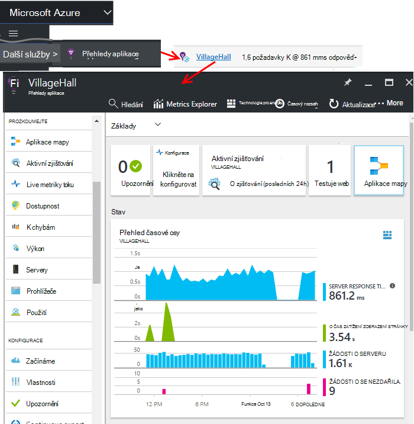

Přehled zásuvné (stránky) aplikace zobrazuje souhrn klíčové diagnostiky metriky aplikace a je brány tak, aby ostatní funkce na portálu.

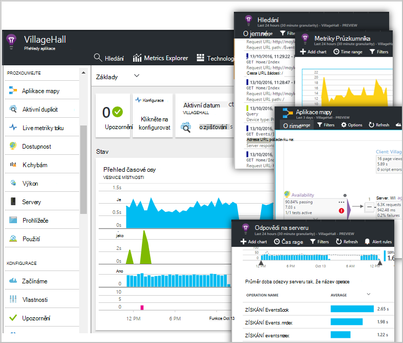

Můžete přizpůsobit grafech a připnout do řídicího panelu. Tímto způsobem můžete přenést i společně klíčové grafy z jiné aplikace.

## Řídicí panely

První věc, kterou uvidíte po přihlášení k [portálu Microsoft Azure](https://portal.azure.com) je řídicího panelu. Tady můžete přenést i společně grafů, které jsou pro vás nejdůležitější přes všechny vaše Azure zdrojů, včetně telemetrie z [Přehledy aplikace Visual Studio](app-insights-overview.md).
 

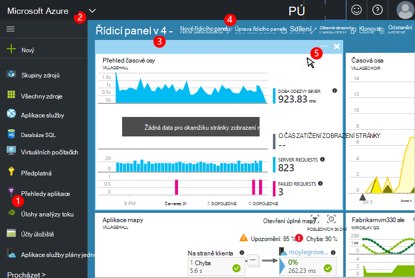

1. **Přejít na konkrétní zdroje** například vaši aplikaci distribuovali přehledy aplikace: použití panelu vlevo.
2. **Vraťte se na řídicím panelu aktuální**nebo přepnout na jiná zobrazení posledních: použijte v rozevírací nabídce vlevo nahoře.
3. **Přepnout řídicí panely**: použití rozevírací nabídky na název řídicího panelu
4. **Vytvořit, upravit a sdílet řídicí panely** na řídicí panel nástrojů.
5. **Úprava řídicí panel**: umístěte ukazatel myši na dlaždici a potom použijte jeho horní panel můžete přesunout, upravit nebo odebrat.

## Přidat do řídicího panelu

Když se díváte na zásuvné nebo sada graf s dílčími pruhy zajímavé, můžete připnout ji zkopírujte do řídicího panelu. Zobrazí se ho při příštím vrátíte tam.

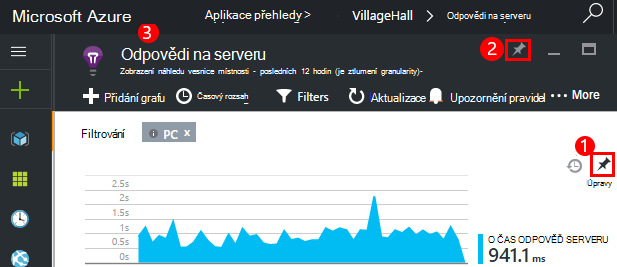

1. Připnutí graf do řídicího panelu. Kopii grafu se zobrazí na řídicím panelu.
2. Připnutí celé zásuvné na řídicí panel: Zobrazí se na řídicím panelu jako dlaždici, která můžete procházet.
3. Klikněte na levém horním rohu se vraťte do řídicího panelu aktuální. Pak můžete v rozevírací nabídce se vraťte do aktuálního zobrazení.

Všimněte si, že grafy jsou seskupené do dlaždice: dlaždici může obsahovat více než jednom grafu. Připnout dlaždici celé do řídicího panelu.

### Připnutí dotazy v analýzy

Můžete také grafy [pin analýzy](app-insights-analytics-using.md#pin-to-dashboard) [sdílených](#share-dashboards-with-your-team) řídicího panelu. Umožňuje přidávat grafy libovolného dotazu vedle standardní metriky. (Je nákladů u této funkce.)

## Úprava dlaždice na řídicím panelu

Když na dlaždici je na řídicím panelu, můžete upravit.

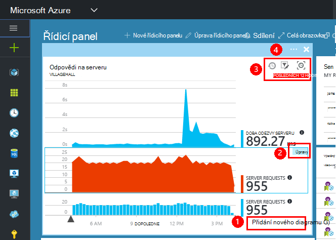

1. Přidání grafu do dlaždici. 
2. Nastavení míru, dimenze Seskupit podle a stylu grafu (grafy, tabulky).
3. Přetáhněte ukazatel myši přes diagram přiblížit; Klikněte na tlačítko Zpět resetovat timespan; nastavení vlastností filtru v grafech na dlaždici.
4. Nastavte název dlaždice.

Dlaždice připnuté z metrických explorer listy mají další možnosti úprav než dlaždice připnuté z zásuvné Přehled.

Původní, můžete připnuté dlaždici nebyl ovlivněn úpravami.

## Přepínání mezi řídicích panelů

Můžete uložit více řídicích panelů a mezi nimi přecházet. Když připnete grafu nebo zásuvné, někdo přidá do aktuální řídicího panelu.

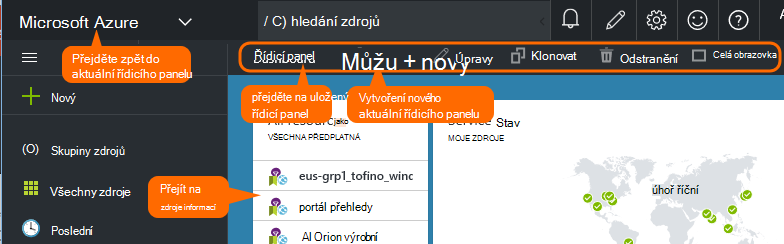

Máte jednu řídicí panel pro zobrazení Celá obrazovka v místu pro tým a jiné pro obecný vývoj.

Na řídicím panelu zásuvné zobrazuje se jako dlaždici: Kliknutím na něj přejdete zásuvné. Graf zreplikuje grafu v původním umístění.

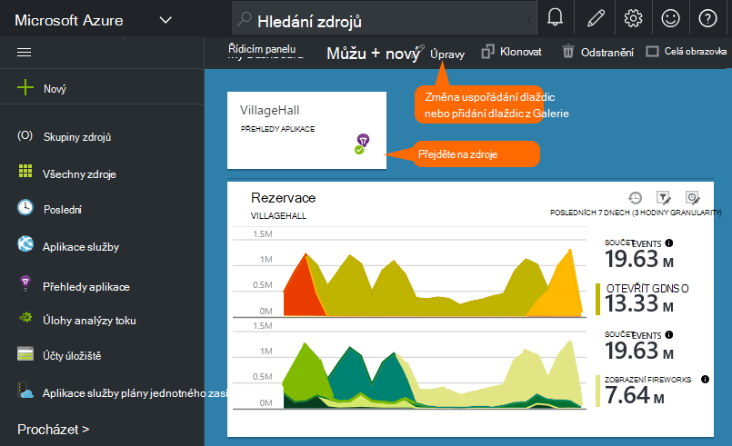

## Sdílení řídicího panelu

Po vytvoření řídicího panelu, můžete sdílet s ostatními uživateli.

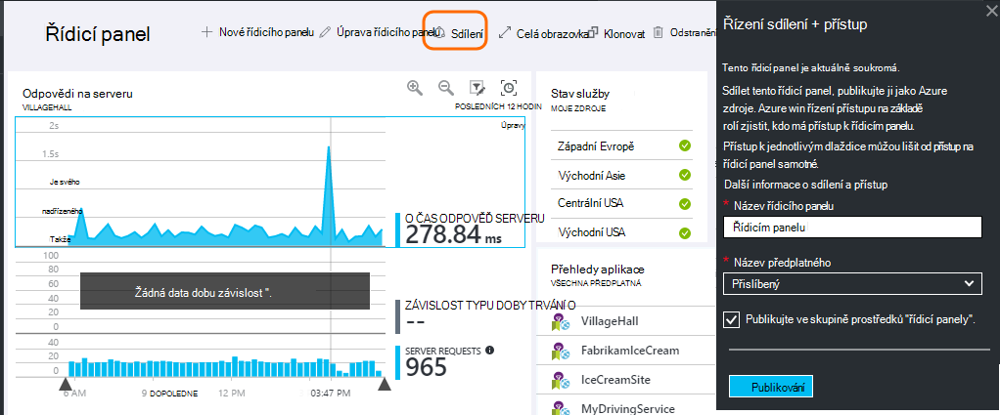

Informace o [rolích a řízení přístupu](app-insights-resources-roles-access-control.md).

## Aplikace navigace

Přehled zásuvné je brány na další informace o aplikaci.

* **Graf nebo dlaždici** klikněte na některou dlaždice grafu nebo zobrazíte více podrobností o se zobrazí.

### Přehled zásuvné tlačítka

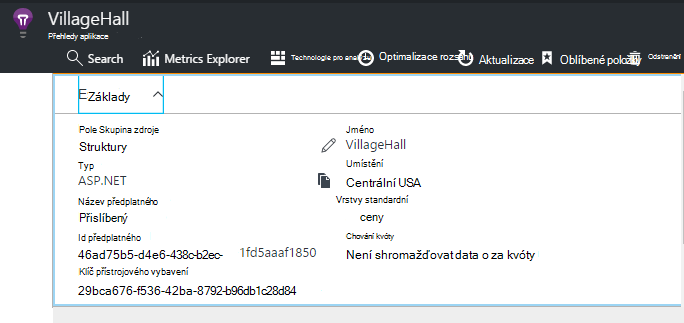

* [**Metriky Explorer**](app-insights-metrics-explorer.md) – vytvoření vlastní grafy výkonu a využití.
* [**Hledání**](app-insights-diagnostic-search.md) – prošetřit konkrétní výskyty události jako je třeba požadavky, výjimek, nebo se připojte trasování.
* [**Technologie pro analýzu**](app-insights-analytics.md) - výkonných dotazů přes svůj telemetrie.
* **Časový rozsah** – nastavte zobrazení tak, že všechny grafy na zásuvné rozsah.
* **Odstranění** - odstranit zdrojů aplikace přehledy pro tuto aplikaci. Si taky odebrání balíčků aplikací přehledy z app kódu, nebo upravte [klíče přístrojového vybavení](app-insights-create-new-resource.md#copy-the-instrumentation-key) v aplikaci směrování telemetrie jinému zdroji přehledy aplikace.

### Karta základy

* [Klíč přístrojového vybavení](app-insights-create-new-resource.md#copy-the-instrumentation-key) - identifikuje tento zdroj aplikace. 
* Ceny – zkontrolujte funkcí k dispozici a nastavte hlasitost Caps (čepice).

### Navigační panel

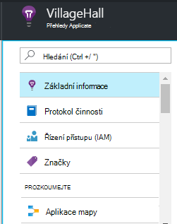

* **Přehled** - návrat na zásuvné přehled aplikace.
* **Protokol činnosti** – upozornění a Azure pro správu události.
* [**Řízení přístupu**](app-insights-resources-roles-access-control.md) – zpřístupnit členům týmu a ostatní.
* [**Značky**](../resource-group-using-tags.md) - používat značky zařadit do skupiny aplikace s ostatními.

PROZKOUMEJTE

* [**Aplikace mapy**](app-insights-app-map.md) – aktivní Mapa znázorňující součásti webové části aplikace, odvozeno z informace o závislostech.
* [**Aktivní diagnostiky**](app-insights-proactive-diagnostics.md) - revize poslední výkonu upozornění.
* [**Dynamický toku**](app-insights-metrics-explorer.md#live-stream) – pevnou sadu poblíž rychlých metriky užitečné při nasazení nové sestavení nebo ladění.
* [**Dostupnost / Web testů**](app-insights-monitor-web-app-availability.md) -běžná odešlou webovou aplikaci z kolem world.* 
* [**K chybám, výkon**](app-insights-web-monitor-performance.md) - výjimek, selhání a doby odezvy pro žádosti o aplikaci a odstranění žádosti o svoji aplikaci [závislostí](app-insights-asp-net-dependencies.md).
* Časový limit [**výkonu**](app-insights-web-monitor-performance.md) – doba odezvy, závislost odpověď. 
* [Servery](app-insights-web-monitor-performance.md) - výkonnosti. K dispozici po [instalaci sledování stavu](app-insights-monitor-performance-live-website-now.md).

* **Prohlížeče** - zobrazení stránky a AJAX výkon. K dispozici po [Nástroje webové stránky](app-insights-javascript.md).
* Vrátí počet **použití** – stránka zobrazit uživatele a relace. K dispozici po [Nástroje webové stránky](app-insights-javascript.md).

KONFIGURACE

* **Začínáme** – kurz vložené.
* **Vlastnosti** - přístrojového vybavení klíč, předplatné a pole číslo id zdroje.
* [Upozornění](app-insights-alerts.md) – metrických upozornění konfigurace.
* [Export spojitým](app-insights-export-telemetry.md) – konfigurace export telemetrie k základnímu úložišti Azure.
* [Testování výkonu](app-insights-monitor-web-app-availability.md#performance-tests) – nastavení syntetické načítání webové stránky.
* [Kvóta ceny](app-insights-pricing.md) a [požití odběr](app-insights-sampling.md).
* **Přístup k rozhraní API** – vytvoření [uvolněte poznámky](app-insights-annotations.md) a rozhraní API dat aplikace Access.
* [**Část pracovní položky**](app-insights-diagnostic-search.md#create-work-item) - připojení k pracovní sledování systém tak, že vytvoříte chyby při kontrole telemetrie.

NASTAVENÍ

* [**Uzamkne**](..\resource-group-lock-resources.md) - uzamknout Azure zdroje
* [**Skript automatizace**](app-insights-powershell.md) – export definici Azure zdroje tak, aby se použije jako šablonu k vytvoření nového zdroje.

PODPORA

* **Žádost o podporu** - vyžaduje na placené předplatné. Další informace najdete v článku [Získání nápovědy](app-insights-get-dev-support.md).

## Co je další krok?

||
|---|---
|[Metriky Průzkumníka](app-insights-metrics-explorer.md) Filtr a segmentu metriky|
|[Diagnostiky hledání](app-insights-diagnostic-search.md) Vyhledání a kontrola událostí souvisejících událostí a vytvořte chyby |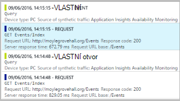
|[Technologie pro analýzu](app-insights-analytics.md) Výkonné dotazovací jazyk| 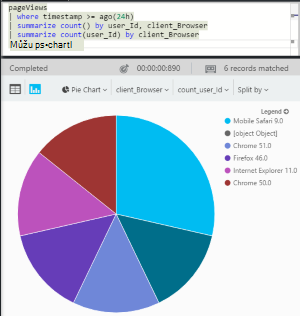

