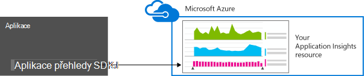

<properties 
    pageTitle="Uchovávání dat a úložiště v aplikaci přehledy" 
    description="Prohlášení o zásadách ochrany osobních údajů a uchovávání informací" 
    services="application-insights" 
    documentationCenter=""
    authors="alancameronwills" 
    manager="douge"/>

<tags 
    ms.service="application-insights" 
    ms.workload="tbd" 
    ms.tgt_pltfrm="ibiza" 
    ms.devlang="na" 
    ms.topic="article" 
    ms.date="05/17/2016" 
    ms.author="awills"/>

# Shromažďování dat, uchovávání informací a úložiště v aplikaci přehledy 

*Přehledy aplikace je v náhledu.*

Po instalaci [Přehledy aplikace Visual Studio] [ start] SDK v aplikaci pošle telemetrie o svoji aplikaci do cloudu. Samozřejmě zodpovědný vývojáři určitě zajímat přesně jaká data se odesílá, co se stane s daty a jak můžete ponechat jeho řízení. Zejména může být odesláno citlivá data, kde je uložená a jak zabezpečené to je? 

Nejdřív uvedeme odpovědět lze krátce:

* Standardní telemetrie moduly, které docházet "pole" pravděpodobně odeslat citlivá data služby. Telemetrie se týká zatížení, výkonu a využití metriky, výjimce sestav a jiných dat diagnostiky. Viditelné v diagnostických sestav hlavní uživatelská data jsou adresy URL; ale aplikace v žádném případě neměli citlivá data umístěte ve formátu prostého textu v adrese URL.
* Můžete zadat kód, který odešle další vlastní telemetrie, aby vám pomohl diagnostických nástrojů a sledování použití. (Tuto možnost rozšíření je skvělý funkce aplikace přehledy.) Je možné, omylem, napsat tento kód tak, aby zahrnovala osobní a další citlivá data. Pokud aplikace spolupracuje tyto údaje, měli byste použít silných revize procesy kódu, kterou jste napsali.
* Při vývoji a testování aplikace není těžké si zkontrolovat, co právě odesílá SDK. Data se zobrazí v okně výstupu ladění integrovaném vývojovém prostředí a prohlížeče. 
* Data směřuje na serverech [Microsoft Azure](http://azure.com) v USA. (Ale aplikace mohlo by umožnit spuštění kamkoli.) Azure má [silné zabezpečení zpracuje a splňuje širokou škálu organizace pro standardy dodržování předpisů](https://azure.microsoft.com/support/trust-center/). Jenom vy a určeným tým mít přístup k datům. Microsoft pedagogy můžete mají omezený přístup k němu pouze okolnosti konkrétní omezené pomocí své znalosti. Je zašifrován na cestě, i když není v servery.

Ve zbývající části tohoto článku popisuje podrobněji na tyto odpovědi. Je navržen tak, aby samostatné, tak, že je možné zobrazit pro kolegy, kteří nejsou součástí vašeho týmu.

## Co je aplikace přehledy?

[Přehledy aplikace Visual Studio] [ start] je služba poskytované společností Microsoft, který vám pomůže zvýšit výkon a použitelnost aplikace live. Sleduje aplikace vždycky, který je spuštěný při zkoušení i po publikování nebo ho nasadit. Přehledy aplikace vytvoří grafy a tabulky, které vidíte, například, kdy dne dostanete většina uživatelů, jak reagovat aplikace je a jak dobře je poskytovaný externí služby, které závisí. Pokud dojde k chybám nebo problémy s výkonem, můžete prohledat telemetrickými daty podrobně zjištění příčiny. A služby, obdržíte e-mailů Pokud jsou všechny změny v dostupnosti a výkonu aplikace.

Abyste mohli získávat tuto funkci, nainstalujte SDK přehledy aplikace v aplikaci, která bude část kódu. Při spuštění aplikace v SDK sleduje svou činnost a odešle telemetrie ke službě přehledy aplikace. Toto je Cloudová služba hostovaná společností [Microsoft Azure](http://azure.com). (Ale aplikace přehledy funguje pro všechny aplikace, nikoli pouze ty, které jsou hostovány v Azure.)

Služba aplikace přehledy ukládá a analyzuje telemetrie. Analýza nebo prohledávání uložené telemetrie zobrazíte přihlásit ke svému účtu Azure a otevřete aplikaci přehledy zdroje pro aplikaci. Přístup k datům můžete taky sdílet s ostatními členy týmu, nebo společně s zadaný Azure účastníky.

Máte data vyexportovaný z aplikace přehledy služby, například k databázi nebo na externí nástroje. Každý z nástrojů poskytnete speciální klíč, kterou můžete získat od služby. Klíč můžete odvolat, v případě potřeby. 

SDK přehledy aplikace jsou dostupné pro celou řadu typů aplikace: webové služby hostované ve vlastní J2EE nebo ASP.NET servery nebo v Azure; Web klienti – to znamená kód spuštěný na webové stránce; desktopových aplikací a služeb; zařízení aplikací například Windows Phone, iOS a Android. Všechny posílají telemetrie stejné služby.

## Jaká data shromažďuje ho?

### Jak se data se shromažďují?

Existují tři zdroje dat:

* SDK, která můžete integrovat s aplikací [ve vývoji](app-insights-asp-net.md) nebo [za běhu](app-insights-monitor-performance-live-website-now.md). Existují různé SDK pro typy jiné aplikace. Je také [SDK webových stránek](app-insights-javascript.md), která načte do prohlížeče koncového uživatele spolu s stránky.

 * Každý SDK obsahuje číslo, [moduly](app-insights-configuration-with-applicationinsights-config.md), které používají různé technologie shromažďovat různé typy telemetrie.
 * Pokud instalujete SDK ve vývoji, můžete jeho rozhraní API odeslat vlastní telemetrie kromě standardní moduly. Tato vlastní telemetrie můžete zahrnout všechna data, která chcete odeslat.
* V některých webových serverů jsou taky agentů, kteří spuštění vedle aplikace a odeslání telemetrie o využití procesoru, paměti a příprava k předání sítě. Například Azure VMs, Docker tabulkami hosts a [servery J2EE](app-insights-java-agent.md) nemůžou mít tyto agentů.
* [Dostupnost testy](app-insights-monitor-web-app-availability.md) jsou procesů spuštěných společností Microsoft, které odesílají žádosti o svoji webovou aplikaci v pravidelných intervalech. Výsledky se odesílají službě přehledy aplikace.

### Jaké typy dat byly shromážděny?

Jsou hlavních kategorií:

* [Webový server telemetrie](app-insights-asp-net.md) – požadavky HTTP.  URI, doba zpracování požadavku, kód odpovědi, IP adresa klienta. Id relace.
* [Webové stránky](app-insights-javascript.md) – stránka, počty uživatele a relace. Načítáním stránek. Výjimky. AJAX volání.
* Výkon čítače – paměti, využití procesoru, vstupu a výstupu, držby sítě.
* Klienta a serveru kontext - OS národní prostředí, typ zařízení, prohlížeče, rozlišení obrazovky.
* [Výjimky](app-insights-asp-net-exceptions.md) a dojde k chybě - **Vypíše zásobníku**, vytvořte id, typ procesoru. 
* [Závislosti](app-insights-asp-net-dependencies.md) - volání externí služby jako je AJAX REST, SQL. Připojení nebo URI řetězec, doba trvání, úspěch, příkaz.
* [Dostupnost testů](app-insights-monitor-web-app-availability.md) – doba trvání test a kroky, odpovědi.
* [Protokoly trasování](app-insights-search-diagnostic-logs.md) a [vlastní telemetrie](app-insights-api-custom-events-metrics.md) - **jakkoliv kódu do protokoly nebo telemetrie**.

[Další podrobnosti](#data-sent-by-application-insights).

## Jak ověříte co shromažďované?

Pokud vytváříte aplikaci Visual Studiu, spusťte aplikaci v režimu ladění (F5). Telemetrie se zobrazí v okně výstupu. Odtud můžete ji zkopírujte a formátu JSON pro snadné kontroly. 

V okně diagnostiky existuje také čitelnější zobrazení.

Na webových stránkách okno prohlížeče ladění.

### Můžete napsat kód k filtrování telemetrie před odesláním?

To bude možné sestavením [telemetrie procesor plugin](app-insights-api-filtering-sampling.md).

## Jak dlouho bude data k dispozici? 

Jako nezpracovaná datových bodů (to znamená položky, které můžete zkontrolovat ve diagnostiky hledání) jsou uloženy dobu 7 dní. Pokud potřebujete uchovávat data delší než, můžete ho zkopírujte do účtu úložiště [průběžné exportovat](app-insights-export-telemetry.md) .

Souhrnná data (to znamená, počty, průměry a další statistická data, která se zobrazí v Průzkumníku míru) se zachovají na semeno minutu 30 dní, a 1 hodinu nebo 1 den (v závislosti na typu) aspoň 90 dní.

## Kdo má přístup k data?

Data jsou viditelné pro vás a pokud máte účet organizace pro členy týmu. 

Může budou exportovány a členové týmu a může ho zkopírovat do jiných umístění nebo předaných jiným lidem.

#### Co dělá Microsoft informace, které aplikace Moje odešle interpretace aplikace?

Společnost Microsoft použije data jenom k poskytování služby.

## Data rozdávání? 

* V USA. 

#### Můžete ho uchováván někde jinde, třeba v Evropě? 

* Není v současné době. 

#### Znamená to, že aplikace Moje musí být umístěny ve Spojených státech?

* Ne. Aplikaci můžete spustit kamkoli, v vlastní místní hosts nebo v cloudu.

## Do jaké míry jsou moje data?  

Přehledy aplikace je služba Azure ve verzi Preview. Když v náhledu pracujeme k ochraně dat za zásady popsané v [Azure zabezpečení, ochrana osobních údajů a dodržování předpisů dokument white paper](http://go.microsoft.com/fwlink/?linkid=392408).

Uložení dat na serverech Microsoft Azure. U účtů na portálu Azure omezení účtu popsané v [Azure zabezpečení, ochrana osobních údajů a dodržování předpisů dokumentu](http://go.microsoft.com/fwlink/?linkid=392408). U účtů na portálu služby týmu Visual Studio [Visual Studio týmu služby dat zámek](http://download.microsoft.com/download/8/E/E/8EE6A61C-44C2-4F81-B870-A267F1DF978C/MicrosoftVisualStudioOnlineDataProtection.pdf) dokumentu slouží k použití. 

Je omezený přístup k vašim datům pracovníky společnosti Microsoft. Jsme přístup ke svým datům jenom s vaší oprávnění a pokud je potřeba podpory použití aplikace přehledy. 

Data v agregovat ve všech aplikacích všechny naše zákazníků (například data sazby a průměrná velikost stopy) slouží ke zlepšení přehledy aplikace.

#### Může odesílatele telemetrie rušit Moje aplikace přehledy data?

Další telemetrie může odesílání ke svému účtu pomocí klávesy přístrojového vybavení, která můžete najít v kódu webové stránky. S dost další data vaší metriky by se zobrazují barvy správně výkonu a využití vaše aplikace.

Kód sdílet s jinými projekty, nezapomeňte odebrání přístrojového vybavení klíče.

## Jsou data šifrovaná? 

Však do servery v současné době.

Pohyb mezi datacentrech musí být zašifrovaný všechna data.

#### Zašifrován data při přenosu šifrovaná z aplikace k serverům aplikace přehledy?

Ano, používáme https odeslání dat na portálu z skoro všech SDK, včetně webových serverů, zařízení a HTTPS webových stránek. Jedinou výjimkou jsou data odesílaným z jednoduchým HTTP webových stránek. 

## Určitelné osobní údaje

#### Může posílat osobně identifikovatelné osobní informace Umožňujících přehledy aplikace? 

Ano, je možné. 

Jako obecné pokyny:

* Většinu standardních telemetrie (to znamená telemetrie odeslat bez můžete psát jakýkoli kód) neobsahuje explicitní Umožňujících. Však je možné k identifikaci osob tak, že při odvozování z kolekce události.
* Výjimky a sledování zpráv by mohly obsahovat Umožňujících
* Vlastní telemetrie – to znamená volání například TrackEvent, která jste napsali v kódu pomocí rozhraní API nebo protokolu trasování - může obsahovat všechna data, které zvolíte.

V tabulce na konci tohoto dokumentu obsahuje podrobnější popis dat shromážděných.

#### Jsem povinnost v souladu s právními předpisy ohledně Umožňujících?

Ano. Je odpovědností zajistit, že shromažďování a používání dat je v souladu s právními předpisy a s podmínkami Microsoft Online Services.

Vaši zákazníci měli řádně podporovat informovat o data, která aplikace shromažďuje a jak se používá data.

#### Svoje uživatele vypnout přehledy aplikace?

Nikoli přímo. Připravili není přepínač, který uživatelé zprovoznit vypnout přehledy aplikace.

Však můžete provádět tyto funkce v aplikaci. Všechny SDK zahrnout rozhraní API nastavení, které se vypnou telemetrie kolekce. 

#### Aplikace se omylem shromažďujete citlivé informace. Můžete aplikaci přehledy přesouváním tato data tak není zachována

Aplikace přehledy filtrovat nebo odstranit data. Měli byste řádně podporovat správě dat a vyhněte se odesílání těchto dat pro přehledy aplikace.

## Dat odeslaných přehledy aplikace

SDK liší platformy a existuje několik součástí, které si můžete nainstalovat. (V nápovědě k [aplikaci přehledy – Začínáme][start].) Jednotlivé součásti odešle jiná data.

#### Kategorie dat Odeslaná pošta v různých scénářích

Akce  | Třídy dat shromážděných (viz následující tabulka)
---|---
[Přidání aplikace přehledy SDK do .NET web projektu][greenbrown] | Kontext Odvozeny Čítače výkonu Požadavky **Výjimky** Relace Uživatelé
[Sledování stavu nainstalovat služby IIS][redfield]|Závislosti Kontext Odvozeny Čítače výkonu
[Přidání aplikace přehledy SDK do jazyka Java web appu][java]|Kontext Odvozeny Žádost o Relace Uživatelé
[Přidání SDK JavaScriptu na webovou stránku][client]|ClientContext  Odvozeny Stránky ClientPerf AJAX
[Definování výchozí vlastnosti][apiproperties]|**Vlastnosti** na všech standardních a vlastních událostí
[Volání TrackMetric][api]|Číselné hodnoty **Vlastnosti**
[Volání sledování *][api]|Název události **Vlastnosti**
[Volání TrackException][api]|**Výjimky** Výpis zásobníku **Vlastnosti**
SDK nelze shromáždit data. Příklad:   -Nemáte přístup ke čítače výkonu  -výjimka v inicializačním telemetrie | Diagnostika SDK
 

Pro [SDK pro jiné platformy][platforms], zobrazit jejich dokumenty.

#### Třídy shromážděná data

Sběr dat třídy | Obsahuje (není vyčerpávající) 
---|---
**Vlastnosti**|**Všechna data - určena kódu**
DeviceContext |ID, IP, národní prostředí, model zařízení sítě, typ sítě, OEM název, rozlišení obrazovky, Role Instance, Role název, typ zařízení
ClientContext |Operační systém, národní prostředí jazyk, sítě, okno rozlišení
Relace | id relace
Kontext |Název počítače, národní prostředí, s operačním systémem zařízení, relace uživatele, v případě vynechání, operace 
Odvozeny |umístění GEO z IP adresa prohlížeče časového razítka, OS
Metriky | Metrických název-hodnota
Události | Název události a hodnoty
PageViews | Adresa URL a stránky jméno nebo název obrazovky
Výkon klienta | Název URL/stránky, čas zatížení prohlížeče
AJAX | Nastavit informace HTTP hovory z webové stránky na serveru
Požadavky |Adresy URL, doba trvání, kód odpovědi
Závislosti|Typ (SQL, HTTP,...), připojovací řetězec nebo URI synchronizace/asynchronní doba trvání, úspěch, příkazu SQL (s sledování stavu)
**Výjimky** | Typ, **zprávy**, hovor štosech, zdrojový soubor a číslo řádku, id vlákna
Dojde k chybě | Id procesu, id nadřazené procesu, dojde k chybě vlákna ID. oprava aplikací, id, Tvůrce dotazů,  Typ výjimky adresu, důvod, proč; zastaralý symboly a registry, binární adresy zahájení a ukončení, binární názvu a cesty, typ procesoru
Sledování | **Zpráva** a závažnosti úrovně
Čítače výkonu | Čas procesoru, dostupnou pamětí, žádosti o sazba, výjimce sazba, soukromé bajtů procesem, vstupu a výstupu sazba, doba trvání požadavku požádat o délka fronty
Dostupnost | Kód odpovědi test web, doba trvání každý krok test test název, časové razítko, úspěch, doba odezvy, test umístění
Diagnostika SDK | Sledování zpráv nebo výjimce 

Můžete [vypnout některá data podle úpravy ApplicationInsights.config][config]

## Kreditů

Tento produkt obsahuje data GeoLite2 vytvořil MaxMind poskytuje společnost [http://www.maxmind.com](http://www.maxmind.com).

## Videa

#### Úvod

> [AZURE.VIDEO application-insights-introduction]

#### Začínáme

> [AZURE.VIDEO getting-started-with-application-insights]

<!--Link references-->

[api]: app-insights-api-custom-events-metrics.md
[apiproperties]: app-insights-api-custom-events-metrics.md#properties
[client]: app-insights-javascript.md
[config]: app-insights-configuration-with-applicationinsights-config.md
[greenbrown]: app-insights-asp-net.md
[java]: app-insights-java-get-started.md
[platforms]: app-insights-platforms.md
[pricing]: http://azure.microsoft.com/pricing/details/application-insights/
[redfield]: app-insights-monitor-performance-live-website-now.md
[start]: app-insights-overview.md

 