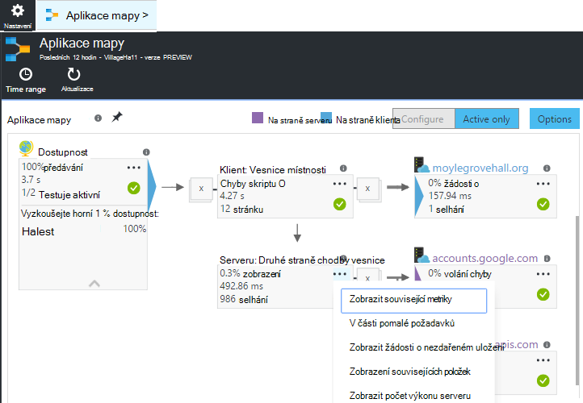
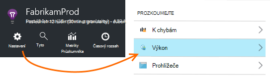
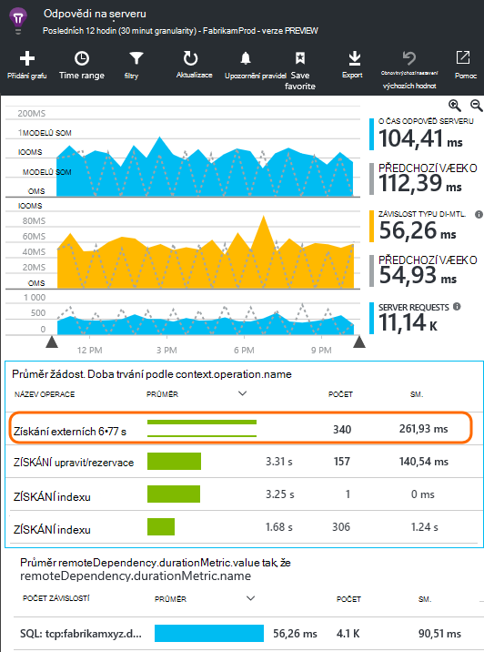
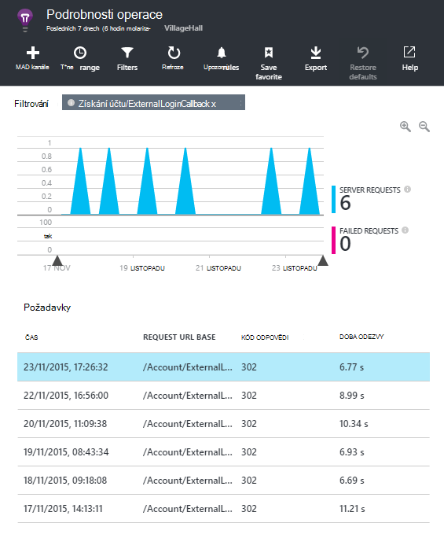
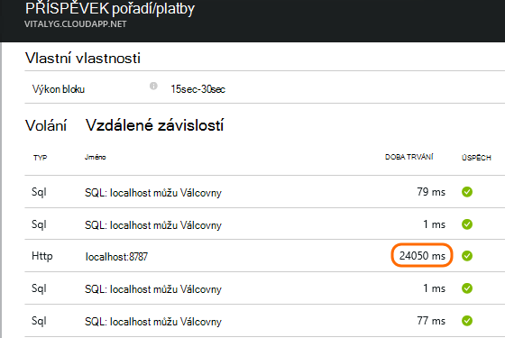
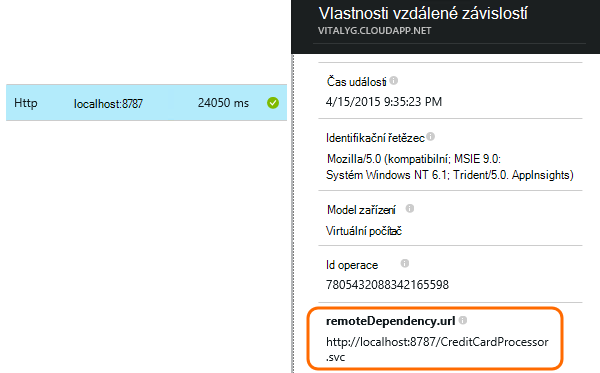
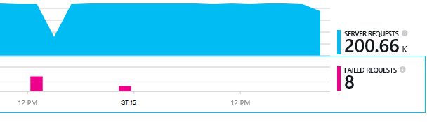
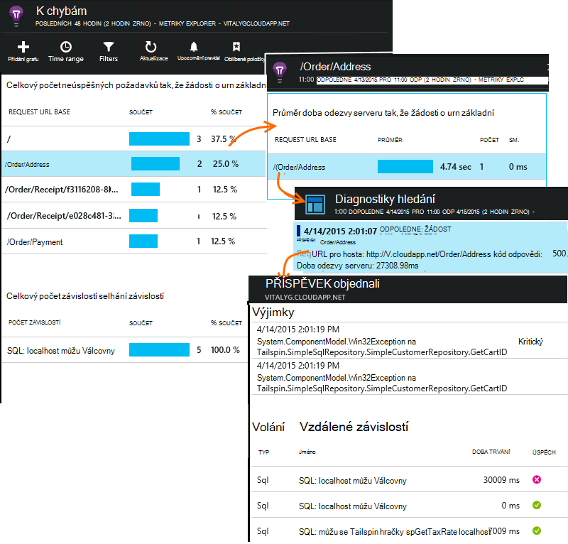

<properties 
    pageTitle="Diagnostika problémů se závislostmi v aplikaci přehledy" 
    description="Vyhledání selhání a snížení výkonu způsobená závislostí" 
    services="application-insights" 
    documentationCenter=""
    authors="alancameronwills" 
    manager="douge"/>

<tags 
    ms.service="application-insights" 
    ms.workload="tbd" 
    ms.tgt_pltfrm="ibiza" 
    ms.devlang="na" 
    ms.topic="article" 
    ms.date="05/12/2016" 
    ms.author="awills"/>
 
# <a name="diagnosing-issues-with-dependencies-in-application-insights"></a>Diagnostika problémů se závislostmi v aplikaci přehledy


*Závislost typu* je externí součást, která se nazývá aplikace. Je to obvykle službu s názvem pomocí HTTP, databázi nebo systému souborů. Nebo na webovou stránku skript, může být AJAX volání na server. Ve Visual Studiu aplikace přehledy můžete snadno zorientujete v jak dlouho aplikace čeká závislostí a jak často hovoru závislost přestane.

## <a name="where-you-can-use-it"></a>Kde lze použít

Odhlášení z pole závislost sledování momentálně neexistuje pro:

* ASP.NET webové aplikace a služby na serveru IIS nebo na Azure
* [Java webové aplikace](app-insights-java-agent.md)
* [Webové stránky](https://azure.microsoft.com/blog/ajax-collection-in-application-insights/)

U jiných typů, například aplikace zařízení můžete napsat vlastní monitoru pomocí rozhraní [TrackDependency API](app-insights-api-custom-events-metrics.md#track-dependency).

Sledování mimo pole závislost aktuálně hlásí hovory na tyto typy závislostí:

* TECHNOLOGIE ASP.NET
 * Databáze SQL
 * Technologie ASP.NET a služby WCF používající protokolu HTTP vazby
 * Místní nebo vzdálené volání HTTP
 * Azure DocumentDb tabulky, úložiště objektů blob a fronty
* Java
 * Volání k databázi přes ovladač [JDBC](http://docs.oracle.com/javase/7/docs/technotes/guides/jdbc/) ATP MySQL, SQL Server, PostgreSQL SQLite.
* Webové stránky
 * [Volání AJAX](app-insights-javascript.md)

Znovu můžete napsat SDK hovory ke sledování jiných závislosti.

## <a name="to-set-up-dependency-monitoring"></a>Nastavit sledování závislostí

Nainstalujte odpovídající agent pro server Host (hostitel).

Platformy | Instalace
---|---
Serveru IIS | Buď [instalace sledování stavu na server](app-insights-monitor-performance-live-website-now.md) nebo [Upgrade aplikace pro .NET framework 4.6 nebo novější](http://go.microsoft.com/fwlink/?LinkId=528259) a nainstalujte [Aplikaci přehledy SDK](app-insights-asp-net.md) v aplikaci.
Azure Web Appu | [Rozšíření přehledy aplikace](app-insights-azure-web-apps.md)
Java webový server | [Java webové aplikace](app-insights-java-agent.md)
Webové stránky | [Sledování JavaScript](app-insights-javascript.md) (Žádné další nastavení za sledování webové stránky)
Azure cloudové služby |  [Spuštění úkolů](app-insights-cloudservices.md#dependencies) nebo [instalace .NET framework 4.6 +](../cloud-services/cloud-services-dotnet-install-dotnet.md)  

Sledování stavu služby IIS servery nevyžaduje znovu vytvořit zdroj projektu se SDK přehledy aplikace. 

## <a name="application-map"></a>Aplikace mapy

Aplikace mapy funguje jako vizuální pomůcku k objevují ostatní závislostí mezi součástí aplikace. 



V polích můžete přejít na příslušné závislost a další grafy.

Klikněte na malou [x] sbalte dílčí stromová struktura.

Připnete mapování a [řídicích panelů](app-insights-dashboards.md), kde bude plně funkční.

[Další informace](app-insights-app-map.md).

## <a name="diagnosis"></a>Diagnostika problémů s výkonem závislost na webovém serveru

K posouzení výkonu požadavky na serveru:



Posuňte se dolů na pohled na mřížky požadavky:



Začátek jednu trvá příliš dlouho. Zjistěme, pokud jsme můžete zjistit, kde dobu strávenou.

Klikněte na daném řádku zobrazíte individuální žádost události:




Klikněte na všechny instance dlouho probíhajících kontrolovat dál.

> [AZURE.NOTE] Přejděte dolů a podíváme se zvolte instance. Latence v kanálu může znamenat neúplná data pro začátek instance.

Posuňte se dolů na volání vzdálené závislost týkající se tohoto požadavku:



Vypadá jako většina obsluze čas, který tuto žádost uplynul při volání do místní služby. 

Vyberte tento řádek získat další informace:




Podrobnosti obsahuje dostatečné informace diagnostikovat potíže.


## <a name="failures"></a>K chybám

Pokud jsou neúspěšných požadavků, klikněte na graf.



Klikněte na prostřednictvím typ požadavku a instance žádost o nezdařeném uložení volání pro vzdálené závislost.





## <a name="custom-dependency-tracking"></a>Vlastní závislost sledování

Standardní modul závislost sledování automaticky zjistí externí závislosti například databází a rozhraní REST API. Ale může být vhodné některé další součásti zpracovávaly stejnou výzvu. 

Můžete zadat kód, který odešle informace o závislostech pomocí stejného [Rozhraní API TrackDependency](app-insights-api-custom-events-metrics.md#track-dependency) používaný standardní moduly.

Například tvořit kódu s sestavení, co jste nenapsali sami může čas všechny volání, pokud chcete zjistit, jaký příspěvek umožňuje doby odezvy. Pokud chcete, aby tato data zobrazí v závislosti grafů v aplikaci přehledy, pošlete ho `TrackDependency`.

```C#

            var success = false;
            var startTime = DateTime.UtcNow;
            var timer = System.Diagnostics.Stopwatch.StartNew();
            try
            {
                success = dependency.Call();
            }
            finally
            {
                timer.Stop();
                telemetry.TrackDependency("myDependency", "myCall", startTime, timer.Elapsed, success);
            }
```

Pokud chcete vypnout modulu Sledování standardní závislostí, odeberte odkaz na DependencyTrackingTelemetryModule [ApplicationInsights.config](app-insights-configuration-with-applicationinsights-config.md).


## <a name="ajax"></a>AJAX

Viz [webové stránky](app-insights-javascript.md).


 