<properties
    pageTitle="Zjistit, Protřídit, Diagnostika"
    description="Analyzovat havaruje zjišťování a diagnostikovat potíže s výkonem v aplikacích"
    authors="alancameronwills"
    services="application-insights"
    documentationCenter=""
    manager="douge"/>

<tags
    ms.service="application-insights"
    ms.workload="tbd"
    ms.tgt_pltfrm="ibiza"
    ms.devlang="na"
    ms.topic="article" 
    ms.date="11/06/2015"
    ms.author="awills"/>

# Zjištění, Protřídit a diagnostice s přehledy aplikace

*Přehledy aplikace je v náhledu.*

Zjistěte, jak funguje aplikace pomáhá přehledy aplikace a použit po live. A pokud došlo k potížím, umožňuje vědět o ho pomáhá posoudit dopad a pomáhají zjistit příčinu.

Tady je účet od týmu, který webových aplikací:

* *"Několik dny, jsme nasazené"menší"hotfix. Jsme nespuštěno obecných testů, ale bohužel máte některé neočekávané změnit sloučena datové příčinou nekompatibilita mezi přední a zadní konce. Hned aktivována serveru výjimky surged naše upozornění a jsme provedené vědět situace. Několika kliknutími jinam na portálu aplikace přehledy dostali jsme dost informací od výjimce callstacks upřesnění problém. Vrátit zpět ihned jsme omezený škod. Aplikace přehledy připíše tuto část devops cyklu velmi jednoduché a akce."*

Zjistěme, jak týmu vývoje typické webu používá aplikaci přehledy ke sledování výkonu. Společnost Microsoft postupujte podle týmu v Fabrikam banky, které vyvíjí online bankovní soustavy (OBS).

Tým označené jako pracuje na obrázku je následující:

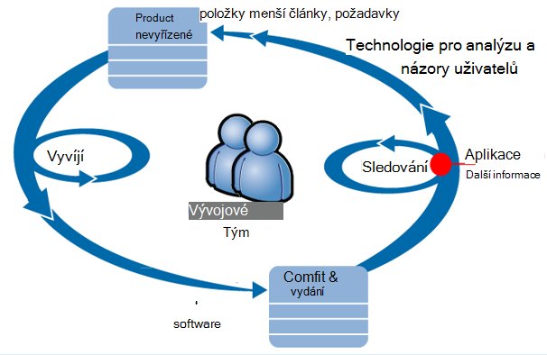

Požadavky na kanálu sociální sítě do jejich vývoj rezervu (seznam úkolů). Stručně řečeno fungují obdobích, které často předvádění pracovní software – obvykle v podobě vylepšení a rozšíření existující aplikace. Aplikace live často aktualizoval s novými funkcemi. Když je živou, týmu sleduje se výkonu a využití s pomocí aplikace přehledy. Zpět do jejich vývoj rezervu informační kanály tuto analýzu.

Aplikace přehledy používá tým ke sledování živou webové aplikace úzce pro:
* Výkon. Chtějí pochopit, jak doby odezvy se liší podle počet požadavku; kolik procesoru, sítě, disk a dalších zdrojů použily; a pokud jsou kritické body.
* K chybám. Pokud jsou tu uvedené výjimky nebo selhání požadavky, nebo pokud čítače výkonu dostane mimo pohodlnému rozsah, týmu znát rychle tak, aby se může provádět akce.
* Použití. Pokaždé, když vydána nová funkce týmu chcete se dozvědět, do jaké míry se používá, a jestli mají uživatelé případné potíže s ním.

Pojďme zaměřit na část názory obrázku:

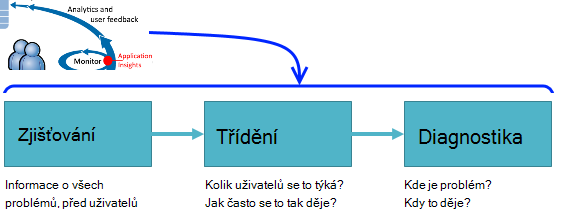

## Zjištění špatné dostupnosti

Marcela Markova je vývojářem vedoucí týmu OBS a trvá pořádat týkající se sledování výkonu online. Anna nastaví několik [webových testů][availability]:

* Test jedné adresy URL pro hlavní cílovou stránku s aplikací http://fabrikambank.com/onlinebanking/. Anna nastaví kritéria kód HTTP 200 a textem Vítejte!. Pokud se nezdaří tento test, je něco vážně správné snažit se síti nebo na servery nebo možný problém nasazení. (Nebo uživatel změnil na uvítací! zpráva, na stránce bez nechat své pozná.)

* Hlubší vícekrokové testu, který se přihlašuje a získá aktuální účet seznamem, kontrola několik klíčové údaje na každé stránce. Tento test ověří, že odkaz na databázi účtů pracuje. Použije fiktivní ČísloZákazníka: několik z nich zachovány pro účely testování.

Tyto testy nastavení Marcela je se jistí, že tým rychle vědět všechny výpadku.  

K chybám zobrazují jako červené tečky v diagramu test web:

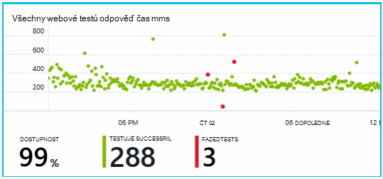

Ale důležitější, bude oznámení o poruchy mailem týmu vývoje. Tímto způsobem budou vědět před skoro všech zákazníků.

## Sledování měřítka

Na stránce Přehled v aplikaci přehledy je graf zobrazující řadu [klíčových metrik][perf].

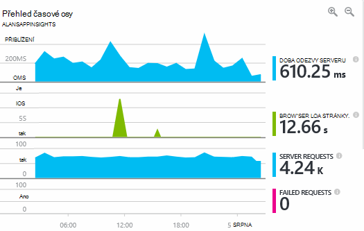

Prohlížeče času načtení stránky je odvozeno z telemetrie odeslané přímo z webové stránky. Doba odezvy serveru, serveru žádost o počet a počet neúspěšných požadavku jsou všechny měří se v webového serveru a odeslat do aplikace přehledy odtud.

Marcela je mírně starali o v grafu odpověď serveru, který zobrazuje průměr dobu mezi Pokud server obdrží žádost HTTP z prohlížeče uživatele a vrátí odpověď. Není zobrazíte změnu v tomto grafu při načítání systému se liší. Ale v tomto případě zdá, že korelace malé složitost v žádosti o a celkového počtu roste v poli Doba odezvy. Který znamenat, že systému funguje jenom na omezení. 

Otevření grafy servery:

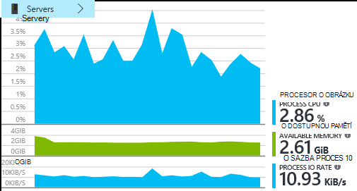

Zdá bez poštu omezení prostředků, takže možná že hrboly v grafech odpověď serveru jsou jenom shoda.

## Upozornění

Však chce sledujte doba odezvy. Pokud půjde moc vysoké, chce vědět o ho okamžitě.

Aby mohla nastaví [upozornění][metrics], pro doby odezvy větší než typický mezní hodnota. To vám své spolehlivosti, mohla budete víte, že k němu Pokud doba odezvy je pomalé.

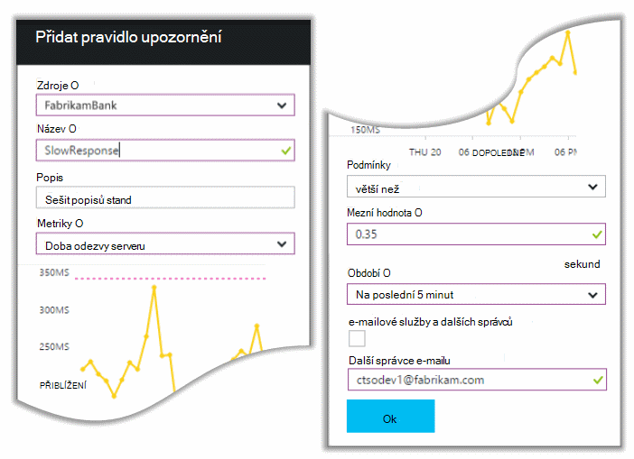

Na celou řadu dalších metriky můžete nastavit upozornění. Pokud počet výjimek stane vysoké nebo dostupnou pamětí přejde nízká nebo je pole Špička požadavků klientů, například můžete přijímat e-maily.

## Aktivní diagnostiky upozornění

Další den, upozornění e-mailu se ukládají z aplikace přehledy. Ale při otevření kontakt, she najde není upozornění čas na odpověď mohla nastavení. Místo toho říká jí, že se náhlé nárůst selhalo žádosti o – to znamená požadavky, které mají vrácena chyba kódy 500 nebo více.

Neúspěšné žádosti jsou, kde uživatelé viděli chybu – obvykle sledovat výjimce v kódu. Možná se zobrazit zpráva oznamující "Je nám líto nelze aktualizujeme vaše údaje teď", nebo na absolutní nevhodná nejhorší, výpis zásobníku na obrazovce uživatele svolením webový server.

Toto oznámení je překvapení, protože posledního mohla dívali, počet neúspěšných požadavku encouragingly nízké. Malým počtem poštovních selhání je očekávat na něčem pracuje serveru. 

Je také trochu překvapení pro své vzhledem k tomu, že uživatel nemá konfigurace toto upozornění. Ve skutečnosti aktivní diagnostiky je součástí aplikace přehledy. Je automaticky přizpůsobena tak, aby vaše aplikace obvykle selhání vzorku a "získá lze" selhání na určitou stránku nebo velkém zatížení, nebo propojená s jiné metriky. Jenom v případě, že je zvýšení nad přijde očekávat vyvolá upozornění.

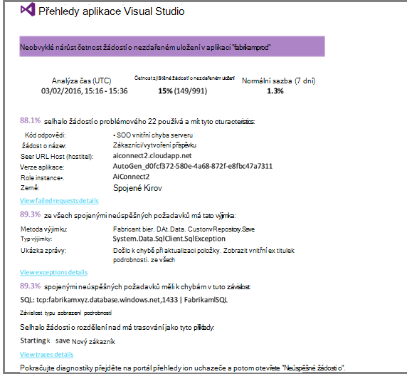

Toto je velmi užitečné e-mailu. Není právě vysokoškolskou varování; příliš dělá spoustu třídění a diagnostické práce.

Zobrazí se to týká jak množství zákazníků a které webové stránky nebo operace. Marcela můžete se rozhodnout, jestli potřebuje získat celý tým práci na tomto jako přechod fire nebo jestli ho můžete ignorovat do příští týden.

E-mailu také ukazuje, že určitý výjimce došlo k a - i přitažlivé - selhání je přidružená k selhání hovory na konkrétní databázi. Vysvětluje, proč poruchy neočekávaně se zobrazovala i v případě jeho Marcela týmu nebyla naposledy používaný všechny aktualizace. 

Anna příkaz ping vedoucí týmu databáze. Ano, budou uvolnění oprava za posledních půl hodiny; a ale ne, případně mohlo dojít změnu menší schématu...

To je to na cestě do stanovování ještě před vyšetřování protokoly a 15 minut od něj vyplývající. Však Marcela klepnutí na odkaz otevřít aplikaci přehledy. Pozvánka se otevře přímo na žádost o nezdařeném uložení a uživatel vidí nezdařeném uložení databáze volání v seznamu přidružené závislost volání. 

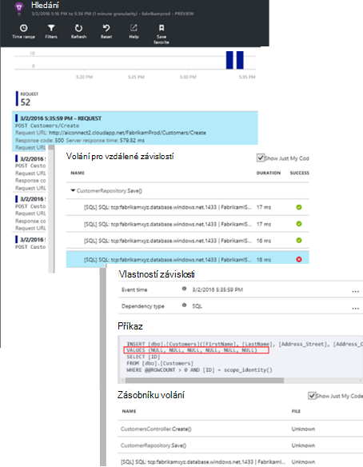

## Zjištění výjimky

S Tato metoda instalace [výjimky](app-insights-asp-net-exceptions.md) jsou automaticky uvedeny interpretace aplikace. Budou lze také zachytit explicitně vložením volání [TrackException()](app-insights-api-custom-events-metrics.md#track-exception) do kódu:  

    var telemetry = new TelemetryClient();
    ...
    try
    { ...
    }
    catch (Exception ex)
    {
       // Set up some properties:
       var properties = new Dictionary <string, string>
         {{"Game", currentGame.Name}};

       var measurements = new Dictionary <string, double>
         {{"Users", currentGame.Users.Count}};

       // Send the exception telemetry:
       telemetry.TrackException(ex, properties, measurements);
    }

Tým Fabrikam banky změnil praktické cvičení vždy odeslat telemetrie na výjimku, pokud není zřejmé obnovení.  

Ve skutečnosti je i širší než jejich strategie: odešlou telemetrie ve všech případech, kde je zákazník zklamáni v co ale chtěli udělat, zda odpovídá výjimku kód nebo ne. Například systému externí mezi bankovní převod chybovou zprávu "" nelze dokončit transakci"nějakého důvodu provozní (bez odolnost zákazníka) potom sledují dané události.

    var successCode = AttemptTransfer(transferAmount, ...);
    if (successCode < 0)
    {
       var properties = new Dictionary <string, string>
            {{ "Code", returnCode, ... }};
       var measurements = new Dictionary <string, double>
         {{"Value", transferAmount}};
       telemetry.TrackEvent("transfer failed", properties, measurements);
    }

TrackException slouží k oznámení výjimek, protože odešle kopii zásobníku; TrackEvent slouží k oznámení jiné události. Můžete připojit všechny vlastnosti, které mohou být užitečné pro diagnostiku.

Výjimky a události objeví [Diagnostiky hledání] [ diagnostic] zásuvné. Můžete přejít do nich chcete zobrazit další vlastnosti a trasování zásobníku.

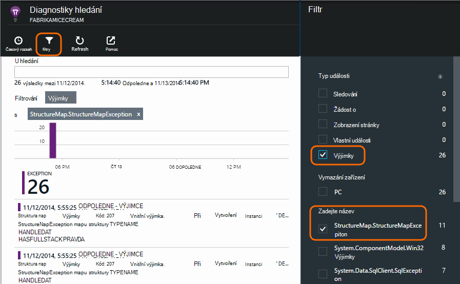

## Sledovat činnosti uživatelů

Když existuje několik výjimek, kdy je doba odezvy konzistentní dobrý, můžete představit tým vývojářů o vylepšení práce uživatelů a podporu více uživatelů dosáhnout požadované cíle.

Příklad cesty běžný uživatel přes webu má Vymazat "filtr": množství zákazníků podívejte se na výše různé typy půjčky; Některé z nich vyplnit ve formuláři nabídky. a kteří získat nabídky, několik pokračovat instalováním uzavře půjčky.

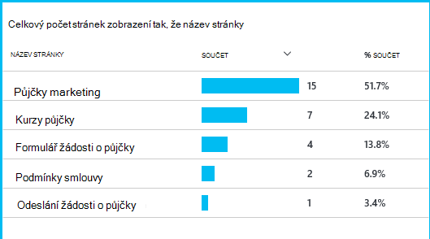

Rozhodování, které největší čísla zákazníci přetáhnout, firmy pracovat, jak můžete získat další uživatele do dolní části Filtr. V některých případech může být selhání uživatelské prostředí (činnosti koncového uživatele) – například na tlačítko Další"je těžké si najděte nebo pokynů nejsou zjevných. Spíše důvodů větší business pro rozevírací nevýhody: možná je příliš velký sazby půjčky.

Bez ohledu na důvodů, proč, data pomáhá týmové práce, co dělají uživatelů. Další hovory sledování může být vložen pro práci se podrobněji. TrackEvent() můžete použít ke zjištění akcích uživatele v pořádku podrobností jednotlivé tlačítko klepnutí významné ocenění například platební vypnout půjčky.

Tým začíná slouží k s informací o činnosti uživatelů. V současné době pokaždé, když budou návrh s novou funkcí, fungují, jakým způsobem se myslíte o jeho použití. Je Navrhněte sledování zavolá funkci od začátku. Lze zlepšit funkci každý cyklu vývoje používají zpětná vazba.

## Aktivní sledování  

Marcela není právě sednout kolem čeká se na upozornění. Brzy po každé nové nasazení mohla trvá pohled na [doby odezvy] [ perf] -celkový obrázek a v tabulce nejnižší požadavky, jakož i výjimce počty.  

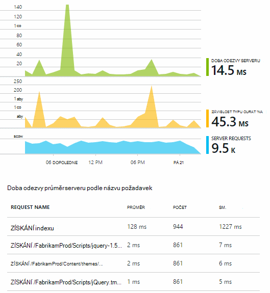

Kontakt můžete posuďte vliv na výkon každé nasazení obvykle porovnávání každý týden s poslední. Pokud se náhlé zhoršování mohla vyvolá, s příslušnými vývojáři.

## Třídění

Třídění - hodnocení závažnosti a rozsahu problému - cílem prvního kroku je po zjišťování. Měli jsme zdůraznění týmu půlnoci? Nebo můžete mít až do další pohodlný mezeru v rezervu vlevo? Existují některé klíčové otázky v třídění.

Jak nic se neděje? Grafy na zásuvné přehled zobrazit některé perspektivě na problém. Například aplikaci Fabrikam generováno čtyři upozornění test web jednu noc. Prohlížíte grafu dopoledne, týmu neviděl, aby byly ve skutečnosti některé červené tečky byli pořád Většina testů zelená. Přechod do grafu dostupnost, byla vymazat všechny tyto chybovému problémy byly z jednoho test umístění. To byla očividně sítě problém došlo k ovlivnění jedinou směrování a samotné nejspíš zrušte.  

Naopak dramatickým a stabilní nárůst grafu výjimce počty nebo odpovědi časy je očividně něco paniku o.

Užitečné třídění taktika je zkuste ho sami. Pokud se dostanete ke stejnému problému, víte, že je typu real.

K čemu zlomek uživatelů se to týká? Získání hrubé odpovědí, dělení výpadek počet relací.

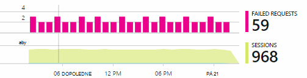

V případě pomalé odpověď porovnejte tabulce požadavků na nejnižší reagovat s četnost použití každé stránce.

Jak je důležitá blokovaných scénář? Pokud je funkční problém blokování příběhu určitého uživatele, záleží mnohem? Pokud zákazníci nelze platit jejich faktury, tady je vážně; Pokud se nemůžete změnit své předvolby barev obrazovky, možná ho můžete počkat. Podrobnosti o události nebo výjimky nebo identity stránce pomalé dovíte, kde Zákazníci nedaří.

## Diagnostika

Diagnostika není úplně stejný jako ladění. Než začnete trasování pomocí kódu, byste měli mít hrubé představu o důvod, proč, kde a kdy se vyskytuje problém.

**Kdy to děje?** Historie zobrazených událostí a míru grafy usnadňuje sladit efekty s možných příčin. Pokud jsou tu uvedené chybovému píků odpověď čas nebo výjimky sazeb, podívejte se na počet požadavku: Pokud nejlepší při současném a pak to vypadá problémovým zdroje. Potřebujete přiřadit další procesoru a paměti? Nebo je závislost nejde spravovat načíst?

**Je nám?**  Pokud máte náhlé rozevírací plnění určitý typ žádost – například pokud zákazník požaduje výpisu z účtu – a pak je možné, může to být externím subsystémem spíše než webové aplikace. V Průzkumníku metriky vyberte chyby závislostí sazba a doba trvání závislosti sazby a porovnejte jejich historie přes minulých několik hodin nebo dnů, které jste zjistil problém s. Pokud jsou vzájemného vztahu změny, může být na straně zmocnitele externím subsystémem.  

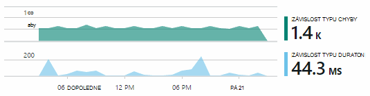

Některé problémy se pomalé závislost jsou problémy zeměpisná poloha. Fabrikam banky používá Azure virtuálních počítačích a zjištění, že se vám to omylem umístěné jejich webový server a účet serveru v různých zemí. Dramatickým zlepšování byl vyvolané migrace jedna z nich.

**K čemu nám?** Pokud se problém nezobrazí v závislosti a pokud nebyla vždy tam, je nejspíš způsobeno tím poslední změny. Historických perspektivy poskytovanou grafy metrické a událost snadno sladit změny náhlé s nasazení. Který zúží dolů pole Hledat problém.

**Co se děje?** Některé problémy vyskytnou jen zřídka a může být obtížné vysledovat testováním offline. Můžeme udělat, stačí zkusit zachycení chyb při k rizikové situaci dojde služby live. Můžete zkontrolovat výpis zásobníku v sestavách výjimku. Kromě toho můžete napsat trasování volání Oblíbené protokolování framework nebo TrackTrace() nebo TrackEvent().  

Fabrikam dosáhl chybovému problém s převody mezi účtu, ale jenom s určitým účtu. Půjde vám ještě snadněji pochopit, co se děje, jsou vloženy TrackTrace() hovory na klíčových bodů v kódu připojení typ účtu jako vlastnost každý volání. Které snadné odfiltrovat pouze trasování v diagnostiky hledání. Hodnoty parametrů jako vlastnosti a měr také připojeny ke sledování volání.

## Práce s nimi

Jakmile jste diagnostikovat potíže, můžete vytvořit plán pro nápravu udělat. Možná budete muset vrátit zpět poslední změnu nebo možná můžete jednoduše přejít rovnou a opravný nástroj fix it. Po dokončení opravy aplikace přehledy zjistíte, zda bylo úspěšné.  

Týmu vývoje Fabrikam banky trvat víc strukturovaný přístup k měření výkonu než používají k před použitím aplikace přehledy.

* Na stránce přehled přehledy aplikace nastavují cílů výkonu z hlediska určité míry.

* Je Navrhněte měření výkonu do aplikace od začátku, například metriky, které změřit průběh uživateli prostřednictvím nálevky.  

## Použití

Aplikace přehledy lze také se dozvíte, co uživatelé dělat s aplikace. Se po spuštění bez problémů, týmu chcete vědět, které funkce jsou nejoblíbenější, co uživatelé jako nebo máte potíže s a jak často se vraťte. Které vám pomohou jejich prioritu nadcházející práci. A můžou plánovat chcete měřit úspěšnost každou funkcí jako součást cyklu vývoje. [Další informace][usage].

## Používání aplikací

To je to jak jedno týmu použití aplikace přehledy nejen kvůli odstraňování problémů jednotlivé, ale kvůli zlepšení jejich životního cyklu vývoje. Můžu ať že ji vám Dal několik dalších rad o jak aplikace přehledy můžete zvýšit výkon vlastních aplikací.

## Video

[AZURE.VIDEO performance-monitoring-application-insights]

<!--Link references-->

[api]: app-insights-api-custom-events-metrics.md
[availability]: app-insights-monitor-web-app-availability.md
[diagnostic]: app-insights-diagnostic-search.md
[metrics]: app-insights-metrics-explorer.md
[perf]: app-insights-web-monitor-performance.md
[usage]: app-insights-web-track-usage.md
 
