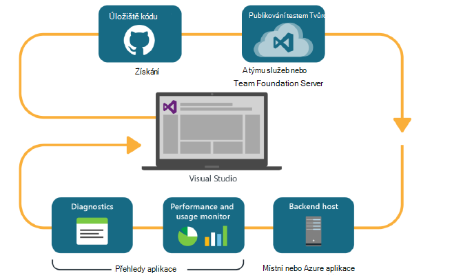
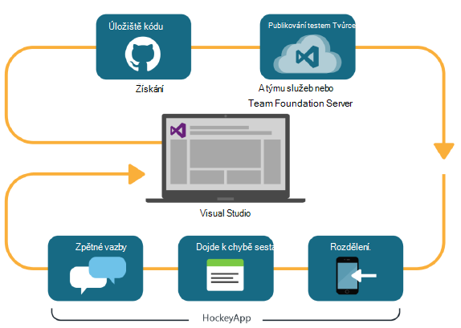

<properties
    pageTitle="Karta Vývojář analýzy"
    description="DevOps s Visual Studiu, přehledy aplikace a HockeyApp"
    authors="alancameronwills"
    services="application-insights"
    documentationCenter=""
    manager="douge"/>

<tags
    ms.service="application-insights"
    ms.workload="tbd"
    ms.tgt_pltfrm="ibiza"
    ms.devlang="na"
    ms.topic="article" 
    ms.date="05/18/2016"
    ms.author="awills"/>

# Karta Vývojář analýzy s přehledy aplikace a HockeyApp

*Přehledy aplikace je v náhledu.*

Více projektů pracovat rychlé [DevOps](https://en.wikipedia.org/wiki/DevOps) obrázku. Budou vytvořit a distribuce žádostí o získat názory jak provede a co uživatelé dělat s ním a tento poznatky použít při plánování další vývojové cykly. 

Sledovat použití a výkonu, je důležité, abyste měli telemetrie z živého aplikace i názoru uživatelé sami. 

Vytvářené mnoho systémy z více součásti: webové služby, procesorů back-end nebo datový úložiště a klientský software systém v prohlížeči uživatele nebo jako aplikaci v telefonu nebo jiné zařízení. Telemetrie z těchto různých součástí musí být dohromady.

Některé vydáních mají omezený distribuci určené testeři; Máme také uspořádání flighting (testů nových funkcí s omezenými cílové skupiny) a A | B testování (paralelní testů alternativní uživatelského rozhraní).

Správa distribuce a integrace sledování průběhu několika součásti klienta a serveru není důvodu úkolu. Tento postup je důležitou součástí Architektura aplikace: nelze vytvoříme systém tomto druhu bez iterativní vývoj obrázku a dobrého nástroje pro sledování.

V tomto článku se podíváme na způsob sledování aspekty obrázku devOps přizpůsobit pomocí jiné části procesu. 

Pokud chcete prohlédnout konkrétní příklad, podívejte se [zajímavými Případová studie](http://aka.ms/mydrivingdocs) obsahující více součásti klienta a serveru.

## DevOps obrázku

Visual Studia a technologie pro analýzu vývojář nástroje nabízejí dobře integrované devOps prostředí. Například tady je typické obrázku pro webovou aplikaci (který může být Java, Node.js nebo ASP.NET):

* Vývojář zkontroluje úložišti kód nebo sloučí do hlavního větví. Úložiště je libovolná na tomto obrázku, ale může to být rovnoměrně z vnější [Správy verzí Team Foundation](https://www.visualstudio.com/docs/tfvc/overview).
* Změny spustit Tvůrce dotazů a Jednotková testovací. Služba sestavení může být ve [Visual Studiu týmovou nebo jeho protějšku místního serveru Team Foundation](https://www.visualstudio.com/docs/vsts-tfs-overview). 
* Úspěšné vytvoření a Jednotková testovací můžete [aktivační událost automatické nasazení](https://www.visualstudio.com/docs/release/author-release-definition/more-release-definition). Hostiteli webových aplikací může být vlastní webový server nebo Microsoft Azure. 
* Telemetrie z aplikace live odeslaný do [Aplikace přehledy](app-insights-overview.md), jak ze serveru a [od klienta prohlížeče](app-insights-javascript.md). Tady můžete analyzovat výkon vzorků aplikace a použití. Nápověda k výkonné [Nástroje hledání](app-insights-analytics.md) Diagnostika problémů. Zkontrolujte, že byste vědět o problém hned, jak ho vzniká [upozornění](app-insights-alerts.md) . 
* Další cyklu vývoje informován analýzách živou telemetrie.

### Zařízení a desktop

Pro zařízení a aplikace klasické pracovní plochy rozdělení část cyklu totiž mírně odlišnou jsme nejsou právě odesílá jednu nebo dvě servery. Místo toho můžete úspěšné vytvoření a Jednotková testovací [aktivační událost odesílá HockeyApp](https://support.hockeyapp.net/kb/third-party-bug-trackers-services-and-webhooks/how-to-use-hockeyapp-with-visual-studio-team-services-vsts-or-team-foundation-server-tfs). HockeyApp dohlížel distribuční funkce pro váš tým zkušební uživatele (nebo veřejnosti, pokud chcete). 

HockeyApp také shromažďuje výkonu a využití ve formulářích:

* Zápis uživatele signalizaci snímky obrazovek
* Dojde k chybě sestavy
* Vlastní telemetrie kódovaný vy.

Ještě jednou obrázku devOps dokončení při provádění vaše plány budoucí vývoj na základě názory získané.

## Nastavení technologie pro analýzu vývojář

Pro jednotlivé součásti aplikace – mobilní nebo webu nebo na ploše - kroky jsou v podstatě stejně. Mnoho typů aplikace Visual Studio automaticky provádí některé z těchto kroků.

1. Přidejte příslušné SDK aplikace. K aplikacím zařízení je HockeyApp a webové služby je aplikace přehledy. Každý má několik varianty pro jiné platformy. (Je také možné můžete buď SDK u aplikace klasické pracovní plochy, když doporučujeme HockeyApp.)
2. Registrace aplikace pomocí portálu přehledy aplikace nebo HockeyApp v závislosti na SDK jste použili. Toto je, kde uvidíte analýzy z aplikace live. Dostanete přístrojového vybavení klíč nebo ID, které můžete konfigurovat do aplikace tak, aby v SDK ví, kam chcete odeslat jeho telemetrie.
3. Přidání vlastního kódu do protokolu událostí nebo metriky, aby vám pomohl diagnostiky nebo k analýze výkonu a využití (v případě potřeby). Je hodně sledování integrované, takže to nebudete potřebovat na první obrázku.
3. K aplikacím zařízení:
 * Nahrajte ladění sestavení HockeyApp. Odtud můžete rozešlete týmu zkušební uživatele. Pokaždé, když nahrajete následné vytvoří, dostane oznámení týmu.
 * Když nastavíte svůj nepřetržitý vytvořit služby, vytvořit definici vydání, který používá Plug-inu krok k nahrání na HockeyApp.

### Technologie pro analýzu a Export pro HockeyApp telemetrie

Můžete prozkoumat HockeyApp vlastní a protokolování telemetrie pomocí technologie pro analýzu a nepřetržitý exportovat funkcí aplikace přehledy nastavením [Most](app-insights-hockeyapp-bridge-app.md).

## Další kroky
 
Tady jsou podrobné pokyny pro různé typy aplikace:

* [V prohlížeči ASP.NET](app-insights-asp-net.md) 
* [Java v prohlížeči](app-insights-java-get-started.md)
* [Node.js web appu](https://github.com/Microsoft/ApplicationInsights-node.js)
* [aplikace iOS](https://support.hockeyapp.net/kb/client-integration-ios-mac-os-x-tvos/hockeyapp-for-ios)
* [Mac OS X aplikace](https://support.hockeyapp.net/kb/client-integration-ios-mac-os-x-tvos/hockeyapp-for-mac-os-x)
* [Aplikace v androidu](https://support.hockeyapp.net/kb/client-integration-android/hockeyapp-for-android-sdk)
* [Aplikace univerzální Windows](https://support.hockeyapp.net/kb/client-integration-windows-and-windows-phone/how-to-create-an-app-for-uwp)
* [Aplikace Windows Phone 8 nebo 8.1.](https://support.hockeyapp.net/kb/client-integration-windows-and-windows-phone/hockeyapp-for-windows-phone-silverlight-apps-80-and-81)
* [Windows prezentaci Foundation aplikace](https://support.hockeyapp.net/kb/client-integration-windows-and-windows-phone/hockeyapp-for-windows-wpf-apps)

