<properties 
    pageTitle="Použití diagnostiky hledání | Microsoft Azure" 
    description="Hledání a filtrování jednotlivých událostí, požadavky a zaznamenávat trasování." 
    services="application-insights" 
    documentationCenter=""
    authors="alancameronwills" 
    manager="douge"/>

<tags 
    ms.service="application-insights" 
    ms.workload="tbd" 
    ms.tgt_pltfrm="ibiza" 
    ms.devlang="na" 
    ms.topic="article" 
    ms.date="06/09/2016" 
    ms.author="awills"/>
 
# Použití diagnostiky hledání v aplikaci přehledy

Diagnostiky hledání je funkce [Aplikace přehledy] [ start] , které umožňují najít a prozkoumání telemetrie jednotlivé položky, jako například zobrazení stránky, výjimek nebo web požadavky. A můžete zobrazit protokolu trasování a událostí, ke kterým máte kódovaný.

## Pokud se zobrazí diagnostiky hledání?

### Na portálu Azure

Diagnostiky hledání můžete otevřít explicitně:

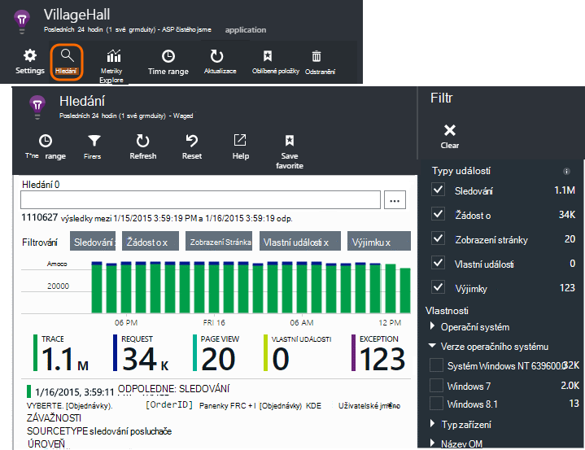

Otevře také při kliknutí prostřednictvím některé grafy a tabulky položky. V tomto případě jeho filtry jsou předem nastavené zaměřit na typ položky, kterou jste vybrali. 

Pokud je aplikace webové služby, zásuvné přehled příkladem grafu objemu žádosti o. Klikněte na něj a zobrazí se na podrobnější graf, s seznam ukazující, kolik požadavků přináší pro každou adresu URL. Klikněte na každý řádek a zobrazí se seznam jednotlivé požadavky pro tuto adresu URL:

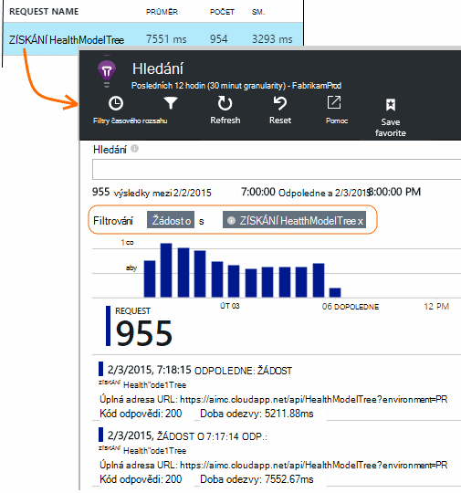

Hlavní část diagnostiky hledání je seznam telemetrie položek – požadavky na serveru, stránky zobrazení, vlastní události, které mají kódovaný a tak dál. V horní části seznamu je souhrnné grafu s počtem událostí v čase.

Události obvykle objeví v diagnostiky hledání před jsou zobrazeny v metrických Průzkumníkovi. I když zásuvné samotný aktualizuje pravidelně, můžete v případě, že tam čekáte pro konkrétní událost klikněte na aktualizovat.

### Ve Visual Studiu

Otevření okna hledání ve Visual Studiu:

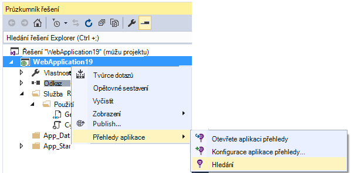

Okno hledání má stejné funkce jako webového portálu:

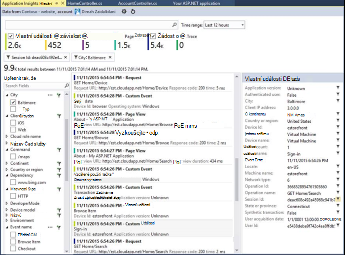

## Analytický nástroj vzorkování

Pokud aplikace vygeneruje spoustu telemetrie (a používáte 2.0.0-beta3 verze technologie ASP.NET SDK nebo novější), modulu adaptivní odběr automaticky sníží hlasitost odesílané tak, že zástupce část události na portálu. Zvláštní události, které se vztahují k stejnou žádost o však budou vybrané nebo vybraná jako skupinu, takže je můžete přecházet mezi související události. 

[Přečtěte si víc o odběr](app-insights-sampling.md).

## Kontrola, zda jednotlivé položky

Vyberte libovolnou položku telemetrie zobrazíte klíče a související položky. Pokud chcete zobrazit celou sadu polí, klikněte na trojtečkou (...). 

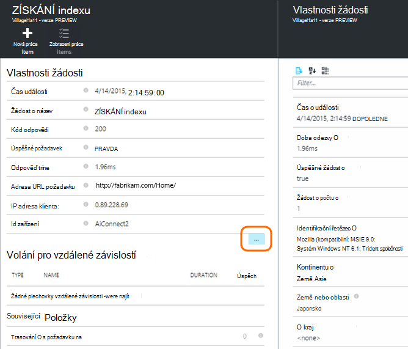

Při hledání celou sadu polí, použijte jednoduchým řetězce (bez zástupných znaků). Dostupná pole závisí na typu telemetrie.

## Vytvořit pracovní položky

Chybu můžete vytvořit v aplikaci Visual Studio týmovou s podrobnostmi z libovolné telemetrie položky. 

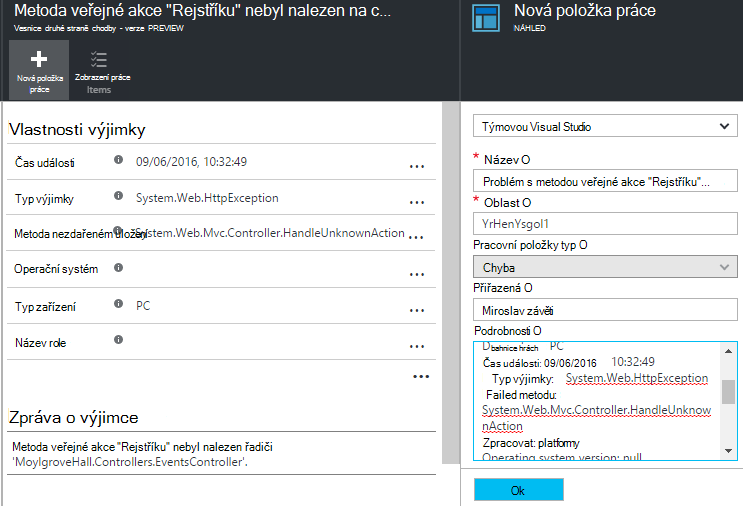

Při prvním to uděláte a, zobrazí se výzva ke konfiguraci spojení pro týmovou účtu a projektu.

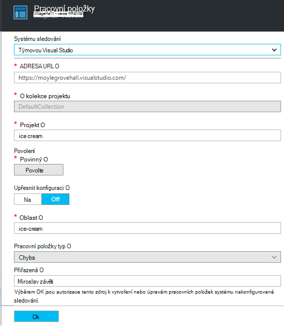

(Můžete taky si můžete zásuvné konfigurace ze stránky Nastavení > pracovních položek.)

## Filtrování typy událostí

Otevřete zásuvné filtr a zvolte typy událostí, které chcete zobrazit. (Pokud později, kterou chcete obnovit filtry, se kterými jste otevřeli zásuvné, klikněte na obnovit.)

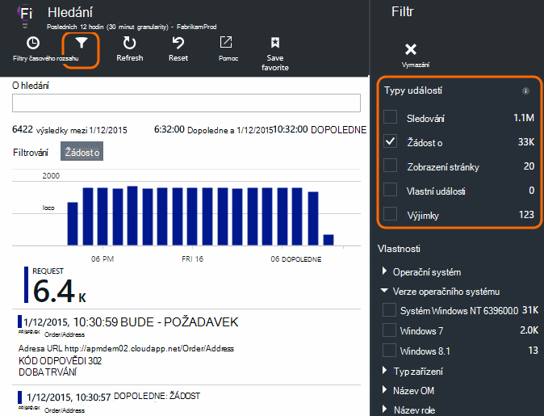

Typy událostí jsou:

* **Sledování** - protokoly pro diagnostiku včetně TrackTrace, log4Net, NLog a System.Diagnostic.Trace volání.
* **Žádost o** – požadavky HTTP přijaté serverové aplikace, včetně stránek, skriptů, obrázky, soubory stylu a data. Tyto události slouží k vytváření grafů přehled žádostí a odpovědí.
* **Zobrazení stránky** - Telemetrie odeslaný webový klient použitá k vytvoření stránky zobrazit sestavy. 
* **Vlastní události** – Pokud jste vložili volání TrackEvent() za účelem [Sledování použití][track], můžete je vyhledávat tady.
* **Výjimky** - nezachycené výjimky v serveru a ty, které se přihlásit pomocí TrackException().

## Filtrovat podle nemovitostí s hodnotou

Můžete filtrovat události na hodnoty jejich vlastnosti. Vlastnosti dostupné, závisí na typy událostí, které jste vybrali. 

Vyberte třeba se žádostí o s kódem konkrétní odpověď.

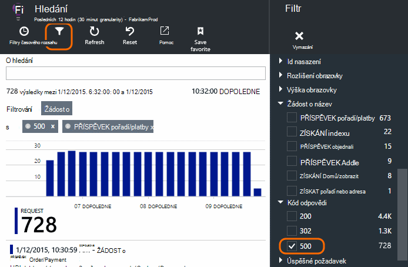

Výběr žádné hodnoty konkrétní vlastnosti má stejný výsledek jako výběr všech hodnot; Přepne vypnout filtrování u této vlastnosti.

### Pokud chcete hledání zpřesnit

Všimněte si, že počty napravo od hodnoty filtru zobrazit počet výskytů nějaké jsou ve vyfiltrované množině dat aktuální. 

V tomto příkladu je obsahuje, zrušte `Reports/Employees` požádat o výsledky ve většině 500 chyb:

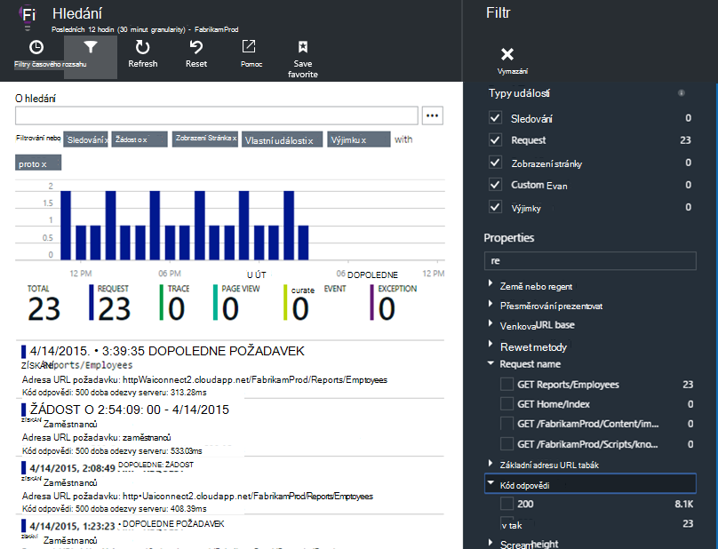

Také pokud budete chtít viz také k jakým událostem byly děje během této doby, můžete zkontrolovat **Zahrnout události se Nedefinováno vlastnosti**.

## Odebrání zkušební provoz bot a web

Použití filtru **skutečné nebo syntetické přenosy** a zkontrolujte **skutečné**.

Můžete taky filtrovat podle **zdroje syntetické provoz**.

## Kontrola, zda jednotlivé výskyty

Přidejte, že žádosti o název filtru, a pak můžete zkontrolovat jednotlivé výskyty dané události.

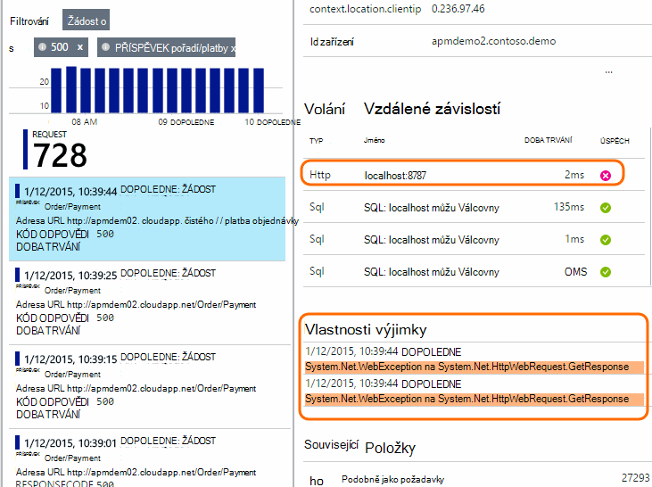

Při žádosti o událostech zobrazit podrobnosti výjimky došlo k chybě během zpracování požadavku.

Proklikejte výjimku zobrazíte její podrobnosti, včetně zásobníku.

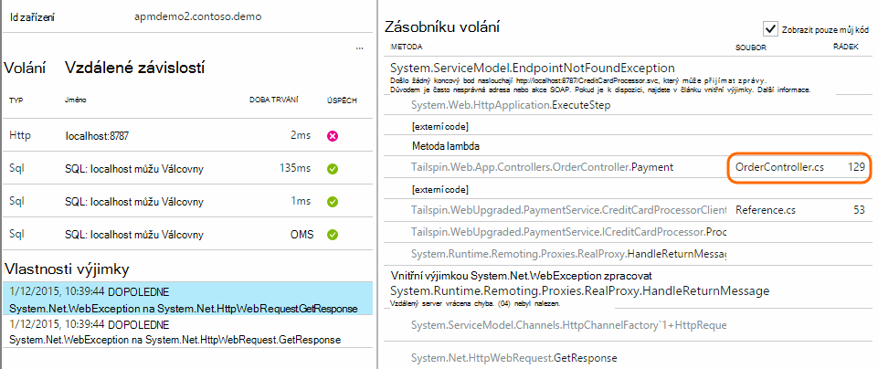

## Vyhledání události se stejnou vlastnost

Najdete všechny položky se stejnou hodnotou vlastnosti:

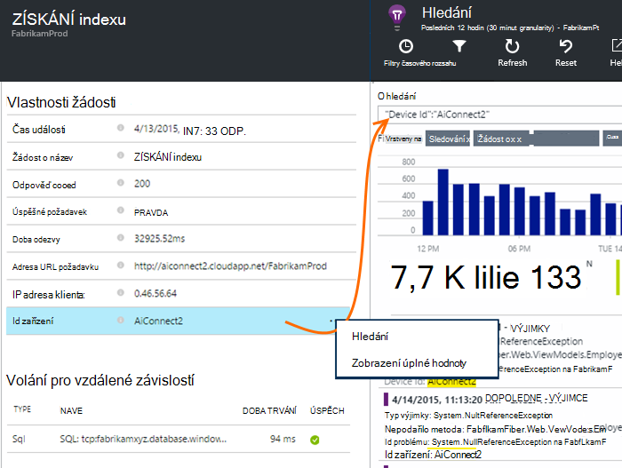

## Hledání podle metrických hodnoty

Pokud potřebujete všechny žádosti o dobu odezvy > 5s s.  Čas představují v značky: 10 000 až značky = 1ms.

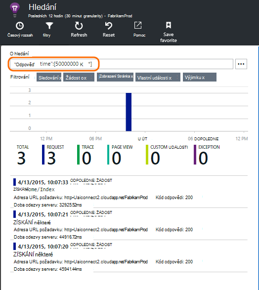

## Hledání dat

Můžete vyhledávat termíny v některém z nemovitostí s hodnotou. Toto je užitečné, pokud jste vytvořili [vlastní události] [ track] s nemovitostí s hodnotou. 

Můžete nastavit čas rozsah, jako hledání pro kratší rozsah dat se rychleji. 

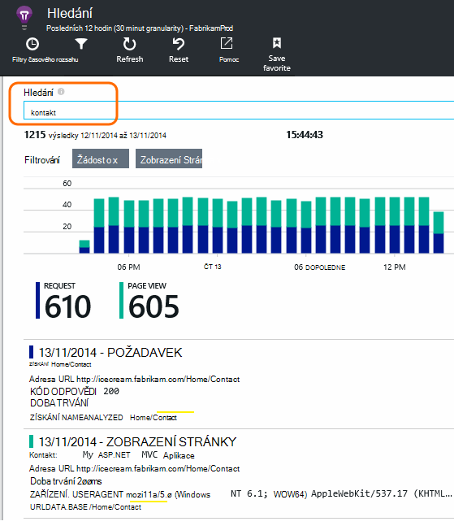

Hledání podmínek, ne podřetězec. Podmínky jsou alfanumerické řetězce včetně některé interpunkce jako "." a "_". Příklad:

termín|*není* spárováno tak, že|ale odpovídají
---|---|---
HomeController.About|informace o domácí|h\*o domácí\*
IsLocal|místní je \*místní|ISL\* IsLocal i\*l\*
Nové zpoždění|w d|Nový zpoždění n\* a d\*

Tady jsou hledaných výrazů, které můžete použít:

Ukázkový dotaz | Efekt 
---|---
pomalé|Vyhledání všech událostí v rozsah kalendářních dat u pole obsahují termín "zpomalit"
databáze??|Odpovídá database01, databaseAB... ? není povoleno na začátku hledaný termín.
databáze * |Odpovídá databáze, database01, databaseNNNN  * není smí na začátku hledaný výraz
Apple a banánů|Najdete události, které obsahují oba výrazy. Použití kapitálu "a", nejsou "a".
Apple nebo banánů Apple banánů|Najděte události, které obsahují buď termínů. Použití "Nebo", ne "nebo". < /br/ > krátký formulář.
Apple není banánů Apple-banánů|Najděte události, které obsahují jedno období, ale ne na druhou. Krátký formulář.
aplikace * a banánů-(grape pear)|Logické operátory a "bracketing".
"Míru": 0 až 500 "Míru": 500 Komu * | Najděte události, které obsahují pojmenované měření rozsahu hodnot.

## Uložení hledání

Jakmile nastavíte všechny filtry, které chcete, můžete uložit hledání jako oblíbené. Pokud pracujete v účet organizace, můžete ho sdílet s ostatními členy týmu.

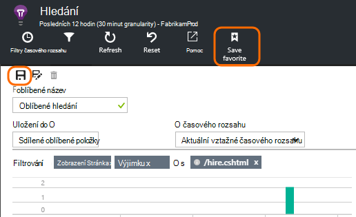

Postup najdete v článku hledání, **přejděte na zásuvné přehled** a otevřete Oblíbené položky:

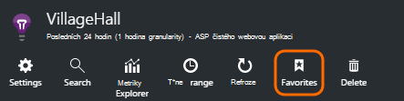

Pokud jste soubor uložili s relativní časového rozsahu, znovu otevřít zásuvné má nejnovější data. Pokud jste soubor uložili s absolutní časového rozsahu, zobrazí stejná data pokaždé, když.

## Odeslání více telemetrie interpretace aplikace

Kromě telemetrie mimo pole poslán aplikace přehledy SDK máte tyto možnosti:

* Zachyťte trasování protokolu z oblíbených protokolování framework v [.NET] [ netlogs] nebo [Java][javalogs]. To znamená, můžete hledat prostřednictvím protokolu trasování a sladit se zobrazení stránky, výjimky a dalších událostí. 
* [Kódu] [ track] odeslat vlastní události, zobrazení stránky a výjimky. 

[Zjistěte, jak odeslat protokoly a vlastní telemetrie interpretace aplikace][trace].

## Služba Q & A

### Jaká data se zachovají?

Až 500 události sekundu z jednotlivých aplikací. Události uchovávají pro sedmi dnů.

### Jak může vidět ODESLANÁ data v mém požadavky serveru?

Jsme není protokolování údajů příspěvek automaticky, ale můžete použít [TrackTrace nebo protokolu volání][trace]. Vložte data příspěvek v parametru zprávy. Se nedá se filtrovat ve zprávě způsobem, jak jde vlastnosti, ale již limit velikosti.

## Další kroky

* [Odeslat protokoly a vlastní telemetrie interpretace aplikace][trace]
* [Nastavení dostupnost a rychlostí reakce testuje][availability]
* [Řešení potíží][qna]

<!--Link references-->

[availability]: app-insights-monitor-web-app-availability.md
[javalogs]: app-insights-java-trace-logs.md
[netlogs]: app-insights-asp-net-trace-logs.md
[qna]: app-insights-troubleshoot-faq.md
[start]: app-insights-overview.md
[trace]: app-insights-search-diagnostic-logs.md
[track]: app-insights-api-custom-events-metrics.md

 