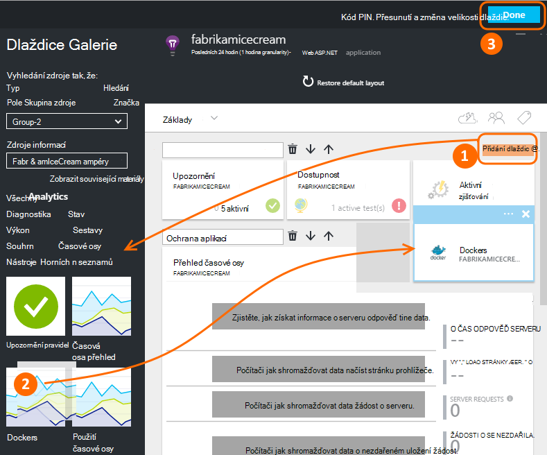
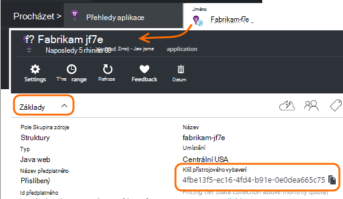
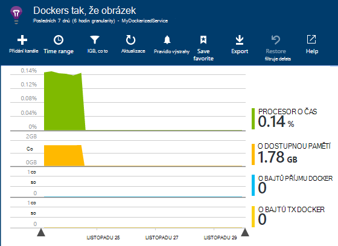
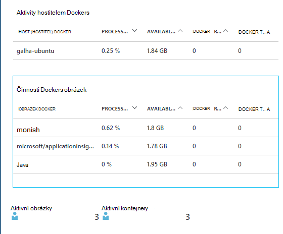
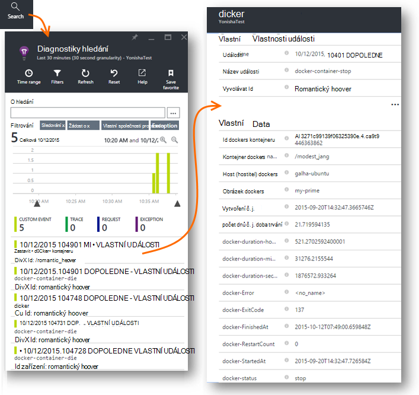
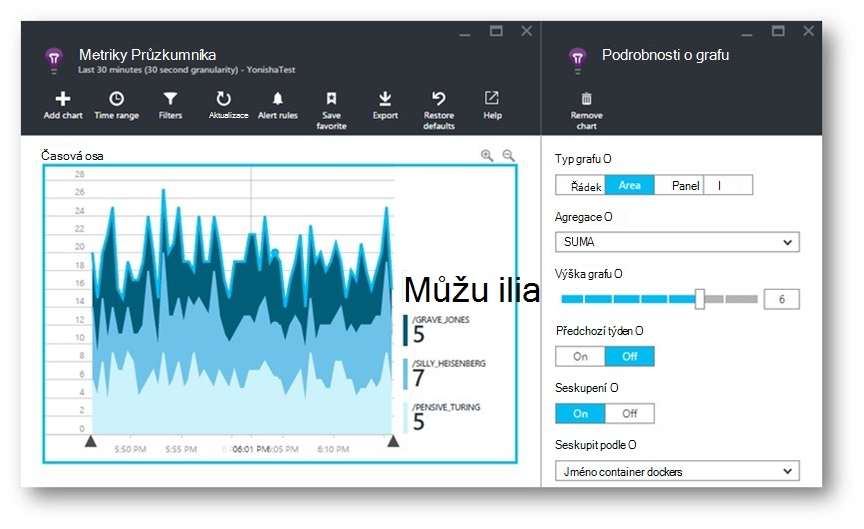
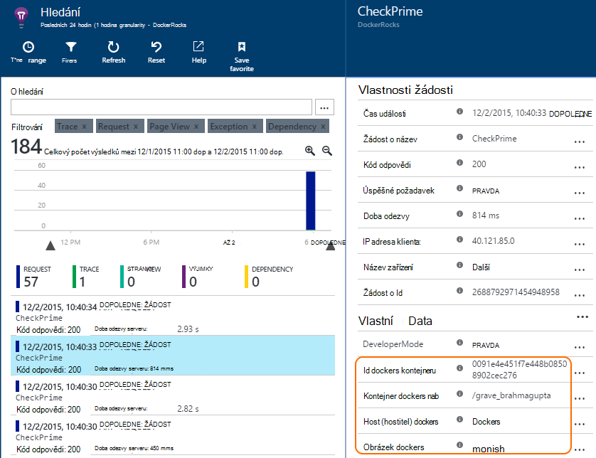
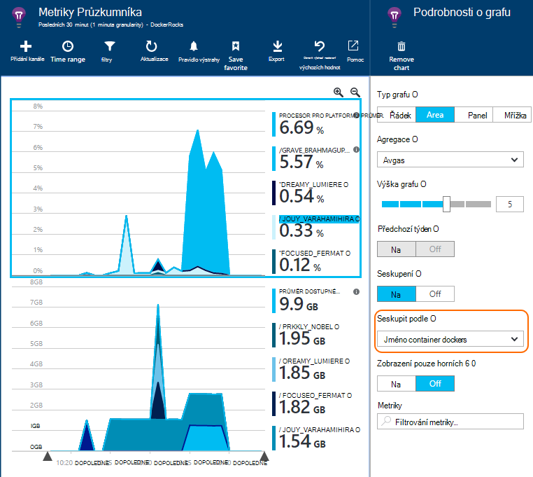

<properties 
    pageTitle="Sledování aplikací Docker v aplikaci přehledy" 
    description="Docker výkon čítače, událostí a výjimky mohou být zobrazena na přehledy aplikace spolu s telemetrie z kontejnerizovaná aplikací." 
    services="application-insights" 
    documentationCenter=""
    authors="alancameronwills" 
    manager="douge"/>

<tags 
    ms.service="application-insights" 
    ms.workload="tbd" 
    ms.tgt_pltfrm="ibiza" 
    ms.devlang="na" 
    ms.topic="article" 
    ms.date="12/01/2015" 
    ms.author="awills"/>
 
# <a name="monitor-docker-applications-in-application-insights"></a>Sledování aplikací Docker v aplikaci přehledy

Cyklus událostí a výkonnosti z [Docker](https://www.docker.com/) kontejnerů můžete zobrazena na přehledy aplikace. Instalace [Aplikace přehledy](app-insights-overview.md) obrázek v kontejneru v hostitele a zobrazí výkonnosti hostitele i u dalších obrázků.

S Docker distribuovat aplikace v lightweight kontejnerů naplněný souhrnnými všechny závislosti. Bude spouštět na hostitelském počítači, spouštěných modul Docker.

Když spustíte [aplikaci přehledy obrázek](https://hub.docker.com/r/microsoft/applicationinsights/) na hostitele Docker, zobrazí se tyto výhody:

* Cyklus telemetrie o všech kontejnerů spuštěný na hostiteli - spustit, zastavit a podobně.
* Výkonnosti pro kontejnery. Využití procesoru, paměti, použití sítě a další možnosti.
* Pokud jsou [nainstalované aplikace přehledy SDK](app-insights-java-live.md) v okně aplikace spuštěné v kontejnerech všechny telemetrie těmito aplikacemi další vlastnosti identifikační kontejner a hostitele počítač. Tak například pokud máte instancí aplikace spuštěné v víc než jednoho hostitele snadno budete moct filtrovat aplikace telemetrie hostitelem.


## <a name="set-up-your-application-insights-resource"></a>Nastavení aplikace přehledy zdroje

1. Přihlaste se k [Portálu Microsoft Azure](https://azure.com) a otevřete aplikaci přehledy zdrojů aplikace; nebo [vytvořte nový účet](app-insights-create-new-resource.md). 

    *Použití které prostředku* Pokud aplikace spuštěné v hostitele vytvořené někdo jiný, je potřeba [vytvořit nový zdroj přehledy aplikace](app-insights-create-new-resource.md). To slouží k zobrazení a analyzovat telemetrie. (Vyberte "Jiné" pro typ aplikace)

    Ale pokud jste vývojář aplikace, pak jsme ať jste [přidali aplikace přehledy SDK](app-insights-java-live.md) každý z nich. Pokud budou všechny skutečně součástí jedné podnikové aplikaci a pak můžete konfigurovat všem poznámkám telemetrie odešlete jeden zdroj a budete používat stejný zdroj k zobrazení dat Docker životní cyklus a výkonu. 

    Třetí scénář je vyvinuté většina aplikace, že používáte samostatné zdroje zobrazíte jejich telemetrie. V takovém případě budete nejspíš chtít vytvořit samostatné zdroj dat Docker. 

2.  Přidání dlaždice Docker: Zvolte **Přidání dlaždice**, přetáhněte dlaždici Docker z galerie a klikněte na **Hotovo**. 

    


3. Klikněte na rozevírací seznam **Essentials** a zkopírujte klávesu přístrojového vybavení. Použijete tento zjistit SDK, kam chcete odeslat jeho telemetrie.


    

Zůstal okno prohlížeče užitečný, můžete se vraťte na brzy bude k dispozici a podívejte se na svého telemetrie.


## <a name="run-the-application-insights-monitor-on-your-host"></a>Spusťte monitor přehledy aplikace na hostitele
 
Teď máte někde zobrazíte telemetrie, můžete nastavit kontejnerizovaná aplikace, která bude shromažďovat a odešlete ji.

1.  Připojení k hostitele Docker. 
2.  Úprava klíče přístrojového vybavení do tento příkaz a pak ho spusťte:
 
    ```

    docker run -v /var/run/docker.sock:/docker.sock -d microsoft/applicationinsights ikey=000000-1111-2222-3333-444444444
    ```

Pouze jeden obrázek přehledy aplikace se vyžaduje za Docker hostitele. Pokud nasazení aplikace na více Docker tabulkami hosts zopakujete příkaz na každém hostiteli.

## <a name="update-your-app"></a>Aktualizace aplikace

Pokud aplikace využívá s [Aplikací přehledy SDK jazyka Java](app-insights-java-get-started.md), přidejte následující řádek do souboru ApplicationInsights.xml v projektu, v části `<TelemetryInitializers>` prvek:

```xml

    <Add type="com.microsoft.applicationinsights.extensibility.initializer.docker.DockerContextInitializer"/> 
```

Jednotlivé položky telemetrie odesílaným z aplikace přidá Docker informace, například kontejner a id hostitele.

## <a name="view-your-telemetry"></a>Zobrazení vašeho telemetrie

Přejděte zpět do zdrojů aplikace přehledy Azure portálu.

Proklikejte Docker dlaždice.

Krátce uvidíte dat příchozí z aplikace Docker zejména pokud máte jiné kontejnery spuštěna modul Docker.


Tady je několik zobrazení, která se zobrazí.

### <a name="perf-counters-by-host-activity-by-image"></a>Výkon čítače hostitelem činnosti obrázek








Kliknutím na název hostitele nebo obrázek podrobněji.


Chcete-li přizpůsobit zobrazení, klikněte na graf, mřížce nadpis, nebo použijte přidání grafu. 

[Další informace o metriky Průzkumníka](app-insights-metrics-explorer.md).

### <a name="docker-container-events"></a>Docker kontejneru události




Pokud chcete zkontrolovat jednotlivé události, klikněte na [Hledat](app-insights-diagnostic-search.md). Hledání a filtrování události, které chcete najít. Klikněte na kterékoli události zobrazíte více podrobností.
 
### <a name="exceptions-by-container-name"></a>Výjimky tak, že jméno container
 



### <a name="docker-context-added-to-app-telemetry"></a>Kontext docker přidány do aplikace telemetrie

Žádost o telemetrie odesílaným z aplikace vybaveno AI SDK rozšíření v kontextu Docker převodníkem:



Čas procesoru dostupnou pamětí výkonnosti, obohacuje na více a seskupené podle názvu Docker kontejner:





## <a name="q--a"></a>Služba Q & A

*Co aplikace přehledy umožní mi, která se nemůžou dostat z Docker?*

* Podrobný rozpis výkonnosti kontejner a obrázek.
* Integrace kontejner a aplikace dat v jedné řídicího panelu.
* [Export telemetrie](app-insights-export-telemetry.md) pro další analýzu databáze, Power BI nebo jiných řídicího panelu.

*Jak se dostanu telemetrie z aplikace samotné?*

* Instalace aplikace přehledy SDK v aplikaci. Zjistěte, jak pro: [Java webové aplikace](app-insights-java-get-started.md), [Windows webových aplikací](app-insights-asp-net.md).
