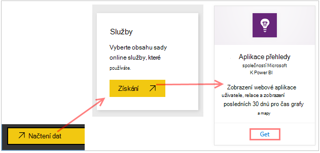
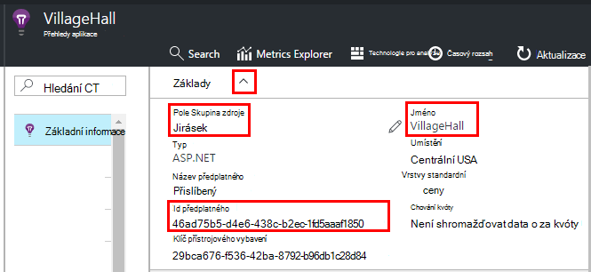
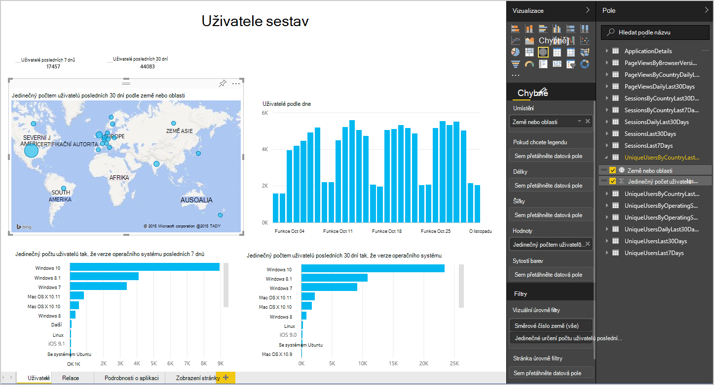
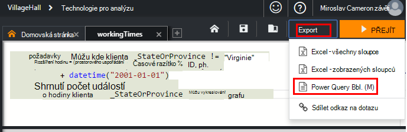
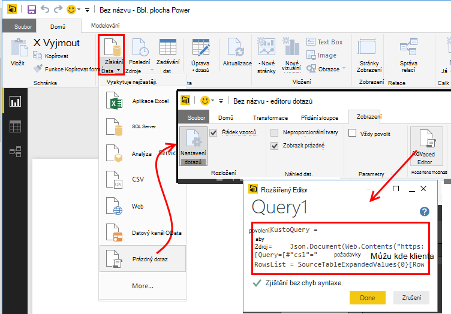
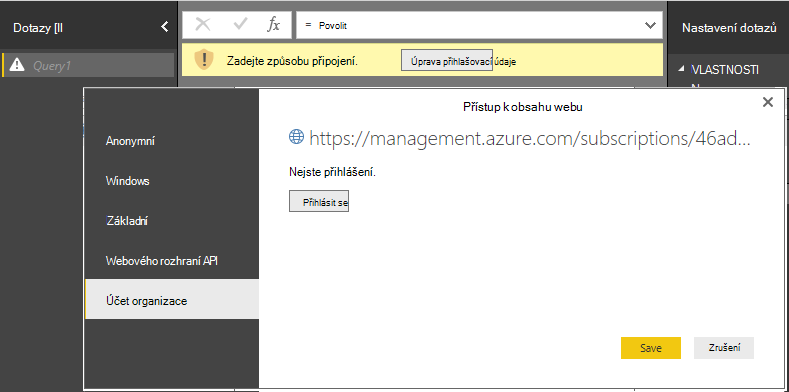
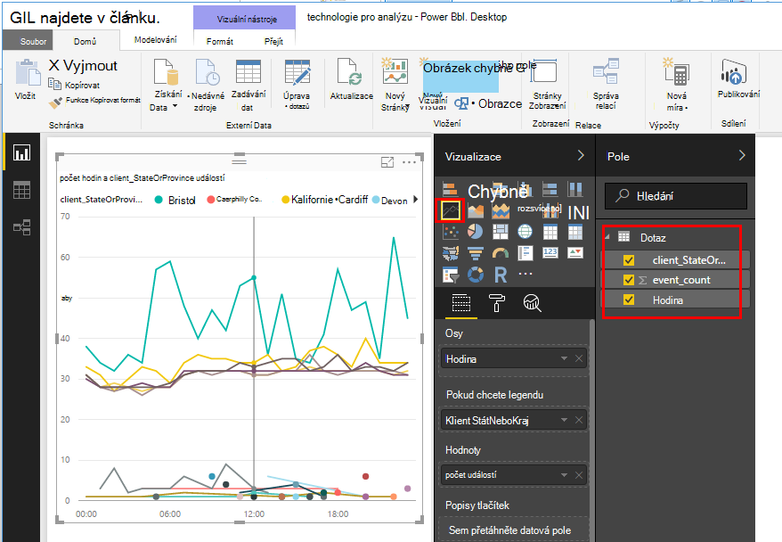
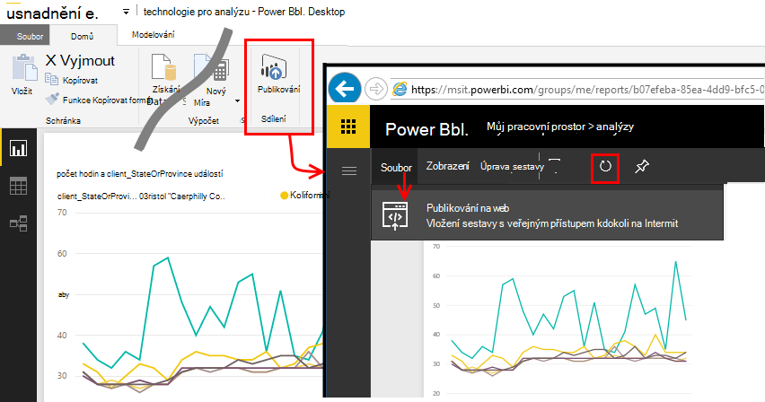

<properties 
    pageTitle="Export do Power BI z aplikace přehledy | Microsoft Azure" 
    description="Analýzy dotazů můžete zobrazit v Power BI." 
    services="application-insights" 
    documentationCenter=""
    authors="noamben" 
    manager="douge"/>

<tags 
    ms.service="application-insights" 
    ms.workload="tbd" 
    ms.tgt_pltfrm="ibiza" 
    ms.devlang="na" 
    ms.topic="article" 
    ms.date="10/18/2016" 
    ms.author="awills"/>

# Obálek přehledy aplikace Power BI

[Power BI](http://www.powerbi.com/) je sada firmy analytických nástrojů, které vám pomůžou analýza dat a sdílet poznatky. Formátovaný řídicí panely jsou k dispozici na všech zařízeních. Můžete kombinovat data z více zdrojů, včetně analýzy dotazů z [Přehledy aplikace Visual Studio](app-insights-overview.md).

Export dat aplikace přehledy do Power BI tři doporučenými způsoby. Je možné používat samostatně nebo společně.

* [**Adaptér power BI**](#power-pi-adapter) – nastavení na dokončení řídicím panelu telemetrie z aplikace. Předdefinované sadu graf s dílčími pruhy, ale můžete přidat vlastní dotazy z jiných zdrojů.
* [**Export analýzy dotazů**](#export-analytics-queries) - vytvářet žádná dotazu pomocí technologie pro analýzu a export do Power BI. Tento dotaz můžete umístit na řídicí panel spolu s dalšími daty.
* [**Nepřetržité exportovat a technologie pro analýzu toku**](app-insights-export-stream-analytics.md) – to zahrnuje víc práce nastavit. To je užitečné, pokud chcete zachovat data dlouhou. Doporučuje se v opačném jiné metody.

## Power BI adaptér

Tento způsob vytvoří na dokončení řídicím panelu telemetrie za vás. Předdefinované počáteční uvedenou množinu dat, ale nebude k němu přidat další data.

### Získání adaptér

1. Přihlaste se k [Power BI](https://app.powerbi.com/).
2. Otevřete **načtení dat**, **službami**, **přehledy aplikace**

    

3. Poskytování údajů aplikace přehledy zdroje.

    

4. Počkejte chvíli nebo dvě pro data, která chcete importovat.

    

Úpravou na řídicím panelu kombinace grafů aplikace přehledy se budou z jiných zdrojů a analýzy dotazů. Existuje vizualizace galerie můžete získat další grafy, kde má parametrů, které můžete nastavit každý graf.

Po počáteční importu řídicího panelu a zprávy dál aktualizovat denně. Můžete určit plán aktualizace na datové sady.

## Export analýzy dotazů

Tento postup vám umožní psaní analýzy dotazy, které chcete a, exportovat do řídicího panelu Power BI. (Můžete přidat na řídicí panel vytvořil adaptér.)

### Jednorázové: nainstalovat Power BI Desktop

K importu aplikace přehledy dotazu, použijte desktopovou verzi aplikace Power BI. Ale můžete publikovat ji na webu nebo pracovního prostoru cloudu Power BI. 

Nainstalujte si [Power BI Desktop](https://powerbi.microsoft.com/en-us/desktop/).

### Export dotazu analýzy

1. [Otevřít technologie pro analýzu a napsat svůj dotaz](app-insights-analytics-tour.md).
2. Otestujte a upřesnění dotazu, až budete spokojení s výsledky.
3. V nabídce **Exportovat** zvolte **Power BI (M)**. Uložte textový soubor.

    
4. V Power BI Desktop vyberte **načíst Data, prázdný dotaz** a pak v editoru dotazů klikněte v části **zobrazení** vyberte **Rozšířený Editor dotazů**.

    Vložte exportovaný skript M jazyk do rozšířeného editoru dotazů.

    

5. Možná budete muset pověření umožňuje Power BI pro přístup k Azure. Použití "účet organizace" se přihlásit pomocí účtu Microsoft.

    

6. Vyberte vizualizaci dotazu a vyberte pole pro osy x, y a rozdělíte dimenze.

    

7. Publikování sestavy do pracovního prostoru cloudu Power BI. Odtud můžete vložit synchronizované verze do jiné webové stránky.

    
 
8. Ručně aktualizovat sestavu v nastavených intervalech nebo nastavení plánované aktualizace v nastaveních na stránce.

## Informace o analytický nástroj vzorkování

Pokud aplikace odešle velké množství dat, může funkce adaptivní odběr pracovat a odeslat jenom procento vaší telemetrie. Platí totéž i nastavíte ruční odběr SDK nebo na požití. [Další informace o odběr.](app-insights-sampling.md)
 

## Další kroky

* [Power BI – zjistěte,](http://www.powerbi.com/learning/)
* [Kurz analýzy](app-insights-analytics-tour.md)
