<properties 
    pageTitle="Použití analýzy toku zpracování dat vyexportovaný z aplikace přehledy | Microsoft Azure" 
    description="Technologie pro analýzu toku můžete nepřetržitě transformace, filtrování a směrování data, která exportu z aplikace přehledy." 
    services="application-insights" 
    documentationCenter=""
    authors="noamben" 
    manager="douge"/>

<tags 
    ms.service="application-insights" 
    ms.workload="tbd" 
    ms.tgt_pltfrm="ibiza" 
    ms.devlang="na" 
    ms.topic="article" 
    ms.date="10/18/2016" 
    ms.author="awills"/>

# <a name="use-stream-analytics-to-process-exported-data-from-application-insights"></a>Použití analýzy toku zpracuje exportovaná data z aplikace přehledy

[Azure toku analýzy](https://azure.microsoft.com/services/stream-analytics/) je ideální nástroj pro zpracování data [vyexportovaný z aplikace přehledy](app-insights-export-telemetry.md). Technologie pro analýzu toku můžete si ho naimportovat data z různých zdrojů. Ho můžete transformace filtrování dat a potom ho směrovat řadu propadů.

V tomto příkladu vytvoříme adaptér trvá dat z aplikace přehledy, přejmenuje zpracuje některá z těchto polí a potrubí do Power BI.

> [AZURE.WARNING] Jsou mnohem lepší jednodušší a [Doporučené způsoby zobrazení dat aplikace přehledy v Power BI](app-insights-export-power-bi.md). Cesta znázorněno zde je právě příklad ukazují, jak chcete zpracovat exportovaná data.

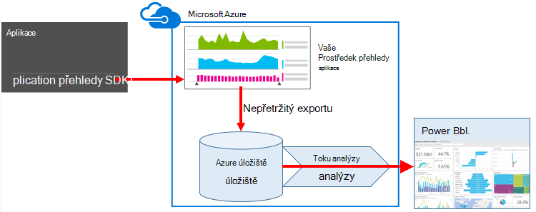


## <a name="create-storage-in-azure"></a>Vytvoření úložiště v Azure

Nepřetržitý export vždy výstupní data s klientem Azure úložiště, je potřeba nejdřív vytvořit úložiště.

1.  Vytvoření účtu "klasické" úložiště ve vašem předplatném [Azure portálu](https://portal.azure.com).

    

2. Vytvoření kontejneru

    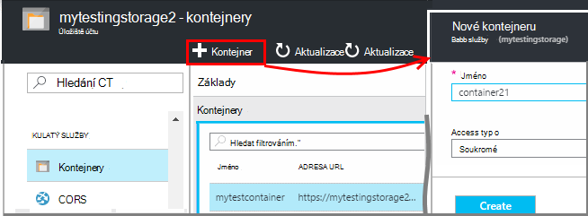

3. Zkopírujte přístupová klávesa úložiště

    Musíte ho brzy bude k dispozici pro nastavení vstupní ke službě analýzy proudu.

    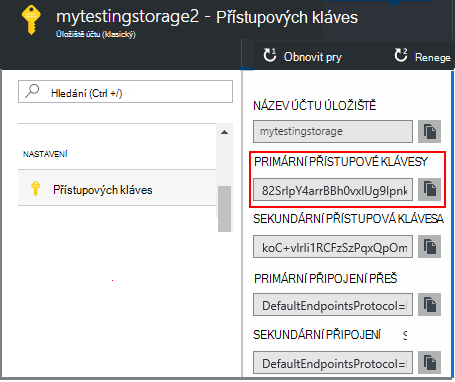

## <a name="start-continuous-export-to-azure-storage"></a>Zahájení nepřetržitý exportovat do Azure úložiště

[Export nepřetržitě](app-insights-export-telemetry.md) slouží k přesunutí dat z aplikace podstatu Azure úložiště.

1. V portálu Azure přejděte do aplikace přehledy zdroje, který jste vytvořili pro aplikaci.

    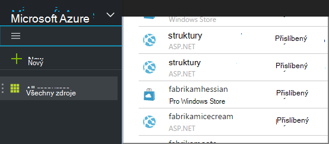

2. Vytvoření nepřetržitý exportovat.

    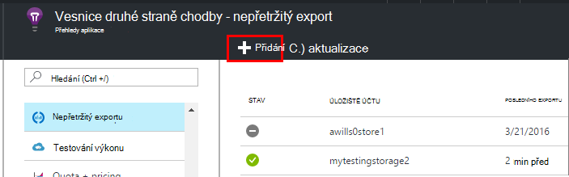


    Vyberte účet úložiště, který jste dříve vytvořili:

    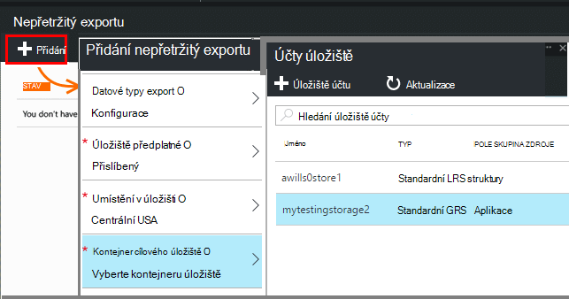
    
    Nastavte typy událostí, které chcete zobrazit:

    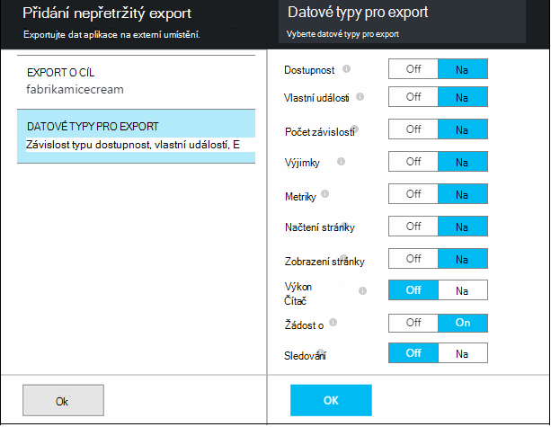

3. Informujte některá data nahromadit. Sednout zpět a zpřístupněte lidé pomocí aplikace určitou dobu. Telemetrie chodily a zobrazí se vám statistické grafy v [metrických explorer](app-insights-metrics-explorer.md) a jednotlivých událostí v [diagnostiky hledání](app-insights-diagnostic-search.md). 

    A navíc bude data exportovat do úložiště. 

4. Zkontrolujte exportovaná data. Ve Visual Studiu, zvolte **zobrazení / cloudu Explorer**a otevřete Azure / úložiště. (Pokud už nemáte tato možnost nabídky, budete potřebovat k instalaci Azure SDK: Otevřete dialogové okno Nový projekt a Visual Basic / cloudu / stažení Microsoft Azure SDK pro .NET.)

    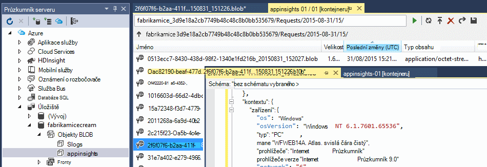

    Poznamenejte si běžné část názvu cesty, která je odvozena z klávesu application název a přístrojového vybavení. 

Události jsou došlo k objektů blob soubory ve formátu JSON zápisu. Každý soubor může obsahovat jedno nebo více událostí. Tak byste rádi čtení data události a filtrování rozložení polí, které chceme. Jsou všechny typy věci, které jsme může dělat s daty, ale naše plán dnes je toku analýzy do kanálu data, která chcete Power BI.

## <a name="create-an-azure-stream-analytics-instance"></a>Vytvoření instance analýzy toku Azure

[Klasický portál Azure](https://manage.windowsazure.com/)vyberte služby Azure toku analýzy a vytvořte nový projekt analýzy toku:


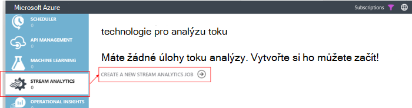


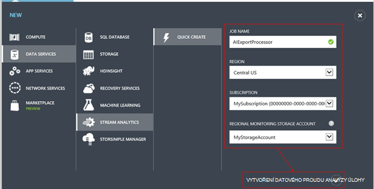

Po vytvoření nového projektu rozbalte její podrobnosti:

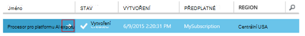


### <a name="set-blob-location"></a>Nastavení objektů blob umístění

Nastavte, aby trvat vstup ze svého objektů blob nepřetržitý exportovat:

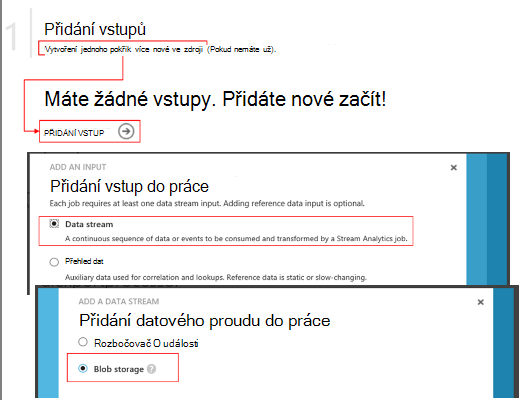

Nyní musíte mít primární klíč přístup ze svého účtu úložiště, které bylo uvedeno dříve. Nastavte jako klíč účtu úložiště.

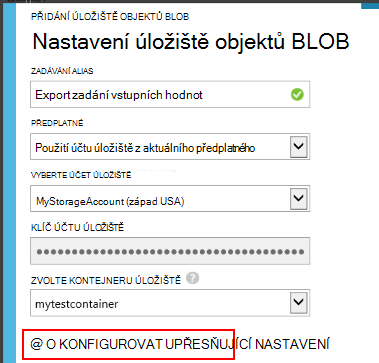

### <a name="set-path-prefix-pattern"></a>Nastavení cesta předponu vzor 

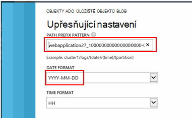


**Ujistěte se, že nastavení formátu data YYYY-MM-DD (s typ čáry).**

Cesta předpona vzor Určuje, kde toku analýzy najde vstupních souborů v úložišti. Budete muset nastavit tak, aby odpovídala jak nepřetržitý exportovat jsou uložená data. Nastavte takto:

    webapplication27_12345678123412341234123456789abcdef0/PageViews/{date}/{time}

V tomto příkladu:

* `webapplication27`stejný název zdroje aplikace přehledy **všechna malá písmena**.
* `1234...`je zkratka přístrojového vybavení zdroje aplikace přehledy **vynecháním typ čáry**. 
* `PageViews`je typ dat, která chcete analyzovat. Dostupné typy závisí na filtr, který jste nastavili v souvislé exportovat. Zkoumat data vyexportovat do najdete v článku dostupné typy a najdete v článku [export datového modelu](app-insights-export-data-model.md).
* `/{date}/{time}`vzorek zapsán doslova.

> [AZURE.NOTE] Zkontrolujte úložiště, aby zkontrolovala, jestli že správného cestu.

### <a name="finish-initial-setup"></a>Dokončení počáteční nastavení

Potvrďte formát serializace:

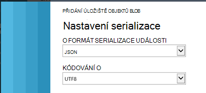

Zavřete průvodce a počkejte instalaci dokončete.

> [AZURE.TIP] Pomocí příkazu ukázkové ke stažení některá data. V jednoduchosti je jako vzorku ladění dotazu.

## <a name="set-the-output"></a>Nastavení výstupu

Nyní vyberte práce a nastavení výstupu.

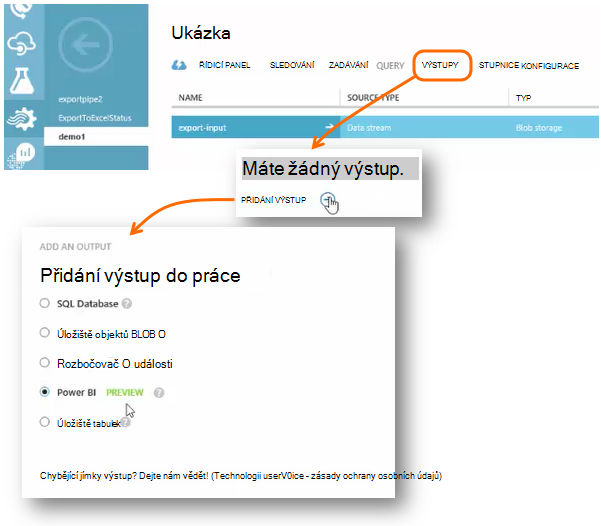

Zadejte svůj **pracovní nebo školní účet** povolit toku Analytics pro přístup k Power BI zdroje. Potom vytvořte název výstup a odstranění cílové datovou sadu Power BI a tabulky.

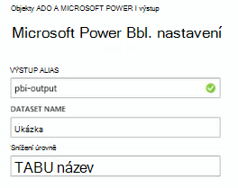

## <a name="set-the-query"></a>Nastavení dotazu

Dotaz se řídí překlad z předávat na vstupu výstupu.

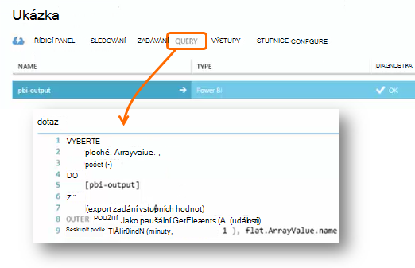


Použijte funkci Test ke kontrole získat výstupu vpravo. Jí ukázkových dat, která jste pořídili pomocí na stránce vstupů. 

### <a name="query-to-display-counts-of-events"></a>Dotaz, který zobrazí počty události

Vložte tento dotaz:

```SQL

    SELECT
      flat.ArrayValue.name,
      count(*)
    INTO
      [pbi-output]
    FROM
      [export-input] A
    OUTER APPLY GetElements(A.[event]) as flat
    GROUP BY TumblingWindow(minute, 1), flat.ArrayValue.name
```

* Export vstup je alias, který jsme udělili proudu při zadávání
* výstup pbi je výstup alias, která byla definována
* Budeme používat [Vnější GetElements použít](https://msdn.microsoft.com/library/azure/dn706229.aspx) , protože název události vnořené arrray JSON. Potom vyberte vybere název události, spolu s počet instance tohoto názvu v časové období. Klauzule [Group By](https://msdn.microsoft.com/library/azure/dn835023.aspx) skupin prvky do časová období 1 minuty.


### <a name="query-to-display-metric-values"></a>Dotaz, který zobrazí hodnoty metriky


```SQL

    SELECT
      A.context.data.eventtime,
      avg(CASE WHEN flat.arrayvalue.myMetric.value IS NULL THEN 0 ELSE  flat.arrayvalue.myMetric.value END) as myValue
    INTO
      [pbi-output]
    FROM
      [export-input] A
    OUTER APPLY GetElements(A.context.custom.metrics) as flat
    GROUP BY TumblingWindow(minute, 1), A.context.data.eventtime

``` 

* Tento dotaz přechází do telemetrie metriky zobrazíte čas události a metrických hodnotu. Metriky hodnoty jsou uvnitř maticových tak používáme vnější GetElements použít vzorek extrahovat řádky. "myMetric" v tomto případě je název metriky. 

### <a name="query-to-include-values-of-dimension-properties"></a>Dotaz zahrnoval hodnoty vlastností dimenze

```SQL

    WITH flat AS (
    SELECT
      MySource.context.data.eventTime as eventTime,
      InstanceId = MyDimension.ArrayValue.InstanceId.value,
      BusinessUnitId = MyDimension.ArrayValue.BusinessUnitId.value
    FROM MySource
    OUTER APPLY GetArrayElements(MySource.context.custom.dimensions) MyDimension
    )
    SELECT
     eventTime,
     InstanceId,
     BusinessUnitId
    INTO AIOutput
    FROM flat

```

* Tento dotaz obsahuje hodnoty vlastností dimenze bez v závislosti na konkrétní dimenzi jsou v pevné index v maticové dimenze.

## <a name="run-the-job"></a>Spuštění úlohy

Vyberte datum v minulosti úlohu z spustíte. 

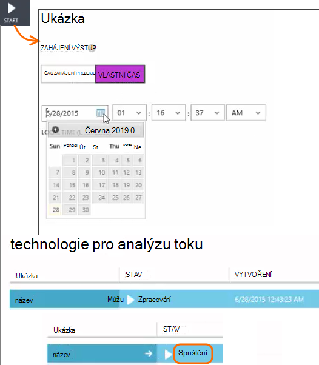

Počkejte, dokud je spuštěná úloha.

## <a name="see-results-in-power-bi"></a>Zobrazte výsledky v Power BI

> [AZURE.WARNING] Jsou mnohem lepší jednodušší a [Doporučené způsoby zobrazení dat aplikace přehledy v Power BI](app-insights-export-power-bi.md). Cesta znázorněno zde je právě příklad ukazují, jak chcete zpracovat exportovaná data.

Otevřete Power BI sithttp://go.microsoft.com/fwlink/p/?LinkId=402333 svým pracovním nebo školním účtem a vyberte datovou sadu a tabulky, který jste definovali jako výstup projektu toku analýzy.

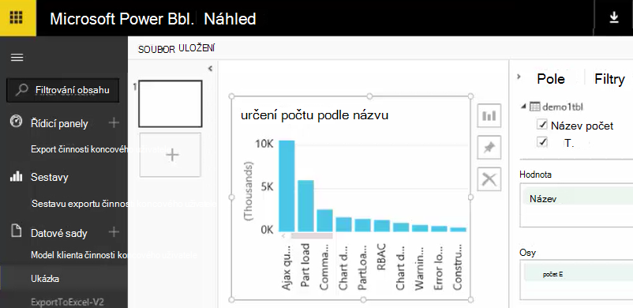

Teď můžete pomocí této sadě dat v sestavách a řídicích panelů v [Power BI](https://powerbi.microsoft.com).


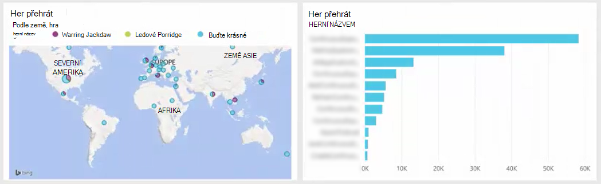


## <a name="no-data"></a>Žádná data?

* Zkontrolujte, které můžete [nastavit formát data](#set-path-prefix-pattern) správně k YYYY-MM-DD (plus pár typ čáry).


## <a name="video"></a>Video

Noam Robert Zeev ukazuje, jak zpracuje exportovaná data pomocí analýzy proudu.

> [AZURE.VIDEO export-to-power-bi-from-application-insights]

## <a name="next-steps"></a>Další kroky

* [Nepřetržitý exportu](app-insights-export-telemetry.md)
* [Podrobné porovnání datových modelů referenční informace pro typy vlastností a hodnoty.](app-insights-export-data-model.md)
* [Přehledy aplikace](app-insights-overview.md)
* [Další příklady a návody](app-insights-code-samples.md)
 
