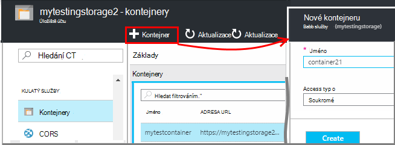
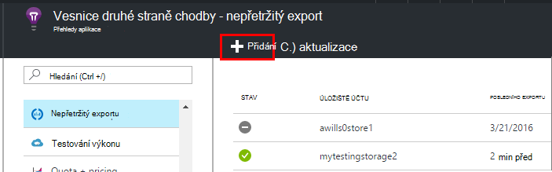
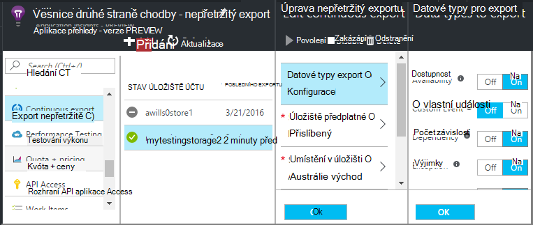
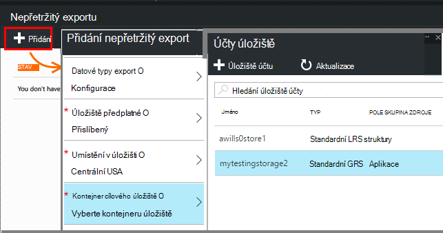
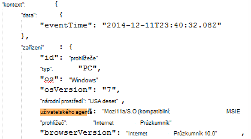
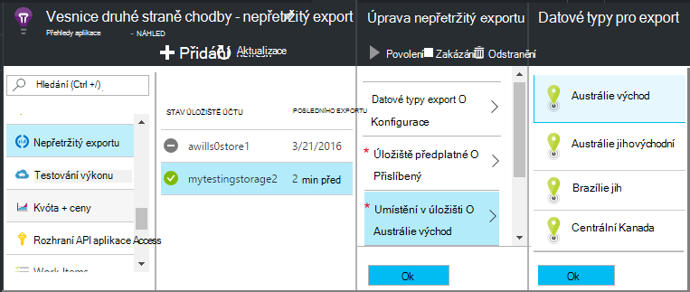

<properties 
    pageTitle="Nepřetržitý export telemetrie z aplikace přehledy | Microsoft Azure" 
    description="Export dat diagnostic a použití do úložiště v Microsoft Azure a stáhněte si ho odtud." 
    services="application-insights" 
    documentationCenter=""
    authors="alancameronwills" 
    manager="douge"/>

<tags 
    ms.service="application-insights" 
    ms.workload="tbd" 
    ms.tgt_pltfrm="ibiza" 
    ms.devlang="na" 
    ms.topic="article" 
    ms.date="10/18/2016" 
    ms.author="awills"/>
 
# Export telemetrie z aplikace přehledy

Chcete zachovat svůj telemetrie po dobu delší než období uchování standardní? Nebo zpracovat nějak specializované? Nepřetržitý exportovat je ideální pro toto. Události, které se zobrazí na portálu aplikace přehledy můžete exportovat do úložiště v Microsoft Azure ve formátu JSON. Tady si můžete stáhnout dat a psát něco jiného, co je kód nutné zpracovat.  

Nepřetržitý exportovat je k dispozici v období placení bezplatnou zkušební verzi a na [Standard a Premium ceny plány](https://azure.microsoft.com/pricing/details/application-insights/).

Před nastavením nepřetržitý export existuje pár alternativ, které můžete chtít zvažte:

* [Export tlačítko](app-insights-metrics-explorer.md#export-to-excel) v horní části metriky nebo hledání zásuvné umožňuje přepojit tabulek a grafů na Excelovou tabulku. 
* [Technologie pro analýzu](app-insights-analytics.md) poskytuje výkonné dotazovací jazyk pro telemetrie a taky můžete exportovat výsledky.
* Pokud chcete zjistit, které můžete [prozkoumat data v Power BI](http://blogs.msdn.com/b/powerbi/archive/2015/11/04/explore-your-application-insights-data-with-power-bi.aspx), můžete to udělat bez použití nepřetržitý exportovat.

## Vytvoření účtu úložiště

Pokud ještě nemáte účet "klasické" úložiště, vytvořte ho.

1. Vytvoření účtu úložiště ve vašem předplatném [Azure portálu](https://portal.azure.com).

    

2. Vytvoření kontejneru.

    

## Nastavení průběžné Export

Na zásuvné přehled aplikace na portálu přehledy aplikace otevřete průběžné exportovat: 

Přidání nepřetržitý exportovat a vyberte typy událostí, které chcete exportovat:

Vyberte nebo vytvořte [účet Azure úložiště](../storage/storage-introduction.md) místo pro ukládání data:

Po vytvoření vašeho exportu, začne přejdete. (Pouze dostanete data, která přijde po vytvoření exportu.) 

Může být zpoždění zhruba hodinu, než data se zobrazí v objektů blob.

Pokud chcete změnit typy událostí později, upravte exportovat:

Ukončit proudu, klikněte na zakázat. Když kliknete na tlačítko Povolit znovu, proudu restartuje novými daty. Nedostanete data, která přišla na portálu při exportu byl zakázán.

Ukončíte proudu trvale odstraníte exportovat. Tím neodstraníte dat z úložiště.

#### Nelze přidat nebo změnit export?

* Přidání nebo změna exporty, musíte vlastníka, Přispěvatel nebo přispěvatelů přehledy aplikace přístupová práva. [Další informace o rolích][roles].

## K jakým událostem můžete získat?

Exportovaná data je nezpracovanými telemetrie budeme dostávat z aplikace, s tím rozdílem, že přičteme umístění data, která jsme vypočítat z IP adresa klienta. 

Data, která vymazal [odběr](app-insights-sampling.md) není součástí exportovaná data.

Jiné počítané metriky nejsou však započítávány. Například jsme není exportovat průměr využití procesoru, ale nemůžeme exportovat jako nezpracovaná telemetrie, ze kterého je spočítat průměr.

Data obsahuje taky výsledky žádných [testů dostupnost web](app-insights-monitor-web-app-availability.md) , který jste vytvořili. 

> [AZURE.NOTE] **Analytický nástroj vzorkování.** Pokud používáte aplikaci přehledy SDK 2.0.0-beta3 verze technologie ASP.NET nebo novější aplikace odešle velké množství dat, může funkce adaptivní odběr ovládání a odeslat jenom procento vaší telemetrie. [Další informace o odběr.](app-insights-sampling.md)

## Kontrola data

Můžete zkontrolovat úložiště přímo na portálu. Klikněte na tlačítko **Procházet**, vyberte svůj účet úložiště a pak otevřete **kontejnery**.

Kontrolovat Azure úložiště ve Visual Studiu, otevřete **zobrazení** **Průzkumníka cloudu**. (Pokud už nemáte tento příkaz nabídky, budete potřebovat k instalaci Azure SDK: Otevřete dialogové okno **Nový projekt** , rozbalte položku Visual Basic / cloudu a klikněte na **Získat Microsoft Azure SDK .NET**.)

Při otevření úložišti objektů blob uvidíte kontejneru s sadu objektů blob souborů. Identifikátor URI každý soubor odvozeno z název zdroje aplikace přehledy, jeho přístrojového vybavení klíč, telemetrie – typ nebo datum a čas. (Název zdroje je malá písmena a klávesu přístrojového vybavení vynechá pomlček.)

Datum a čas jsou UTC a při telemetrie byl uložených v úložišti - není čas, který byl vytvořen. Tak můžete psát kód stahovat data, ho můžete procházet lineárně data.

Tady je formuláři cesty:

    $"{applicationName}_{instrumentationKey}/{type}/{blobDeliveryTimeUtc:yyyy-MM-dd}/{ blobDeliveryTimeUtc:HH}/{blobId}_{blobCreationTimeUtc:yyyyMMdd_HHmmss}.blob"
  
Kde 

-   `blobCreationTimeUtc`je čas vytvoření objektů blob vnitřní přípravu úložiště
-   `blobDeliveryTimeUtc`je čas, kdy objektů blob zkopírována do cílového úložiště export

## Formát dat ve sloupcích

* Každý objektů blob je textový soubor, který obsahuje více "\n'-separated řádky. Obsahuje telemetrie zpracování časové období zhruba půl minuty.
* Každý řádek představuje datový bod telemetrie například zobrazení žádosti o nebo stránky.
* Každý řádek představuje neformátovaný JSON dokumentu osobám s postižením. Pokud chcete sednout a stare ji, otevřete ve Visual Studiu a zvolte upravte, Upřesnit, formát souboru:

Doba trvání jsou v značky, které 10 000 značek = 1ms. Například tyto hodnoty zobrazovat čas 1ms pošlete žádost z prohlížeče se 3ms přijmout a 1.8s zpracuje na stránku v prohlížeči:

    "sendRequest": {"value": 10000.0},
    "receiveRequest": {"value": 30000.0},
    "clientProcess": {"value": 17970000.0}

[Podrobné porovnání datových modelů referenční informace pro typy vlastností a hodnoty.](app-insights-export-data-model.md)

## Zpracování dat.

Na malá můžete napsat některé kód roztažení grafu dat přečíst převést na tabulku a tak dále. Příklad:

    private IEnumerable<T> DeserializeMany<T>(string folderName)
    {
      var files = Directory.EnumerateFiles(folderName, "*.blob", SearchOption.AllDirectories);
      foreach (var file in files)
      {
         using (var fileReader = File.OpenText(file))
         {
            string fileContent = fileReader.ReadToEnd();
            IEnumerable<string> entities = fileContent.Split('\n').Where(s => !string.IsNullOrWhiteSpace(s));
            foreach (var entity in entities)
            {
                yield return JsonConvert.DeserializeObject<T>(entity);
            }
         }
      }
    }

Větší ukázka kódu v tématu [použití roli pracovníka][exportasa].

## Odstranění staré dat.
Upozorňujeme, že jste zodpovědní řízení kapacitu úložiště a odstraňovat původní data v případě potřeby. 

## Pokud obnovit klíč úložiště...

Pokud změníte klávesu k úložišti, nepřetržitý export přestane fungovat. Zobrazí se oznámení ve vašem účtu Azure. 

Nepřetržitý exportovat zásuvné otevírat a upravovat vaše exportovat. Úprava cílové exportovat, ale nechejte stejné úložiště vybrané. Kliknutím na OK potvrďte.

Nepřetržitý export restartuje.

## Export vzorky

* [Export do SQL pomocí roli kolegy][exportcode]
* [Export do SQL pomocí analýzy toku][exportasa]
* [Příklad analýzy toku 2](app-insights-export-stream-analytics.md)

Na větší měřítka zvažte [HDInsight](https://azure.microsoft.com/services/hdinsight/) - Hadoop clusterů v cloudu. HDInsight nabízí spoustu technologií pro server pro správu a analyzovat velký data.

## Služba Q & A

* *Ale možnost I want stačí jednorázové stažení grafu.*  
 
    Ano, Uděláte to. V horní části zásuvné klikněte na [Exportovat Data](app-insights-metrics-explorer.md#export-to-excel).

* *Po exportu, než nejsou žádná data v tomto úložišti.*

    Aplikace přehledy obdrželi všechny telemetrie z aplikace od nastavit export? Zobrazí se pouze nová data.

* *Můžu se pokusili nastavení export, ale byl odepřen přístup*

    Pokud vaše organizace vlastní účet, musíte být členem skupiny vlastníků nebo přispěvatelů.

* *Můžu exportovat přímo do svého vlastního místní úložiště?* 

    Ne, je nám líto. Náš exportní modul aktuálně funguje jenom s Azure úložiště v současné době.  

* *Je nějak omezený na množství dat, která vložíte Moje úložiště?* 

    Ne. Jsme budete mít předání dat dokud neodstraníte exportovat. Pokud nám přístupů vnější limity úložiště objektů blob, ale je poměrně velké jsme už nebudou. Je můžete určit, jakou velikost úložiště můžete používat.  

* *Počet objektů BLOB může zobrazit v úložišti?*

 * U každé typů dat, které jste vybrali export nových objektů blob každou minutu (Pokud vytvoří data je k dispozici). 
 * Kromě toho pro aplikace s vysokou přenosy přiřazených dalších oddílech jednotky. V tomto případě každé jednotky vytvoří objektů blob každou minutu.

* *Obnovené klávesu úložiště nebo změnit název kontejneru a teď exportovat nefunguje.*

    Úprava exportovat a otevřete cílový zásuvné exportovat. Nechte stejné úložiště vybrána jako dříve a kliknutím na OK potvrďte. Export restartuje. Pokud změna během posledních několik dnů, data nepřišli.

* *Můžete pozastavit exportovat?*

    Ano. Klikněte na zakázat.

## Ukázky

* [Analyzovat exportovaného JSON pomocí role kolegy][exportcode]
* [Ukázka analýzy toku](app-insights-export-stream-analytics.md)
* [Export do SQL pomocí analýzy toku][exportasa]

* [Podrobné porovnání datových modelů referenční informace pro typy vlastností a hodnoty.](app-insights-export-data-model.md)

<!--Link references-->

[exportcode]: app-insights-code-sample-export-telemetry-sql-database.md
[exportasa]: app-insights-code-sample-export-sql-stream-analytics.md
[roles]: app-insights-resources-roles-access-control.md

 
