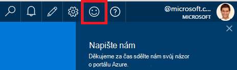
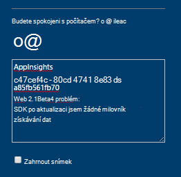
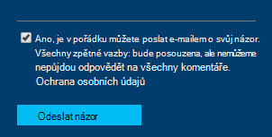

<properties 
    pageTitle="Získání technické podpory od týmu vývoje aplikace přehledy | Microsoft Azure" 
    description="Když budete mít případ, který vyžaduje speciální podporu od týmu vývoje přehledy aplikace, jde jak můžete odeslat podrobnosti k získání podpory." 
    services="application-insights" 
    documentationCenter=""
    authors="alexbulankou" 
    manager="douge"/>
 
<tags 
    ms.service="application-insights" 
    ms.workload="tbd" 
    ms.tgt_pltfrm="ibiza" 
    ms.devlang="na" 
    ms.topic="article" 
    ms.date="06/01/2016" 
    ms.author="albulank"/>
    
# <a name="how-to-get-technical-support-from-application-insights-development-team"></a>Získání technické podpory od týmu vývoje přehledy aplikace
    
Když budete mít technický problém s [Přehledy aplikace Visual Studio](app-insights-overview.md), máte tyto možnosti pro získání nápovědy:

## <a name="1-check-the-documents"></a>1. Kontrola dokumentů

* Chybějící data? Kontrola: [odběr](app-insights-sampling.md) [kvót a omezení](app-insights-pricing.md).
* Řešení potíží: [ASP.NET](app-insights-troubleshoot-faq.md) | [Java](app-insights-java-troubleshoot.md)

## <a name="2-search-the-forums"></a>2. na fórech hledání

* [Fórum MSDN](https://social.msdn.microsoft.com/Forums/vstudio/home?forum=ApplicationInsights)
* [StackOverflow](http://stackoverflow.com/questions/tagged/ms-application-insights)

## <a name="3-azure-support-plan"></a>3. plán podpory azure?

Existují situace, kde se mají vývojářům prošetřit konkrétní písmena. 

Pokud máte [podpory plánu s Microsoft Azure](https://azure.microsoft.com/support/plans/) můžete [Otevřít požadavek podpory můžete](https://portal.azure.com/?#blade/Microsoft_Azure_Support/HelpAndSupportBlade).

## <a name="4-contact-the-application-insights-team"></a>4. Obraťte se na tým přehledy aplikace

Pokud nemáte plán podpory, náš tým vývoj je spokojení nabízet nejlepší plánování řízené úsilí podpory zákazníkům přehledy aplikace, jako jsme Příprava milníku všeobecně dostupná. Budeme se úvodní informace o **nových možností podpory**: lze popsat váš případ námi o odeslání názoru formuláře na Azure portálu a vývojář na kontaktu týmu aplikace přehledy zpět na váš problém vyřešit.


1. Na [portálu přehledy aplikace](https://portal.azure.com)klikněte na usměvavý obličej v pravém horním rohu:  

       

2. Do pole komentáře zkontrolujte, jestli chcete-li zadat **AppInsights** jako první řádek a potom obsahují následující informace:   

    ```

    AppInsights   
    ikey: <instrumentation key>   
    sdk: <SDK that you are using, including name and version>  
    issue: <please describe the problem you are having>

    ```   

       

3. Zkontrolujte "Ano, je ok k e-mailu je". 

      

Technik týmu aplikace přehledy bude kontaktovat brzy bude k dispozici. Jak společnost Microsoft tato služba poskytuje na nejlepší základna plánování řízené úsilí, žádné formální SLA může být zadán v tomto okamžiku.


