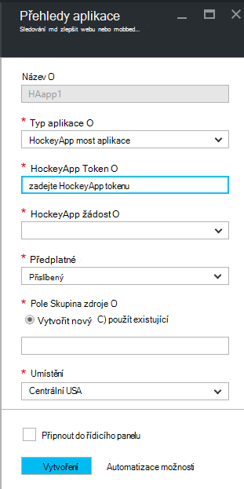

<properties 
    pageTitle="Zkoumání dat v aplikaci přehledy HockeyApp | Microsoft Azure" 
    description="Analýza využití a výkon Azure aplikace s přehledy aplikace." 
    services="application-insights" 
    documentationCenter="windows"
    authors="alancameronwills" 
    manager="douge"/>

<tags 
    ms.service="application-insights" 
    ms.workload="tbd" 
    ms.tgt_pltfrm="ibiza" 
    ms.devlang="na" 
    ms.topic="article" 
    ms.date="08/25/2016" 
    ms.author="awills"/>

#  Prozkoumání dat HockeyApp v aplikaci přehledy

[HockeyApp](https://azure.microsoft.com/services/hockeyapp/) je platformu doporučené pro sledování živou stolní počítače a mobilní aplikace. Z HockeyApp můžete odeslat vlastní a sledování telemetrie ke sledování použití a pomáhat v diagnostice (kromě získávání dat pád). Tomto proudu telemetrie můžete zjistit pomocí výkonných [analýz](app-insights-analytics.md) funkce [Přehledy aplikace Visual Studio](app-insights-overview.md). Kromě toho můžete [Exportovat vlastní a sledování telemetrie](app-insights-export-telemetry.md). Aby tyto funkce nastavíte most přenášet data HockeyApp interpretace aplikace.

## Aplikaci HockeyApp mostu

Aplikace mostu HockeyApp je základní funkce, která umožňuje přístup k datům HockeyApp v aplikaci přehledy prostřednictvím analýz a nepřetržitý exportovat funkce. Všechna data shromážděná HockeyApp po vytvoření aplikaci mostu HockeyApp budou přístupné z těchto funkcí. Zjistěme, jak nastavit některé z těchto mostu aplikací.

V HockeyApp otevřete nastavení účtu, [Rozhraní API tokeny](https://rink.hockeyapp.net/manage/auth_tokens). Vytvoření nového tokenu nebo znovu použít existující úrovně. Minimální práva povinné jsou "jen pro čtení". Přepnout kopii rozhraní API tokenu.

Otevřete portál Microsoft Azure a [Vytvořit přehledy aplikace zdroje](app-insights-create-new-resource.md). Nastavení aplikace typu aplikacím"HockeyApp mostu":

Není potřeba nastavit název - automaticky nastaví ho na dotazy používající HockeyApp název.

Pole mostu HockeyApp se zobrazí. 

Zadejte token HockeyApp poznamenat dříve. Tato akce vyplní v rozevírací nabídce "HockeyApp aplikace" se všemi HockeyApp aplikacemi. Vyberte tu, kterou chcete použít a dokončete zbývající pole. 

Otevřete nový zdroj. 

Všimněte si, že data, která bude při spuštění toku.

Je to! Veškerá data shromážděná v aplikaci vybavit přístroji HockeyApp od této chvíle je nyní také k dispozici ve funkcích technologie pro analýzu a nepřetržitý exportovat přehledy aplikace.

Stručně pojďme si rozebrat, každý z těchto funkcí teď k dispozici.

## Technologie pro analýzu

Technologie pro analýzu je výkonný nástroj pro ad-hoc dotazování dat, umožňuje Diagnostika a analyzovat vaší telemetrie a rychle zjistit příčin a vzorce.

* [Další informace o analýzy](app-insights-analytics-tour.md)
* [Úvod videa](https://channel9.msdn.com/events/Build/2016/T666)
* [Pokročilých konceptů videa](https://channel9.msdn.com/Events/Build/2016/P591)

## Nepřetržitý exportu

Nepřetržitý Export umožňuje exportujte data do kontejneru úložišti objektů Blob Azure. Toto je velmi užitečné, pokud je potřeba uchovávat data po dobu delší než doba uchovávání informací, které aktuálně nabízíme přehledy aplikace. Můžete uchovávat data v úložišti objektů blob, zpracuje ji do SQL databáze nebo upřednostňovaný dat skladování řešení.

[Další informace o nepřetržitý Export](app-insights-export-telemetry.md)

## Další kroky

* [Použití technologie pro analýzu dat.](app-insights-analytics-tour.md)

