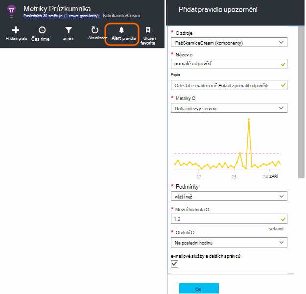
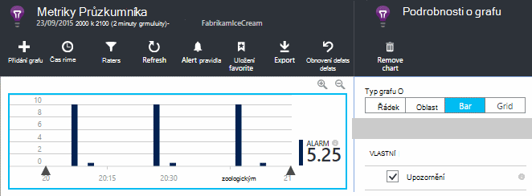
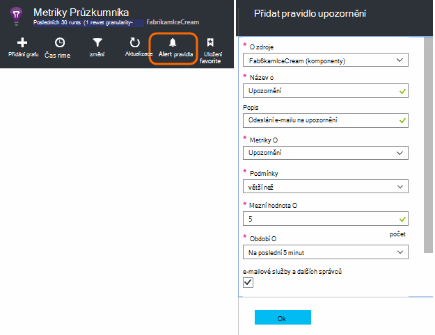
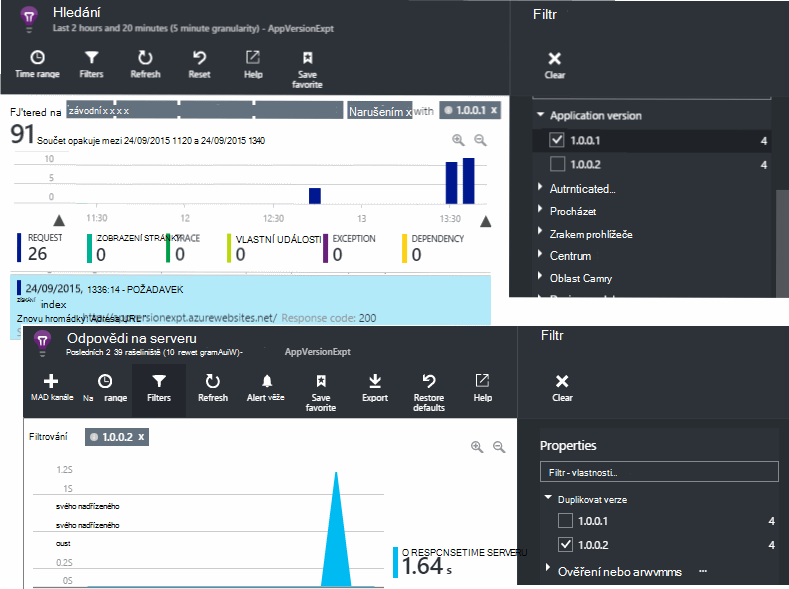
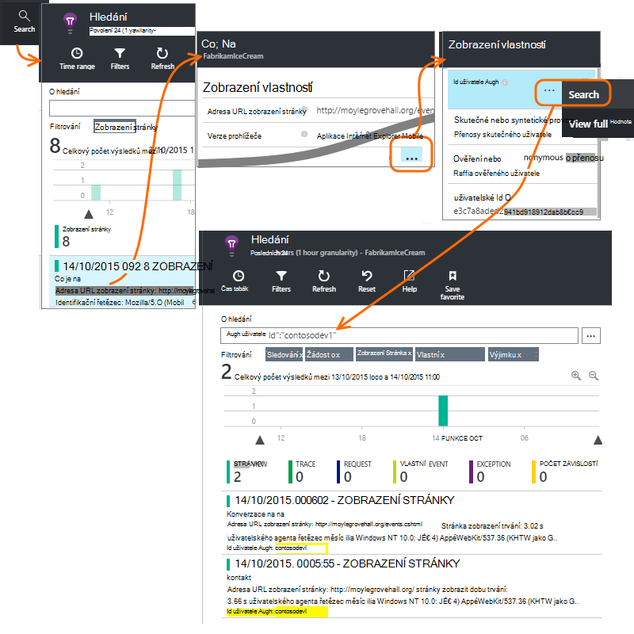
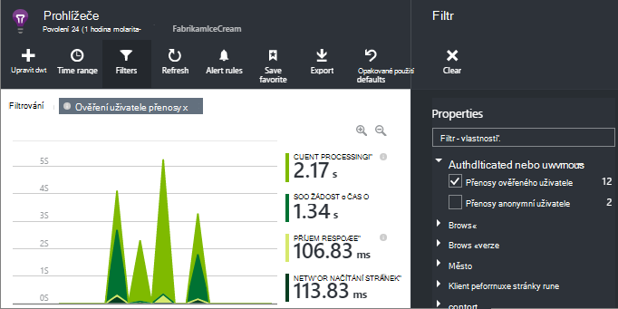
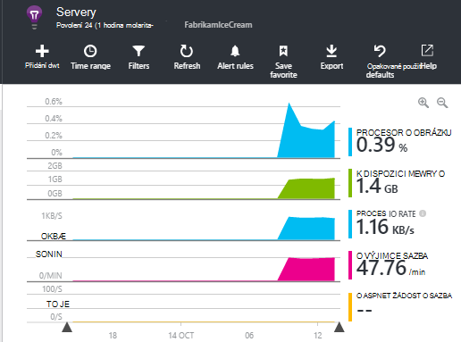

<properties 
    pageTitle="Jak lze v aplikaci přehledy | Microsoft Azure" 
    description="Nejčastější dotazy týkající se v aplikaci přehledy." 
    services="application-insights" 
    documentationCenter=""
    authors="alancameronwills" 
    manager="douge"/>

<tags 
    ms.service="application-insights" 
    ms.workload="tbd" 
    ms.tgt_pltfrm="ibiza" 
    ms.devlang="na" 
    ms.topic="article" 
    ms.date="02/05/2016" 
    ms.author="awills"/>

# <a name="how-do-i--in-application-insights"></a>Jak můžu... v aplikaci přehledy?

## <a name="get-an-email-when-"></a>-Mailu Pokud...

### <a name="email-if-my-site-goes-down"></a>E-mailu Pokud havaruje osobního webu

Nastavte [dostupnost web otestovat](app-insights-monitor-web-app-availability.md).

### <a name="email-if-my-site-is-overloaded"></a>E-mailu Pokud přetížený osobního webu

Nastavte [upozornění](app-insights-alerts.md) u **Doba odezvy serveru**. Mezní hodnoty mezi 1 a 2 sekund budou pracovat.



Aplikace mohou také viditelně namáhání vrácením selhání kódy. Nastavení upozornění na **žádosti o se nezdařila**.

Pokud chcete nastavení upozornění na **serveru výjimky**, pravděpodobně provedení [některé další nastavení](app-insights-asp-net-exceptions.md) najdete v části data.

### <a name="email-on-exceptions"></a>E-mail na výjimky

1. [Nastavení výjimky sledování](app-insights-asp-net-exceptions.md)
2. [Nastavení upozornění](app-insights-alerts.md) na míru počet výjimek


### <a name="email-on-an-event-in-my-app"></a>E-mail na událost v mé aplikaci

Předpokládejme, že byste chtěli přijímat e-mailu, když dojde k zvláštní události. Aplikace přehledy nenabízí možnost tuto funkci přímo, ale můžete [nastavit zaslal upozornění, když metriky ve výkresu protínají prahovou hodnotu](app-insights-alerts.md). 

Upozornění můžete však není vlastní události nastavit [vlastní metriky](app-insights-api-custom-events-metrics.md#track-metric). Napište nějaký kód zvětšíte metriky dojde k události:

    telemetry.TrackMetric("Alarm", 10);

nebo:

    var measurements = new Dictionary<string,double>();
    measurements ["Alarm"] = 10;
    telemetry.TrackEvent("status", null, measurements);

Vzhledem k tomu, že upozornění oba státy, budete muset nastavit nižší hodnoty až zvažte upozornění uzavřená:

    telemetry.TrackMetric("Alarm", 0.5);

Vytvoření grafu v [metrických explorer](app-insights-metrics-explorer.md) a zobrazte složku svého upozornění:



Nyní nastavení upozornění aktivováno při metriky nad střední hodnotu krátkodobě:




Nastavení doby průměrování minimální. 

Jak při přechodu míru nad a pod prahové hodnoty dostanete e-mailů.

Některé aspekty k zamyšlení:

* Upozornění obsahuje dva stavy ("upozornění" a "pořádku"). Stav je vyhodnocen pouze po přijetí metriky.
* E-mailu se pošle pouze v případě změny stavu. Toto je proč budete muset poslat obě vysoké a metriky hodnotu Nízká. 
* Pokud chcete zjistit upozornění, průměr považuje přijaté hodnot za předchozí období. V takovém pokaždé, když přijetí metriky tak, aby e-mailů odesílat častěji období, které nastavíte.
* Protože na "upozornění" i "pořádku" na kterou se odesílají e-mailů, můžete znovu mysli jednorázové událost jako podmínky dvě stavu. Třeba místo "úlohy dokončen" událost nastavit jako, máte podmínku "projektu probíhá" kde získat e-mailů na začátku a na konci projektu.

### <a name="set-up-alerts-automatically"></a>Nastavit upozornění automaticky

[Použití Powershellu ke vytvořit nové upozornění](app-insights-alerts.md#set-alerts-by-using-powershell)

## <a name="use-powershell-to-manage-application-insights"></a>Použití Powershellu ke správě přehledy aplikace

* [Vytvoření nového zdroje](app-insights-powershell-script-create-resource.md)
* [Vytváření nových oznámení](app-insights-alerts.md#set-alerts-by-using-powershell)

## <a name="application-versions-and-stamps"></a>Verze aplikace a razítka

### <a name="separate-the-results-from-dev-test-and-prod"></a>Oddělení výsledky od vývojáře, testování a výrobní

* Různé environmnents nastavit jiné ikeys
* Pro různé razítka (odchylka, otestovat, spotřeba) označení telemetrie s jinou nemovitostí s hodnotou

[Víc se uč](app-insights-separate-resources.md)
 

### <a name="filter-on-build-number"></a>Filtrovat podle čísla Tvůrce dotazů

Při publikování novou verzi aplikace je vhodné mít možnost oddělit telemetrie z různých sestavení.

Vlastnost verze aplikace můžete nastavit tak, že můžete k filtrování výsledků [hledání](app-insights-diagnostic-search.md) a [metrických Průzkumníka](app-insights-metrics-explorer.md) . 




Existuje několik různých metod nastavení vlastnosti verze aplikace.

* Přímo nastavte:

    `telemetryClient.Context.Component.Version = typeof(MyProject.MyClass).Assembly.GetName().Version;`

* Zalomení řádku v [inicializačním telemetrie](app-insights-api-custom-events-metrics.md#telemetry-initializers) zajistit, že jsou všechny instance TelemetryClient konzistentní nastavená.

* [ASP.NET] Nastavení verze `BuildInfo.config`. Webový modul vyzvedne verze stránky přímo ze uzel BuildLabel. Zahrnout tento soubor v projektu a nezapomeňte nastavit vlastnost kopírovat vždy v Průzkumníku řešení.

    ```XML

    <?xml version="1.0" encoding="utf-8"?>
    <DeploymentEvent xmlns:xsi="http://www.w3.org/2001/XMLSchema-instance" xmlns:xsd="http://www.w3.org/2001/XMLSchema" xmlns="http://schemas.microsoft.com/VisualStudio/DeploymentEvent/2013/06">
      <ProjectName>AppVersionExpt</ProjectName>
      <Build type="MSBuild">
        <MSBuild>
          <BuildLabel kind="label">1.0.0.2</BuildLabel>
        </MSBuild>
      </Build>
    </DeploymentEvent>

    ```
* [ASP.NET] V MSBuild generovat BuildInfo.config automaticky. K tomuto účelu přidáte několik řádků .csproj soubor:

    ```XML

    <PropertyGroup>
      <GenerateBuildInfoConfigFile>true</GenerateBuildInfoConfigFile>    <IncludeServerNameInBuildInfo>true</IncludeServerNameInBuildInfo>
    </PropertyGroup> 
    ```

    Tím se vytvoří soubor s názvem *yourProjectName*. BuildInfo.config. Procesu publikování soubor přejmenuje BuildInfo.config.

    Sestavení popisek obsahuje zástupný symbol (AutoGen_...) při vytváření aplikace Visual Studio. Ale pokud vytvořené pomocí MSBuild, je vyplněné na správné číslo verze.

    Umožňuje MSBuild generovat čísla verze nastavení verze jako `1.0.*` v AssemblyReference.cs

## <a name="monitor-backend-servers-and-desktop-apps"></a>Sledování back-end serverů a aplikace klasické pracovní plochy

[Použití modulu Windows Server SDK](app-insights-windows-desktop.md).


## <a name="visualize-data"></a>Vizualizace dat

#### <a name="dashboard-with-metrics-from-multiple-apps"></a>Řídicí panel s metriky více aplikacích

* [Metriky Explorer](app-insights-metrics-explorer.md)přizpůsobení grafu a uložte do oblíbených položek. Připnutí na řídicím panelu Azure.


#### <a name="dashboard-with-data-from-other-sources-and-application-insights"></a>Řídicí panel s daty z jiných zdrojů a interpretaci aplikace

* [Export telemetrie k Power BI](app-insights-export-power-bi.md). 

Nebo

* Použití služby SharePoint jako řídicího panelu zobrazení dat ve webových částech Sharepointu. [Použití nepřetržitý exportu a analýzy toku k exportu do SQL](app-insights-code-sample-export-sql-stream-analytics.md).  Kontrola databáze pomocí PowerView a vytvořte webové části Sharepointu pro PowerView.


<a name="search-specific-users"></a>
### <a name="filter-out-anonymous-or-authenticated-users"></a>Odfiltrovat anonymní nebo ověřených uživatelů

Pokud vaši uživatelé přihlásit, můžete nastavit [ověření id uživatele](app-insights-api-custom-events-metrics.md#authenticated-users). (Ho není dojít automaticky.) 

Můžete provést následující akce:

* Hledání na konkrétní uživatelské ID



* Filtrování metriky anonymní nebo ověřený uživatelům



## <a name="modify-property-names-or-values"></a>Úprava vlastností názvy nebo hodnoty

Vytvoření [filtru](app-insights-api-filtering-sampling.md#filtering). Toto oprávnění umožňuje změnit nebo filtrovat telemetrie před odesláním z aplikace pro přehledy aplikace.

## <a name="list-specific-users-and-their-usage"></a>Seznam konkrétních uživatelů a jejich použití

Pokud chcete [Hledat konkrétní uživatele](#search-specific-users), můžete nastavit [ověření id uživatele](app-insights-api-custom-events-metrics.md#authenticated-users).

Pokud chcete seznam uživatelů s daty například jaké stránky se podívejte nebo jak často se přihlásí, máte dvě možnosti:

* [Nastavení ověření id uživatele](app-insights-api-custom-events-metrics.md#authenticated-users), [Exportovat do databáze](app-insights-code-sample-export-sql-stream-analytics.md) a použití vhodného nástroje Analýza dat uživatele tam.
* Pokud máte jenom malým počtem uživatelů, pošlete vlastní události nebo metriky pomocí požadovaná data jako název metrických hodnotu nebo události a nastavení uživatelské id jako vlastnosti. Analyzovat zobrazení stránky, nahraďte standardní trackPageView volání JavaScript. Analyzovat serverovou telemetrie, umožňuje telemetrie inicializační přidat id uživatele pro všechny telemetrie serveru. Můžete filtrovat a segmentu metriky a vyhledávání na id uživatele.


## <a name="reduce-traffic-from-my-app-to-application-insights"></a>Snížení přenosů z aplikace Moje interpretace aplikace

* V [ApplicationInsights.config](app-insights-configuration-with-applicationinsights-config.md)zakážete všechny modulů kontroly, které už nepotřebujete, například výkonu čítač kolekcí.
* Použití [odběru a filtrování](app-insights-api-filtering-sampling.md) na SDK.
* Na webových stránkách omezte počet Ajax hovory vykázaného za každé stránky zobrazit. Skript úryvek po `instrumentationKey:...` , vložení: `,maxAjaxCallsPerView:3` (nebo vhodné čísla).
* Pokud používáte [TrackMetric](app-insights-api-custom-events-metrics.md#track-metric), výpočtu agregace listy metrických hodnot před odesláním výsledek. Přetížení TrackMetric(), kde můžete, který neexistuje.


Další informace o [ceny a kvóty](app-insights-pricing.md).

## <a name="disable-telemetry"></a>Zakázání telemetrie

**Dynamicky zastavit a spustit** kolekci a předávání telemetrie ze serveru:

```

    using  Microsoft.ApplicationInsights.Extensibility;

    TelemetryConfiguration.Active.DisableTelemetry = true;
```


**Zakázání vybrané standardní kolekcí** – například výkonnosti, požadavků HTTP závislosti - odstranit nebo poznámky, příslušných řádků v [ApplicationInsights.config](app-insights-api-custom-events-metrics.md). Může to uděláte, například pokud chcete odeslat TrackRequest data.


## <a name="view-system-performance-counters"></a>Zobrazení systémové výkonnosti

Mezi metriky, které můžete zobrazit v Průzkumníku metriky jsou systému výkonnosti. Existuje předdefinované zásuvné s názvem **serverů** , která se zobrazí několik z nich.



### <a name="if-you-see-no-performance-counter-data"></a>Pokud se zobrazí bez data čítačů

* **Serveru IIS** na vlastní počítač nebo na virtuálního počítače. [Instalace sledování stavu](app-insights-monitor-performance-live-website-now.md). 
* **Webu azure** – nepodporujeme výkonnosti ještě. Existuje několik metriky získané jako standardní součástí webu Azure ovládací panely.
* **UNIX server** - [instalace collectd](app-insights-java-collectd.md)

### <a name="to-display-more-performance-counters"></a>Chcete-li zobrazit další výkonnosti

* Nejdřív [přidejte nový graf](app-insights-metrics-explorer.md) a zjistěte, jestli čítač v základní nastaven, nabízíme.
* V opačném případě [Přidání proti sadu shromážděná modulu čítače výkonu](app-insights-performance-counters.md).


