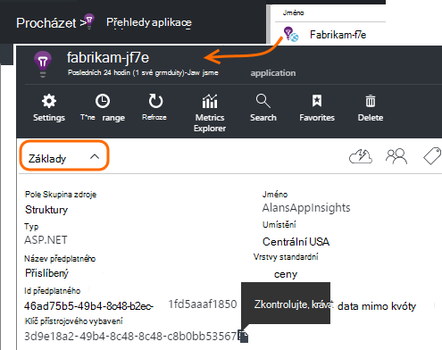
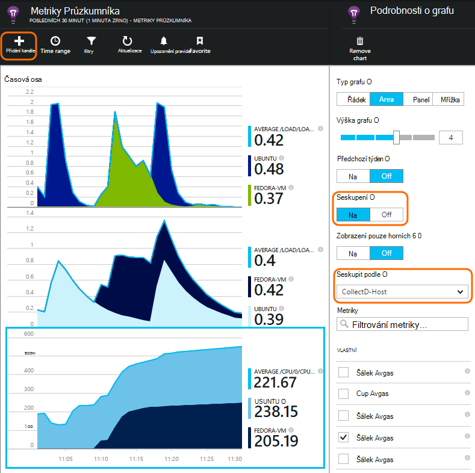

<properties 
    pageTitle="collectd: výkon stat jazyka Java na Unix v aplikaci přehledy" 
    description="Rozšířené sledování webu Java s CollectD modul plug-in pro přehledy aplikace" 
    services="application-insights" 
    documentationCenter="java"
    authors="alancameronwills" 
    manager="douge"/>

<tags 
    ms.service="application-insights" 
    ms.workload="tbd" 
    ms.tgt_pltfrm="ibiza" 
    ms.devlang="na" 
    ms.topic="article" 
    ms.date="08/24/2016" 
    ms.author="awills"/>
 
# <a name="collectd-unix-performance-metrics-in-application-insights"></a>collectd: Unix měřítka v aplikaci přehledy

*Přehledy aplikace je v náhledu.*

Můžete prozkoumat Unix systém měřítka v [Aplikaci přehledy](app-insights-overview.md), nainstalujte [collectd](http://collectd.org/)spolu s jeho aplikace přehledy modulu plug-in. Toto řešení otevřít zdroj shromažďuje různé systému a sítě statistiky.

Obvykle, které budete používat collectd Pokud už máte [vybavit přístroji Java webové služby pomocí aplikace přehledy][java]. Máte víc dat týkající se zvýšit výkon vaše aplikace nebo diagnostikovat potíže. 


## <a name="get-your-instrumentation-key"></a>Získat kód přístrojového vybavení

Na [portálu Microsoft Azure](https://portal.azure.com)otevřete [Aplikaci přehledy](app-insights-overview.md) zdroj místo, kam chcete data vložit. (Nebo [Vytvoření nového prostředku](app-insights-create-new-resource.md).)

Přepnout kopii klávesu přístrojového vybavení, který identifikuje zdroje.




## <a name="install-collectd-and-the-plug-in"></a>Instalace collectd a modulu plug-in

V počítačích serverů Unix:

1. Instalace [collectd](http://collectd.org/) verze 5.4.0 nebo novější.
2. Stáhněte si [aplikaci přehledy collectd zapisovací modul plug-in](https://aka.ms/aijavasdk). Poznámka: číslo verze.
3. Kopírování modulu plug-in JAR do `/usr/share/collectd/java`.
3. Úprava `/etc/collectd/collectd.conf`:
 * Zkontrolujte, zda že je povoleno, které [modul plug-in Java](https://collectd.org/wiki/index.php/Plugin:Java) .
 * Aktualizujte JVMArg pro java.class.path zahrnout následující SKLENICE. Aktualizace číslo verze podle tu, kterou jste si stáhli:
  * `/usr/share/collectd/java/applicationinsights-collectd-1.0.5.jar`
 * Přidáte tento fragment pomocí klávesy přístrojového vybavení z vaší zdroje:

```

     LoadPlugin "com.microsoft.applicationinsights.collectd.ApplicationInsightsWriter"
     <Plugin ApplicationInsightsWriter>
        InstrumentationKey "Your key"
     </Plugin>
```

Tady je součástí ukázkový soubor konfigurace:

    ...
    # collectd plugins
    LoadPlugin cpu
    LoadPlugin disk
    LoadPlugin load
    ...

    # Enable Java Plugin
    LoadPlugin "java"

    # Configure Java Plugin
    <Plugin "java">
      JVMArg "-verbose:jni"
      JVMArg "-Djava.class.path=/usr/share/collectd/java/applicationinsights-collectd-1.0.5.jar:/usr/share/collectd/java/collectd-api.jar"

      # Enabling Application Insights plugin
      LoadPlugin "com.microsoft.applicationinsights.collectd.ApplicationInsightsWriter"
                
      # Configuring Application Insights plugin
      <Plugin ApplicationInsightsWriter>
        InstrumentationKey "12345678-1234-1234-1234-123456781234"
      </Plugin>

      # Other plugin configurations ...
      ...
    </Plugin>
.   ...

Konfigurovat další [moduly plug-in collectd](https://collectd.org/wiki/index.php/Table_of_Plugins), které můžete shromažďovat různé data z různých zdrojů.

Restartujte collectd podle jeho [ručně](https://collectd.org/wiki/index.php/First_steps).

## <a name="view-the-data-in-application-insights"></a>Zobrazení dat v aplikaci přehledy

V aplikaci přehledy zdroj, otevřete [metriky Explorer a přidávat grafy][metrics], výběr metriky hledáte z vlastní kategorie.



Ve výchozím nastavení jsou metriky agregované ve všech počítačích hostitele ze kdy byly shromážděny metriky. Metriky za hostitele zásuvné podrobnosti grafu zobrazíte zapněte seskupení a klikněte na zařadit do skupiny hostitelem CollectD.


## <a name="to-exclude-upload-of-specific-statistics"></a>Aby se vyloučila nahrát konkrétní statistiky

Ve výchozím nastavení modulu plug-in aplikace přehledy odešle všechna data shromážděná povolené collectd číst moduly plug-in. 

Chcete-li vyloučit data z konkrétní moduly plug-in nebo zdrojů dat.:

* Úprava konfiguračního souboru. 
* V `<Plugin ApplicationInsightsWriter>`, přidejte směrnice řádky takto:

Směrnice | Efekt
---|---
`Exclude disk` | Vyloučení všechna data shromážděná `disk` modulu plug-in
`Exclude disk:read,write` | Vyloučit zdroje s názvem `read` a `write` z `disk` modulu plug-in.

Zvláštní směrnice s nový řádek.


## <a name="problems"></a>Máte problémy?

*Proč nevidím dat na portálu*

* Otevření [hledání] [ diagnostic] zobrazíte, pokud na příchod nezpracovanými události. Někdy se trvat déle, se zobrazí v Průzkumníku metriky.
* Je potřeba [Nastavit výjimky brány firewall pro odchozí data](app-insights-ip-addresses.md)
* Povolte trasování v modulu plug-in aplikace přehledy. Přidejte tento řádek v rámci `<Plugin ApplicationInsightsWriter>`:
 *  `SDKLogger true`
* Otevřete terminál a začněte collectd v režimu s komentářem, zobrazíte všech problémů, ke které je hlášení:
 * `sudo collectd -f`


<!--Link references-->

[api]: app-insights-api-custom-events-metrics.md
[apiexceptions]: app-insights-api-custom-events-metrics.md#track-exception
[availability]: app-insights-monitor-web-app-availability.md
[diagnostic]: app-insights-diagnostic-search.md
[eclipse]: app-insights-java-eclipse.md
[java]: app-insights-java-get-started.md
[javalogs]: app-insights-java-trace-logs.md
[metrics]: app-insights-metrics-explorer.md
[usage]: app-insights-web-track-usage.md

 
