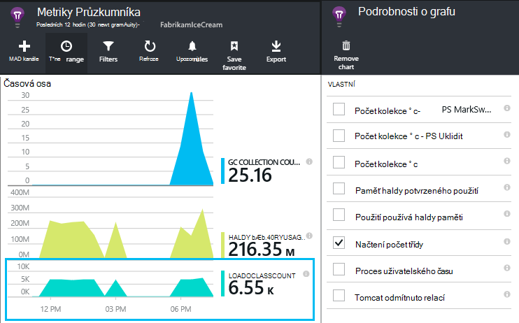

<properties 
    pageTitle="Začínáme s aplikací interpretaci s Java v zatmění" 
    description="Pomocí modulu plug-in zatmění přidáte výkonu a využití sledování na váš web Java s přehledy aplikace" 
    services="application-insights" 
    documentationCenter="java"
    authors="alancameronwills" 
    manager="douge"/>

<tags 
    ms.service="application-insights" 
    ms.workload="tbd" 
    ms.tgt_pltfrm="ibiza" 
    ms.devlang="na" 
    ms.topic="article" 
    ms.date="03/02/2016" 
    ms.author="awills"/>
 
# Začínáme s aplikací interpretaci s Java v zatmění

V aplikaci přehledy SDK odešle telemetrie Java webové aplikace tak, aby se můžete analýzu použití. Modul plug-in pro přehledy aplikace zatmění automaticky nainstaluje SDK v projektu, takže využijte telemetrie pole a rozhraní API, které můžete použít k zápisu vlastní telemetrie.   

## Zjistit předpoklady pro

Aktuálně Plug-inu prací pro Maven webových a projekty dynamické v zatmění. ([Přidání přehledy aplikace na jiné typy jazyka Java projektu][java].)

Budete potřebovat:

* Oracle JRE 1,6 nebo novější
* Předplatné [Microsoft Azure](https://azure.microsoft.com/). (Může spustíte [bezplatnou zkušební verzi](https://azure.microsoft.com/pricing/free-trial/).)
* [Zatmění integrovaném vývojovém prostředí pro vývojáře í Java](http://www.eclipse.org/downloads/)džínovinu nebo novější.
* Windows 7 nebo novější, nebo Windows Server 2008 nebo novějším

## Instalace SDK na zatmění (jednou)

Stačí udělat jednou jednotlivé počítače. Tento krok nainstaluje sada nástrojů, které můžete přidat SDK do každého dynamické Web projektu.

1. V zatmění klikněte na Nápověda, instalovat Software nové.

    

2. V SDK probíhá http://dl.windowsazure.com/eclipse, klikněte v části Azure nástrojů. 
3. Zrušte zaškrtnutí políčka **kontaktovat všechny weby aktualizace...**

    

Provedením zbývajících kroků pro jednotlivé projekty Java.

## Vytvoření zdrojů aplikace přehledy v Azure

1. Přihlaste se k [portálu Azure](https://portal.azure.com).
2. Vytvoření nového prostředku přehledy aplikace.  

      
3. Nastavení aplikace typu Java webové aplikace.  

      
4. Najdete klíč přístrojového vybavení nového prostředku. Musíte to krátce vložte do kódu projektu.  

      

## Přidání aplikace přehledy do projektu

1. Přidání aplikace přehledy z místní nabídky Java web projektu.

    

2. Vložte klávesu přístrojového vybavení, který jste dostali z portálu Microsoft Azure.

    

Klíč odeslaný spolu s jednotlivé položky telemetrie a říká přehledy aplikace zobrazíte v zdroj.

## Spusťte aplikaci a najdete v článku metriky

Spusťte aplikaci.

Vraťte se do aplikace přehledy zdroje v Microsoft Azure.

Nastavit informace HTTP požaduje data se zobrazí na zásuvné Přehled. (Pokud tam není, počkejte několik sekund, než a kliknutím na aktualizovat.)

 

Proklikejte grafu zobrazíte podrobnější metriky. 

[Další informace o metriky.][metrics]

 

A po zobrazení vlastností žádost, uvidíte události telemetrie přidružené například žádosti o schůzku a výjimky.
 

## Telemetrie straně klienta

Rychlý úvod zásuvné klikněte na získat kód ke sledování webové stránky: 

Vložení kódu vedoucí soubory ve formátu HTML.

#### Zobrazit údaje o straně klienta

Otevřete aktualizované webových stránek a jejich použití. Počkejte chvíli až dva, a pak vrátit interpretace aplikace a otevřete zásuvné použití. (Z zásuvné přehled přejděte dolů a klikněte na využití.)

Stránka metriky zobrazení uživatelů a relace se zobrazí na zásuvné použití:

[Další informace o nastavení klienta telemetrie.][usage]

## Publikování aplikace

Nyní publikujte aplikace na server pomocí upozorní ty a podívejte se na video telemetrie objeví na portálu.

* Zkontrolujte, jestli že brány firewall umožňuje aplikace telemetrie odešlete tyto porty:

 * DC.Services.VisualStudio.com:443
 * DC.Services.VisualStudio.com:80
 * F5.Services.VisualStudio.com:443
 * F5.Services.VisualStudio.com:80

* Na serverech Windows nainstalujte:

 * [Microsoft Visual C++ Redistributable](http://www.microsoft.com/download/details.aspx?id=40784)

    (Umožňuje výkonnosti.)

## Výjimky a žádost o selhání

Neošetřené výjimky se automaticky shromažďují:

Sběr dat na dalších výjimek, máte dvě možnosti:

* [Vložení volání TrackException v kódu](app-insights-api-custom-events-metrics.md#track-exception). 
* [Instalace agenta Java na server](app-insights-java-agent.md). Určení metody, kterou chcete sledovat.

## Sledování volání metod a externí závislosti

[Instalace agenta Java](app-insights-java-agent.md) přihlásit zadané vnitřní metody a volání přes JDBC, s daty časování.

## Výkonnosti

Na zásuvné vaší přehled přejděte dolů a klikněte na dlaždici **servery** . Zobrazí se oblasti výkonnosti.

### Přizpůsobení kolekce èítaèù výkonu

Jak zakázat kolekce ze standardní sady výkonnosti, přidáte následující kód uzlu kořenové ApplicationInsights.xml souboru:

    <PerformanceCounters>
       <UseBuiltIn>False</UseBuiltIn>
    </PerformanceCounters>

### Shromáždit další výkonnosti

Můžete zadat další výkonnosti shromažďované.

#### JMX čítače (zveřejněným tak, že virtuálního počítače Java)

    <PerformanceCounters>
      <Jmx>
        <Add objectName="java.lang:type=ClassLoading" attribute="TotalLoadedClassCount" displayName="Loaded Class Count"/>
        <Add objectName="java.lang:type=Memory" attribute="HeapMemoryUsage.used" displayName="Heap Memory Usage-used" type="composite"/>
      </Jmx>
    </PerformanceCounters>

*   `displayName`– Název zobrazený v portálu přehledy aplikace.
*   `objectName`– JMX název objektu.
*   `attribute`– Atribut název objektu JMX vzdáleně
*   `type`(volitelné) – typ JMX objektu atributu:
 *  Výchozí: jednoduché typu int ATP dlouhé.
 *  `composite`: dat čítače výkonu je ve formátu "Attribute.Data"
 *  `tabular`: dat čítače výkonu je ve formátu tabulky

#### Windows výkonnosti

Každý [Windows čítače](https://msdn.microsoft.com/library/windows/desktop/aa373083.aspx) patří do skupiny kategorie (stejným způsobem, že pole je členem třídy). Kategorie můžou být globální, nebo můžete číslované nebo s názvem instance.

    <PerformanceCounters>
      <Windows>
        <Add displayName="Process User Time" categoryName="Process" counterName="%User Time" instanceName="__SELF__" />
        <Add displayName="Bytes Printed per Second" categoryName="Print Queue" counterName="Bytes Printed/sec" instanceName="Fax" />
      </Windows>
    </PerformanceCounters>

*   displayName – název zobrazený v portálu přehledy aplikace.
*   categoryName – ke kterému je přidružen čítač výkonu kategorie čítače výkonu (výkonu objekt).
*   název_čítače – název tohoto čítače.
*   Název_instance – název instance výkonu čítač kategorii nebo prázdný řetězec (""), pokud kategorii obsahuje jedna instance. Pokud NázevKategorie je proces a čítače chcete shromažďovat od aktuálního JVM na, která běží aplikace, zadejte `"__SELF__"`.

Vaše výkonnosti jsou zobrazeny jako vlastní metriky v [Průzkumníku metriky][metrics].

### UNIX výkonnosti

* [Instalace collectd s modul plug-in aplikace přehledy](app-insights-java-collectd.md) získat širokou škálu systému a sítě data.

## Dostupnost webových testů

Aplikace přehledy můžete otestovat váš web v pravidelných intervalech a zkontrolujte, zda je to dobře reagovat. [Nastavit][availability], zobrazení pomocí posuvníku dolů klikněte na dostupnost.

Dostanete grafy z doby odezvy společně s e-mailová oznámení havaruje webu.

[Další informace o dostupnosti webových testů.][availability] 

## Protokoly pro diagnostiku

Pokud používáte Logback nebo Log4J (verze 1.2 nebo verze 2.0) pro trasování, máte sledování protokolů automaticky odeslána interpretace aplikace, kde můžete prozkoumat a vyhledávat na nich.

[Další informace o protokoly pro diagnostiku][javalogs]

## Vlastní telemetrie 

Vložení několika řádků kódu ve webové aplikaci Java chcete zjistit, co dělají uživatelé s ním nebo lépe diagnostikovat potíže. 

Kód můžete vložit webovou stránku JavaScript a na straně serveru Java.

[Další informace o vlastních telemetrie][track]

## Další kroky

#### Zjištění a diagnostice problémů

* [Přidání webových klientů telemetrie] [ usage] získat výkonu telemetrie z webový klient.
* [Nastavení webových testů] [ availability] zajistit aplikace zůstane živou a citlivé.
* [Hledání událostí a protokolování] [ diagnostic] lépe diagnostikovat potíže.
* [Zachyťte trasování Log4J nebo Logback][javalogs]

#### Sledovat použití

* [Přidání webových klientů telemetrie] [ usage] zobrazení stránky monitor a metriky základní uživatele.
* [Sledování vlastní události a metriky] [ track] informace o použití aplikace, jak na klienta a serveru.

<!--Link references-->

[availability]: app-insights-monitor-web-app-availability.md
[diagnostic]: app-insights-diagnostic-search.md
[java]: app-insights-java-get-started.md
[javalogs]: app-insights-java-trace-logs.md
[metrics]: app-insights-metrics-explorer.md
[track]: app-insights-api-custom-events-metrics.md
[usage]: app-insights-web-track-usage.md

 