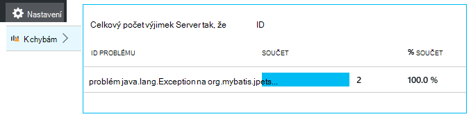

<properties
    pageTitle="Java webové aplikace technologie pro analýzu s aplikací přehledy | Microsoft Azure"
    description="Sledovat výkon a použití te000126961 webem Java s přehledy aplikace. "
    services="application-insights"
    documentationCenter="java"
    authors="alancameronwills"
    manager="douge"/>

<tags
    ms.service="application-insights"
    ms.workload="tbd"
    ms.tgt_pltfrm="ibiza"
    ms.devlang="na"
    ms.topic="get-started-article"
    ms.date="08/17/2016"
    ms.author="awills"/>

# Začínáme s aplikací přehledy v aplikaci project web Java

*Přehledy aplikace je v náhledu.*

[AZURE.INCLUDE [app-insights-selector-get-started](../../includes/app-insights-selector-get-started.md)]

[Přehledy aplikace](https://azure.microsoft.com/services/application-insights/) je služba extensible analýzy, která vám pomůže pochopit výkon a použití te000126961 živé aplikace. Používat ke [zjištění a diagnostice problémy s výkonem a výjimky](app-insights-detect-triage-diagnose.md)a [kódu] [ api] můžete sledovat, co uživatelé dělat s aplikací.

Přehledy aplikace podporuje Java aplikace spuštěna Linux, Unix nebo Windows.

Potřebuješ:

* Oracle JRE 1,6 nebo novější, nebo zulština JRE 1,6 nebo novější
* Předplatné [Microsoft Azure](https://azure.microsoft.com/). (Může spustíte [bezplatnou zkušební verzi](https://azure.microsoft.com/pricing/free-trial/).)

*Pokud jste ještě do webových aplikací, který už živou, může použijte alternativní postup přidání [SDK za běhu na webovém serveru](app-insights-java-live.md). Tento alternativní zabráněno opětovné vytvoření kód, ale není dostupná možnost kódu můžete sledovat činnosti uživatelů.*

## 1. získat klíč přístrojového vybavení přehledy aplikace

1. Přihlaste se k [portálu Microsoft Azure](https://portal.azure.com).
2. Vytvoření aplikace přehledy zdroje. Nastavení aplikace typu Java webové aplikace.

    
4. Najdete klíč přístrojového vybavení nového prostředku. Musíte tento klíč krátce vložte do kódu projektu.

    

## 2. Přidání SDK přehledy aplikace jazyka Java do projektu

*Vyberte příslušný způsob plánu projektu.*

#### Pokud používáte zatmění vytvořit projekt Maven nebo dynamických...

Použití [Aplikace přehledy SDK jazyka Java Plug-inu][eclipse].

#### Pokud používáte Maven...

Pokud projektu již nastavenou pro účely vytvoření Maven, sloučit následující kód pom.xml soubor.

Aktualizujte závislostí projektu získat binární stáhnout.

    <repositories>
       <repository>
          <id>central</id>
          <name>Central</name>
          <url>http://repo1.maven.org/maven2</url>
       </repository>
    </repositories>

    <dependencies>
      <dependency>
        <groupId>com.microsoft.azure</groupId>
        <artifactId>applicationinsights-web</artifactId>
        <!-- or applicationinsights-core for bare API -->
        <version>[1.0,)</version>
      </dependency>
    </dependencies>

* *Vytvořit nebo kontrolního chybových zpráv funkce ověření?* Zkuste použít konkrétní verzi, jako například: `<version>1.0.n</version>`. [Poznámky k verzi SDK](https://github.com/Microsoft/ApplicationInsights-Java#release-notes) nebo naše [Maven artefakty](http://search.maven.org/#search%7Cga%7C1%7Capplicationinsights)najdete nejnovější verzi.
* *Potřebujete aktualizovat na nové SDK?* Aktualizace závislostmi vašeho projektu.

#### Pokud používáte Gradle...

Pokud váš projekt už nastavenou pro účely vytvoření Gradle, sloučit následující kód build.gradle soubor.

Aktualizujte závislostí projektu získat binární stáhnout.

    repositories {
      mavenCentral()
    }

    dependencies {
      compile group: 'com.microsoft.azure', name: 'applicationinsights-web', version: '1.+'
      // or applicationinsights-core for bare API
    }

* Chyby *sestavení nebo kontrolního ověření? Zkuste použít konkrétní verzi, jako například:* `version:'1.0.n'`. *Nejnovější verze najdete v [SDK poznámky](https://github.com/Microsoft/ApplicationInsights-Java#release-notes).*
* *Chcete-li aktualizovat nové SDK*
 * Aktualizace závislostmi vašeho projektu.

#### V opačném případě …

Ruční přidání SDK:

1. Stáhněte si [aplikaci přehledy SDK jazyka Java](https://aka.ms/aijavasdk).
2. Extrahovat binární soubory ze souboru zip a přidejte do projektu.

### Otázky...

* *Co je vztah mezi `-core` a `-web` součástí poštovního?*

 * `applicationinsights-core`Umožňuje úplné rozhraní API. Potřebujete vždy této součásti.
 * `applicationinsights-web`Umožňuje metriky, která sleduje počty žádost HTTP a doby odezvy. Pokud nechcete, aby se tento telemetrie automaticky shromažďují můžete vynechat této součásti. Pokud například chcete napsat vlastní.

* *Chcete-li při publikování aktualizovat SDK změny*
 * Stáhněte si nejnovější [Aplikaci přehledy SDK jazyka Java](https://aka.ms/qqkaq6) a nahradit staré.
 * Změny jsou popsány v [SDK poznámky](https://github.com/Microsoft/ApplicationInsights-Java#release-notes).

## 3. přidat soubor XML aplikace přehledy

Přidání ApplicationInsights.xml ke složce zdrojů v projektu nebo zkontrolujte, jestli že je vrstva přidána cesty tříd nasazení projektu. Zkopírujte následující kód XML do ní.

Nahraďte klávesu přístrojového vybavení, který jste dostali z portálu Microsoft Azure.

    <?xml version="1.0" encoding="utf-8"?>
    <ApplicationInsights xmlns="http://schemas.microsoft.com/ApplicationInsights/2013/Settings" schemaVersion="2014-05-30">

      <!-- The key from the portal: -->

      <InstrumentationKey>** Your instrumentation key **</InstrumentationKey>

      <!-- HTTP request component (not required for bare API) -->

      <TelemetryModules>
        <Add type="com.microsoft.applicationinsights.web.extensibility.modules.WebRequestTrackingTelemetryModule"/>
        <Add type="com.microsoft.applicationinsights.web.extensibility.modules.WebSessionTrackingTelemetryModule"/>
        <Add type="com.microsoft.applicationinsights.web.extensibility.modules.WebUserTrackingTelemetryModule"/>
      </TelemetryModules>

      <!-- Events correlation (not required for bare API) -->
      <!-- These initializers add context data to each event -->

      <TelemetryInitializers>
        <Add   type="com.microsoft.applicationinsights.web.extensibility.initializers.WebOperationIdTelemetryInitializer"/>
        <Add type="com.microsoft.applicationinsights.web.extensibility.initializers.WebOperationNameTelemetryInitializer"/>
        <Add type="com.microsoft.applicationinsights.web.extensibility.initializers.WebSessionTelemetryInitializer"/>
        <Add type="com.microsoft.applicationinsights.web.extensibility.initializers.WebUserTelemetryInitializer"/>
        <Add type="com.microsoft.applicationinsights.web.extensibility.initializers.WebUserAgentTelemetryInitializer"/>

      </TelemetryInitializers>
    </ApplicationInsights>

* Klíč přístrojového vybavení odeslaný spolu s jednotlivé položky telemetrie a říká přehledy aplikace zobrazíte v zdroj.
* Žádost HTTP component je nepovinný krok. Automaticky pošle telemetrie o žádosti a doby odezvy k portálu.
* Srovnávací událostí je doplněk komponentu žádost HTTP. Identifikátor přiřadí každý požadavek přijatých serverem a přidá tento identifikátor jako vlastnost jednotlivé položky telemetrie jako vlastnost "Operation.Id". Umožňuje sladit telemetrie spojené se každý požadavek nastavení filtru v [diagnostiky hledání][diagnostic].
* Klíč aplikace přehledy projít dynamicky z portálu Microsoft Azure jako vlastnost systému (-DAPPLICATION_INSIGHTS_IKEY = your_ikey). Pokud je vlastnost definované, hledá proměnnou (APPLICATION_INSIGHTS_IKEY) v nastavení aplikace Azure. Pokud jsou oba vlastnosti Nedefinováno, výchozí InstrumentationKey se používá z ApplicationInsights.xml. Tato řada pomáhá spravovat různých InstrumentationKeys různých prostředích dynamicky.

### Alternativní způsoby, jak nastavit klíč přístrojového vybavení

Aplikace přehledy SDK vyhledá klávesu v následujícím pořadí:

1. Vlastnost systému:-DAPPLICATION_INSIGHTS_IKEY = your_ikey
2. Proměnná prostředí: APPLICATION_INSIGHTS_IKEY
3. Konfigurační soubor: ApplicationInsights.xml

Můžete také [nastavit v kódu](app-insights-api-custom-events-metrics.md#ikey):

    telemetryClient.InstrumentationKey = "...";

## 4. Přidat filtr HTTP

Poslední krok konfigurace umožňuje komponentu žádost HTTP přihlásit každý požadavek web. (Není musí pokud potřebujete úplné rozhraní API).

Najděte a otevřete soubor web.xml v projektu a sloučit následující kód uzlu web appu, kde jsou nakonfigurovány aplikace filtry.

Co nejpřesnější výsledků dosáhnete, by měl filtr namapované před všechny ostatní filtry.

    <filter>
      <filter-name>ApplicationInsightsWebFilter</filter-name>
      <filter-class>
        com.microsoft.applicationinsights.web.internal.WebRequestTrackingFilter
      </filter-class>
    </filter>
    <filter-mapping>
       <filter-name>ApplicationInsightsWebFilter</filter-name>
       <url-pattern>/*</url-pattern>
    </filter-mapping>

#### Pokud používáte jarní Web MVC 3.1 nebo novější

Úprava těchto prvků zahrnout balíček aplikace přehledy:

    <context:component-scan base-package=" com.springapp.mvc, com.microsoft.applicationinsights.web.spring"/>

    <mvc:interceptors>
        <mvc:interceptor>
            <mvc:mapping path="/**"/>
            <bean class="com.microsoft.applicationinsights.web.spring.RequestNameHandlerInterceptorAdapter" />
        </mvc:interceptor>
    </mvc:interceptors>

#### Pokud používáte Struts 2

Přidejte tuto položku konfiguračního souboru Struts (obvykle pojmenovali struts.xml nebo struts default.xml):

     <interceptors>
       <interceptor name="ApplicationInsightsRequestNameInterceptor" class="com.microsoft.applicationinsights.web.struts.RequestNameInterceptor" />
     </interceptors>
     <default-interceptor-ref name="ApplicationInsightsRequestNameInterceptor" />

(Pokud máte zachycovacích dotazů definované ve vrstvě výchozí zachytávací modul můžete jednoduše přidat tohoto balíku.)

## 5. Spusťte aplikaci

Spustit v režimu ladění v počítači vývoj, nebo publikování na serveru.

## 6. zobrazení vašeho telemetrie v aplikaci přehledy

Vraťte se do aplikace přehledy zdroje portálu [Microsoft Azure](https://portal.azure.com).

Nastavit informace HTTP požaduje data se zobrazí na zásuvné Přehled. (Pokud tam není, počkejte několik sekund, než a kliknutím na aktualizovat.)

[Další informace o metriky.][metrics]

Proklikejte grafu zobrazíte podrobnější agregované metriky.

> Aplikace přehledy předpokládá formát HTTP požadavky na MVC aplikací: `VERB controller/action`. Například `GET Home/Product/f9anuh81`, `GET Home/Product/2dffwrf5` a `GET Home/Product/sdf96vws` budou seskupené do `GET Home/Product`. Toto seskupení umožňuje smysluplné agregace požadavky, například počet žádosti a průměrná doba provádění žádosti.

### Instance data 

Proklikejte typu zvláštní žádost zobrazíte jednotlivé instance. 

Dva typy dat zobrazených v aplikaci přehledy: souhrnná data, ukládají a zobrazují jako průměr, počty a součty; a instance data – jednotlivých sestav HTTP žádosti o výjimek, zobrazení stránky a vlastní události.

Při zobrazení vlastností žádost, zobrazí se události telemetrie přidružen například žádosti o schůzku a výjimky.

### Technologie pro analýzu: Výkonné dotazovací jazyk

Jak shromažďovat víc dat můžete spouštění dotazů jak agregace dat a zobrazíte jednotlivé instance. [Technologie pro analýzu]() je výkonný nástroj pro obě Principy výkonu a využití a pro účely diagnostiky.

## 7. Nainstalujte aplikaci na serveru

Nyní publikujte aplikace na server pomocí upozorní ty a podívejte se na video telemetrie objeví na portálu.

* Zkontrolujte, jestli že brány firewall umožňuje aplikace telemetrie odešlete tyto porty:

 * DC.Services.VisualStudio.com:443
 * F5.Services.VisualStudio.com:443

* Na serverech Windows nainstalujte:

 * [Microsoft Visual C++ Redistributable](http://www.microsoft.com/download/details.aspx?id=40784)

    (Tento součást umožňuje výkonnosti.)

## Výjimky a žádost o selhání

Neošetřené výjimky se automaticky shromažďují:

Sběr dat na dalších výjimek, máte dvě možnosti:

* [Vložení volání trackException() v kódu][apiexceptions]. 
* [Instalace agenta Java na server](app-insights-java-agent.md). Určení metody, kterou chcete sledovat.

## Sledování volání metod a externí závislosti

[Instalace agenta Java](app-insights-java-agent.md) přihlásit zadán vnitřní metody a volání přes JDBC, s daty časování.

## Výkonnosti

Otevřete **Nastavení** **servery**, chcete-li zobrazit řadu výkonnosti.

### Přizpůsobení kolekce èítaèù výkonu

Jak zakázat kolekce ze standardní sady výkonnosti, přidáte následující kód uzlu kořenové ApplicationInsights.xml souboru:

    <PerformanceCounters>
       <UseBuiltIn>False</UseBuiltIn>
    </PerformanceCounters>

### Shromáždit další výkonnosti

Můžete zadat další výkonnosti shromažďované.

#### JMX čítače (zveřejněným tak, že virtuálního počítače Java)

    <PerformanceCounters>
      <Jmx>
        <Add objectName="java.lang:type=ClassLoading" attribute="TotalLoadedClassCount" displayName="Loaded Class Count"/>
        <Add objectName="java.lang:type=Memory" attribute="HeapMemoryUsage.used" displayName="Heap Memory Usage-used" type="composite"/>
      </Jmx>
    </PerformanceCounters>

*   `displayName`– Název zobrazený v portálu přehledy aplikace.
*   `objectName`– JMX název objektu.
*   `attribute`– Atribut název objektu JMX vzdáleně
*   `type`(volitelné) – typ JMX objektu atributu:
 *  Výchozí: jednoduché typu int ATP dlouhé.
 *  `composite`: dat čítače výkonu je ve formátu "Attribute.Data"
 *  `tabular`: dat čítače výkonu je ve formátu tabulky

#### Windows výkonnosti

Každý [Windows čítače](https://msdn.microsoft.com/library/windows/desktop/aa373083.aspx) patří do skupiny kategorie (stejným způsobem, že pole je členem třídy). Kategorie můžou být globální, nebo můžete číslované nebo s názvem instance.

    <PerformanceCounters>
      <Windows>
        <Add displayName="Process User Time" categoryName="Process" counterName="%User Time" instanceName="__SELF__" />
        <Add displayName="Bytes Printed per Second" categoryName="Print Queue" counterName="Bytes Printed/sec" instanceName="Fax" />
      </Windows>
    </PerformanceCounters>

*   displayName – název zobrazený v portálu přehledy aplikace.
*   categoryName – kategorie čítače výkonu (výkonu objekt) ke kterému je přidružen čítač výkonu.
*   název_čítače – název tohoto čítače.
*   Název_instance – název kategorie instanci čítače výkonu nebo prázdný řetězec (""), pokud kategorii obsahuje jedna instance. Pokud NázevKategorie je proces a čítače chcete shromažďovat od aktuálního JVM na, která běží aplikace, zadejte `"__SELF__"`.

Vaše výkonnosti jsou zobrazeny jako vlastní metriky v [Průzkumníku metriky][metrics].

### UNIX výkonnosti

* [Instalace collectd s modul plug-in aplikace přehledy](app-insights-java-collectd.md) získat širokou škálu systému a sítě data.

## Načtení dat uživatelem a relace

Dobře odesíláte telemetrie z webu. Nyní zobrazíte plné 360 pohled aplikace můžete přidat další sledování:

* [Přidání telemetrie do webové stránky] [ usage] zobrazení stránky monitor a metriky uživatele.
* [Nastavení webových testů] [ availability] zajistit aplikace zůstane živé a neodpovídá.

## Zachyťte trasování protokolu

Aplikace přehledy můžete řez a kostkami protokoly z Log4J, Logback nebo jiných protokolování rámce. Protokoly můžete porovnat s HTTP žádosti o schůzku a jiných telemetrie. [Zjistěte, jak][javalogs].

## Odeslání vlastní telemetrie

Teď jste si nainstalovali v SDK, můžete odeslat vlastní telemetrie rozhraní API.

* [Sledování vlastní události a metriky] [ api] se dozvíte, co dělají uživatelé s aplikací.
* [Hledání událostí a protokolování] [ diagnostic] lépe diagnostikovat potíže.

## Dostupnost webových testů

Aplikace přehledy můžete otestovat váš web v pravidelných intervalech a zkontrolujte, zda je to dobře reagovat. [Nastavit][availability], klikněte na Web testů.

Dostanete grafy z doby odezvy společně s e-mailová oznámení havaruje webu.

[Další informace o dostupnosti webových testů.][availability] 

## Otázky? Máte problémy?

[Poradce při potížích s Java](app-insights-java-troubleshoot.md)

## Další kroky

Další informace najdete v tématu [Středisko pro vývojáře Java](/develop/java/).

<!--Link references-->

[api]: app-insights-api-custom-events-metrics.md
[apiexceptions]: app-insights-api-custom-events-metrics.md#track-exception
[availability]: app-insights-monitor-web-app-availability.md
[diagnostic]: app-insights-diagnostic-search.md
[eclipse]: app-insights-java-eclipse.md
[javalogs]: app-insights-java-trace-logs.md
[metrics]: app-insights-metrics-explorer.md
[usage]: app-insights-web-track-usage.md
