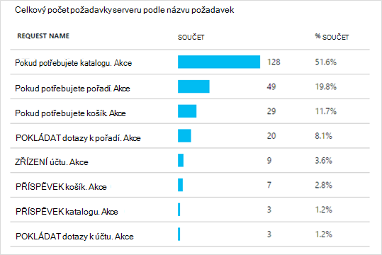

<properties 
    pageTitle="Aplikace přehledy pro Java webových aplikací web apps, které jsou již live" 
    description="Spuštění sledování webovou aplikaci, která už je spuštěný na server" 
    services="application-insights" 
    documentationCenter="java"
    authors="alancameronwills" 
    manager="douge"/>

<tags 
    ms.service="application-insights" 
    ms.workload="tbd" 
    ms.tgt_pltfrm="ibiza" 
    ms.devlang="na" 
    ms.topic="article" 
    ms.date="08/24/2016" 
    ms.author="awills"/>
 
# Aplikace přehledy pro Java webových aplikací web apps, které jsou již live

*Přehledy aplikace je v náhledu.*

Pokud jste ještě webovou aplikaci, která už je spuštěný na serveru J2EE, můžete začít sledování pomocí [Aplikace přehledy](app-insights-overview.md) bez nutnosti změny kód nebo nové kompilace projektu. Pomocí této možnosti můžete získat informace o požadavků HTTP odeslané na váš server neošetřené výjimky a výkonnosti.

Musíte mít předplatné [Microsoft Azure](https://azure.com).

> [AZURE.NOTE] Postup na této stránce přidá SDK do webové aplikace za běhu. Tento přístrojového vybavení runtime je užitečné, pokud nechcete, aby k aktualizaci nebo opětovné sestavení zdrojového kódu. Ale pokud je to možné, doporučujeme můžete [Přidat SDK zdrojového kódu](app-insights-java-get-started.md) místo. Nabídne vám další možnosti, třeba psaní kódu můžete sledovat činnosti uživatelů.

## 1. získat klíč přístrojového vybavení přehledy aplikace

1. Přihlaste se k [portálu Microsoft Azure](https://portal.azure.com)
2. Vytvoření nového prostředku přehledy aplikace

    
3. Nastavení aplikace typu Java webové aplikace.

    
4. Najdete klíč přístrojového vybavení nového prostředku. Musíte tento klíč krátce vložte do kódu projektu.

    

## 2. sadu SDK stáhnout

1. Stáhněte si [aplikaci přehledy SDK jazyka Java](https://aka.ms/aijavasdk). 
2. Na serveru extrahujte SDK obsah v adresáři, ze kterého binární soubory aplikace project nakládá. Pokud používáte Tomcat, tento adresář by obvykle v části`webapps\<your_app_name>\WEB-INF\lib`

## 3. přidání souboru xml aplikace přehledy

Vytvoření ApplicationInsights.xml do složky, ve které jste přidali SDK. Vložte do něj následující XML.

Nahraďte klávesu přístrojového vybavení, který jste dostali z portálu Microsoft Azure.

    <?xml version="1.0" encoding="utf-8"?>
    <ApplicationInsights xmlns="http://schemas.microsoft.com/ApplicationInsights/2013/Settings" schemaVersion="2014-05-30">

      <!-- The key from the portal: -->

      <InstrumentationKey>** Your instrumentation key **</InstrumentationKey>

      <!-- HTTP request component (not required for bare API) -->

      <TelemetryModules>
        <Add type="com.microsoft.applicationinsights.web.extensibility.modules.WebRequestTrackingTelemetryModule"/>
        <Add type="com.microsoft.applicationinsights.web.extensibility.modules.WebSessionTrackingTelemetryModule"/>
        <Add type="com.microsoft.applicationinsights.web.extensibility.modules.WebUserTrackingTelemetryModule"/>
      </TelemetryModules>

      <!-- Events correlation (not required for bare API) -->
      <!-- These initializers add context data to each event -->

      <TelemetryInitializers>
        <Add   type="com.microsoft.applicationinsights.web.extensibility.initializers.WebOperationIdTelemetryInitializer"/>
        <Add type="com.microsoft.applicationinsights.web.extensibility.initializers.WebOperationNameTelemetryInitializer"/>
        <Add type="com.microsoft.applicationinsights.web.extensibility.initializers.WebSessionTelemetryInitializer"/>
        <Add type="com.microsoft.applicationinsights.web.extensibility.initializers.WebUserTelemetryInitializer"/>
        <Add type="com.microsoft.applicationinsights.web.extensibility.initializers.WebUserAgentTelemetryInitializer"/>

      </TelemetryInitializers>
    </ApplicationInsights>

* Klíč přístrojového vybavení odeslaný spolu s jednotlivé položky telemetrie a říká přehledy aplikace zobrazíte v zdroj.
* Žádost HTTP component je nepovinný krok. Automaticky pošle telemetrie o žádosti a doby odezvy k portálu.
* Srovnávací událostí je doplněk komponentu žádost HTTP. Identifikátor přiřadí každý požadavek přijatých serverem a přidá tento identifikátor jako vlastnost jednotlivé položky telemetrie jako vlastnost "Operation.Id". Umožňuje sladit telemetrie spojené se každý požadavek nastavení filtru v [diagnostiky hledání](app-insights-diagnostic-search.md).

## 4. Přidat filtr HTTP

Najděte a otevřete soubor web.xml v projektu a sloučit následující fragment kódu uzlu web appu, kde jsou nakonfigurovány aplikace filtry.

Co nejpřesnější výsledků dosáhnete, by měl filtr namapované před všechny ostatní filtry.

    <filter>
      <filter-name>ApplicationInsightsWebFilter</filter-name>
      <filter-class>
        com.microsoft.applicationinsights.web.internal.WebRequestTrackingFilter
      </filter-class>
    </filter>
    <filter-mapping>
       <filter-name>ApplicationInsightsWebFilter</filter-name>
       <url-pattern>/*</url-pattern>
    </filter-mapping>

## 5. výjimky brány firewall zaškrtnutí

Možná budete muset [Nastavení výjimky odeslání odchozí dat](app-insights-ip-addresses.md).

## 6. webovou aplikaci restartujte

## 7. zobrazení vašeho telemetrie v aplikaci přehledy

Vraťte se do aplikace přehledy zdroje portálu [Microsoft Azure](https://portal.azure.com).

Telemetrie o požadavků HTTP se zobrazí na zásuvné Přehled. (Pokud tam není, počkejte několik sekund, než a kliknutím na aktualizovat.)

 

Proklikejte grafu zobrazíte podrobnější metriky. 

 

A po zobrazení vlastností žádost, uvidíte události telemetrie přidružené například žádosti o schůzku a výjimky.
 

[Další informace o metriky.](app-insights-metrics-explorer.md)

## Další kroky

* [Přidat telemetrie na webové stránky](app-insights-web-track-usage.md) do zobrazení stránky monitor a metriky uživatele.
* [Nastavení webových testů](app-insights-monitor-web-app-availability.md) možný že zůstane aplikace live a citlivé.
* [Zachyťte trasování protokolu](app-insights-java-trace-logs.md)
* [Hledání událostí a protokolování](app-insights-diagnostic-search.md) lépe diagnostikovat potíže.

 
