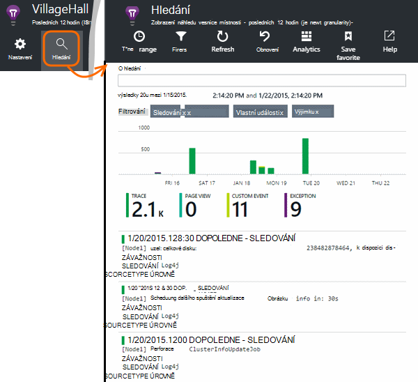

<properties 
    pageTitle="Prozkoumání Java sledování protokoly do aplikace přehledy" 
    description="Hledání Log4J nebo Logback trasování v aplikaci přehledy" 
    services="application-insights" 
    documentationCenter="java"
    authors="alancameronwills" 
    manager="douge"/>

<tags 
    ms.service="application-insights" 
    ms.workload="tbd" 
    ms.tgt_pltfrm="ibiza" 
    ms.devlang="na" 
    ms.topic="article" 
    ms.date="07/12/2016" 
    ms.author="awills"/>

# Prozkoumání Java sledování protokoly do aplikace přehledy

Pokud používáte Logback nebo Log4J (verze 1.2 nebo verze 2.0) pro trasování, máte sledování protokolů automaticky odeslána interpretace aplikace, kde můžete prozkoumat a vyhledávat na nich.

Instalace [Aplikace přehledy SDK jazyka Java][java], pokud jste, které již neučinili.

## Přidání knihoven protokolování do projektu

*Vyberte příslušný způsob plánu projektu.*

#### Pokud používáte Maven...

Pokud projektu již nastavenou pro účely vytvoření Maven, jednu z následujících fragmenty kódu sloučíte pom.xml soubor.

Aktualizujte závislostí projektu získat binární stáhnout.

*Logback*

    <dependencies>
       <dependency>
          <groupId>com.microsoft.azure</groupId>
          <artifactId>applicationinsights-logging-logback</artifactId>
          <version>[1.0,)</version>
       </dependency>
    </dependencies>

*Log4J verze 2.0*

    <dependencies>
       <dependency>
          <groupId>com.microsoft.azure</groupId>
          <artifactId>applicationinsights-logging-log4j2</artifactId>
          <version>[1.0,)</version>
       </dependency>
    </dependencies>

*Verze 1.2 Log4J*

    <dependencies>
       <dependency>
          <groupId>com.microsoft.azure</groupId>
          <artifactId>applicationinsights-logging-log4j1_2</artifactId>
          <version>[1.0,)</version>
       </dependency>
    </dependencies>

#### Pokud používáte Gradle...

Pokud projektu již nastavenou pro účely Gradle Tvůrce dotazů, přidejte jedno z následujících čar a umožňuje `dependencies` skupiny v souboru build.gradle:

Aktualizujte závislostí projektu získat binární stáhnout.

**Logback**

    compile group: 'com.microsoft.azure', name: 'applicationinsights-logging-logback', version: '1.0.+'

**Log4J verze 2.0**

    compile group: 'com.microsoft.azure', name: 'applicationinsights-logging-log4j2', version: '1.0.+'

**Verze 1.2 Log4J**

    compile group: 'com.microsoft.azure', name: 'applicationinsights-logging-log4j1_2', version: '1.0.+'

#### V opačném případě …

Stáhněte si a extrahovat příslušné appender a přidejte příslušné knihovny do projektu:

Protokolování | Ke stažení | Knihovna
----|----|----
Logback|[SDK s Logback appender](https://aka.ms/xt62a4)|applicationinsights protokolování logback
Log4J verze 2.0|[SDK s Log4J v2 appender](https://aka.ms/qypznq)|applicationinsights protokolování log4j2 
Verze 1.2 Log4j|[SDK s appender Log4J verze 1.2](https://aka.ms/ky9cbo)|applicationinsights protokolování log4j1_2 

## Přidání appender framework protokolování

Abyste začali dostávat trasování, sloučit relevantní fragment kódu konfiguračního souboru Log4J nebo Logback: 

*Logback*

    <appender name="aiAppender" 
      class="com.microsoft.applicationinsights.logback.ApplicationInsightsAppender">
    </appender>
    <root level="trace">
      <appender-ref ref="aiAppender" />
    </root>

*Log4J verze 2.0*

    <Configuration packages="com.microsoft.applicationinsights.Log4j">
      <Appenders>
        <ApplicationInsightsAppender name="aiAppender" />
      </Appenders>
      <Loggers>
        <Root level="trace">
          <AppenderRef ref="aiAppender"/>
        </Root>
      </Loggers>
    </Configuration>

*Verze 1.2 Log4J*

    <appender name="aiAppender" 
         class="com.microsoft.applicationinsights.log4j.v1_2.ApplicationInsightsAppender">
    </appender>
    <root>
      <priority value ="trace" />
      <appender-ref ref="aiAppender" />
    </root>

Appenders aplikace přehledy můžete odkázat libovolné nakonfigurovaných protokolování a ne nutně protokolování kořenové (viz výše ukázek kódu).

## Prozkoumání zaznamenané trasování v portálu přehledy aplikace

Teď máte nastavený projektu odeslat trasování interpretace aplikace, můžete zobrazit a hledání tyto trasování v portálu přehledy aplikace do pole [Hledat] [ diagnostic] zásuvné.

## Další kroky

[Diagnostiky hledání][diagnostic]

<!--Link references-->

[diagnostic]: app-insights-diagnostic-search.md
[java]: app-insights-java-get-started.md

 
