<properties
    pageTitle="Aplikace přehledy pro JavaScript webové aplikace | Microsoft Azure"
    description="Získání stránky zobrazení relace počty a, data klienta web a sledovat vzorce použití. Zjištění výjimky a problémy s výkonem v JavaScriptu webových stránek."
    services="application-insights"
    documentationCenter=""
    authors="alancameronwills"
    manager="douge"/>

<tags
    ms.service="application-insights"
    ms.workload="tbd"
    ms.tgt_pltfrm="ibiza"
    ms.devlang="na"
    ms.topic="get-started-article"
    ms.date="08/15/2016"
    ms.author="awills"/>

# Přehledy aplikace na webových stránkách

[AZURE.INCLUDE [app-insights-selector-get-started-dotnet](../../includes/app-insights-selector-get-started-dotnet.md)]

Zjistěte, jakým výkon a použití te000126961 aplikace nebo webovou stránku. Když naopak přidáte přehledy aplikace Visual Studio skript stránky, dostanete časy načítání stránek prodloužit AJAX hovory, počty a podrobnosti prohlížeče výjimky a AJAX chyby, jakož i uživatelů a počty relace. Všechny tyto můžete rozdělené stránky klienta OS a verze prohlížeče, geo umístění a ostatní dimenze. Můžete taky nastavení upozorňování na počtu selhání nebo zpomalit načtení stránky.

Pomocí aplikace přehledy webové stránky: jenom přidat stručných JavaScript. Pokud webová služba je [Java](app-insights-java-get-started.md) nebo [ASP.NET](app-insights-asp-net.md), můžete integrovat telemetrie z serveru a klientech.

Potřebujete předplatné [Microsoft Azure](https://azure.com). Pokud má váš tým předplatné organizace, požádejte vlastníka k nim přidat Account Microsoft. Tak malých užívání a vývoj nebude nákladů všechno, co je bezplatná ceny osy.

## Nastavení aplikace přehledy pro webovou stránku

Nejdřív musíte přidat přehledy aplikace na webové stránky? Jste může mít neudělali. Pokud se rozhodnete přidat aplikaci přehledy do webové aplikace v dialogovém okně Nový projekt ve Visual Studiu, skript jsme přidali potom. V takovém případě nemusíte dělat jakékoli další.

Jinak budete muset přidat fragment kódu webové stránky, následujícím způsobem.

### Otevřete aplikaci přehledy zdroje

Pokud se zobrazí data o výkonu a využití vaší stránky je zdroj přehledy aplikace. 

Přihlaste se k [portálu Azure](https://portal.azure.com).

Pokud jste už nastavili sledování aplikace na straně serveru, máte už zdroje:

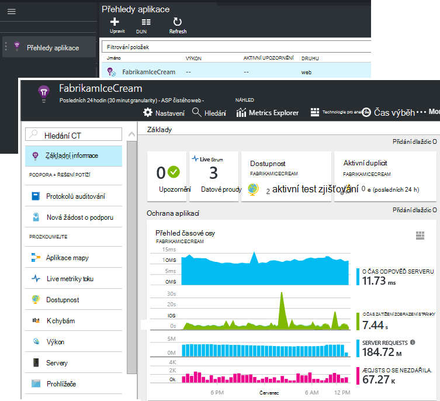

Pokud nemáte, vytvořte ho:

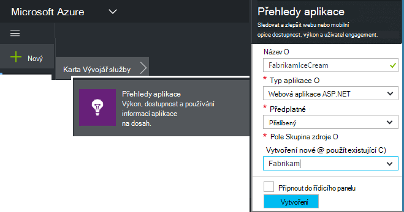

*Už otázky?* [Další informace o vytváření zdroje](app-insights-create-new-resource.md).

### Přidání skriptu SDK do aplikace nebo webové stránky

V rychlém získáte skriptu pro webové stránky:

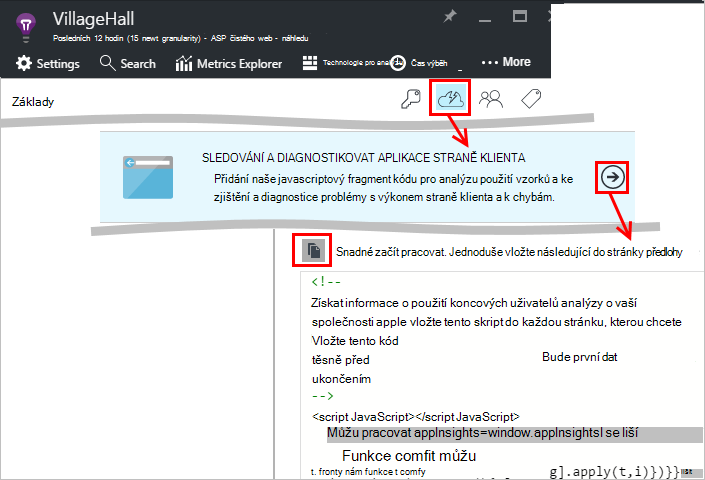

Vložení skriptu těsně před `</head>` značku části každé stránky, kterou chcete sledovat. Pokud má váš web stránku předlohy, můžete umístit skript tam. Příklad:

* V projektu ASP.NET MVC by vložíte ji`View\Shared\_Layout.cshtml`
* Na Sharepointovém webu, v Ovládacích panelech otevřete [Nastavení webu a stránku předlohy](app-insights-sharepoint.md).

Skript obsahuje klávesu přístrojového vybavení, který směruje data, která chcete aplikaci přehledy zdroje. 

([Důkladnější vysvětlení skriptem](http://apmtips.com/blog/2015/03/18/javascript-snippet-explained/))

*(Pokud používáte rámec známý webovou stránku, vyhledejte adaptéry přehledy aplikace. For example, je [modul AngularJS](http://ngmodules.org/modules/angular-appinsights).)*

## Podrobné konfigurace

Existuje několik [parametrů](https://github.com/Microsoft/ApplicationInsights-JS/blob/master/API-reference.md#config) , které můžete nastavit, když ve většině případů neměli potřebujete. Můžete třeba zakázat nebo omezit počet Ajax hovory nahlášený za zobrazení stránky (omezení přenosy). Nebo můžete nastavit režim ladění mít telemetrie umožňuje přecházet rychle mezi kanálu bez právě dávce.

Pokud chcete nastavit tyto parametry, vyhledejte tento řádek v kódu a po ní přidat další položky hodnotami oddělenými čárkou:

    })({
      instrumentationKey: "..."
      // Insert here
    });

[K dispozici parametry](https://github.com/Microsoft/ApplicationInsights-JS/blob/master/API-reference.md#config) patří následující:

    // Send telemetry immediately without batching.
    // Remember to remove this when no longer required, as it
    // can affect browser performance.
    enableDebug: boolean,

    // Don't log browser exceptions.
    disableExceptionTracking: boolean,

    // Don't log ajax calls.
    disableAjaxTracking: boolean,

    // Limit number of Ajax calls logged, to reduce traffic.
    maxAjaxCallsPerView: 10, // default is 500

    // Time page load up to execution of first trackPageView().
    overridePageViewDuration: boolean,

    // Set these dynamically for an authenticated user.
    appUserId: string,
    accountId: string,

## Spuštění aplikace

Spuštění webovou aplikaci, použije při generování telemetrie a počkejte pár sekund. Můžete ho pomocí klávesy **F5** ve vašem počítači vývoj spusťte nebo publikovat a uživatelům přehrát s ním.

Pokud chcete zkontrolovat, které do webových aplikací odesílá interpretace aplikace telemetrie, pomocí webového prohlížeče ladění nástrojů (**F12** v mnoha prohlížečích). Data jsou odeslány dc.services.visualstudio.com

## Zkoumání dat výkonu prohlížeče

Otevřete zásuvné prohlížeče zobrazíte data agregované výkonu z vašich uživatelů prohlížeče.

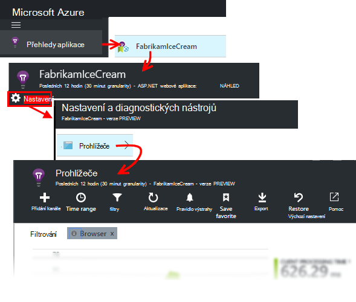

*Ještě žádná data? Klikněte na * *aktualizace* * v horní části stránky. Dál nic? Viz [Poradce při potížích](app-insights-troubleshoot-faq.md).*

Prohlížeče zásuvné je [zásuvné Explorer metriky](app-insights-metrics-explorer.md) s přednastavené filtry a výběr grafu. Úpravou časového rozsahu, filtry a konfiguraci graf a výsledků uložit jako oblíbené. Klikněte na **Obnovit výchozí nastavení** vrátit k původní zásuvné konfiguraci.

## Výkon načítání stránek

Nahoře je Segmentovaný graf načítáním stránek. Celková výška grafu představuje průměr čas zavádění a zobrazit stránky z aplikace v prohlížečích vašich uživatelů. Čas je měřeno od, když prohlížeč odesílá původní žádost HTTP do všech synchronní zatížení, které byly zpracovány události, včetně rozložení a spustit skripty. Neobsahuje asynchronní úkoly třeba načítání webové části z AJAX volání.

Graf segmenty doby načítání celkový počet stránek do [Standardní časování definované W3C](http://www.w3.org/TR/navigation-timing/#processing-model). 

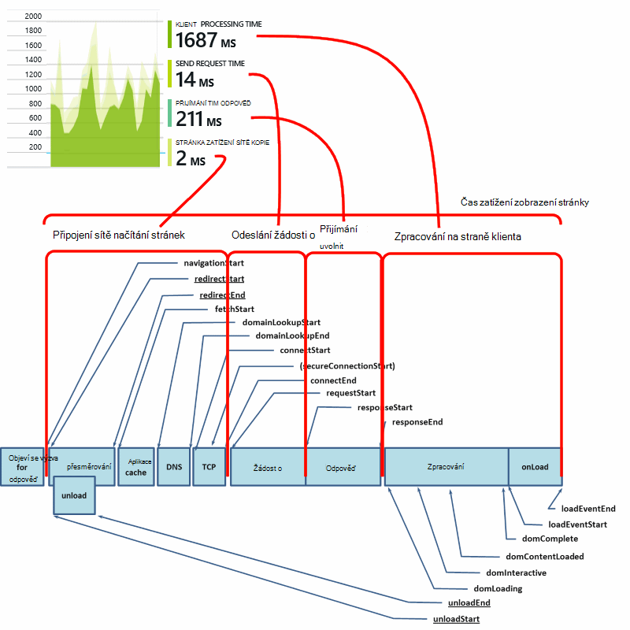

Všimněte si, že čas *Připojit* často nižší než může očekáváte, protože je průměrně přes všechny žádosti o z prohlížeče na server. Mnoho jednotlivé požadavky měli čas připojit 0, protože je už aktivní připojení k serveru.

### Zpomalit načítání?

Načtení pomalé stránky jsou hlavní zdrojem nespokojenost pro uživatele. Pokud grafu označuje načtení pomalé stránky, není těžké si udělat některé diagnostické zdroje informací.

Graf zobrazuje průměr všech načítání stránek prodloužit v aplikaci. Pokud chcete zobrazit, pokud problém se týká jen určité stránky, najděte další dolů zásuvné kde není mřížka rozdělené adresa URL stránky:

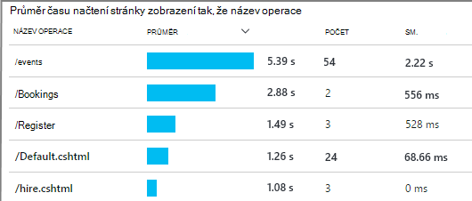

Všimněte si počtu zobrazení stránek a směrodatnou odchylku. Pokud je velmi nízký počet stránek, pak problém nemají vliv na uživatele mnohem. Vysoký směrodatnou odchylku (srovnatelná s průměr samotné) označuje spoustu variant mezi jednotlivé rozměry.

**Přiblížit na jednu adresu URL a zobrazení jednu stránku.** Kliknutím na název stránky zobrazíte zásuvné prohlížeče grafy filtrované jenom na tuto adresu URL; a potom na instanci stránkového zobrazení.

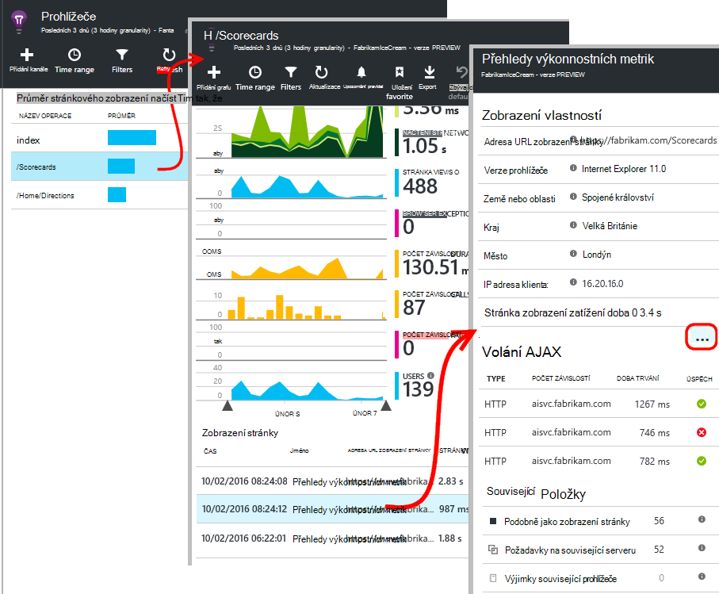

Klikněte na `...` úplný seznam vlastností pro dané události nebo kontrola hovory Ajax a související události. Pomalé volání Ajax ovlivní celkový čas načítání stránek, jako jsou synchronní. Související události obsahují požadavky serveru pro adresu URL (Pokud jste nastavíte přehledy aplikace na webovém serveru).

**Stránka výkonu v průběhu času.** Zpět na zásuvné prohlížeče Změna mřížky času načtení zobrazení stránky do spojnicového grafu vidět – Pokud došlo k píků v určitou dobu:

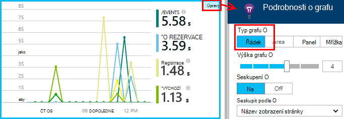

**Rozdělit tak, že ostatní dimenze.** Stránky jsou možná pomaleji načíst na určitý prohlížeč, klient s operačním systémem nebo místo uživatele? Přidejte nový graf a Experimentujte s dimenzi **Seskupit podle** .

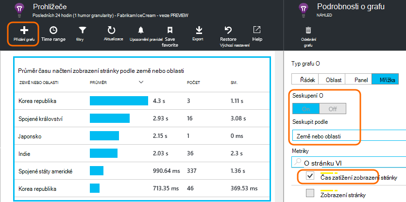

## Výkon AJAX

Ujistěte se, že volání AJAX na webových stránkách jsou dobrý. Používají se často asynchronní vyplnění části stránky. Sice celková stránka může načíst neprodleně, uživatelé může být pořádku výchozích na prázdnou webovou částí, čeká se na data umístěná v nich.

Na zásuvné prohlížeče jako závislostí jsou zobrazené AJAX hovorů z webové stránky.

Existují souhrnné grafy v horní části zásuvné:

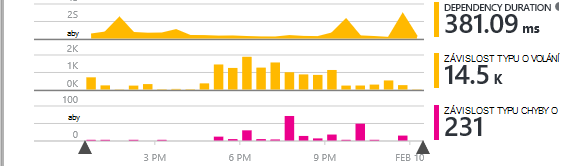

a podrobné mřížky nižší dolů:

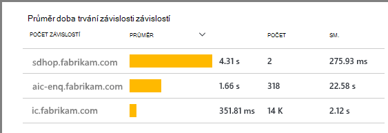

Klikněte na libovolnou řádek konkrétní informace.

> [AZURE.NOTE] Pokud byste odstranili prohlížeče filtru u zásuvné, serveru a AJAX závislosti najdete v těchto grafech. Klikněte na Obnovit výchozí nastavení, aby překonfigurovali filtr.

**K procházení k podrobnostem do selhalo Ajax volání** přejděte dolů mřížce selhání závislost a potom klikněte na řádek zobrazíte konkrétní instance.

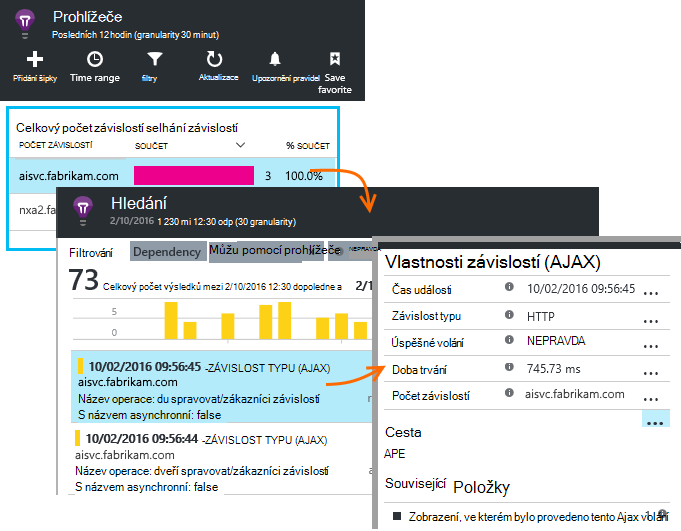

Klikněte na `...` pro celou telemetrie Ajax volání.

### Žádná Ajax volání vykázaného?

Volání AJAX obsahovat HTTP hovorů z skriptu webovou stránku. Pokud je vykázaného nevidíte, zkontrolujte, jestli není nastavený fragment kódu `disableAjaxTracking` nebo `maxAjaxCallsPerView` [Parametry](https://github.com/Microsoft/ApplicationInsights-JS/blob/master/API-reference.md#config).

## Výjimky prohlížeče

Na zásuvné prohlížeče je souhrnné grafu výjimky a mřížka typy výjimek dál dolů zásuvné.

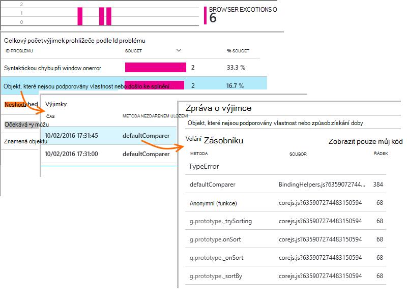

Pokud nevidíte prohlížeče výjimky vykázaného, zkontrolujte, jestli není nastavený fragment kódu `disableExceptionTracking` [parametr](https://github.com/Microsoft/ApplicationInsights-JS/blob/master/API-reference.md#config).

## Kontrola, zda jednotlivé stránky zobrazit události

Obvykle telemetrie zobrazení stránky se analyzuje přehledy aplikace a zobrazit jenom souhrnná sestavy, za všechny vaše uživatele. Ale pro účely ladění, můžete taky zobrazit jednotlivé stránky zobrazit události.

V zásuvné diagnostiky hledání nastavte filtry zobrazení stránky.

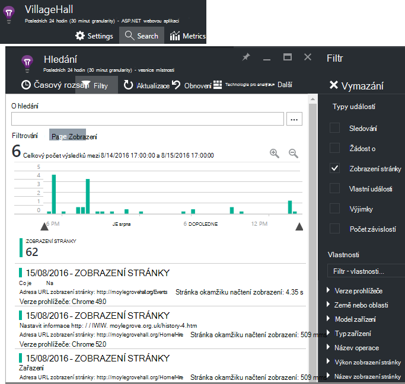

Výběrem kterékoliv události zobrazíte více podrobností. Na stránce Podrobnosti klikněte na trojtečkou (...) zobrazit i další podrobnosti.

> [AZURE.NOTE] Pokud používáte [vyhledávání](app-insights-diagnostic-search.md), Všimněte si, že budete muset pouze celá slova: "Abou" a "o" neodpovídají "O".

Můžete taky pomocí výkonných [analýz dotazu jazyka](app-insights-analytics-tour.md) můžete hledat zobrazení stránky.

### Zobrazení vlastností stránky

* **Doba trvání zobrazení stránky** 

 * Ve výchozím nastavení doby trvání načtení stránky z klienta požádat o celou zatížení (včetně pomocné soubory s výjimkou asynchronní úkoly, jako je volá Ajax). 
 * Pokud nastavíte `overridePageViewDuration` v [konfiguraci stránky](#detailed-configuration)interval mezi klientem požádat o spuštění prvního `trackPageView`. Přesunete trackPageView z polohy obvykle po inicializace skript, budou obsahovat jinou hodnotu.
 * Pokud `overridePageViewDuration` je sada a doba trvání podle argumentu `trackPageView()` zavolat, pak bude použita hodnota argumentu. 

## Spočítá kustomizovanou stránku

Ve výchozím nastavení probíhá počet stránek pokaždé, když novou stránku načte do prohlížeče klienta.  Ale chcete počítat zobrazení další stránky. Například na stránku můžete zobrazit její obsah karty a chcete spočítat stránky, když uživatel kombinace kláves vymění karty. Nebo kód v JavaScriptu na stránce může načíst nový obsah beze změny v prohlížeči na adresu URL.

Vložení hovoru JavaScript takto v odpovídajícím bodě v klientském kódu:

    appInsights.trackPageView(myPageName);

Název stránky může obsahovat stejné znaky jako adresa URL, ale cokoli po "#" nebo "?" je ignorován.

## Sledování

Chcete zjistit, co vaši uživatelé dělat s aplikací?

* [Další informace o použití sledování](app-insights-web-track-usage.md)
* [Další informace o vlastních událostí a metriky rozhraní API](app-insights-api-custom-events-metrics.md).

#### Video: Sledování použití

> [AZURE.VIDEO tracking-usage-with-application-insights]

## Další kroky

* [Sledovat použití](app-insights-web-track-usage.md)
* [Vlastní události a metriky](app-insights-api-custom-events-metrics.md)
* [Přečtěte si sestavení míra](app-insights-overview-usage.md)

