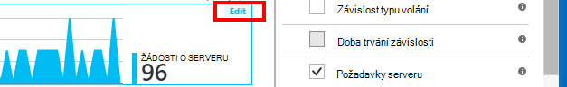

<properties 
    pageTitle="Prozkoumání metriky v aplikaci přehledy | Microsoft Azure" 
    description="Jak interpretovat grafy v metrických explorer a přizpůsobení metrických explorer listy." 
    services="application-insights" 
    documentationCenter=""
    authors="alancameronwills" 
    manager="douge"/>

<tags 
    ms.service="application-insights" 
    ms.workload="tbd" 
    ms.tgt_pltfrm="ibiza" 
    ms.devlang="na" 
    ms.topic="article" 
    ms.date="10/15/2016" 
    ms.author="awills"/>
 
# Prozkoumání metriky v aplikaci přehledy

Metriky v [Aplikaci přehledy] [ start] jsou naměřené hodnoty a počty události, které jsou odesílány telemetrie z aplikace. Pomáhají zjistit problémy s výkonem a sledování trendů v využití aplikace. Existuje široká škála standardní metriky a můžete taky vytvořit vlastní vlastní metriky a události.

Počty metriky a událostí se zobrazují v grafech souhrnných hodnot jako jsou součty, průměry nebo počty.

Tady je ukázka grafu:

Některé grafy jsou nasegmentovány: celková výška grafu kdykoli je součtem metrik zobrazit. Pokud chcete legendu ve výchozím nastavení se zobrazí největší množství.

Tečkované čáry zobrazit hodnotu metriky dříve jeden týden.

## Časový rozsah

Můžete změnit časový rozsah překryty grafů nebo tabulek v libovolné zásuvné.

Pokud jste očekává některá data, která není zatím se zobrazovala, klikněte na aktualizovat. Grafy aktualizovat sami intervalech, ale intervaly jsou delší pro větší časového rozsahu. V režimu verze to trvat dlouho pro data, která chcete procházejí profilace analýzy do diagramu.

Chcete-li zvětšit část grafu, přetáhněte nad ním:

Klikněte na tlačítko Zpět Lupa obnovit.

## Nastavení a čárky hodnoty

Umístěte ukazatel myši nad grafu, zobrazí hodnoty metriky v daném okamžiku.

Hodnota míru na určitém místě je agregované za předchozí interval odběr. 

Analytický nástroj vzorkování intervalu nebo "granularity" je zobrazen v horní části zásuvné. 

Je možné upravit rozlišení v oblasti zásuvné čas.

K dispozici granularity závisí na časový rozsah, který jste vybrali. Explicitní granularity jsou alternativ "automatické" granularity časového rozsahu. 

## Metriky Průzkumníka

Proklikejte grafu na zásuvné Přehled zobrazíte podrobnější sadu související grafy a mřížky. Můžete upravit těmito grafy a mřížky zaměřit se na informace, které vás zajímá.

Nebo kliknete na tlačítko metriky Průzkumníka v vedoucí zásuvné Přehled.

Například, klepněte na Procházet web appu se nepodařilo žádosti o grafu:

## Co znamenají čísla?

Legendu straně ve výchozím nastavení obvykle zobrazuje agregovanou hodnotu období grafu. Když najedete myší na graf, zobrazí hodnotu v daném okamžiku.

Všechny datové body v diagramu je agregované hodnoty dat dostali v předchozím interval vzorkování nebo "granularity". Rozlišení se zobrazí v horní části zásuvné a se liší podle celkovou časovou osu grafu.

Metriky může být agregovaný různými způsoby: 

 * **SUMA** sečte hodnoty všem datovým bodům přijatých přes interval vzorkování nebo tečka grafu.
 * **Průměrná** vydělením součet počet datových bodů dostali pro interval.
 * Počet **jedinečných** se používají pro počtem uživatelů a účty. Přes interval vzorkování nebo období graf obrázek ukazuje počet různí uživatelé viděli v té době.

Můžete změnit způsob agregace:

Výchozí metoda každý metriky se zobrazí, když vytvoříte nový graf nebo když jsou všechny metriky vybraná:

## Úpravy grafů a tabulek

Pokud chcete přidat nový graf zásuvné:

Vyberte **Upravit** na existující nebo nové graf upravovat, co vidíte:

Můžete zobrazit víc než jednu míru v grafu, když se omezení o kombinace, které mohou být zobrazena společně. Jakmile jste si vybrali jednu míru, některé ostatní jsou zakázány. 

Pokud kódovaný [vlastní metriky] [ track] do aplikace (volání TrackMetric a TrackEvent) budou uvedené v tomto poli.

## Segmentech dat

Můžete rozdělit metriky tak, že vlastnost – například k porovnání zobrazení stránky v klientech různých operačních systémech. 

Vyberte graf nebo tabulku, přejděte na seskupení a vyberte vlastnosti, které chcete seskupit podle:

> [AZURE.NOTE] Při použití seskupení typy plošný graf a pruhový graf poskytují skládaného zobrazení. To je vhodné místo, kam způsob agregace SUMA. Ale pokud typ agregace průměr, vyberte typy zobrazení řádku nebo tabulku. 

Pokud kódovaný [vlastní metriky] [ track] do aplikace a obsahují nemovitostí s hodnotou, byste měli v seznamu vyberte položku Vlastnosti.

Je graf příliš malý Segmentovaný dat? Upravte jeho výšku:

## Filtrování dat

Chcete-li zobrazit pouze metriky pro vybraný sadu nemovitostí s hodnotou:

Pokud nevyberete všechny hodnoty pro určitou vlastnost, je stejná jako vyberte je všechny: na tuto vlastnost je bez filtru.

Všimněte si počty události vedle každého vlastnosti hodnota. Po výběru hodnoty jednu vlastnost počty společně jiných nemovitostí s hodnotou se upraví.

Filtry platí pro všechny grafy na zásuvné. Pokud budete potřebovat různé filtry použité pro různé grafy, vytvořte a uložte jinou metriky listy. Pokud chcete, můžete připnout grafy z jiné listy na řídicí panel tak, aby si mohli prohlédnout vedle sebe.

### Odebrání zkušební provoz bot a web

Použití filtru **reálnou a syntetické přenosů** a zkontrolujte **reálnou**.

Můžete taky filtrovat podle **zdroje syntetické provoz**.

### Chcete-li přidat vlastnosti do seznamu filtrů

Chcete filtrovat telemetrie v kategorii vlastní? Například možná zdola nahoru uživatele do různých kategorií a budete chtít segmentech data podle těchto kategorií.

[Vytvořit vlastní vlastnost](app-insights-api-custom-events-metrics.md#properties). Nastavení v [Inicializačním Telemetrie](app-insights-api-custom-events-metrics.md#telemetry-initializers) ji zobrazit ve všech telemetrie – včetně standardní telemetrie odeslaný různé SDK moduly.

## Upravit typ grafu

Všimněte si, že můžete přepínat mezi tabulky a grafy:

## Uložení metriky zásuvné

Po vytvoření některé grafy, uložte je do oblíbených položek. Můžete zvolit, zda abyste ho mohli sdílet s ostatními členy týmu, pokud používáte účet organizace.

Viz zásuvné znovu, **přejděte na zásuvné – přehled** a otevřete Oblíbené položky:

Pokud se rozhodnete relativní časového rozsahu, když jste uložili, zásuvné aktualizují na nejnovější metriky. Pokud jste se rozhodli absolutní časového rozsahu, zobrazí stejná data pokaždé, když.

## Obnovení zásuvné

Pokud upravujete zásuvné, ale pak chcete vrátit k původní uložit nastavení, jednoduše klikněte na obnovit.

## Živou metriky toku: rychlé metriky zavřít sledování

Živou toku metriky ukazuje aplikace metriky přímo v tuto chvíli velmi s blízké latence reálném čase 1 sekundy. To je velmi užitečné, když jste uvolnění nové sestavení a chcete, aby zkontrolovala, jestli je všechno pracovní podle očekávání nebo vyšetřování incident v reálném čase.

Na rozdíl od metriky Průzkumník Windows Live toku metriky zobrazuje pevnou sadu metriky. Data trvá jenom pro dlouhou, jak se v grafu a potom ignorován. 

Neexistuje živou toku metriky s aplikací přehledy SDK ASP.NET, verze 2.1.0 nebo novější.

## Nastavit upozornění

Aby vás upozornil e-mailem neobvyklé hodnot z libovolné míru, přidejte upozornění. Můžete buď na Odeslat e-mailu pro účet správce nebo konkrétní e-mailové adresy.

[Další informace o upozornění][alerts].

## Export do aplikace Excel

Můžete exportovat metrických data, která se zobrazí v Průzkumníku míru do souboru aplikace Excel. Exportovaná data obsahují data z všechny grafy a tabulky, jak je vidět na portálu. 

Exportu dat pro každý graf nebo tabulka na samostatném listu v souboru aplikace Excel.

Co vidíte je obsah exportu. Pokud chcete změnit rozsah dat exportovaných změňte časový rozsah nebo filtry. U tabulek Pokud zobrazující příkaz **načíst více** kliknete jej před kliknutím na exportovat, zobrazit další data vyexportovat.

*Exportujte funguje jenom pro Internet Explorer a Chrome v současné době. Pracujeme na přidání podpory pro jiné prohlížeče.*

## Nepřetržitý exportu

Pokud budete potřebovat data nepřetržitě exportovaná tak, aby mohli pracovat externě, zvažte použití [nepřetržitě exportovat](app-insights-export-telemetry.md).

### Power BI

Pokud budete potřebovat i rozsáhlejší zobrazení dat, můžete [Exportovat do Power BI](http://blogs.msdn.com/b/powerbi/archive/2015/11/04/explore-your-application-insights-data-with-power-bi.aspx).

## Technologie pro analýzu

[Technologie pro analýzu](app-insights-analytics.md) je další univerzální způsob, jak analyzovat vaší telemetrie pomocí výkonných dotazovací jazyk. Používejte, pokud chcete kombinovat vypočítat výsledky z metriky nebo provádět v deph průzkum poslední výkonu vaše aplikace. Pokud chcete automatické aktualizace grafech na řídicím panelu a upozornění na druhé straně pomocí Průzkumníka metriky.

## Řešení potíží

*Proč nevidím všechna data v grafu.*

* Filtry platí pro všechny grafy na zásuvné. Ujistěte se, že když jste zaměřené na jednom grafu, můžete nenastavili filtru s vyloučením všechna data na jiný. 

    Pokud budete chtít nastavit jiné filtry na různé grafy, byla vytvořená v jiné listy, je uložte jako samostatný Oblíbené položky. Pokud chcete, můžete je připnout na řídicí panel tak, aby si mohli prohlédnout vedle sebe.

* Pokud skupiny grafu tak, že vlastnost, která není definované na metriky pak bude nic v diagramu. Zkuste vymazat "Seskupit" nebo zvolit jiné seskupení vlastnost.
* Data o výkonu (procesor, vstupů/výstupů sazby a tak dál) je k dispozici pro Java webové služby systému Windows aplikace klasické pracovní plochy, [služby IIS webové aplikace a služby nainstalujete sledování stavu](app-insights-monitor-performance-live-website-now.md)a [Azure Cloud Services](app-insights-azure.md). Není k dispozici Azure weby.

## Další kroky

* [Sledování použití s přehledy aplikace](app-insights-overview-usage.md)
* [Použití diagnostiky hledání](app-insights-diagnostic-search.md)

<!--Link references-->

[alerts]: app-insights-alerts.md
[start]: app-insights-overview.md
[track]: app-insights-api-custom-events-metrics.md

 