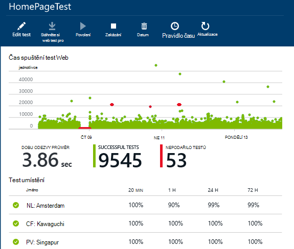
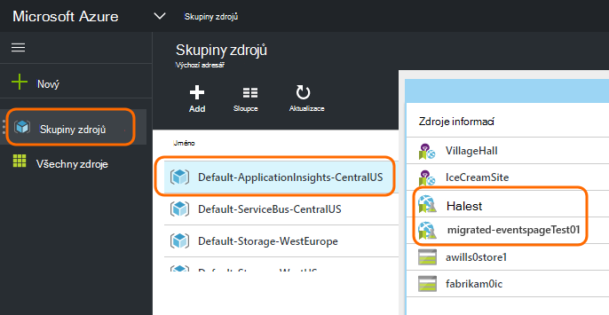
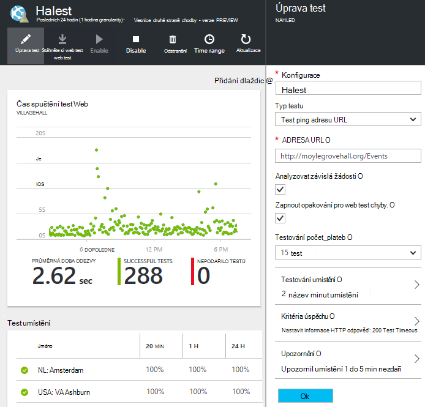

<properties 
    pageTitle="Azure koncového bodu migrace do testy dostupnost přehledy aplikací" 
    description="Migrace klasické Azure koncový bod sledování testů přehledné aplikace dostupnost testuje 31. října 2016."
    services="application-insights" 
    documentationCenter=""
    authors="soubhagyadash" 
    manager="douge"/>

<tags 
    ms.service="application-insights" 
    ms.workload="tbd" 
    ms.tgt_pltfrm="ibiza" 
    ms.devlang="na" 
    ms.topic="article" 
    ms.date="07/25/2016" 
    ms.author="awills"/>
 
# Přesunutí z Azure koncový bod sledovat, abyste testy dostupnost přehledy aplikací

Používáte [Sledování koncový bod](https://blogs.msdn.microsoft.com/mast/2013/03/03/windows-azure-portal-update-configure-web-endpoint-status-monitoring-preview/) pro aplikace Azure? *31. října 2016*jsme budete nahraďte je novou a přesnějším [dostupnost testů](app-insights-monitor-web-app-availability.md). Jsme vytvořili některých nových testů, i když jste zakázané až 31. října 2016. 

Umožňuje upravovat nových testů a postupovat přepínačem sami chcete. Najdete je [Azure portál](https://portal.azure.com) ve skupinovém rámečku Výchozí ApplicationInsights CentralUS zdroje.

## Jaké jsou dostupnost testů?

Dostupnost testování je funkce Azure, která neustále zkontroluje, zda webům a službám nahoru a spuštění tak, že požadavky HTTP (jednoho testy nebo Visual Studio webových testů) z až 16 umístění Celosvětová dostupnost. 

V [klasickém Azure portál](https://manage.windowsazure.com)tyto testy byly s názvem sledování koncového bodu. Další byly ve svém rozsahu omezena. Nové testy dostupnost jsou zásadní zlepšování:

* Až 10 Visual Studio web nebo ping testů každý zdroj přehledy aplikace. 
* Až 16 umístění Celosvětová dostupnost odeslání žádosti o zkušební do webové aplikace. Získat větší kontrolu zkušebních úspěch kritérií. 
* Otestujte všem webům a služby – stačí Azure webových aplikacích.
* Testování opakování: zmenšení falešně pozitivní upozornění kvůli problémům se sítí přechodná. 
* Webhooks dostávat upozornění HTTP příspěvek upozornění.

Další informace o [dostupnosti testů tady](app-insights-monitor-web-app-availability.md).

Dostupnost testů jsou součástí [Přehledy aplikace Visual Studio](app-insights-overview.md), které je služba extensible analytics pro všechny webové aplikace.

## Co se děje se můj koncový bod testuje, takže?

* Jsme zkopírovali koncový bod sledování testy nových testů dostupnost přehledy aplikace.
* Nové testů dostupnost jsou k dispozici a staré testů koncový bod jsou spuštěné.
* Výstrahy pravidel *mít nemigruje* . Nové testů původně nastavili při použití výchozí pravidla:
 * Aktivace po víc než 1 umístění sestavy k chybám v 5 minut.
 * Odeslání e-mailu správcům předplatného.

[Azure portál](https://portal.azure.com)můžete najít migrované testů ve skupině prostředků "Výchozí CentralUS ApplicationInsights". Předponou názvy test "Migrated-". 

## Co je potřeba udělat?

* Pokud nějak zmeškané migrace testy, lze [snadno nastavit](app-insights-monitor-web-app-availability.md)nových testů dostupnosti.

### Možnost odpověď: udělejte nic. Nechte se nám.

**Na 31. října 2016** jsme udělejte toto:

* Zakázání staré testů koncového bodu.
* Povolte migrované testů dostupnosti.

### Možnost B: můžete spravovat a/nebo povolení nových testů.

* Zkontrolujte a upravte nových testů dostupnost nového [Azure portálu](https://portal.azure.com). 
 * Kontrola kritéria aktivační událost
 * Kontrola příjemců e-mailu
* Povolení nových testů
* Deaktivujeme starší verze koncový bod sledování testů na 31. října 2016 

### Možnost C: nesouhlas

Pokud nechcete používat testů dostupnost, odstraňte je [Azure](https://portal.azure.com)portálu. Je také odkaz odhlášení odběru najdete na konci e-mailů oznámení.

Pořád odstraníte původní testů koncového bodu na 31. října 2016. 

## Jak upravit nových testů?

Přihlaste se k [portálu Azure](https://portal.azure.com) a vyhledejte webových testů "Migrated-": 

Úpravy a/nebo povolení test:

## Proč se to děje?

Lepší služby. Staré koncového bodu služby byl mnohem užší. Můžete poskytnout jenom dvěma adresy URL pro jednoduché testy z 3 geo umístění na OM Azure nebo webové aplikace. Nové testů by umožnit spuštění vícekrokové webových testů z až 16 umístění a zadáte až 10 testů jedné aplikaci. Můžete otestovat všechny adresy URL: nemusí být Azure webu.

Nové testů jsou nakonfigurovat odděleně od webových aplikací nebo OM, který jste testování. 

Jsme migrujete testů zajistit že mít kontrolu nad nimi při používání novém portálu dál. 

## Co je aplikace přehledy?

Nové testů dostupnost jsou součástí [Přehledy aplikace Visual Studio](app-insights-overview.md). Tady je [video 2 minuty](http://go.microsoft.com/fwlink/?LinkID=733921).

## Mám můžu platební nových testů?

Migrované testů vytvořené v aplikaci přehledy zdroje ve výchozím bezplatné plánu. Díky kolekce až miliónů 5 datové body. Která snadno se vztahuje objemů dat testy použije aktuálně. 

Samozřejmě pokud přehledy aplikací, jako a vytvořte další testy dostupnost nebo některé její sledování výkonu a diagnostických funkcí přijmout, pak budete generovat další datové body.  Však výsledek pouze bude, může přístupů kvóty pro bezplatné plán. Pokud přihlášení pro plány standardní nebo Premium, nebudou účtu. 

[Další informace o aplikaci přehledy ceny a sledování kvóty](app-insights-pricing.md). 

## Co je a není poštovním?

Zachovají ze starého testů koncového bodu:

* Adresa URL koncového bodu otestuje.
* GEO umístění, ze kterých se odesílají žádosti.
* Test počet_plateb zůstane 5 minut.
* Otestujte vypršení časového limitu zůstane 30 sekund. 

Nemigruje se:

* Pravidlo upozornění aktivační událost. Pravidlo, které jsme vytvořili aktivačních událostí při 1 umístění sestavy k chybám v 5 minut.
* Je zobrazeno upozornění příjemce. E-mailů oznámení odešle předplatné vlastníkům a dalších vlastníci. 

## Jak najít nového testů?

Můžete upravit jakékoli nových testů teď můžete podle potřeby. Přihlaste se k [portálu Azure](https://portal.azure.com), otevřete **Skupiny zdrojů** a vyberte **Výchozí ApplicationInsights CentralUS**. Ve skupinovém rámečku najdete zkoušku nový web. [Další informace o nových testů dostupnosti](app-insights-monitor-web-app-availability.md).

Všimněte si, že bude nové upozornění e-mailů odesílaných z tuto adresu: aplikace přehledy upozornění(ai-noreply@microsoft.com)

## Co se stane, když mám nic dělat?

Možnost A použije. Jsme povolit migrované testů a nastavení výchozích pravidel upozornění výše uvedené. Budete muset přidat všechny vlastní výstrahy pravidla příjemci výše uvedené. Deaktivujeme starší verze koncový bod sledování testů. 

## Kde lze zadání názoru na to? 

Děkujeme za váš názor. Zadejte [e-mailovou](mailto:vsai@microsoft.com). 

