<properties
    pageTitle="Diagnostika problémů s výkonem na pracovního webu služby IIS | Microsoft Azure"
    description="Sledujte výkon na webu bez znovu nasazení. Použijte samostatný nebo pomocí aplikace přehledy SDK získat závislost telemetrie."
    services="application-insights"
    documentationCenter=".net"
    authors="alancameronwills"
    manager="douge"/>

<tags
    ms.service="application-insights"
    ms.workload="tbd"
    ms.tgt_pltfrm="ibiza"
    ms.devlang="na"
    ms.topic="get-started-article"
    ms.date="10/24/2016"
    ms.author="awills"/>

# Nástroj webové aplikace se aplikace přehledy za běhu

*Přehledy aplikace je v náhledu.*

Portálové živou web app s přehledy aplikace Visual Studio, aniž by bylo k úpravě nebo přeinstalujte kódu. Jsou hostovány vaše aplikace pomocí serveru IIS místní instalací sledování stavu, nebo pokud jste Azure webových aplikací nebo se spouštějí v Azure OM, můžete nainstalovat aplikace přehledy rozšíření. (Existuje taky samostatné články o nastavení [live J2EE webové aplikace](app-insights-java-live.md) a [Služby Azure Cloud Services](app-insights-cloudservices.md)).

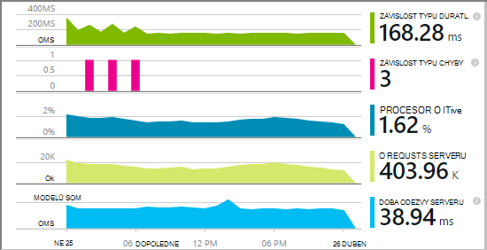

Máte na výběr tři směruje použít aplikace přehledy k webovým aplikacím .NET:

* **Sestavení:** [Přidání aplikace přehledy SDK] [greenbrown] kódu web app. 
* **Běhu:** Nástroje webovou aplikaci na serveru, jak je popsáno níže, bez opětovné vytvoření a opětovné nasazení kódu.
* **Obojí:** Vytvořte v SDK do kódu web app a také použít běhu rozšíření. Vytěžit maximum obou možnostech. 

Tady je přehled dostanete tak, že každý postup:

||Vytvoření času|Doba běhu|
|---|---|---|
|Žádosti o & výjimky|Ano|Ano|
|[Podrobnější výjimky](app-insights-asp-net-exceptions.md)||Ano|
|[Závislost typu diagnostiky](app-insights-asp-net-dependencies.md)|Na .NET 4.6 +|Ano|
|[Systém výkonnosti](app-insights-performance-counters.md)||Služby IIS nebo Azure cloudové služby, není Azure web appu|
|[Rozhraní API pro vlastní telemetrie][api]|Ano||
|[Sledování protokolu integrace](app-insights-asp-net-trace-logs.md)|Ano||
|[Zobrazení a uživatel data stránky](app-insights-javascript.md)|Ano||
|Není nutné znovu vytvořit kód|Ne||

## Nástroje webovou aplikaci za běhu

Je třeba [Microsoft Azure](http://azure.com) předplatné.

### Pokud je aplikace Azure webových aplikací nebo cloudové služby

* Vyberte aplikaci přehledy aplikace na ovládací panely v Azure. 

    [Další informace](app-insights-azure.md).

### Pokud aplikace je hostitelem vašeho serveru IIS

1. Na webovém serveru IIS Přihlaste se pomocí přihlašovacích údajů správce.
2. Stáhněte si a spusťte [Instalační služby systému sledování stavu](http://go.microsoft.com/fwlink/?LinkId=506648).
4. V dialogovém okně Průvodce Přihlaste se k Microsoft Azure.

    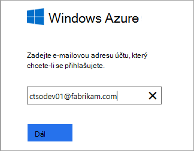

    *Chyby připojení? Viz [Poradce při potížích](#troubleshooting).*

5. Vyberte nainstalované webové aplikace nebo web, který chcete sledovat, a konfigurace prostředků, ve kterém chcete výsledky zobrazit v portálu přehledy aplikace.

    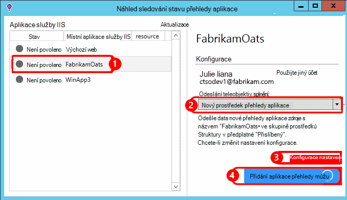

    Za normálních okolností rozhodnete konfigurace nový zdroj a [pole Skupina zdroje][roles].

    V opačném použít existující zdroj Pokud jste už nastavili [testuje web] [ availability] pro váš web nebo [webový klient sledování][client].

6. Restartujte službu IIS.

    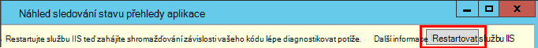

    Na krátkou chvíli se přerušilo webové služby.

6. Všimněte si, že ApplicationInsights.config byly vloženy do webové aplikace, které chcete sledovat.

    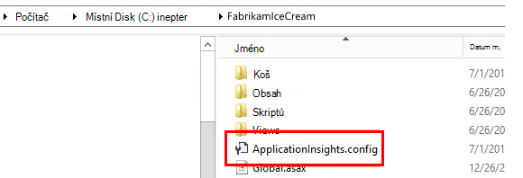

   Existují také některé změny web.config.

#### Chcete (opětovné) nakonfigurovat později?

Po dokončení průvodce můžete znovu nakonfigurujete agent kdykoli budete chtít. Můžete taky použít toto Pokud jste si nainstalovali agent, ale došlo některé problémy s počáteční instalace.

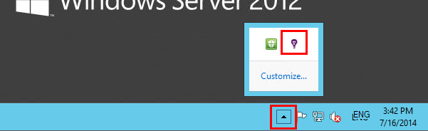

## Zobrazení výkonu telemetrie

Přihlaste se k [portálu Azure](https://portal.azure.com), vyhledejte aplikaci přehledy a otevřete prostředek, který jste vytvořili.

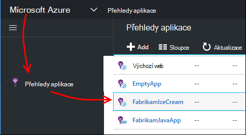

Otevřete zásuvné výkonu zobrazíte žádost, doba odezvy, závislost typu a dalších dat.

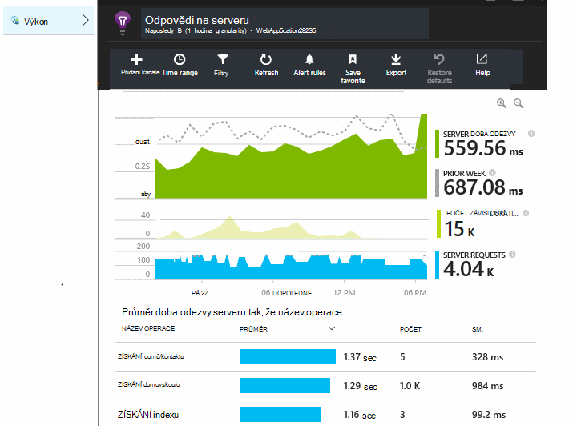

Klikněte na graf otevřete podrobné zobrazení.

Můžete provést tyto akce [Upravit, změna uspořádání, uložte](app-insights-metrics-explorer.md), a připněte grafů nebo celé zásuvné do [řídicího panelu](app-insights-dashboards.md).

## Závislosti

Doba trvání závislosti graf zobrazuje dobu trvání voláním z aplikace pro externí součásti například databází a rozhraní REST API, úložišti objektů blob Azure.

Rozdělit grafu tak, že volání do různých závislosti: upravit graf, zapněte seskupení a potom seskupit závislosti, typ závislosti nebo závislost výkonu.

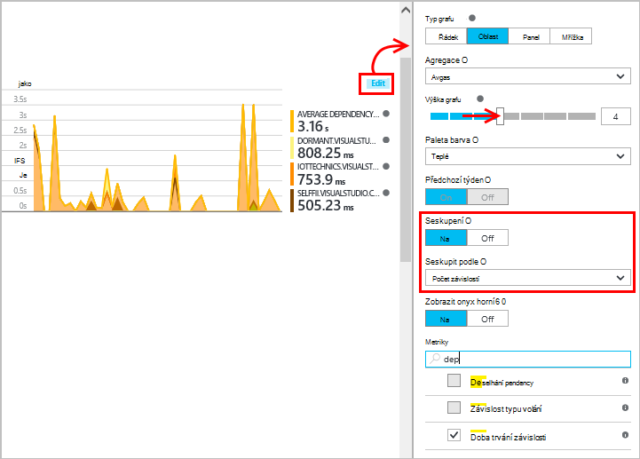

## Výkonnosti 

(Ne pro Azure webových aplikací web apps.) Klikněte na položku servery na zásuvné Přehled zobrazíte grafy výkonnosti serveru například využití procesoru držby a paměti.

Pokud ještě několika instancí serveru můžete upravit grafy zařadit do skupiny rolí instancí.

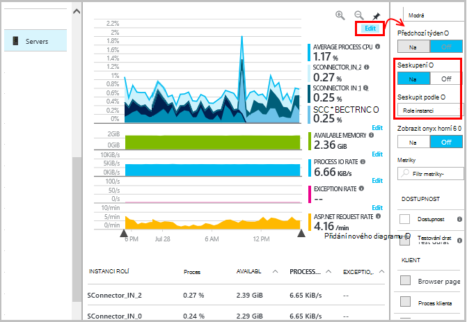

Můžete také [změnit nastavení, které jsou uvedeny tak, že v SDK výkonnosti](app-insights-configuration-with-applicationinsights-config.md#nuget-package-3). 

## Výjimky

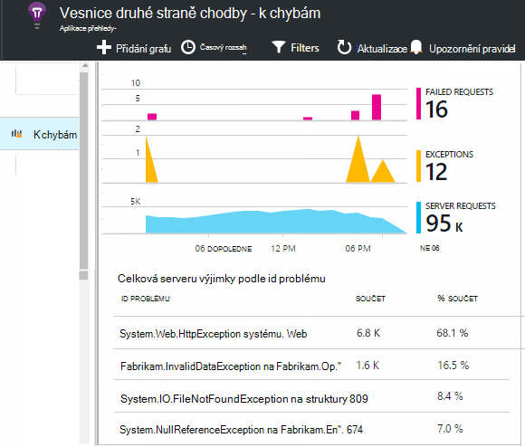

Můžete procházet hierarchii na konkrétní výjimky (z posledních sedmi dnů) a získat zásobníku trasování a data kontextu.

## Analytický nástroj vzorkování

Pokud používáte aplikaci přehledy SDK 2.0.0-beta3 verze technologie ASP.NET nebo novější aplikace odešle velké množství dat, může funkce adaptivní analytický nástroj vzorkování ovládání a odeslat jenom procento vaší telemetrie. [Další informace o odběr.](app-insights-sampling.md)

## Řešení potíží

### Připojení chyby

Musíte při otevření [některé odchozí portů](app-insights-ip-addresses.md#outgoing-ports) brány firewall váš server umožníte stav sledování práce.

### Žádné telemetrie?

  * Umožňuje generovat některá data webu.
  * Počkejte několik minut, aby data se ukládají a potom klikněte na **Aktualizovat**.
  * Otevřete diagnostiky hledání (dlaždici hledání) zobrazíte jednotlivých událostí. Události jsou viditelné diagnostiky hledání často před agregace dat se zobrazí v grafu.
  * Otevřete sledování stavu a vyberte aplikaci v levém podokně. Zkontrolujte, jestli jsou všechny zprávy diagnostických nástrojů pro tuto aplikaci v části "Konfigurace oznámení":

  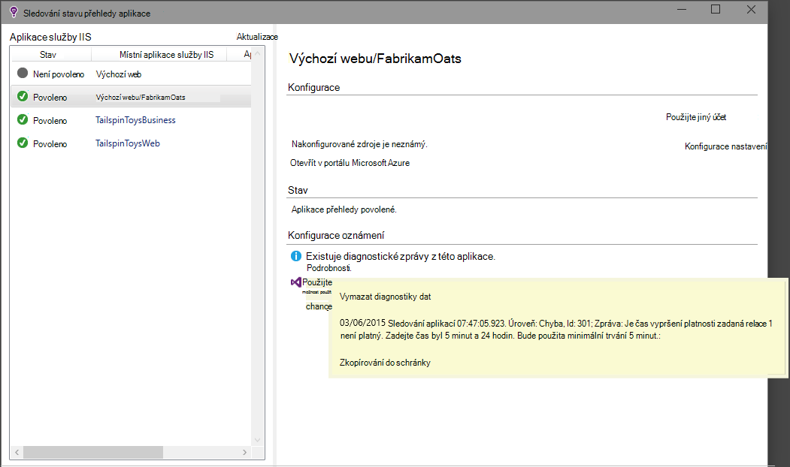

  * Zkontrolujte, že brány firewall serveru povolí odchozí přenosy dat pro porty výše uvedené.
  * Na serveru Pokud se zobrazí zpráva o "dostatečná oprávnění", zkuste toto:
    * Ve Správci služby IIS vyberte fondu aplikací, otevřete **Upřesnit nastavení**a pod **Process Modeling** si všimněte identitě.
    * V počítači správy ovládací panely přidáte tento identitu skupiny uživatelů sledování výkonu.
  * Pokud máte na serveru nainstalovány MMA/SCOM, může dojít ke konfliktu některých verzí. Odinstalujte SCOM a sledování stavu a znovu nainstalujte nejnovější verze.
  * Viz [Poradce při potížích][qna].

## Požadavky na systém

Podpora OS pro sledování stavu přehledy aplikace na serveru:

- Windows Server 2008
- Windows Server 2008 R2
- Windows Server 2012
- Windows serveru 2012 R2

s nejnovějšími SP .NET Framework 4.0 a 4.5

Na straně klienta Windows 7, 8 a 8.1, znova se .NET Framework 4.0 a 4.5

Podpora služby IIS je: IIS 7 7.5, 8, 8.5 (IIS požaduje)

## Automatizace pomocí prostředí PowerShell

Můžete spustit a zastavit sledování pomocí prostředí PowerShell na serveru IIS.

Nejdřív importujte modul přehledy aplikace:

`Import-Module 'C:\Program Files\Microsoft Application Insights\Status Monitor\PowerShell\Microsoft.Diagnostics.Agent.StatusMonitor.PowerShell.dll'`

Zjistěte, se kterými aplikacemi jsou sledován:

`Get-ApplicationInsightsMonitoringStatus [-Name appName]`

* `-Name`(Volitelné) Název do webových aplikací.
* Zobrazí aplikace přehledy sledování stavu pro každý web app (nebo aplikaci pojmenované) v tomto serveru IIS.

* Vrátí `ApplicationInsightsApplication` pro jednotlivé aplikace:
 * `SdkState==EnabledAfterDeployment`: Aplikace je sledován a byla využívá na běhu, buď pomocí nástroje pro sledování stavu, nebo `Start-ApplicationInsightsMonitoring`.
 * `SdkState==Disabled`: Aplikaci nejsou podporovány pro přehledy aplikace. Nikdy instrumented nebo sledování běhu byl zakázán pomocí nástroje pro sledování stavu nebo s `Stop-ApplicationInsightsMonitoring`.
 * `SdkState==EnabledByCodeInstrumentation`: Aplikaci byl podporovány přidáním SDK zdrojového kódu. Jeho SDK nelze aktualizovat nebo zastavit.
 * `SdkVersion`Zobrazuje verzi se používá pro sledování této aplikace.
 * `LatestAvailableSdkVersion`Zobrazuje verzi aktuálně dostupné v galerii NuGet. Upgrade aplikace na tuto verzi, můžete `Update-ApplicationInsightsMonitoring`.

`Start-ApplicationInsightsMonitoring -Name appName -InstrumentationKey 00000000-000-000-000-0000000`

* `-Name`Název aplikace ve službě IIS
* `-InstrumentationKey`Ikey zdrojů aplikace přehledy místo, kam chcete výsledky zobrazovat.

* Tato rutina ovlivní pouze aplikace, které nejsou už vybavit přístroji – tedy SdkState == NotInstrumented.

    Rutiny nemá vliv na aplikaci, která už využívá, v čase sestavit přidáním SDK kódu nebo za běhu pomocí předchozího tuto rutinu.

    Verze SDK použitá k nástroje aplikace je verze naposledy staženou na tomto serveru.

    Pokud si Pokud chcete stáhnout nejnovější verzi, použijte aktualizace ApplicationInsightsVersion.

* Vrátí `ApplicationInsightsApplication` na úspěšné. Pokud se nezdaří, zaznamená trasování do stderr.

    
          Name                      : Default Web Site/WebApp1
          InstrumentationKey        : 00000000-0000-0000-0000-000000000000
          ProfilerState             : ApplicationInsights
          SdkState                  : EnabledAfterDeployment
          SdkVersion                : 1.2.1
          LatestAvailableSdkVersion : 1.2.3

`Stop-ApplicationInsightsMonitoring [-Name appName | -All]`

* `-Name`Název aplikace ve službě IIS
* `-All`Ukončení sledování všech aplikací na tomto serveru IIS jehož`SdkState==EnabledAfterDeployment`

* Ukončení sledování zadaný aplikace a odstraní přístrojového vybavení. Ho jde použít pouze pro aplikace, které byly vybavit přístroji při spuštění pomocí nástroje pro sledování stavu nebo Start ApplicationInsightsApplication. (`SdkState==EnabledAfterDeployment`)

* Vrátí ApplicationInsightsApplication.

`Update-ApplicationInsightsMonitoring -Name appName [-InstrumentationKey "0000000-0000-000-000-0000"`]

* `-Name`: Název do webových aplikací ve službě IIS.
* `-InstrumentationKey`(Volitelné). Slouží k Změna zdroje, ke kterému se odesílá telemetrie v aplikaci.
* Tuto rutinu:
 * Upgrade aplikace pojmenované verzi SDK naposledy stáhnout, na tomto počítači. (Funguje, jenom když `SdkState==EnabledAfterDeployment`)
 * Pokud zadáte klíč přístrojového vybavení, pojmenované aplikace překonfigurovat odešlete telemetrie zdroje s tuto klávesu. (Jde použít v případě `SdkState != Disabled`)

`Update-ApplicationInsightsVersion`

* Na server je možné stáhnout nejnovější přehledy SDK aplikace.

## Další kroky

* [Vytvořit web testy] [ availability] a ujistěte se, zůstane živou webu.
* [Hledání událostí a protokolování] [ diagnostic] lépe diagnostikovat potíže.
* [Přidání webových klientů telemetrie] [ usage] zobrazíte výjimky z webové stránky kódu a umožňují vložení sledování volání.
* [Přidání aplikace přehledy SDK kódu webové služby] [ greenbrown] tak, aby vložíte sledování a protokolů volání v kódu serveru.

<!--Link references-->

[api]: app-insights-api-custom-events-metrics.md
[availability]: app-insights-monitor-web-app-availability.md
[client]: app-insights-javascript.md
[diagnostic]: app-insights-diagnostic-search.md
[greenbrown]: app-insights-asp-net.md
[qna]: app-insights-troubleshoot-faq.md
[roles]: app-insights-resources-roles-access-control.md
[usage]: app-insights-web-track-usage.md
