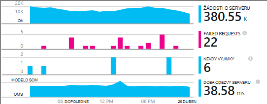
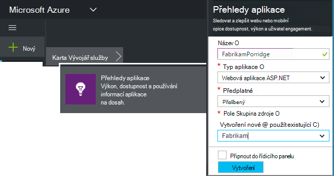
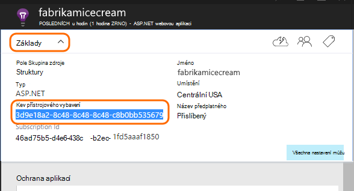
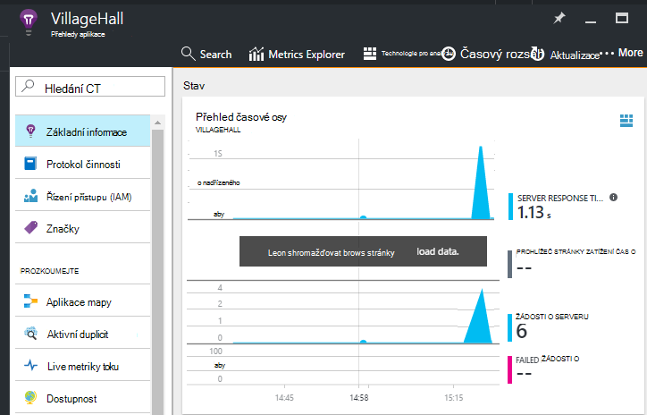

<properties
    pageTitle="Přidání aplikace přehledy SDK sledování aplikace Node.js | Microsoft Azure"
    description="Analýzu použití, dostupnost místní nebo webové aplikace Microsoft Azure s přehledy aplikace."
    services="application-insights"
    documentationCenter=""
    authors="alancameronwills"
    manager="douge"/>

<tags
    ms.service="application-insights"
    ms.workload="tbd"
    ms.tgt_pltfrm="ibiza"
    ms.devlang="na"
    ms.topic="get-started-article"
    ms.date="08/30/2016"
    ms.author="awills"/>


# <a name="add-application-insights-sdk-to-monitor-your-nodejs-app"></a>Přidání aplikace přehledy SDK sledování Node.js aplikace

*Přehledy aplikace je v náhledu.*

[Přehledy aplikace Visual Studio](app-insights-overview.md) sleduje živou aplikaci tak, aby vám pomohou [zjistit a diagnostikovat potíže s výkonem a výjimky](app-insights-detect-triage-diagnose.md)a [Seznamte se s použití aplikace](app-insights-overview-usage.md). To funguje pro aplikace, které jsou hostované na vlastní místního serveru IIS servery nebo na Azure VMs, jakož i Azure webových aplikacích.


V SDK poskytuje automatické kolekce příchozí sazby žádost HTTP a odpovědí, výkonnosti (procesoru, paměti, RPS) a neošetřené výjimky. Kromě toho můžete přidat vlastní volání ke sledování závislosti, metriky nebo jiné události.




#### <a name="before-you-start"></a>Než začnete

Potřebuješ:

* Visual Studio 2013 nebo novější. Dál je lepší.
* Předplatné [Microsoft Azure](http://azure.com). Pokud váš tým nebo organizace má předplatné Azure, vlastník můžete přidat můžete k ní pomocí svého [účtu Microsoft](http://live.com).

## <a name="add"></a>Vytvoření aplikace přehledy zdroje

Přihlaste se k [portálu Azure][portal]a vytvořit nové přehledy aplikace zdroje. [Zdroje] [ roles] v Azure je instancí služby. Kde analyzovat a prezentovat vám telemetrie z aplikace je tento zdroj.



Vyberte jako typ aplikace. Volba typu aplikace nastaví výchozí obsah listy zdroje a vlastností viditelné v [Průzkumníku metriky][metrics].

#### <a name="copy-the-instrumentation-key"></a>Kopírování klávesu přístrojového vybavení

Klíč označuje zdroj a budete ji nainstalovat brzy bude k dispozici v SDK směrování dat tomuto zdroji.




## <a name="sdk"></a>Instalace SDK v aplikaci

```
npm install applicationinsights --save
```

## <a name="usage"></a>Použití

To umožní žádost o sledování neošetřené výjimce sledování a výkon systému sledování (procesoru a paměti/RPS).

```javascript

var appInsights = require("applicationinsights");
appInsights.setup("<instrumentation_key>").start();
```

Klíč přístrojového vybavení můžete nastavit taky v prostředí proměnné APPINSIGHTS_INSTRUMENTATIONKEY. Důvodem je, žádný argument je potřeba při volání `appInsights.setup()` nebo `appInsights.getClient()`.

Zkusíte v SDK bez odeslání telemetrie: nastavit klíč přístrojového vybavení prázdný řetězec.


## <a name="run"></a>Spuštění projektu

Spusťte aplikaci a vyzkoušet si: Otevřete různých stránkách generovat některé telemetrie.


## <a name="monitor"></a>Zobrazení vašeho telemetrie

Vraťte se do [portálu Azure](https://portal.azure.com) a vyhledejte aplikaci přehledy zdroje.


Hledejte data na stránce Přehled. Nejdřív uvidíte jenom jednou nebo dvěma body. Příklad:



Proklikejte grafu zobrazíte podrobnější metriky. [Další informace o metriky.][perf]

#### <a name="no-data"></a>Žádná data?

* Používání aplikace otevření jiné stránky, aby vygeneruje některé telemetrie.
* Otevřete dlaždici [hledání](app-insights-diagnostic-search.md) zobrazíte jednotlivých událostí. Někdy trvá události trochu během delší dostanou přes metriky kanálu.
* Počkejte několik sekund, než a klikněte na **Aktualizovat**. Grafy aktualizovat sami pravidelně, ale můžete v případě, že tam čekáte pro některá data neprojeví ručně aktualizovat.
* Viz [Poradce při potížích][qna].

## <a name="publish-your-app"></a>Publikování aplikace

Teď nasazení aplikace služby IIS nebo Azure a sledování dat nahromadit.


#### <a name="no-data-after-you-publish-to-your-server"></a>Žádná data po publikování na serveru?

Otevřete tyto porty pro odchozí přenosy dat v bráně firewall vaší serveru:

+ `dc.services.visualstudio.com:443`
+ `f5.services.visualstudio.com:443`


#### <a name="trouble-on-your-build-server"></a>Máte potíže s na serveru vytvořit?

Přečtěte si téma [tuto položku Poradce při potížích](app-insights-asp-net-troubleshoot-no-data.md#NuGetBuild).


## <a name="customized-usage"></a>Přizpůsobené použití 

### <a name="disabling-auto-collection"></a>Zakázání automatického kolekce

```javascript
import appInsights = require("applicationinsights");
appInsights.setup("<instrumentation_key>")
    .setAutoCollectRequests(false)
    .setAutoCollectPerformance(false)
    .setAutoCollectExceptions(false)
    // no telemetry will be sent until .start() is called
    .start();
```

### <a name="custom-monitoring"></a>Vlastní sledování

```javascript
import appInsights = require("applicationinsights");
var client = appInsights.getClient();

client.trackEvent("custom event", {customProperty: "custom property value"});
client.trackException(new Error("handled exceptions can be logged with this method"));
client.trackMetric("custom metric", 3);
client.trackTrace("trace message");
```

[Další informace o telemetrie rozhraní API](app-insights-api-custom-events-metrics.md).

### <a name="using-multiple-instrumentation-keys"></a>Použití několika kláves přístrojového vybavení

```javascript
import appInsights = require("applicationinsights");

// configure auto-collection with one instrumentation key
appInsights.setup("<instrumentation_key>").start();

// get a client for another instrumentation key
var otherClient = appInsights.getClient("<other_instrumentation_key>");
otherClient.trackEvent("custom event");
```

## <a name="examples"></a>Příklady

### <a name="tracking-dependency"></a>Sledování závislostí

```javascript
import appInsights = require("applicationinsights");
var client = appInsights.getClient();

var startTime = Date.now();
// execute dependency call
var endTime = Date.now();

var elapsedTime = endTime - startTime;
var success = true;
client.trackDependency("dependency name", "command name", elapsedTime, success);
```


### <a name="manual-request-tracking-of-all-get-requests"></a>Ruční žádost sledovat všechny žádosti o "Získat"

```javascript
var http = require("http");
var appInsights = require("applicationinsights");
appInsights.setup("<instrumentation_key>")
    .setAutoCollectRequests(false) // disable auto-collection of requests for this example
    .start();

// assign common properties to all telemetry sent from the default client
appInsights.client.commonProperties = {
    environment: process.env.SOME_ENV_VARIABLE
};

// track a system startup event
appInsights.client.trackEvent("server start");

// create server
var port = process.env.port || 1337
var server = http.createServer(function (req, res) {
    // track all "GET" requests
    if(req.method === "GET") {
        appInsights.client.trackRequest(req, res);
    }

    res.writeHead(200, { "Content-Type": "text/plain" });
    res.end("Hello World\n");
}).listen(port);

// track startup time of the server as a custom metric
var start = +new Date;
server.on("listening", () => {
    var end = +new Date;
    var duration = end - start;
    appInsights.client.trackMetric("StartupTime", duration);
});
```

## <a name="next-steps"></a>Další kroky

* [Sledování telemetrie na portálu](app-insights-dashboards.md)
* [Přepsat vaše telemetrie analýzy dotazů](app-insights-analytics-tour.md)


<!--Link references-->

[knowUsers]: app-insights-overview-usage.md
[metrics]: app-insights-metrics-explorer.md
[perf]: app-insights-web-monitor-performance.md
[portal]: http://portal.azure.com/
[qna]: app-insights-troubleshoot-faq.md
[roles]: app-insights-resources-roles-access-control.md
