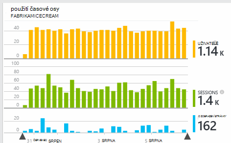

<properties
    pageTitle="Použití analýzy pomocí aplikace přehledy"
    description="Přehled analýzy využití s přehledy aplikace"
    services="application-insights"
    documentationCenter=""
    authors="alancameronwills"
    manager="douge"/>

<tags
    ms.service="application-insights"
    ms.workload="tbd"
    ms.tgt_pltfrm="ibiza"
    ms.devlang="multiple"
    ms.topic="article" 
    ms.date="04/08/2016"
    ms.author="awills"/>

# Použití analýzy pomocí aplikace přehledy

Víte, jak můžou uživatelé používat aplikaci můžete zaměřit vývojové práce na scénáře, které jsou důležité k nim a získat podstatu cílů, které by nějak jednodušší nebo obtížnější dosáhnout.

Aplikace přehledy můžete poskytnout Vymazat přehled použití aplikace, pomůže vám usnadní datům vašich uživatelů a zahájit obchodní cíle.

Aplikace přehledy funguje i samostatné aplikace (v iOS, Android a Windows) a webových aplikací (hostitelem .NET nebo J2EE). 

## Přidání aplikace přehledy do projektu

Na začátku potřebujete bezplatný účet s [Microsoft Azure](https://azure.com). (Po uplynutí zkušebního období, můžete pokračovat v bezplatné osy službu.)

[Azure portál](https://portal.azure.com)vytvořte přehledy aplikace zdroje. Toto je, kde uvidíte použití a výkonu dat o svoji aplikaci.

**Pokud je aplikace zařízení aplikaci** přidat SDK přehledy aplikace do projektu. Přesný postup se liší podle [integrovaném vývojovém prostředí, tak i platformu](app-insights-platforms.md). Pro aplikace systému Windows jednoduše klikněte pravým tlačítkem myši na projekt ve Visual Studiu a zvolte "Přidat aplikaci přehledy."

**Pokud je web app a** otevřete zásuvné rychlý Start a získání kódu pro přidání webových stránek. Je znova publikujte s Tento fragment kódu.

Můžete také přidat aplikaci přehledy [ASP.NET](app-insights-asp-net.md) nebo [J2EE](app-insights-java-get-started.md) kódu server tak, aby se sloučení telemetrie z klienta a serveru.

### Spuštění projektu a zobrazit první výsledky

Spuštění projektu v režimu ladění pro několik minut, přejděte na [portál Azure](https://portal.azure.com) a přejděte na zdroj projektu v aplikaci přehledy.

Publikování aplikace další telemetrie a zjistit, co dělají vaši uživatelé s aplikací.

## Technologie pro analýzu mimo pole

Klikněte na dlaždici zobrazení stránky zobrazíte podrobnostmi používání.

Najeďte myší na prázdné místo nad grafu zobrazíte počty na určitém místě. V opačném čísla zobrazit hodnotu agregované období, například na průměr, celkových nebo počet různých uživatelé období.

Ve webových aplikacích uživatelé počítají pomocí soubory cookie. Osoba, která používá několik prohlížeče vymaže soubory cookie a používá funkci ochrany osobních údajů ke spočítání několikrát.

Relace webových se počítá po 30 minutách nečinnosti. Relace na telefon nebo jiné zařízení se počítá, kdy je pozastavené aplikace na několik sekund.

Proklikejte grafu zobrazíte více podrobností. Příklad:

(V tomto příkladu je z webu, ale vypadat podobně jako u aplikace spuštěné v operačním systému zařízení grafy.)

Porovnání s předchozí týden zobrazíte, když měníte věci:

Porovnání dvou metriky, například uživatelů a nové uživatele:

Data skupiny (segment) tak, že vlastnost například prohlížeče, operačního systému nebo City:

## Použití stránky

Klikněte na zobrazení stránky dlaždice pro získání rozdělení nejoblíbenější stránek:

Z příkladu výše se z webu her. Z něho okamžitě vidíme:

* Použití nebyla lepší v uplynulém týdnu. Možná jsme měli vzít v úvahu optimalizaci vyhledávacích webů?
* Mnoho méně uživatelů najdete na stránkách her než na domovskou stránku. Proč není domovské stránky zajistit všichni přehrát her?
* "Luštitele" je nejoblíbenější hry. Jsme by měl přednostně nové nápady a vylepšení tam.

## Vlastní sledování

Předpokládejme, že místo provádění každé hry v samostatnou webovou stránku, se rozhodnete Refaktorovat všechny do aplikace stejné jednostránkové s většina funkcí kódovaný jako JavaScriptu na webovou stránku. To umožňuje uživateli rychle přepínat mezi jeden hra nebo i několik her mít na jedné stránce.

Rádi byste však pořád aplikace přehledy přihlásit toho, kolikrát každé hry otevřené, přesně stejným způsobem jako při byly na samostatnou webovou stránku. To je snadné: jenom vložení volání modulu telemetrie do svého JavaScript místo, kam chcete záznam, který uživatel otevřel nové "stránky":

    telemetryClient.trackPageView(game.Name);

## Vlastní události

Telemetrie můžete použít různými způsoby pochopit, jak aplikace držitelem se používá. Ale vždy nechcete nesprávné zprávy s zobrazení stránky. Místo toho používejte vlastní události. Můžete jim poslat z aplikace zařízení, webové stránky nebo na webový server:

(JavaScript)

    telemetryClient.trackEvent("GameEnd");

(C#)

    var tc = new Microsoft.ApplicationInsights.TelemetryClient();
    tc.TrackEvent("GameEnd");

(VB)

    Dim tc = New Microsoft.ApplicationInsights.TelemetryClient()
    tc.TrackEvent("GameEnd")

Nejčastěji používané vlastní události, najdete na zásuvné Přehled.

Klikněte na záhlaví v tabulce zobrazíte celkový počet události. Graf můžete rozdělit podle různých atributů, například název události:

Užitečné funkce časové osy s obrázky je, že změny můžete porovnat s jinými metriky a události. Například v době, kdy se přehrávají další her, můžete čekat zobrazíte nárůst opuštěné her stejně. Ale nárůst opuštěné her neúměrné je budete chtít zjistit, zda velkém zatížení způsobuje problémy, které uživatelé najít nepřijatelná.

## Procházejte zvláštní události

Získat lepší znalost jak typický relace půjde, můžete zaměřit na relaci určitého uživatele, který obsahuje určitou druhu události.

V tomto příkladu jsme kódovaný vlastní události "NoGame", která se nazývá, pokud se uživatel přihlásí bez skutečného zahájení hry. Proč byste měli uživatele to udělat? Pokud nám procházejte některé zvláštní události, jsme možná zobrazí chyba potvrzením.

Vlastní události dostali z aplikace jsou uvedeny podle názvu na zásuvné základní informace:

Proklikejte se události úrok a vyberte poslední konkrétní výskyt:

Podívejme se na všechny telemetrie relaci došlo k danou NoGame událost.

Došlo k žádné výjimky tak, aby uživateli nebyl zabráněno přehrávání některé selháním.

Jsme odfiltrovat všechny typy telemetrie kromě zobrazení stránky pro tuto relaci:

A teď vidíme, že tento uživatel přihlášena jednoduše ke kontrole nejnovější skóre. Možná jsme byste měli vědět vývoj příběhu uživatele, který usnadňuje to udělat. (A dojde určitého textu jsme měli implementovat vlastní událost do sestavy)

## Filtrování, hledání a segmentech dat s vlastnostmi
Libovolný značky a číselné hodnoty můžete připojení k události.

JavaScriptu na klienta

    appInsights.trackEvent("WinGame",
        // String properties:
        {Game: currentGame.name, Difficulty: currentGame.difficulty},
        // Numeric measurements:
        {Score: currentGame.score, Opponents: currentGame.opponentCount}
    );

C# na serveru

    // Set up some properties:
    var properties = new Dictionary <string, string>
        {{"game", currentGame.Name}, {"difficulty", currentGame.Difficulty}};
    var measurements = new Dictionary <string, double>
        {{"Score", currentGame.Score}, {"Opponents", currentGame.OpponentCount}};

    // Send the event:
    telemetry.TrackEvent("WinGame", properties, measurements);

VB na serveru

    ' Set up some properties:
    Dim properties = New Dictionary (Of String, String)
    properties.Add("game", currentGame.Name)
    properties.Add("difficulty", currentGame.Difficulty)

    Dim measurements = New Dictionary (Of String, Double)
    measurements.Add("Score", currentGame.Score)
    measurements.Add("Opponents", currentGame.OpponentCount)

    ' Send the event:
    telemetry.TrackEvent("WinGame", properties, measurements)

Vlastnosti připojení k zobrazení stránky stejným způsobem:

JavaScriptu na klienta

    appInsights.trackPageView("Win",
        {Game: currentGame.Name},
        {Score: currentGame.Score});

Do pole diagnostiky hledání zobrazte vlastnosti po kliknutí na Procházet jednotlivé výskyt události.

Zobrazíte výskyty události s hodnotou nemovitosti konkrétní pomocí vyhledávacího pole.

## A | Testování B

Pokud si nejste jisti, jakou variantu funkce bude úspěšnější, uvolněte oba, díky každý přístupné pro jiné uživatele. Měřit úspěšnost každé a pak posuňte jednotné verzi.

Pro tento postup připojíte různých značky všechny telemetrie odesílané ve všech verzích aplikace. Můžete to udělat tak, že definování vlastností v aktivním TelemetryContext. Tyto vlastnosti výchozí se přidají do každé telemetrie zprávy, která odešle žádost – nejenom vlastní zprávy, ale i standardní telemetrie.

Na portálu aplikace přehledy potom budete moct filtr a seskupení (segment) data značek tak, aby porovnat v různých verzích Excelu.

C# na serveru

    using Microsoft.ApplicationInsights.DataContracts;

    var context = new TelemetryContext();
    context.Properties["Game"] = currentGame.Name;
    var telemetry = new TelemetryClient(context);
    // Now all telemetry will automatically be sent with the context property:
    telemetry.TrackEvent("WinGame");

VB na serveru

    Dim context = New TelemetryContext
    context.Properties("Game") = currentGame.Name
    Dim telemetry = New TelemetryClient(context)
    ' Now all telemetry will automatically be sent with the context property:
    telemetry.TrackEvent("WinGame")

Jednotlivé telemetrie můžete změnit výchozí hodnoty.

Univerzální inicializační můžete nastavit tak, aby všechny nové TelemetryClients automaticky používat kontext.

    // Telemetry initializer class
    public class MyTelemetryInitializer : ITelemetryInitializer
    {
        public void Initialize (ITelemetry telemetry)
        {
            telemetry.Properties["AppVersion"] = "v2.1";
        }
    }

V inicializačním aplikace například Global.asax.cs:

    protected void Application_Start()
    {
        // ...
        TelemetryConfiguration.Active.TelemetryInitializers
        .Add(new MyTelemetryInitializer());
    }

## Sestavení – míra – informace

Při použití technologie pro analýzu bude integrovanou součástí cyklu vývoje – stačí něco si myslíte o k řešení problémů. Tady je několik tipů:

* Určení klíčové míru aplikace. Budete chtít tolik uživatelé největšímu nebo dáváte přednost kratších seznamů všechno uživatelů? Chcete maximalizovat návštěvy nebo prodeje?
* Chcete změřit každý článek. Při vytváření náčrtků příběhu nového uživatele nebo funkce nebo plán aktualizace již existujícího vždy popřemýšlet o tom, jak bude měřit úspěšnost změny. Před kódování spustí, zeptejte se "jaký vliv bude to mít naše metrice, pokud to funguje? Vhodné jsme sledovat všechny nové zvláštní události?"
A samozřejmě, je-li funkci živou, zkontrolujte, podívejte se na analýz a pracovat na stránce výsledků.
* Jiné metriky týkají klíčové míru. Například, pokud chcete přidat funkci "Oblíbené", rádi byste vědět, jak často uživatelé přidávat oblíbené položky. Pořád možná další zajímavé vědět, jak často se vraťte na své oblíbené položky. A co je nejdůležitější, se zákazníky, kteří používají Oblíbené položky nakonec koupit většího počtu produktů?
* Kanárských testování. Nastavte si funkce přepínač, který umožňuje vytvořit novou funkci zobrazuje jenom někteří uživatelé. Pomocí aplikace přehledy uvidíte novou funkci používá způsobem, který jste právě zamýšlená. Úpravy a potom uvolněte širší cílové skupině.
* Obraťte se na vaši uživatelé! Technologie pro analýzu není dost na vlastní, ale doplňkovou na údržbu relace dobré zákazníka.

## Víc se uč

* [Zjištění, protřídit a diagnostice havaruje a problémy s výkonem v aplikaci](app-insights-detect-triage-diagnose.md)
* [Začínáme s aplikací přehledy na mnoha platformách](app-insights-detect-triage-diagnose.md)

## Video

> [AZURE.VIDEO usage-monitoring-application-insights]

 
