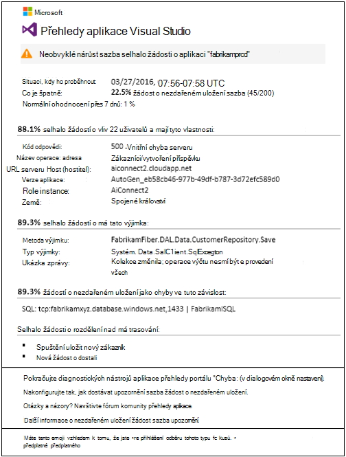
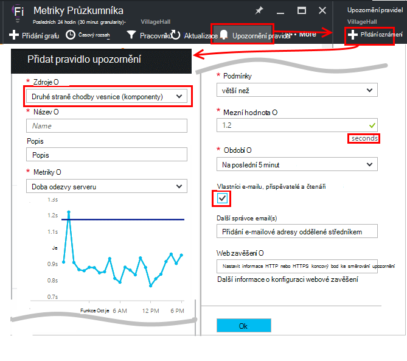

<properties 
    pageTitle="Kurz přehledy aplikace | Microsoft Azure" 
    description="Sledovat použití a výkonu živou webové aplikace.  Zjistit, protřídit a diagnostikovat potíže. Neustále sledovat a zlepšit úspěchu s jinými uživateli." 
    services="application-insights" 
    documentationCenter=""
    authors="alancameronwills" 
    manager="douge"/>

<tags 
    ms.service="application-insights" 
    ms.workload="tbd" 
    ms.tgt_pltfrm="ibiza" 
    ms.devlang="na" 
    ms.topic="article" 
    ms.date="10/15/2016" 
    ms.author="awills"/>
 
# Aplikace přehledy – Úvod

Přehledy aplikace Visual Studio je služba extensible analýzy, která sleduje živou webové aplikace. S nimi můžete zjistit a diagnostikovat potíže s výkonem a porozumět tomu, co uživatelé skutečně dělat s aplikací. Je určený pro vývojáře pomáhají nepřetržitě zlepšit výkon a použitelnosti. To funguje pro aplikace z nejrůznějších platformách včetně .NET, Node.js J2EE, hostitelem místní nebo v cloudu. 

[Podívejte se na úvodní animaci](https://www.youtube.com/watch?v=fX2NtGrh-Y0).

## Jak to funguje?

Instalace balíčku malé přístrojového vybavení v aplikaci a nastavení aplikace přehledy zdroje na portálu Microsoft Azure. Přístrojového vybavení sleduje aplikace a odešle telemetrickými daty k portálu. Na portálu zobrazuje statistické grafy a poskytuje nástroje hledání výkonné k diagnostice problémy.

Aplikace přehledy obsahuje několik [Standardní přístrojového vybavení moduly](app-insights-configuration-with-applicationinsights-config.md) shromažďovat různé typy telemetrie například doby odezvy žádost, výjimky a závislost volání. Můžete také [kódu odeslat vlastní telemetrie](app-insights-api-custom-events-metrics.md) k portálu.

### Co je režijních?

Dopad na výkon vaše aplikace je příliš malý. Sledování volání jsou mimo blokování, dávce a Odeslaná pošta v samostatném vlákna. 

## Co to dělá?

Aplikace přehledy směřuje vývojový tým vám pomůže pochopit, jak funguje aplikace a jak se používá. Umožňuje:

Typy telemetrie:

* Kurzy žádost HTTP, doby odezvy, úspěšnosti.
* Závislost typu (HTTP & SQL) zavolejte sazby, doby odezvy, úspěšnosti.
* Trasování výjimka ze serveru a klientských.
* Trasování diagnostickém protokolu.
* Zobrazení stránky spočítá počet uživatelů a relace, prohlížeče načítáním, výjimky.
* AJAX volání sazby, doby odezvy a úspěšnosti.
* Výkonnosti serveru.
* Vlastní klienta a serveru telemetrie.
* Segmentace umístění klienta, verze prohlížeče, operační systém verze, instance serveru, vlastní rozměry a další.
* Dostupnost testů

Diagnostické nástroje a analytické nástroje:

* Inteligentní a ruční oznámení o selhání a jiných metriky a na dostupnost.
* Grafy v čase agregované metriky.
* Diagnostiky hledání na výskytů požadavků, výjimek, vlastní události, protokolu trasování, zobrazení stránky, závislost a AJAX volá. 
* Technologie pro analýzu - výkonné dotazovací jazyk přes svůj telemetrie
* Řídicí panely – vytvořte grafy, budete muset sledovat všechny součásti aplikace.

## Jak se používá?

### Sledování

Instalace aplikace přehledy v webovou aplikaci, nastavte dostupnost webových testů a:

* Nastavte si řídicího panelu pro svou místnost některou týmu, abyste mohli sledovat na zatížení, rychlostí reakce a výkonu závislostí, načítání stránek prodloužit a AJAX volání. 
* Seznamte se s, které jsou nejnižší a většina žádosti o selhání.
* Když nasadíte nové verzi okamžitě vědět o všech snížení úrovně, podívejte se na živou proudu.

### Diagnostika

Když upozorněni, nebo Seznamte se s problému:

* K chybám sladit se výjimek, závislost volání a trasování.
* Prozkoumejte výpis zásobníku a sledování protokoly.

### Posuďte

Změřte účinnosti každou nových funkcí nasadíte.

* Chcete změřit, jak zákazníci používají nový činnosti koncového uživatele nebo funkcí business.
* Napište vlastní telemetrie do kódu přihlásit použití.
* Každý cyklu vývoje založit pevný důkaz z telemetrie.

## Začínáme

Přehledy aplikace je jednou z mnoha službám v Microsoft Azure a telemetrie odeslaný tam pro analýzu a prezentaci. Takže dříve, než je něco jiného, musíte mít předplatné [Microsoft Azure](http://azure.com). Je zadarmo zaregistrovat a můžete si vybrat bezplatné [ceny osy](https://azure.microsoft.com/pricing/details/application-insights/) z aplikace přehledy. Pokud vaše organizace už má předplatné, budou k němu přidat účtu Microsoft. 

Existuje několik způsobů, jak začít. Začněte podle toho, co je nejvhodnější pro vás. Můžete přidat na ostatní později.

* **V době spuštění: nástroje webovou aplikaci na serveru.** Zabrání všechny aktualizace kódu. Je třeba přístup správce serveru.
 * [**Služby IIS místní nebo na virtuálního počítače**](app-insights-monitor-performance-live-website-now.md)
 * [**Azure webových aplikací nebo OM**](app-insights-monitor-performance-live-website-now.md#if-your-app-runs-as-an-azure-web-app)
 * [**J2EE**](app-insights-java-live.md)
* **V době vývoje: Přidání aplikace přehledy kódu.** Umožňuje napsat vlastní telemetrie a nástroje back-end a aplikace klasické pracovní plochy.
 * Aktualizace 2013 [Visual Studio](app-insights-asp-net.md) 2 nebo novější.
 * Java [zatmění](app-insights-java-eclipse.md) nebo [Další nástroje](app-insights-java-get-started.md)
 * [Node.js](app-insights-nodejs.md)
 * [Dalších platformách](app-insights-platforms.md)
* Pro zobrazení stránky, AJAX a telemetrie další klientské **[Nástroje webové stránky](app-insights-javascript.md)** .
* **[Dostupnost testů](app-insights-monitor-web-app-availability.md)** - ping váš web pravidelně na naše servery.

> [AZURE.NOTE]  V tomto okamžiku jenom potřebujete k získání a experimentovat. Ale pokud chcete zobrazit, co můžete dělat přehledy aplikace, Čtěte dál...

## Prozkoumání metriky

Spusťte aplikaci – buď v režimu ladění v počítači vývoj nebo publikovat na serveru - a použijte určitou dobu. Přihlaste se k [portálu Azure](https://portal.azure.com).

Přejděte na zásuvné přehled aplikace přehledy vaší aplikace:

Přehled vám umožní zobrazit hned jak funguje aplikace. Je možné porovnávat zatížení (z hlediska rychlost požadavků) s časem aplikace příliš odpověď na žádosti. Pokud existuje neúměrné nárůst doba odezvy při přechodu načíst nahoru, můžete přiřadit další prostředky do aplikace. Jestliže se po nasazení nové sestavení další neúspěšných odpovědí doprava, můžete chtít vrátit zpět.

#### Získejte další informace

Proklikejte grafu, můžete získat další sady graf s dílčími pruhy. Například grafu doba odezvy serveru vede k grafů, které zobrazují žádost o sazby, doby odezvy a doby odezvy závislostí (to znamená služby, které aplikace volá).  

Graf závislosti je užitečný, protože ho pomůže vám zjistit, zda databáze a REST API, který používá aplikaci odpovídáte dobře nebo způsobuje prodlevy.

#### Přizpůsobení grafu

Zkuste jednu z těchto grafech pro úpravy. Pokud váš web appu získáte v kolekci instance serveru můžete porovnat doby odezvy na jiný server instance:

1. Najeďte myší na graf a klikněte na Upravit.
2. Zvolte metriky. Několika metrik mohou být zobrazena v jednom grafu, ale jenom v některých kombinace: může být potřeba zrušte jednu míru před vyberte požadovaný.
3. Umožňuje seskupit podle segmentech metriky tak, že vlastnost. V tomto příkladu jsme pro různé doby odezvy zobrazí samostatných řádcích. 

    Všimněte si, že je potřeba, abyste vybrali platná vlastnost metriky nebo grafu se nezobrazí žádná data.
4. Vyberte typ grafu. Plošný graf a pruhových grafů zobrazení skládaného vhodný typ agregace po "Součet".

[Další informace o seznámení metriky](app-insights-metrics-explorer.md).

## Vyhledávání instance dat

Pokud chcete zkontrolovat potíže, je vhodné zkontrolovat instance zvláštní událost.

Proklikejte metrických grafu vyhledávat instance data příslušné filtry a časový rozsah. Například proklikejte se počítá žádost o server chcete zobrazit jednotlivé žádost sestavy. 

Nebo můžete získat přímo do instance data z vyhledávání na stránce Přehled:

Pomocí filtrů fokus na určitých typů událostí a na zvolený nemovitostí s hodnotou:

Trojtečkou (...) Pokud chcete zobrazit úplný seznam vlastností, klepněte na Otevřít další události přidružený k stejné žádosti. V tomto příkladu obsahuje žádost o nezdařeném uložení sestavy přidružené výjimek:

Otevřete událost – v tomto příkladu související výjimce – a můžete vytvořit pracovní položky (Pokud používáte Visual Studio týmovou pro sledování úkolů). 
 

## Technologie pro analýzu

[Technologie pro analýzu](app-insights-analytics.md) je i složitější vyhledávání a analýza funkce, ve kterém můžete napsat dotazy SQL profesionálové přes telemetrickými daty buď k vyhledání konkrétních potíží nebo sestavíte statistické informace.

Otevřete okno výuková a zobrazit a spouštět příklady dotazů nad daty nebo čtení delší [výuková návodu](app-insights-analytics-tour.md). Technologie IntelliSense výzvu s dotazy, které můžete použít, a [odkaz celou jazyk](app-insights-analytics-reference.md). 

Dotazy obvykle začít s názvem telemetrie toku například požadavky, výjimky nebo závislosti. POP otevřete panel schématu vlevo zobrazíte seznam dostupných telemetrie datových proudů. Dotaz, jako je kanál operací [dotazu](app-insights-analytics-reference.md#queries-and-operators) `where` - boolean filtru – nebo `project` – který vypočítá nové vlastnosti. `summarize`[agregace instance](app-insights-analytics-tour.md#aggregate-groups-of-rows)seskupením pomocí funkcí, které definujete a použití funkce agregace přes seskupená data.

Výsledky může být [vykreslovat v tabulkách nebo různé typy graf s dílčí výsečí](app-insights-analytics-tour.md#charting-the-results).

## Vlastní telemetrie

Předdefinované telemetrie, která se zobrazí pouze po instalaci aplikace přehledy umožňuje analyzovat počty úspěšnosti, a odezva pro webové žádosti ke svým hovorům aplikace a závislosti – to znamená z aplikace SQL, rozhraní REST API. Navíc budete trasování výjimky a (sledování stavu na server) výkonnosti systému. Pokud přidáte fragment klienta na webové stránky, dostanete počty zobrazení stránky a načítáním, klienta výjimky a AJAX volání do celého úspěšné a odpovědi na ně sazby. 

Analýza tento telemetrie můžou obsahovat mnohem o výkonu a využití vaše aplikace. Ale někdy, který není dost. Můžete chtít monitoru délka fronty tak, aby ladění výkonu. nebo počítat prodeje a segmentech podle umístění. nebo na straně klienta zjistěte, jak často, že uživatel stiskne tlačítko konkrétní tak, aby ladění uživatelského prostředí.

Rozhraní [API aplikace přehledy](app-insights-api-custom-events-metrics.md) poskytuje volání `TrackEvent(name)` a `TrackMetric(name, value)` tak, aby bylo možné odesílat vlastní vlastní události a metriky. Existuje odpovídající volání na straně klienta.

Třeba při webovou stránku aplikaci herní jednostránkové, můžete vložit řádků na příslušných místech přihlásit, když uživatel wins nebo ztratí hry:

    
    appInsights.trackEvent("WinGame");
    ...
    appInsights.trackEvent("LoseGame");

Potom jsme můžete graf vlastní události počty rozdělíte tak, že název události:

### Trasování protokolu

Pro účely diagnostiky je událost nastavit jako vlastní `TrackTrace(message)` využívající pro spuštění trasování. V funkce vyhledávání a technologie pro analýzu můžete hledat na obsah zprávy, který může být delší než název události. 

Pokud už používáte rámec protokolování například Log4Net, NLog, Log4J nebo System.Diagnostic.Trace, potom tyto hovory trasování můžete zachycený přehledy aplikace a se zobrazí vedle jiných telemetrie. V sekci nástroje Visual Studio automaticky přidávat příslušný modul SDK.

## Řídicí panely

Mnoho aplikace se skládají z některé komponenty například webové služby a jeden nebo více zpět ukončit procesorů. Jednotlivé součásti budou kontroloval samostatné aplikace přehledy zdroje. Pokud systému získáte na Azure můžete být pomocí - a sledování - služeb, jako je rozbočovače událostí a automatické učení taky. 

Sledování celého systému, můžete vybrat nejzajímavější grafy z jiné aplikace a připnout Azure [řídicích panelů](app-insights-dashboards.md), což umožňuje sledujte celý systém neustále. 

Ve skutečnosti vytvořit více řídicí panely – například týmový místnosti řídicího panelu pro sledování stavu systému obecné; řídicí panel návrh, který se zaměřuje na použití různých funkcí. samostatný řídicí panel pro komponenty pod test. a tak dále.  

Řídicí panely, třeba prostředky, můžete sdílet mezi členy týmu.

## Vývoj ve Visual Studio

Pokud používáte Visual Studio se dají aplikace, najdete několik nástrojů přehledy aplikace integrované. 

### Diagnostiky hledání

Okno hledání obsahuje události, které jste odhlášeni. (Pokud jste přihlášení k Azure při nastavování přehledy aplikace, budete moct vyhledávat stejné události na portálu.)

Hledání textu označené jako pracuje na všechna pole v události. Například vyhledejte část adresy URL stránky; Hodnota vlastnosti například město klienta; nebo nebo určitých slov v trasování protokol.

Klikněte na kterékoli události zobrazíte podrobné vlastnosti.

Můžete také otevřete kartu související položky lépe diagnostikovat neúspěšných požadavků nebo výjimky.

### Diagnostika centrální

Diagnostika centrální (ve Visual Studiu 2015 nebo novější) zobrazen telemetrie serveru přehledy aplikace, která je generováno. To funguje, i když je pouze k instalaci SDK, bez propojovacích ke zdroji na portálu Azure.

### Výjimky

Pokud jste [nastavili sledování výjimek](app-insights-asp-net-exceptions.md), výjimky sestavy se zobrazí v okně hledání. 

Klikněte na tlačítko výjimky získat zásobníku. Pokud kód aplikaci se otevře ve Visual Studiu, můžete procházet z zásobníku relevantní řádek kód.

Kromě toho v řádku kód Lens nad obou metod uvidíte počet výjimek zaznamenané aplikace přehledy v posledních 24h.

### Místní sledování

(Z Visual Studio aktualizace 2015 2) Pokud jste to ještě nakonfigurovali SDK telemetrie odešlete portálu přehledy aplikace (tak, aby žádný klíč přístrojového vybavení v ApplicationInsights.config) se zobrazí okno diagnostiky telemetrie od nejnovějšího ladění relace. 

Toto je vhodné, pokud už jste publikovali předchozí verze aplikace. Nechcete, aby telemetrie z vaší ladění relací kombinovaný s telemetrie na portálu aplikace přehledy z aplikace publikované.

Je také užitečné, pokud máte nějaký [vlastní telemetrie](app-insights-api-custom-events-metrics.md) , kterou chcete ladění před odesláním telemetrie k portálu.

* *Nejdřív se plně nakonfigurované přehledy aplikace odeslat telemetrie k portálu. Ale teď chci najdete v článku telemetrie pouze ve Visual Studiu.*

 * V okně hledání nastavení je možnost Hledat místní diagnostiky i v případě, že aplikace odešle telemetrie k portálu.
 * Telemetrie odesílaná do portálu ukončíte poznámky řádku `<instrumentationkey>...` z ApplicationInsights.config. Až budete chtít znova odeslat telemetrie na portál, zrušte komentář.

## Trendy

Trendy je nástroj ve Visual Studiu pro vizualizaci chování aplikace určitou dobu. 

**Průzkum trendů Telemetrie** vyberte tlačítko na panelu nástrojů aplikace přehledy nebo okno aplikace přehledy hledání. Vyberte jednu z pěti běžné dotazy na Začínáme. Můžete analyzovat různé datové sady založené na typech telemetrie, časový rozsah a jiné vlastnosti. 

Najít odchylky ve vašich datech, zvolte jednu z možností odchylky v části "Typ zobrazení" rozevíracího seznamu. Možnosti filtrování v dolní části okna to snadný způsob zdokonalujte v na konkrétní podmnožiny vaší telemetrie.

## Uvolnění nové sestavení

### Live metriky toku

Živou toku metriky ukazuje aplikace metriky přímo v tuto chvíli velmi s blízké latence reálném čase 1 sekundy. To je velmi užitečné, když jste uvolnění nové sestavení a chcete, aby zkontrolovala, jestli je všechno pracovní podle očekávání nebo vyšetřování incident v reálném čase.

Na rozdíl od metriky Explorer zobrazuje živou toku metriky pevnou sadu metriky. Data trvá jenom pro dlouhou, jak se v grafu a potom ignorován. 

### Poznámky

[Vydání poznámky](app-insights-annotations.md) v grafech metriky zobrazit, kde jste nainstalovali nové sestavení. Je to snadný způsob podívejte, jestli vaše změny měli žádný vliv na výkon aplikace. Budou můžete automaticky vytvořit tak, že [Visual Studio týmovou vytvořit systém](https://www.visualstudio.com/en-us/get-started/build/build-your-app-vs)a můžete taky [vytvořit přímo z prostředí PowerShell](#create-annotations-from-powershell).

Uvolnění poznámky jsou funkce sestavení cloudové a uvolněním služby Visual Studio týmovou. 

## Upozornění

Pokud se vyskytne problém s aplikací, je vhodné vědět o ho okamžitě. 

Aplikace přehledy nabízí tři typy upozornění, které jsou doručeny e-mailem.

### Aktivní diagnostiky 

[Aktivní diagnostiky](app-insights-proactive-failure-diagnostics.md) automaticky nastavenou – nemusíte ji nakonfigurovat. Za předpokladu, že váš web má dost přenosy, dostanete e-mailu Pokud zvýšení neúspěšných požadavků, která neobvyklé přihlášení den nebo žádosti o sazba. Upozornění na obsahuje diagnostických informací. 

Tady je ukázka upozornění. 

Druhý typ aktivní zjišťování zjišťuje vzájemný vztah mezi selhání a faktory například umístění, klient s operačním systémem nebo typ prohlížeče.

### Metriky upozornění

Můžete nakonfigurovat [metrických upozornění](app-insights-alerts.md) vám to říct při jakékoli míru ve výkresu protínají mezní hodnota některé dobu – třeba počty selhání, paměti nebo zobrazení stránky.

### Dostupnost

[Dostupnost webových testů](app-insights-monitor-web-app-availability.md) odešlou k vašemu webu z našich servery na různých místech ve světě. Se dozvíte, když je váš web není k dispozici na Internetu nebo reagovat pomalu. 

## Export

Můžete získat telemetrickými daty z portálu aplikace přehledy několika způsoby:

* [Nepřetržitý exportovat](app-insights-export-telemetry.md) je ideální, pokud chcete zachovat velkou část telemetrie po dobu delší než období standardní uchovávání informací.
* [Metriky](app-insights-metrics-explorer.md#export-to-excel) tabulky, výsledky hledání a výsledky [analýzy](app-insights-analytics.md) můžete exportovat do tabulky aplikace Excel. 
* Rozhraní dat aplikace Access REST API mohou sloužit k hledání a extrahovat data, včetně spuštění analýzy dotazů. Rozhraní API momentálně v soukromé náhledu. [Přečtěte si víc o připojování ke náhled](https://visualstudio.uservoice.com/forums/357324-application-insights/suggestions/4999529-make-data-accessible-via-apis-for-custom-processin).
* Můžete exportovat řídicí panely [analýzy dotazy k Power BI](app-insights-export-power-bi.md) a výsledky zobrazit v Power BI vizualizace, které můžete automaticky aktualizovat.

 
## Správa dat

Existuje omezení na používání aplikace přehledech, které do určité míry, závisí na ceny schéma, které zvolíte. Na jsou hlavní omezení:

* Telemetrie sazbu vztaženou na minutu
* Počet bodů dat za měsíc
* Období uchování dat

[Odběr](app-insights-sampling.md) je mechanismus snížení nákladů a chybovým omezení. Zahodí část telemetrie, uchovávání zástupce výběru. Související položky (například výjimky a požadavky, které je příčinou) se zachovají nebo vyřazené společně. Pro aplikace ASP.NET odběr je automatické a se použije v aplikaci; jinak můžete nastavit tak můžou být použité na požití k portálu.

## Další kroky

Začínáme se za běhu:

* [Serveru IIS](app-insights-monitor-performance-live-website-now.md)
* [J2EE server](app-insights-java-live.md)

Začínáme na vývoj dobu:

* [TECHNOLOGIE ASP.NET](app-insights-asp-net.md)
* [Java](app-insights-java-get-started.md)
* [Node.js](app-insights-nodejs.md)

## Podpora a váš názor

* Otázky a problémy:
 * [Řešení potíží][qna]
 * [Fórum MSDN](https://social.msdn.microsoft.com/Forums/vstudio/home?forum=ApplicationInsights)
 * [StackOverflow](http://stackoverflow.com/questions/tagged/ms-application-insights)
 * [Získání podpory vývojář](app-insights-get-dev-support.md)
* Návrhy:
 * [UserVoice](https://visualstudio.uservoice.com/forums/357324)
* Blog:
 * [Aplikace přehledy blogu](https://azure.microsoft.com/blog/tag/application-insights)

## Videa

> [AZURE.VIDEO 218]

> [AZURE.VIDEO usage-monitoring-application-insights]

> [AZURE.VIDEO performance-monitoring-application-insights]

> [Úvodní animaci](https://www.youtube.com/watch?v=fX2NtGrh-Y0)

<!--Link references-->

[android]: https://github.com/Microsoft/ApplicationInsights-Android
[azure]: ../insights-perf-analytics.md
[client]: app-insights-javascript.md
[desktop]: app-insights-windows-desktop.md
[detect]: app-insights-detect-triage-diagnose.md
[greenbrown]: app-insights-asp-net.md
[ios]: https://github.com/Microsoft/ApplicationInsights-iOS
[java]: app-insights-java-get-started.md
[knowUsers]: app-insights-overview-usage.md
[platforms]: app-insights-platforms.md
[portal]: http://portal.azure.com/
[qna]: app-insights-troubleshoot-faq.md
[redfield]: app-insights-monitor-performance-live-website-now.md

 