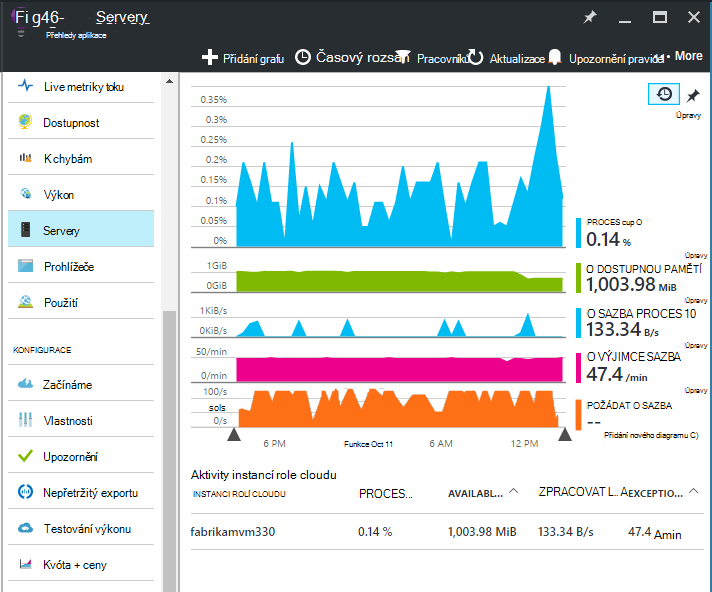
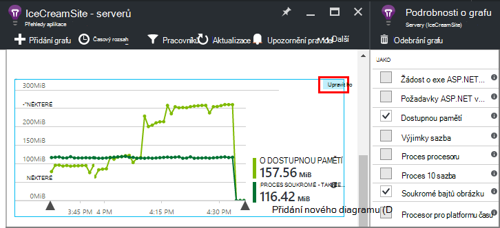
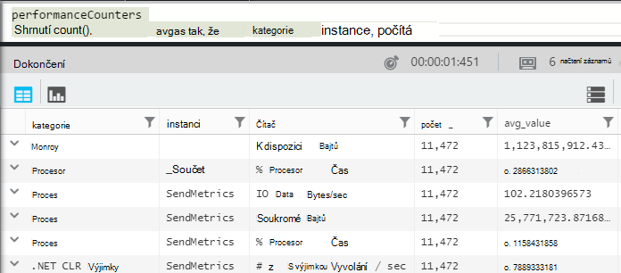
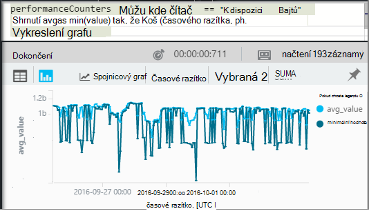
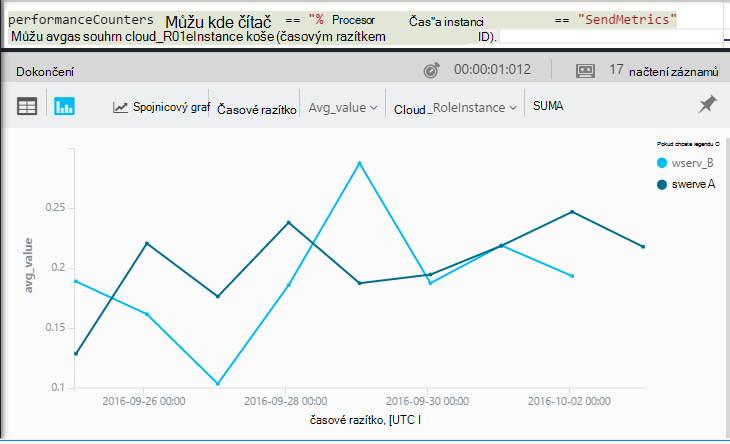

<properties 
    pageTitle="Výkonnosti v aplikaci přehledy | Microsoft Azure" 
    description="Systému sledování a vlastní .NET výkonnosti v aplikaci přehledy." 
    services="application-insights" 
    documentationCenter=""
    authors="alancameronwills" 
    manager="douge"/>

<tags 
    ms.service="application-insights" 
    ms.workload="tbd" 
    ms.tgt_pltfrm="ibiza" 
    ms.devlang="na" 
    ms.topic="article" 
    ms.date="10/11/2016" 
    ms.author="awills"/>
 
# <a name="system-performance-counters-in-application-insights"></a>Systém výkonnosti v aplikaci přehledy


Windows nabízí celou řadu [výkonnosti](http://www.codeproject.com/Articles/8590/An-Introduction-To-Performance-Counters) například procesoru držby paměti, disk a použití sítě. Můžete také definovat vlastní. [Přehledy aplikace](app-insights-overview.md) se můžou zobrazit tyto výkonnosti Pokud aplikace běží v rámci služby IIS na místní host nebo virtuálního počítače, ke kterým máte přístup pro správu. Grafy označení dostupných živé aplikaci zdrojů a pomáhají určit chybné párování zatížení mezi instancemi serveru.

Výkonnosti se zobrazí v zásuvné servery, které obsahuje tabulky, které segmentů instance serveru.



(Výkonnosti nejsou k dispozici pro Azure Web Apps. Ale můžete [Odeslat Azure diagnostiky interpretace aplikační](app-insights-azure-diagnostics.md).)

## <a name="configure"></a>Konfigurace

Pokud dosud není nainstalovaná sledování stavu přehledy aplikací v počítačích serverů, budete muset nainstalovat tuto značku zobrazíte výkonnosti.

Stáhněte si a spusťte [Instalační program Sledování stavu](http://go.microsoft.com/fwlink/?LinkId=506648) na jednotlivé instance serveru. Pokud je už nainstalovaná, nemusíte znovu nainstalovat.

* *Mám [nainstalovanou aplikaci SDK přehledy v mé aplikaci](app-insights-asp-net.md) průběhu vývoje. Potřebuju ještě sledování stavu?*

    Ano, sledování stavu je potřeba k shromáždit výkonnosti ASP.NET webových aplikací. Možná jste již zjistili, sledování stavu lze také k [sledování webových aplikací, které jsou již live](app-insights-monitor-performance-live-website-now.md)bez instalace SDK průběhu vývoje.


## <a name="view-counters"></a>Zobrazení čítačů

Servery zásuvné zobrazí výchozí sada výkonnosti. 

Zobrazíte další čítače upravit grafy na zásuvné servery nebo otevřete nový zásuvné [Metriky Explorer](app-insights-metrics-explorer.md) a přidejte nové grafy. 

K dispozici čítače jsou uvedeny metriky při úpravě grafu.



Pokud chcete zobrazit všechny nejužitečnější grafy na jednom místě, vytvoření [řídicího panelu](app-insights-dashboards.md) a připnout ho ho.

## <a name="add-counters"></a>Přidání čítačů

Pokud čítač výkonu, které chcete není uveden v seznamu metriky, je proto, že SDK přehledy aplikace není shromažďování na webový server. Můžete nakonfigurovat ji tak.

1. Zjistíte, jaké čítače jsou dostupné na serveru pomocí tohoto příkazu Powershellu na serveru:

    `Get-Counter -ListSet *`

    (See [`Get-Counter`](https://technet.microsoft.com/library/hh849685.aspx).)

1. Otevřete ApplicationInsights.config.

 * Pokud jste přidali přehledy aplikace do aplikace během vývoje, upravte ApplicationInsights.config v projektu a potom ho znovu nasadit k serverům.
 * Pokud použijete sledování stavu a nástroje web appu za běhu, najděte ApplicationInsights.config v kořenovém adresáři aplikace ve službě IIS. Aktualizujte obsahuje v jednotlivých instance serveru.

2. Úprava směrnice kolekcí výkon:

 ```XML

    <Add Type="Microsoft.ApplicationInsights.Extensibility.PerfCounterCollector.PerformanceCollectorModule, Microsoft.AI.PerfCounterCollector">
      <Counters>
        <Add PerformanceCounter="\Objects\Processes"/>
        <Add PerformanceCounter="\Sales(photo)\# Items Sold" ReportAs="Photo sales"/>
      </Counters>
    </Add>

```

Můžete zachytit standardní čítače i ty že implementovali sami. `\Objects\Processes`Příkladem standardní čítač je k dispozici ve všech systémech Windows. `\Sales(photo)\# Items Sold`je znázorněn příklad vlastní čítač, který může být prováděn webové služby. 

Formát je `\Category(instance)\Counter"`, nebo kategorie, ve kterých není instance chci jen `\Category\Counter`.

`ReportAs`je nutný pro funkce čítač názvy, které se neshodují `[a-zA-Z()/-_ \.]+` – to znamená obsahují znaky, které nejsou uloženy v následujících sad: písmen, které kulaté závorky lomítko, pomlčka, podtržení, mezeru, tečky.

Pokud chcete zadat instance, budou shromážděny jako dimenzi "CounterInstanceName" nahlášeného metriky.

### <a name="collecting-performance-counters-in-code"></a>Shromažďování výkonnosti v kódu

Shromáždit výkonnosti systému a odešlete je interpretace aplikace, můžete příklad upravit fragment níže:

    var perfCollectorModule = new PerformanceCollectorModule();
    perfCollectorModule.Counters.Add(new PerformanceCounterCollectionRequest(
      @"\.NET CLR Memory([replace-with-application-process-name])\# GC Handles", "GC Handles")));
    perfCollectorModule.Initialize(TelemetryConfiguration.Active);

Nebo umí totéž s vlastní metriky, kterou jste vytvořili:

    var perfCollectorModule = new PerformanceCollectorModule();
    perfCollectorModule.Counters.Add(new PerformanceCounterCollectionRequest(
      @"\Sales(photo)\# Items Sold", "Photo sales"));
    perfCollectorModule.Initialize(TelemetryConfiguration.Active);

## <a name="performance-counters-in-analytics"></a>Výkonnosti v analýzy

Můžete vyhledat a zobrazit sestavy čítačů výkonu v [analýzy](app-insights-analytics.md).


Zpřístupňuje schématu **jako** `category`, `counter` název a `instance` název každého čítače.  V telemetrie pro každou aplikaci zobrazí se pouze čítače pro tuto aplikaci. Například najdete v článku jaký čítače jsou k dispozici: 



("Instance tady odkazuje na instanci čítače výkonu není instancí počítače role nebo serveru. Název instance čítače výkonu obvykle segmenty údaje jako například počet procesorů čas podle názvu obrázku nebo aplikace.)

Chcete-li získat graf dostupnou pamětí přes nedávnému období: 




Stejně jako další telemetrie **jako** taky má sloupec `cloud_RoleInstance` , která označuje identity instance serveru Host (hostitel), na kterém běží aplikace. Chcete-li například porovnat aplikace na různých počítačích: 




## <a name="aspnet-and-application-insights-counts"></a>ASP.NET a počty přehledy aplikace

*Jaký je rozdíl mezi sazba výjimky a výjimky metriky?*

* *Výjimky sazba* je čítače výkonu systému. CLR spočítá všechny zpracování a neošetřené výjimek, které jsou vyvolání a vydělí celkové v intervalu odběr délku intervalu. V aplikaci přehledy SDK shromažďuje tento výsledek a odešle k portálu.
* *Výjimky* udává počet TrackException sestavy dostali portálem v intervalu vzorkování grafu. Obsahuje pouze zpracování výjimek, které jste napsali TrackException vás spojí v kódu a nezahrnuje všechny [neošetřené výjimky](app-insights-asp-net-exceptions.md). 

## <a name="alerts"></a>Upozornění

Podobně jako jiné metriky můžete [Nastavit upozornění](app-insights-alerts.md) upozornit, pokud čítače výkonu přejde mimo omezení, které zadáte. Otevřete zásuvné upozornění a klikněte na Přidat oznámení.


## <a name="next"></a>Další kroky

* [Závislost typu sledování](app-insights-asp-net-dependencies.md)
* [Výjimky sledování](app-insights-asp-net-exceptions.md)