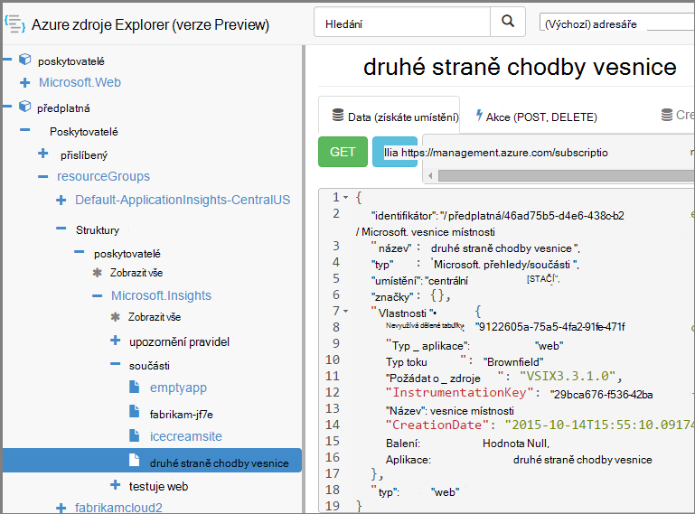

<properties 
    pageTitle="Vytvoření aplikace přehledy zdrojů pomocí prostředí PowerShell" 
    description="Programově vytvořte přehledy aplikace zdroje jako součást vašeho Tvůrce dotazů." 
    services="application-insights" 
    documentationCenter=""
    authors="alancameronwills" 
    manager="douge"/>

<tags 
    ms.service="application-insights" 
    ms.workload="tbd" 
    ms.tgt_pltfrm="ibiza" 
    ms.devlang="na" 
    ms.topic="article" 
    ms.date="03/02/2016" 
    ms.author="awills"/>
 
# <a name="create-application-insights-resources-using-powershell"></a>Vytvoření aplikace přehledy zdrojů pomocí prostředí PowerShell

Tento článek popisuje, jak vytvořit zdroj [Aplikace přehledy](app-insights-overview.md) v Azure automaticky. Třeba provádět jako součást procesu Tvůrce dotazů. Spolu s základní zdrojů aplikace přehledy můžete vytvořit [web testů dostupnost](app-insights-monitor-web-app-availability.md), [nastavte upozornění](app-insights-alerts.md)a vytvořte další Azure zdroje.

Klíč k vytváření tyto materiály je JSON šablony pro [Správce prostředků Azure](../powershell-azure-resource-manager.md). Ve zkratce má postup: stažení definice JSON existujících zdrojů. parametrizovat určitých hodnot například názvy; a pak spusťte šabloně kdykoli budete chtít vytvořit nový zdroj. Několik zdrojů můžete balíček společně, byla vytvořená všechny v jednom přejděte – například monitoru aplikace s testů dostupnost, upozornění a úložiště pro nepřetržitý export. Existuje několik odstínů některých parameterizations, vysvětlující jsme se tady.

## <a name="one-time-setup"></a>Jednorázové instalace

Pokud jste s předplatným Azure před nepoužili Powershellu:

Nainstalujte modul Azure Powershellu v počítači, ve které chcete spustit skripty:

1. Instalace [platformy Microsoft Web (verze 5 nebo novější)](http://www.microsoft.com/web/downloads/platform.aspx).
2. Můžete nainstalovat Microsoft Azure Powershellu.

## <a name="copy-the-json-for-existing-resources"></a>Zkopírujte JSON existujících zdrojů

1. Nastavte si [Aplikace přehledy](app-insights-overview.md) projektu podobný těch, které chcete automaticky generovat. Pokud budete chtít, přidáte webových testů a upozornění.
2. Vytvoření nového souboru .json - Pojďme volání `template1.json` v tomto příkladu. Zkopírujte tento obsah do něho:


    ```JSON

        {
          "$schema": "https://schema.management.azure.com/schemas/2015-01-01/deploymentTemplate.json#",
          "contentVersion": "1.0.0.0",
          "parameters": {
            "appName": { "type": "string" },
            "webTestName": { "type": "string" },
            "url": { "type": "string" },
            "text": { "type" : "string" }
          },
          "variables": {
            "testName": "[concat(parameters('webTestName'), 
               '-', toLower(parameters('appName')))]"
            "alertRuleName": "[concat(parameters('webTestName'), 
               '-', toLower(parameters('appName')), 
               '-', subscription().subscriptionId)]"
          },
          "resources": [
            {
              // component JSON file contents
            },
            {
              //web test JSON file contents
            },
            {
              //alert rule JSON file contents
            }
 
            // Any other resources go here
          ]
        }
    
    ```

    Tato šablona bude nastavit jeden dostupnost test kromě hlavní zdroje.


2. Otevřete [Azure správce prostředků](https://resources.azure.com/). Přejděte dolů až `subscriptions/resourceGroups/<your resource group>/providers/Microsoft.Insights/components`, aplikace zdroji. 

    

    *Součástí* jsou základní zdroje aplikace přehledy pro zobrazování aplikací. Existuje samostatné zdrojů pro přidružená upozornění pravidla a dostupnosti webových testů.

3. Zkopírujte JSON komponentu do příslušné pozici ve `template1.json`.
6. Odstraňte tyto vlastnosti:
  * `id`
  * `InstrumentationKey`
  * `CreationDate`
4. Otevřete webtests a alertrules oddíly a zkopírujte JSON pro jednotlivé položky do šablony. (Nekopírujte z uzlů webtests nebo alertrules: přejděte do položky pod nimi.)

    Každý web test má pravidlo přidružené výstrahy, takže musíte zkopírovat oba.

    Web test musí být uvedena před pravidlo výstrahy.

5. Jak splnit schéma, vložte tento řádek jednotlivé zdroje:

    `"apiVersion": "2014-04-01",`

    (Schématu taky nahlásí, že o velkými a malými písmeny typ názvy zdrojů `Microsoft.Insights/*` – ale *neměníte tyto* .)


## <a name="parameterize-the-template"></a>Parametrizaci šablony

Nyní máte konkrétní názvy nahradit parametry. [Parametrizovat šablony](../resource-group-authoring-templates.md)se zadávají výrazy pomocí [sada funkcí pomocníka](../resource-group-template-functions.md). 

Nelze parametrizovat jenom část řetězce, takže použijte `concat()` vytvářet řetězce.

Tady jsou příklady náhrady, které se mají být. Existuje několik výskyty každý nahrazení. Budete potřebovat ostatním v šabloně. Tyto příklady používají parametry a proměnných, která byla definována v horní části šablony.

hledání | Nahraďte
---|---
`"hidden-link:/subscriptions/.../components/MyAppName"`| `"[concat('hidden-link:',`<br/>` resourceId('microsoft.insights/components',` <br/> ` parameters('appName')))]"`
`"/subscriptions/.../alertrules/myAlertName-myAppName-subsId",` | `"[resourceId('Microsoft.Insights/alertrules', variables('alertRuleName'))]",`
`"/subscriptions/.../webtests/myTestName-myAppName",` | `"[resourceId('Microsoft.Insights/webtests', parameters('webTestName'))]",`
`"myWebTest-myAppName"` | `"[variables(testName)]"'`
`"myTestName-myAppName-subsId"` | `"[variables('alertRuleName')]"`
`"myAppName"` | `"[parameters('appName')]"`
`"myappname"`(malá písmena) | `"[toLower(parameters('appName'))]"`
`"<WebTest Name=\"myWebTest\" ...`<br/>` Url=\"http://fabrikam.com/home\" ...>"`|`[concat('<WebTest Name=\"',` <br/> `parameters('webTestName'),` <br/> `'\" ... Url=\"', parameters('Url'),` <br/> `'\"...>')]" `


## <a name="set-dependencies-between-the-resources"></a>Nastavení závislostí mezi zdroje

Azure by měl nastavit zdrojů ve striktním pořadí. Abyste měli jistotu, že jeden instalace dokončí před začátkem dalšího, přidejte závislost řádky:

* Na webu testování zdroje:

    `"dependsOn": ["[resourceId('Microsoft.Insights/components', parameters('appName'))]"],`

* V upozornění zdroje:

    `"dependsOn": ["[resourceId('Microsoft.Insights/webtests', variables('testName'))]"],`

## <a name="create-application-insights-resources"></a>Vytvoření aplikace přehledy zdroje

1. V prostředí PowerShell Přihlaste se k Azure

    `Login-AzureRmAccount`

2. Příkaz takto:

    ```PS

        New-AzureRmResourceGroupDeployment -ResourceGroupName Fabrikam `
               -templateFile .\template1.json `
               -appName myNewApp `
               -webTestName aWebTest `
               -Url http://myapp.com `
               -text "Welcome!"
               -siteName "MyAzureSite"

    ``` 

    * -ResourceGroupName je skupina, kde chcete vytvořit nové zdroje.
    * -templateFile musí spadat před vlastní parametry.
    * -název_aplikace název zdroje, chcete-li vytvořit.
    * -webTestName název test web vytvořit.
    * – Adresa Url adresu url webové aplikace.
    * -A textový řetězec, který se zobrazí na webové stránce.
    * název-webu – použít, pokud je Azure webu


## <a name="define-metric-alerts"></a>Definování metrických upozornění

Existuje [prostředí PowerShell způsob nastavení upozornění](app-insights-alerts.md#set-alerts-by-using-powershell).


## <a name="an-example"></a>Příklad

Zde je dokončeno component, web test a web test šablona upozornění, který jsem vytvořil(a):

``` JSON

{
  "$schema": "https://schema.management.azure.com/schemas/2015-01-01/deploymentTemplate.json#",
  "contentVersion": "1.0.0.0",
  "parameters": {
    "webTestName": { "type": "string" },
    "appName": { "type": "string" },
    "URL": { "type": "string" },
    "text": { "type" : "string" }
  },
  "variables": {
    "alertRuleName": "[concat(parameters('webTestName'), '-', toLower(parameters('appName')), '-', subscription().subscriptionId)]",
    "testName": "[concat(parameters('webTestName'), '-', toLower(parameters('appName')))]"
  },
  "resources": [
    {
      //"id": "[resourceId('Microsoft.Insights/components', parameters('appName'))]",
      "apiVersion": "2014-04-01",
      "kind": "web",
      "location": "Central US",
      "name": "[parameters('appName')]",
      "properties": {
        "TenantId": "9122605a-471fc50f8438",
        "Application_Type": "web",
        "Flow_Type": "Brownfield",
        "Request_Source": "VSIX3.3.1.0",
        "Name": "[parameters('appName')]",
        //"CreationDate": "2015-10-14T15:55:10.0917441+00:00",
        "PackageId": null,
        "ApplicationId": "[parameters('appName')]"
      },
      "tags": { },
      "type": "microsoft.insights/components"
    },
    {
      //"id": "[resourceId('Microsoft.Insights/webtests', variables('testName'))]",
      "name": "[variables('testName')]",
      "apiVersion": "2014-04-01",
      "type": "microsoft.insights/webtests",
      "location": "Central US",
      "tags": {
        "[concat('hidden-link:', resourceId('microsoft.insights/components', parameters('appName')))]": "Resource"
      },
      "properties": {
        "provisioningState": "Succeeded",
        "Name": "[parameters('webTestName')]",
        "Description": "",
        "Enabled": true,
        "Frequency": 900,
        "Timeout": 120,
        "Kind": "ping",
        "RetryEnabled": true,
        "Locations": [
          {
            "Id": "us-va-ash-azr"
          },
          {
            "Id": "emea-nl-ams-azr"
          },
          {
            "Id": "emea-gb-db3-azr"
          }
        ],
        "Configuration": {
          "WebTest": "[concat(
             '<WebTest   Name=\"', 
                parameters('webTestName'), 
              '\"  Id=\"32cfc791-aaad-4b50-9c8d-993c21beb218\"   Enabled=\"True\"         CssProjectStructure=\"\"    CssIteration=\"\"  Timeout=\"120\"  WorkItemIds=\"\"         xmlns=\"http://microsoft.com/schemas/VisualStudio/TeamTest/2010\"         Description=\"\"  CredentialUserName=\"\"  CredentialPassword=\"\"         PreAuthenticate=\"True\"  Proxy=\"default\"  StopOnError=\"False\"         RecordedResultFile=\"\"  ResultsLocale=\"\">  <Items>  <Request Method=\"GET\"         Guid=\"a6f2c90b-61bf-b28hh06gg969\"  Version=\"1.1\"  Url=\"', 
              parameters('Url'), 
              '\" ThinkTime=\"0\"  Timeout=\"300\" ParseDependentRequests=\"True\"         FollowRedirects=\"True\" RecordResult=\"True\" Cache=\"False\"         ResponseTimeGoal=\"0\"  Encoding=\"utf-8\"  ExpectedHttpStatusCode=\"200\"         ExpectedResponseUrl=\"\" ReportingName=\"\" IgnoreHttpStatusCode=\"False\" />        </Items>  <ValidationRules> <ValidationRule  Classname=\"Microsoft.VisualStudio.TestTools.WebTesting.Rules.ValidationRuleFindText, Microsoft.VisualStudio.QualityTools.WebTestFramework, Version=10.0.0.0, Culture=neutral, PublicKeyToken=b03f5f7f11d50a3a\" DisplayName=\"Find Text\"         Description=\"Verifies the existence of the specified text in the response.\"         Level=\"High\"  ExectuionOrder=\"BeforeDependents\">  <RuleParameters>        <RuleParameter Name=\"FindText\" Value=\"', 
              parameters('text'), 
              '\" />  <RuleParameter Name=\"IgnoreCase\" Value=\"False\" />  <RuleParameter Name=\"UseRegularExpression\" Value=\"False\" />  <RuleParameter Name=\"PassIfTextFound\" Value=\"True\" />  </RuleParameters> </ValidationRule>  </ValidationRules>  </WebTest>')]"
        },
        "SyntheticMonitorId": "[variables('testName')]"
      }
    },
    {
      //"id": "[resourceId('Microsoft.Insights/alertrules', variables('alertRuleName'))]",
      "name": "[variables('alertRuleName')]",
      "apiVersion": "2014-04-01",
      "type": "microsoft.insights/alertrules",
      "location": "East US",
      "dependsOn": [
        "[resourceId('Microsoft.Insights/components', parameters('appName'))]",
        "[resourceId('Microsoft.Insights/webtests', variables('testName'))]"
      ],
      "tags": {
        "[concat('hidden-link:', resourceId('Microsoft.Insights/components', parameters('appName')))]": "Resource",
        "[concat('hidden-link:', resourceId('Microsoft.Insights/webtests', variables('testName')))]": "Resource"
      },
      "properties": {
        "name": "[variables('alertRuleName')]",
        "description": "",
        "isEnabled": true,
        "condition": {
          "$type": "Microsoft.WindowsAzure.Management.Monitoring.Alerts.Models.LocationThresholdRuleCondition, Microsoft.WindowsAzure.Management.Mon.Client",
          "odata.type": "Microsoft.Azure.Management.Insights.Models.LocationThresholdRuleCondition",
          "dataSource": {
            "$type": "Microsoft.WindowsAzure.Management.Monitoring.Alerts.Models.RuleMetricDataSource, Microsoft.WindowsAzure.Management.Mon.Client",
            "odata.type": "Microsoft.Azure.Management.Insights.Models.RuleMetricDataSource",
            "resourceUri": "[resourceId('microsoft.insights/webtests', variables('testName'))]",
            "metricName": "GSMT_AvRaW"
          },
          "windowSize": "PT15M",
          "failedLocationCount": 2
        },
        "action": {
          "$type": "Microsoft.WindowsAzure.Management.Monitoring.Alerts.Models.RuleEmailAction, Microsoft.WindowsAzure.Management.Mon.Client",
          "odata.type": "Microsoft.Azure.Management.Insights.Models.RuleEmailAction",
          "sendToServiceOwners": true,
          "customEmails": [ ]
        },
        "provisioningState": "Succeeded",
        "actions": [ ]
      }

    }
  ]
}

```

## <a name="see-also"></a>Viz taky

Další články automatizace:

* [Vytvoření zdrojů aplikace přehledy](app-insights-powershell-script-create-resource.md) - rychlý způsob bez použití šablony.
* [Nastavení upozornění](app-insights-powershell-alerts.md)
* [Vytvořit web testy](https://azure.microsoft.com/blog/creating-a-web-test-alert-programmatically-with-application-insights/)
* [Odeslání Azure diagnostiky interpretace aplikace](app-insights-powershell-azure-diagnostics.md)
* [Vytvoření poznámky vydání](https://github.com/Microsoft/ApplicationInsights-Home/blob/master/API/CreateReleaseAnnotation.ps1)
