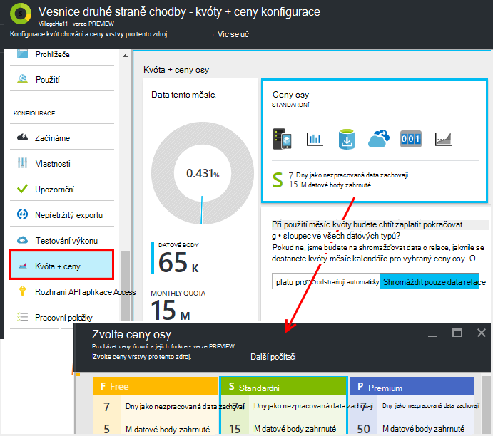
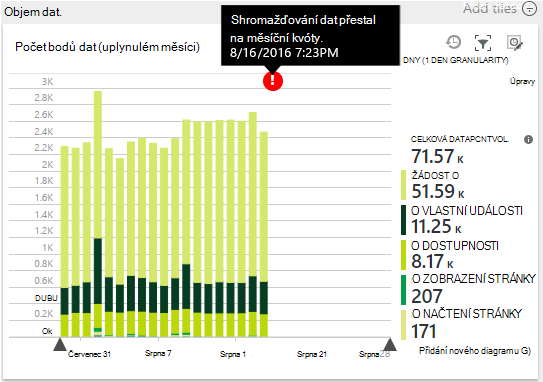
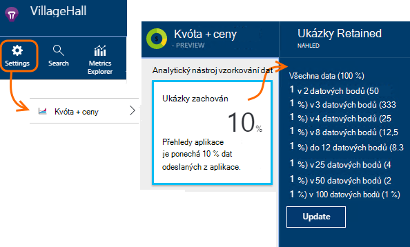
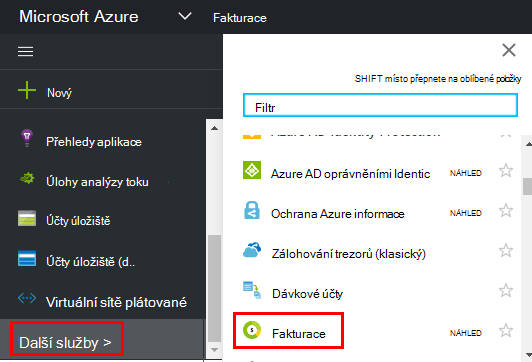

<properties 
    pageTitle="Správa kvóty a ceny pro přehledy aplikace | Microsoft Azure" 
    description="Zvolte plán cena, které potřebujete, spravovat svazky telemetrie" 
    services="application-insights" 
    documentationCenter=""
    authors="alancameronwills" 
    manager="douge"/>

<tags 
    ms.service="application-insights" 
    ms.workload="tbd" 
    ms.tgt_pltfrm="ibiza" 
    ms.devlang="na" 
    ms.topic="article" 
    ms.date="10/13/2016" 
    ms.author="awills"/>

# Správa kvóty a ceny pro přehledy aplikace

*Přehledy aplikace je v náhledu.*

[Ceny] [ pricing] pro [Přehledy aplikace Visual Studio] [ start] se podle objemu dat na aplikace. Existuje podstatné bezplatné osy, ve kterém se zobrazí většina funkcí s určitá omezení.

Jednotlivé aplikace přehledy zdroje účtován jako samostatná služba a přispívá k účtu pro vaše předplatné Azure.

[V tématu ceny schéma][pricing].

## Revize kvóty a cena plánu aplikace přehledy zdroje

Můžete otevřít kvóty + ceny zásuvné ze stránky nastavení zdroje aplikace.

U možnosti ceny schéma ovlivňuje:

* [Měsíční kvóty](#monthly-quota) - částka telemetrie můžete analyzovat každý měsíc.
* [Rychlost dat](#data-rate) – maximální rychlost, pro niž můžete zpracovány data z aplikace.
* [Export nepřetržitě](#continuous-export) – jestli můžete exportovat data do jiných nástrojů a služeb.

Tyto limity se nastavují samostatně pro jednotlivé aplikace přehledy zdroje.

### Bezplatná zkušební verze Premium

Při prvním vytvoření nového zdroje aplikace přehledy v začínala bezplatné osy.

Kdykoli můžete přejít 30denní bezplatnou zkušební verzi Premium. To vám výhody Premium osy. Po 30 dnech, se automaticky vrátí něco jiného, co jste úroveň byly před – Pokud explicitně vybrat jiné vrstvě. Vyberte vrstvu, které se mají v průběhu uplynutí zkušebního období, ale pořád dostanete bezplatnou zkušební verzi až do konce 30 dní.

## Měsíční kvóty

* Každý měsíc kalendáře aplikace můžete posílat určitého množství telemetrie interpretace aplikace. Je v současné době kvóty pro bezplatné ceny osy miliónů 5 datové body za měsíc a podstatně další jiných schémat; Můžete si koupit další Pokud dostanete kvóty.  V tématu [ceny schéma] [ pricing] skutečné čísel. 
* Kvóty závisí na ceny vrstvy, kterou jste zvolili.
* Kvóty se počítá od půlnoci UTC první den v měsíci.
* Graf bodů dat zobrazuje, kolik kvóty má byly čerpány tento měsíc.
* Kvóty měří se v *datových bodů.* Jeden datový bod jde o hovor do jedné ze sledování metody, zda označovaný taky jako explicitně v kódu nebo pomocí jednoho z standardní telemetrie moduly. Může obsahovat více připojených vlastnosti a metriky.
* Datové body vznikají:
 * [Moduly SDK](app-insights-configuration-with-applicationinsights-config.md) , která automaticky sběr dat, například zprávu žádosti o nebo dojde k chybě nebo měření výkonu.
 * [Rozhraní API](app-insights-api-custom-events-metrics.md) `Track...` hovory, které jste napsali, jako například `TrackEvent` nebo `trackPageView`.
 * [Dostupnost webových testů](app-insights-monitor-web-app-availability.md) , který jste vytvořili.
* Při ladění, uvidíte datových bodů odesílaná z aplikace v okně výstupu Visual Studio. Události klienta uvidí otevřením, že na kartě síti v prohlížeči je ladění podokno (obvykle F12).
* *Data relace* není započten do kvóty. Jedná se o počtu uživatelů, relace, prostředí a data zařízení.
* Pokud chcete spočítat nahoru datových bodů kontroly, můžete najít v různých míst:
 * Jednotlivé položky, které vidíte v [diagnostiky hledání](app-insights-diagnostic-search.md), která obsahuje HTTP požadavky, výjimek, protokolu trasování, zobrazení stránky, závislost události a vlastní události.
 * Míry nezpracovanými [míru](app-insights-metrics-explorer.md) například čítače výkonu. (Body, které se zobrazí na grafy jsou obvykle agregace více nezpracovanými datových bodů).
 * Jednotlivých bodech u grafu dostupnost web je také agregované několik datových bodů.
* Můžete taky zkontrolovat jednotlivých datových bodů na straně zdroje během ladění:
 * Pokud spustíte aplikaci v režimu ladění ve Visual Studiu, přihlášeni datových bodů v okně výstupu. 
 * Klient datových bodů zobrazíte podokno prohlížeče ladění (obvykle F12) a otevřete kartu síť.
* Rychlost dat může (ve výchozím nastavení) sníží [adaptivní odběr](app-insights-sampling.md). To znamená, že jako použití vaše zvyšování aplikace sazba telemetrie nebude zvětšit velmi podobným způsobem podle očekávání.

### Nadsazení

Pokud aplikace odešle více než měsíční kvóty, můžete:

* Platba další data. V tématu [ceny schéma] [ pricing] podrobnosti. Můžete předem tuto možnost. Tato možnost není dostupná v Free ceny osy.
* Upgradujte ceny osy.
* Nemusíte dělat nic. Data relace, zůstanou zaznamenán, ale jiná data se nezobrazí v diagnostiky hledání nebo v Průzkumníku metriky.

## Množství dat, které mi odesílání

Graf v dolní části cen zásuvné se zobrazuje vaše aplikace datový bod objem seskupené podle datový bod typ. (Můžete taky vytvořit tento graf v Průzkumníku míru).

Klikněte na graf podrobněji, nebo přetáhněte ukazatel myši přes ho a klikněte na (+) pro podrobností časový rozsah.

Graf znázorňuje množství dat, které přichází na službu aplikace přehledy po [odběru](app-insights-sampling.md).

Pokud data hlasitost dosáhne vaše měsíční kvóta poznámky se zobrazí v grafu.

## Rychlost dat

Kromě měsíční kvóty jsou omezení omezení na rychlosti data. Pro bezplatné [ceny osy] [ pricing] limit je 200 datové body/druhé průměr víc než 5 minut a pro placené úrovně ho je 500/s průměr víc než jednu minutu. 

Existují tři bloky, které jsou započteny samostatně:

* [Volání TrackTrace](app-insights-api-custom-events-metrics.md#track-trace) a [zaznamenávání protokoly](app-insights-asp-net-trace-logs.md)
* [Výjimky](app-insights-api-custom-events-metrics.md#track-exception)omezený na 50 body/s.
* Všechny ostatní telemetrie (zobrazení stránky relace, požadavky, závislosti, metriky, vlastní události, výsledky testů web).

*Co se stane, když Moje aplikace překračuje za sekundu?*

* Objemu dat, která odešle aplikace je posouzena každou minutu. Pokud je větší než za sekundu jako průměr za minutu server odmítl některé požadavky. V SDK vyrovnávací paměti data a potom se pokusí poslat znova, rozložení nárůstu přes několik minut. Pokud aplikace konzistentní odešle data na nad omezení sazba, dojde ke ztrátě některých data. (ASP.NET, Java a JavaScript SDK opakujte odeslání tímto způsobem, jiné SDK může jednoduše dat rozevírací omezena.)

Dojde k omezení, zobrazí se upozornění, že se to stalo oznámení.

*Jak poznám počet datových bodů odesílání Moje aplikace*

* Otevřete nastavení/kvóty a ceny, abyste zjistili, hlasitost Data grafu.
* Nebo v Průzkumníku metriky přidejte nový graf a vyberte **datový bod hlasitost** jeho metriky. Přepnutí na skupiny a seskupit podle **datového typu**.

## Chcete-li zmenšit frekvenci dat

Pokud narazíte na omezení omezení, tady jsou některé věci, které můžete dělat:

* Použití [odběr](app-insights-sampling.md). Tato technologie omezuje sazba data bez zkosení vaší metriky a bez přerušení umožňuje přecházet mezi související položky ve vyhledávání.
* [Omezení počtu Ajax hovorů, které je možné vykázat](app-insights-javascript.md#detailed-configuration) v každé zobrazení stránky nebo přepnout vypnout Ajax sestav.
* Vypněte kolekce moduly, které už nepotřebujete úpravou [ApplicationInsights.config](app-insights-configuration-with-applicationinsights-config.md). Například rozhodnout, že jsou inessential výkonnosti nebo závislost údaje.
* Předem agregační metriky. Pokud vložíte volání TrackMetric v aplikaci můžete omezit přenosy použitím přetížení, která přijímá do výpočtu průměru a směrodatnou odchylkou dávky měrných jednotek. Nebo můžete použít [předem prostředku balíčku](https://www.myget.org/gallery/applicationinsights-sdk-labs). 

## Analytický nástroj vzorkování

[Odběr](app-insights-sampling.md) je způsob, jak snížení sazeb niž telemetrie při zachování možnost Najít související události během diagnostiky hledání a zachování správné události spočítá odeslaný do aplikace. 

Analytický nástroj vzorkování způsobem efektivní snížit náklady a nepřekročili měsíční kvóty. Analytický nástroj vzorkování algoritmus zachová související položky telemetrie, tak, aby například když použijete hledání, můžete najít žádost týkající se určitého výjimky. Algoritmus zachová správné počty také tak, aby se zobrazily správné hodnoty v Průzkumníku míru žádost o sazby, výjimce sazby a dalšími počty.

Existuje několik formami odběr.

* [Adaptivní odběr](app-insights-sampling.md) je výchozí ASP.NET SDK, která automaticky přizpůsobí objemu telemetrie, která odešle aplikace. Funguje automaticky v SDK ve web appu tak, aby se sníží telemetrie přenosy v síti. 
* *Analytický nástroj vzorkování požití* je alternativu pracuje na místa, kde telemetrie z aplikace do služby přehledy aplikace. Nemá vliv množství telemetrie odesílaným z aplikace, ale snižuje hlasitost zachovají službou. Můžete ho zmenšit kvóty používaný telemetrie z prohlížeče a další SDK.

Nastavit odběr požití, nastavte ovládací prvek v kvóty + ceny zásuvné:

> [AZURE.WARNING] Hodnoty zobrazené na dlaždici ukázky zachovají označuje nastavené pro odběr požití hodnoty. Nezobrazují vzorkování, který pracuje na stránce SDK v aplikaci. 
> 
> Pokud už příchozí telemetrie má na SDK odebraného se nepoužil požití odběr.
 
Zjistit skutečná vzorkování bez ohledu na to, kde byly použity pomocí [technologie pro analýzu dotazu](app-insights-analytics.md) třeba takto:

    requests | where timestamp > ago(1d)
  	| summarize 100/avg(itemCount) by bin(timestamp, 1h) 
  	| render areachart 

V každém zachovají záznamu `itemCount` označuje počet původní záznamy, které představuje, roven 1 + počet předchozí vyřazené záznamů. 

## Revize účtu pro vaše předplatné Azure

Náklady přehledy aplikace se přidají do vašeho účtu Azure. Můžete zobrazit podrobnosti o vaší Azure bill v části fakturace portálu Azure nebo [Portál fakturace Azure](https://account.windowsazure.com/Subscriptions). 

## Název omezení

1.  Maximálně 200 jedinečné metrických názvy a 200 jedinečné vlastností aplikace. Metriky zahrnout data odeslaná prostřednictvím TrackMetric, jakož i měření na jiné typy dat, například události.  [Metriky a názvů vlastností] [ api] globální za přístrojového vybavení klíče.
2.  [Vlastnosti] [ apiproperties] lze použít k filtrování a group by pouze v případě, že máte míň než 100 jedinečné hodnoty pro každou vlastnost. Po počet jedinečných hodnot je větší než 100, můžete pořád vyhledávat vlastnost, ale už pomocí filtrů nebo seskupit podle.
3.  Standardní vlastnosti třeba požádat o název a adresa URL stránky jsou omezené na 1 000 jedinečných hodnot v týdnu. Po 1000 jedinečné hodnoty a další hodnoty jsou označeny jako "Hodnotám." Původní hodnoty můžete pořád využívat pro celý text hledání a filtrování.

Pokud zjistíte, že aplikace tato omezení překračuje, zvažte možnost rozdělení dat mezi různých přístrojového vybavení klíče – to znamená, [vytváření nových zdrojů aplikace přehledy](app-insights-create-new-resource.md) a pošlete některá data na nové přístrojového vybavení klíče. Je možné, že je lepší strukturovanými výsledek. [Řídicí panely](app-insights-dashboards.md#dashboards) můžete přenést různých metriky na obrazovce stejné tak tento přístup nemá omezit možnost porovnat různých metriky. 

## Limity souhrn

[AZURE.INCLUDE [application-insights-limits](../../includes/application-insights-limits.md)]

<!--Link references-->

[api]: app-insights-api-custom-events-metrics.md
[apiproperties]: app-insights-api-custom-events-metrics.md#properties
[start]: app-insights-overview.md
[pricing]: http://azure.microsoft.com/pricing/details/application-insights/

 