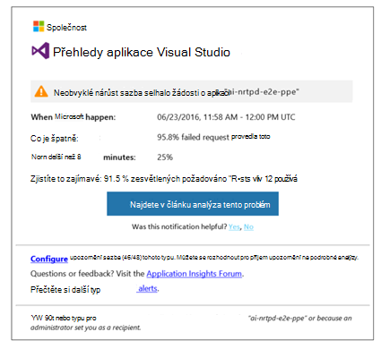
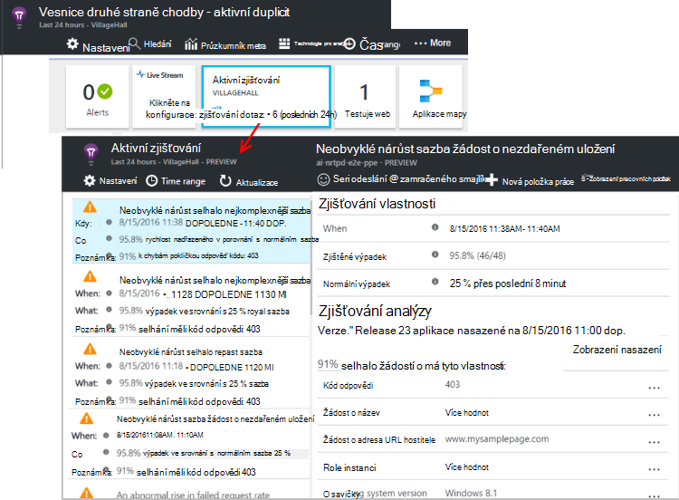

<properties 
    pageTitle="Aktivní Diagnostika v aplikaci přehledy | Microsoft Azure" 
    description="Aplikace přehledy provádí automatické podrobné analýzy telemetrie aplikace a zobrazí upozornění na možné problémy." 
    services="application-insights" 
    documentationCenter="windows"
    authors="rakefetj" 
    manager="douge"/>

<tags 
    ms.service="application-insights" 
    ms.workload="tbd" 
    ms.tgt_pltfrm="ibiza" 
    ms.devlang="na" 
    ms.topic="article" 
    ms.date="08/15/2016" 
    ms.author="awills"/>

#  Aktivní Diagnostika v aplikaci přehledy

 Aktivní diagnostiky automaticky zobrazí upozornění na potenciální problémy s výkonem ve webové aplikaci. Slouží k provedení inteligentní analýzy telemetrie, které aplikace odesílá interpretace [aplikace Visual Studio](app-insights-overview.md). Pokud existuje náhlé nárůst selhání nebo neobvyklé vzorků klienta nebo serveru výkonu, zobrazí se upozornění. Tato funkce vyžaduje žádná konfigurace. Funguje aplikace pošle dost telemetrie.

Jak z e-mailů, které dostáváte a zásuvné aktivní zjišťování se dostanete aktivní zjišťování upozornění.

## Kontrola aktivní zjišťování

Můžete zjistit zjišťování dvěma způsoby:

* **Obdržíte e-mail** z aplikace přehledy. Tady je typické příkladu:

    

    Klikněte na velké tlačítko zobrazíte více podrobností portálu.

* **Aktivní zjišťování dlaždice** na zásuvné přehled vaše aplikace zobrazuje počet posledních upozornění. Klikněte na dlaždici chcete podívat na seznam nedávné upozornění.

Vyberte upozornění zobrazíte její podrobnosti.

## Zjištění jaké problémy?

Existují tři typy zjišťování:

* [Aktivní selhání sazba diagnostiky](app-insights-proactive-failure-diagnostics.md). Budeme používat počítač se naučíte nastavit očekávané sazbu neúspěšných požadavků pro aplikace korelace s načítání a jiných faktorů. Pokud výpadek dostane mimo očekávané obálky, pošleme upozornění.
* [Diagnostika aktivní výkonu](app-insights-proactive-performance-diagnostics.md). Jsme hledat neobvyklých vzorků doby odezvy a selhání každý den. Jsme sladit tyto problémy s vlastnostmi například umístění, prohlížeče, klient s operačním systémem instance serveru a čas.
* [Azure cloudových služeb](https://azure.microsoft.com/blog/proactive-notifications-on-cloud-service-issues-with-azure-diagnostics-and-application-insights/). Chcete získat oznámení aplikace je hostovaný v Azure Cloudovým službám a instanci rolí má potíží se spuštěním časté recyklace nebo runtime havaruje.

(Nápovědy v každém upozornění odkazů můžete odpovídající články.)

## Další kroky

Tyto diagnostické nástroje můžete zkontrolovat telemetrie z aplikace:

* [Metriky Průzkumníka](app-insights-metrics-explorer.md)
* [Průzkumník hledání](app-insights-diagnostic-search.md)
* [Technologie pro analýzu - výkonné dotazovací jazyk](app-insights-analytics-tour.md)

Aktivní diagnostiky jsou úplně automatické. Ale možná chcete nastavit některé další oznámení?

* [Ručně nakonfigurovat metrických upozornění](app-insights-alerts.md)
* [Dostupnost webových testů](app-insights-monitor-web-app-availability.md) 

