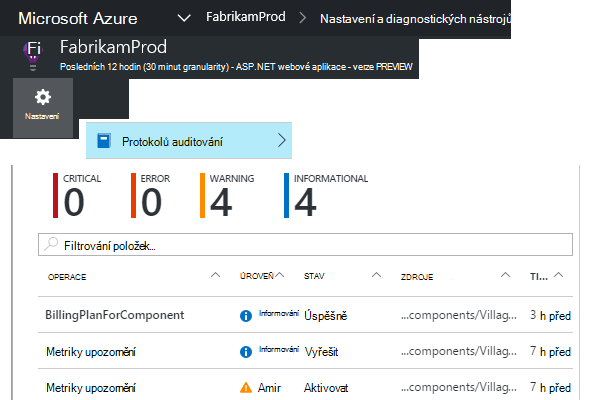

<properties 
    pageTitle="Aktivní selhání sazba Diagnostika v aplikaci přehledy | Microsoft Azure" 
    description="Upozorňující na neobvyklé změnami rychlost selhalo požadavků do webové aplikace a poskytuje diagnostické analýzu. Není nutná žádná konfigurace." 
    services="application-insights" 
    documentationCenter=""
    authors="yorac" 
    manager="douge"/>

<tags 
    ms.service="application-insights" 
    ms.workload="tbd" 
    ms.tgt_pltfrm="ibiza" 
    ms.devlang="na" 
    ms.topic="article" 
    ms.date="10/12/2016" 
    ms.author="awills"/>
 
# Diagnostika aktivní selhání sazba

[Přehledy aplikace Visual Studio](app-insights-overview.md) automaticky upozorní v reálném čase blízké webovou aplikaci dojde neobvyklé nárůst sazbu k chybám. Zjistí neobvyklé nárůst rychlost HTTP požadavků hlášené jako se nezdařila. Toto jsou obvykle můžou být s kódy odezvy v 400 - a 500oblastí. Vám pomůže protřídit a diagnostikovat potíže, analýzu charakteristických vlastností selhalo žádosti o schůzku a související telemetrie uvedenou v oznámení. Jsou taky odkazy na portálu aplikace přehledy diagnostiky dál. Funkce musí žádné instalace sestavení nebo konfigurace používá počítače výukové algoritmů předpovídat normální výpadek.

Tato funkce funguje Java a ASP.NET aplikací web hostovaný v cloudu nebo na vlastní serverech. Funguje taky pro nějakou aplikaci generovaný žádost o telemetrie – například pokud máte roli pracovníka, která volá [TrackRequest()](app-insights-api-custom-events-metrics.md#track-request). 

Po nastavení [Aplikace přehledy pro váš projekt](app-insights-overview.md)a uvedený aplikace vygeneruje minimální určitou část telemetrie aktivní selhání diagnostiky přijímá 24 hodin další normální chování aplikace, než je zapnuta a odesílat upozornění.

Tady je ukázka upozornění. 

> [AZURE.NOTE] Ve výchozím nastavení se zobrazí kratší formát pošty než v tomto příkladu. Ale můžete to udělat [Přepnout do této podrobné formátu](#configure-alerts).

Všimněte si, že se dozvíte:

* Výpadek ve srovnání s normálním aplikace chování.
* Kolik uživatelů se to týká – tak zjistíte, kolik starat.
* Charakteristické vzorek přidružené k chybám. V tomto příkladu je kód konkrétní odpovědi, název žádost (operace) a verze aplikace. Který okamžitě dovíte, kde začít hledat v kódu. Další možností může být určitý operační systém prohlížeče nebo klienta.
* Výjimek, protokolu stopy a chyby závislostí (databáze nebo jiných komponent externí), které se zobrazí přiřazené charakterizované žádosti o nezdařeném uložení.
* Odkazy přímo do odpovídajícího hledání na telemetrie v aplikaci přehledy.

## Výhody aktivní upozornění

Běžné [metrických upozornění](app-insights-alerts.md) pozná, že se může jít o problém. Ale aktivní selhání diagnostiky spustí diagnostiky pracovní zátěž: můžete provádění spoustu analýzy, jinak byste museli dělat sami. Získáte výsledky přehledně balíček, pomůže vám s pro rychlejší přechod do kořenové problém.

## Jak to funguje

V reálném čase aktivní diagnostiky monitory telemetrie dostali z aplikace, zejména četnost selhalo požadavků. Tento míru spočítá požadavků pro které `Successful request` vlastnost hodnotu false. Ve výchozím nastavení `Successful request== (resultCode < 400)` (Pokud máte vlastní kód došlo k zápisu [filtru](app-insights-api-filtering-sampling.md#filtering) nebo generovat [TrackRequest](app-insights-api-custom-events-metrics.md#track-request) hovory). 

Vaše aplikace výkonu má typické vzorek chování. Některé požadavky budou více chybám selhání než ostatní; a celkové výpadek může přejít o při načítání. Diagnostika aktivní selhání používá počítače výukové zobrazíte tyto odchylky. 

Jak telemetrie pochází přehledné aplikace webovou aplikaci, aktivní selhání diagnostice srovnává aktuální chování vzorky považovat za posledních několik dnů. Pokud je neobvyklé nárůst výpadek oproti předchozím výkonu, se při spuštění aktivují analýzu.

Při aktivaci analýzu služby provádí analýzu clusteru selhalo žádosti o identifikace vzorek hodnot, které určení k chybám. Ve výše uvedeném příkladu analýzu zjistil, že většina selhání jsou informace o kódu určitých výsledků, žádost o název, hostitele adresa URL serveru a rolí instance. Analýza zjistil vlastnost operační systém klienta průběhu více hodnot, a to není uvedený naopak.

Když služby využívá s těmito telemetrie, analyzátoru najde výjimky a chyby závislostí, které jsou přidružené k žádosti o v obrázku, který byl zjištěn společně s příkladem všech protokolů trasování spojené s těmito požadavky.

Do výsledné analýzy je vám poslal, aby jako výstrahy, pokud nejsou nakonfigurovány ho není na.

Jako [výstrahy, které můžete nastavit ručně](app-insights-alerts.md)můžete zkontrolovat stav výstrahy a nakonfigurovat na zásuvné upozornění aplikace přehledy zdroje. Ale na rozdíl od jiných oznámení nepotřebujete, můžete nastavit nebo konfigurace aktivní selhání diagnostiky. Pokud chcete, můžete ho zakázat nebo změnit jeho cílovou e-mailové adresy.

## Konfigurace upozornění 

Můžete zakázat aktivní diagnostiky, Změna příjemců e-mailu, vytvořit webhook nebo vyjádření výslovného souhlasu podrobnější oznámení.

Otevřete stránku upozornění. Aktivní diagnostické nástroje jsou však započítávány spolu s upozornění, které jste nastavili ručně a uvidíte, zda se právě stavu upozornění.

Kliknutí na upozornění na ji nakonfigurovat.

Oznámení můžete zakázat aktivní diagnostiky, ale nemůže odstranit (nebo vytvořte jiný účet).

#### Podrobné upozornění

Pokud vyberete "Přijímání podrobný rozbor" e-mailu bude obsahovat další diagnostické informace. Někdy budete moct diagnostikovat potíže jenom z dat v e-mailu. 

Existuje lehké riziko podrobnější upozornění může obsahovat citlivé informace, protože obsahuje výjimky a sledování zpráv. Však to by pouze dojít, pokud váš kód by mohly umožnit citlivé informace do zprávy. 

## Triaging a diagnostice upozornění

Upozornění označuje, aby byl zjištěn neobvyklé nárůst sazba žádost o nezdařeném uložení. Je pravděpodobné, že je nějaký problém se aplikace nebo jeho prostředí.

Z procento požadavky a počet uživatelů, kteří vliv můžete se rozhodnout, jak naléhavý řešení tohoto problému je. Ve výše uvedeném příkladu výpadek 22.5 % ve srovnání s normálním sazby o 1 %, označuje, že něco chybná se děje. Na druhé straně se týká jenom 11 uživatelů. Kdyby aplikace, bude moct posuďte, jak vážně, která je.

V mnoha případech bude moct diagnostikovat potíže rychle z žádost o název, výjimek, závislost selhání a sledování údajích. 

Existuje pár vodítek. Například závislost výpadek v tomto příkladu je stejná jako výjimce sazba (89.3 %). To o tom, že nastane výjimku přímo z neúspěšného závislost - pojmenování jasno, kde začít hledat v kódu.

Zjistit další, odkazy na každý oddíl přejdete přímo na [stránku hledání](app-insights-diagnostic-search.md) filtrované na příslušné požadavky, výjimek, závislost nebo trasování. Nebo můžete otevřít [Azure portál](https://portal.azure.com), přejděte do aplikace přehledy zdroje aplikace a otevřete zásuvné k chybám.

V tomto příkladu kliknutí na odkaz "Podrobnosti závislost selhání" se otevře aplikace přehledy hledání zásuvné v příkazu SQL s příčinou: hodnoty Null, pokud podle povinná a nesplňuje podmínky ověření při ukládání operace.

## Revize poslední upozornění

Chcete-li zobrazit upozornění na portálu, otevřete **Nastavení protokolů auditování**.

Klikněte na libovolnou upozornění zobrazíte jeho úplné podrobnosti.

Nebo klikněte na **aktivní zjišťování** získat přímo do poslední upozornění:

## Jaký je rozdíl...

Diagnostika sazba aktivní selhání doplňuje další podobné ale různé prvky přehledy aplikace. 

* [Upozornění na míru](app-insights-alerts.md) jsou nastavené a můžete sledovat širokou škálu metriky například procesoru držby, žádost o sazby, načítáním stránek atd. Je můžete používat s upozorněním, třeba když potřebujete přidat další materiály. Diagnostika aktivní selhání naopak vysvětlovat malé velké množství kritické metriky (aktuálně jenom žádosti o nezdařeném uložení kurz), navržený upozornění, že můžete v reálném čase po webovou aplikaci se nepodařilo požádat sazba zvyšuje výrazně ve srovnání s normálním chování webové aplikace.

    Diagnostika sazba aktivní selhání automaticky přizpůsobí prahové hodnoty v odpovědi na běžné podmínky.

    Spuštění aktivní selhání sazba diagnostiky diagnostiky pracovní zátěž:. 
* [Diagnostika aktivní výkonu](app-insights-proactive-performance-diagnostics.md) také pomocí počítače intelligence Seznamte se s neobvyklé vzorků ve vaší metriky a není nutná žádná konfigurace vy. Ale na rozdíl od aktivní selhání sazba diagnostiky účel Diagnostika aktivní výkonu najít segmentů vaše použití potrubí, který by se mohly vážně hodit – například podle určité stránky na určitý typ prohlížeče. Denní provedení analýzy a pokud některý z výsledků nachází, bude pravděpodobně naléhavé méně než upozornění. Naopak analýzy diagnostických nástrojů aktivní selhání se provádí průběžně na příchozí telemetrie a se vám zobrazí upozornění během několika minut serveru selhání sazby jsou větší než byste čekali.

## Pokud se zobrazí upozornění diagnostiky aktivní selhání sazba

*Proč obdrželi toto oznámení?*

*   Zjistili jsme neobvyklé nárůst četnost žádostí o nezdařeném uložení ve srovnání s normálním účaří předchozí období. Po analýze selhání a související telemetrie jsme si, že je problém, který by měla vypadat do. 

*Znamená oznámení, že jasné narazí na problém?*

*   Pokusíme upozornit na aplikaci přerušení nebo snížení úrovně, přestože pouze můžete plně pochopit sémantiku a jejich dopad na aplikaci nebo uživatelům.

*Ano že podíváte Moje data?*

*   Ne. Služba není plně automatická. Pouze dostanete oznámení. Data jsou [soukromé](app-insights-data-retention-privacy.md).

*Je nutné přihlášení k odběru toto oznámení?* 

*   Ne. Každý aplikace odesílající žádost o telemetrie má toto upozornění pravidlo.

*Je možné odhlášení nebo dostávat oznámení odeslané na Mí kolegové?*

*   Ano, v upozornění pravidla, klikněte na tlačítko aktivní diagnostiky pravidlo ji nakonfigurovat. Můžete zakázat upozornění nebo změnit příjemce upozornění. 

*Můžu ztratilo e-mailu. Kde najdu své upozornění na portálu?*

*   V protokolech auditování. Klikněte na nastavení, protokolů auditování a žádné výstrahy zobrazíte jeho výskyt, ale s omezenou podrobné zobrazení.

*Upozornění na jsou známých problémů a nebudete chtít přijímat.*

*   Máme potlačení upozornění na naše rezervu.

## Další kroky

Tyto diagnostické nástroje můžete zkontrolovat telemetrie z aplikace:

* [Metriky Průzkumníka](app-insights-metrics-explorer.md)
* [Průzkumník hledání](app-insights-diagnostic-search.md)
* [Technologie pro analýzu - výkonné dotazovací jazyk](app-insights-analytics-tour.md)

Aktivní zjišťování jsou úplně automatické. Ale možná chcete nastavit některé další oznámení?

* [Ručně nakonfigurovat metrických upozornění](app-insights-alerts.md)
* [Dostupnost webových testů](app-insights-monitor-web-app-availability.md) 

