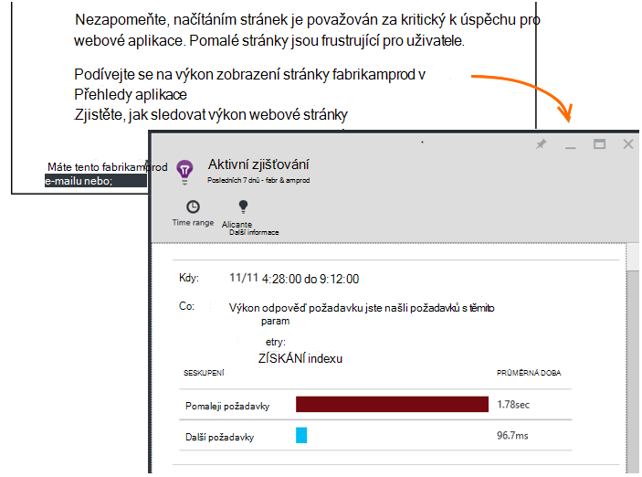

<properties 
    pageTitle="Aplikace přehledy: Diagnostika aktivní výkonu | Microsoft Azure" 
    description="Aplikace přehledy provede podrobné analýzy telemetrie aplikace a zobrazí upozornění na možné problémy." 
    services="application-insights" 
    documentationCenter="windows"
    authors="antonfrMSFT" 
    manager="douge"/>

<tags 
    ms.service="application-insights" 
    ms.workload="tbd" 
    ms.tgt_pltfrm="ibiza" 
    ms.devlang="na" 
    ms.topic="article" 
    ms.date="08/31/2016" 
    ms.author="awills"/>

#  Diagnostika aktivní výkonu

*Přehledy aplikace je v náhledu.*

[Přehledy aplikace Visual Studio](app-insights-overview.md) provede podrobné analýzy telemetrie aplikace a může vás upozorní na potenciální problémy s výkonem. Pravděpodobně čtete tento vzhledem k tomu, že jste dostali jednu z našich aktivní upozornění e-mailem. 

Tato funkce vyžaduje žádné nastavení a při automaticky aktivní aplikace vygeneruje dost telemetrie.

## Jaké jsou Diagnostika aktivní výkonu?

Diagnostika aktivní výkonu zjišťuje neobvyklé vzorků výkonu ve své aplikaci analýzou telemetrie, které aplikace odesílá interpretace aplikace. 

Zejména najde problémy s výkonem, které se projeví pouze určitým uživatelům nebo jenom uživatelům v některých případech projeví.

Můžete například upozornit, pokud stránkách aplikace načíst mnohem na jeden typ prohlížeče než jiné nebo žádosti o jsou pomaleji podávané množství od určitého serveru. Problémy související s kombinací vlastnosti, ho můžete zjistit taky jako načtení pomalé stránky v jedné zeměpisná oblast v určitou dobu dne.

Odchylky tyto velmi obtížně zjistit tak, že podrobná data, ale jsou nejčastěji používaných, než si myslíte. Často se jenom povrchový, když stížnost zákazníkům. Do té doby je příliš pozdě: ovlivněné uživatele jsou už přechod na konkurence!

V současné době naše algoritmů prohlédnout načítáním stránek, doby odezvy požadavek na serveru a doby odezvy závislost.  

Nemáte k vytváření všechny mezní hodnoty či konfigurace pravidel. Počítač učení s pomocí algoritmus dolování dat se používají zjišťování neobvyklé vzorků. 

Mrzí velmi přes mít svůj názor. Dejte nám prosím vědět ho vám pomůže, jak můžeme vylepšit aktivní zjišťování a jaké další funkce chcete, abychom přidat. Poskytnutí zpětné vazby prostřednictvím poslat smajlíka nebo zamračeného smajlíka na portálu nebo e-mailu, abychom vám AppInsightsML@microsoft.com. 

## Informace o aktivní upozornění

* *Proč obdrželi e-mailu?*
 * Aktivní zjišťování analyzovat telemetrie aplikace poslali interpretace aplikace a v aplikaci zjištěny problémy s výkonem. 
* *Znamená oznámení, že jasné narazí na problém?*
 * Ne. Je jednoduše návrh o něco, že můžete se podívat, informace velmi. 
* *Co mám dělat?*
 * [Podívejte se na údaje zobrazené](#responding-to-an-alert). Pomocí Průzkumníka metriky zkontrolujte výkonu v čase a přejít další metriky. Použití vyhledávání k filtrování zvláštní události, které vám pomůžou příčinu kořenové. 
* *Ano že podíváte Moje data?*
 * Ne. Služba není plně automatická. Pouze dostanete oznámení. Data jsou [soukromé](app-insights-data-retention-privacy.md).

## Proces zjišťování

* *Jaké druhy výkonu odchylky zjištění?*
 * Vzorky, které by vás být časově náročný ke kontrole pro sebe. Například slabý výkon ve specifické kombinace umístění, čas den, tak i platformu.
* *Analýza všechna data shromážděná přehledy aplikace?*
 * Není v současné době. V současné době jsme analyzovat vyžádání odpověď čas, dobu odezvy závislost a stránky načíst čas. Analýza další metriky je brzy k dispozici. 
* *Můžu si vytvořit vlastní odchylky pravidla vyhledávání?*
 * Zatím ne. Ale můžete to udělat:
 * [Nastavení upozornění](app-insights-alerts.md) , která se zobrazí, když metriky protíná prahovou hodnotu.)
 * [Export telemetrie](app-insights-export-telemetry.md) do [databáze](app-insights-code-sample-export-sql-stream-analytics.md) nebo [PowerBI](app-insights-export-power-bi.md) nebo [Další](app-insights-code-sample-export-telemetry-sql-database.md) nástroje, kde můžete analyzovat sami.
* *Jak často se provádí analýzy?*
 * Doporučujeme spouštět analýzu denně na telemetrie z předchozí den.
* * Tak to nahradit [metriky upozornění](app-insights-alerts.md)?
 * Ne.  Jsme není potvrdit zjišťování každé chování, které byste mohli chtít neobvyklého.

## Jak zjistit problémy vyplývající

Otevřete diagnostiky sestavu z e-mailu nebo ze seznamu odchylky.

* **Když** zobrazí čas, kdy byl zjištěn problém.
* **K čemu** popisuje
 * Problém, který byl zjištěn;
 * Vlastnosti sady události, které jsme našli zobrazí chování potíže.
* V tabulce srovnává sadu nesprávně fungoval s průměr chování jiné události.

Kliknutím na odkazy otevřete Průzkumníka metrické a hledání na příslušné grafy filtrované na čas a vlastnosti sady pomalé provést.

Změna časového rozsahu nebo filtry, které můžete prozkoumat telemetrie.

## Jak můžu zlepšit výkon?

Pomalé a neúspěšné odpovědi jsou jednu největších frustrations pro uživatele webu znáte z vlastní prostředí. Takže je důležité při řešení problémů.

### Třídění

Nejdřív záleží? Pokud stránku vždy pomalé načítání, ale jenom 1 % uživatelé webu muset někdy ji chcete prohlédnout, máte další důležité myslete. Na druhé straně Pokud pouze 1 % uživatelů otevřela, ale vyvolá výjimek pokaždé, který může být jmění vyšetřování.

Použití příkazu dopad v e-mailu jako obecnou příručku, ale mějte na paměti, že není podrobné informace. Shromáždění dalších důkaz pro potvrzení.

Zvažte parametry problém. Pokud je zeměpisná oblast závislý, nastavit [dostupnost testů](app-insights-monitor-web-app-availability.md) včetně této oblasti: jednoduše pravděpodobně problémům se sítí v této oblasti. 

### Diagnostika načtení pomalé stránky 

Kde je problém? Je pomalá reakce serveru, je na stránce velmi dlouhý nebo udělat před sebou hodně práce zobrazte ji nemá prohlížeči?

Otevřete metrických zásuvné prohlížeče. [Segmentovaný zobrazení času načtení stránky prohlížeče](app-insights-javascript.md#explore-your-data) ukazuje, kam čas. 

* Pokud **Odešlete žádost o čas** nastavená dostatečně vysoká, server odpovídá pomalu nebo žádá příspěvku s velkým množstvím dat. Podívejte se na [měřítka](app-insights-web-monitor-performance.md#metrics) prozkoumat doby odezvy. 
* Nastavte [Sledování závislost](app-insights-dependencies.md) zjistit, zda pomalost kvůli externí služby nebo databáze.
* Pokud je nejvíce **Příjem odpověď** , stránky a jeho závislá části - JavaScript, CSS, obrázky a tak dále (ale asynchronní načtení dat) jsou dlouhé. Nastavte si [otestujte dostupnost](app-insights-monitor-web-app-availability.md)a ujistěte se, jak nastavit možnost načíst závislá částí. Až se dostanete některé výsledky, otevřete podrobnosti o výsledku a rozbalte tuto značku zobrazíte načítáním různých souborů.
* Vysoký **Doba zpracování klienta** o tom, že skripty běží pomalu. Pokud důvod, proč není zřejmé, můžete do ní přidat kód časování a odeslat časy v trackMetric volání.

### Zlepšení pomalé stránky

Je web plné rad k vylepšení odpovědí serveru a načítáním stránek, takže nebude pokusíme opakovat všechny zde. Tady je několik tipů, které pravděpodobně už znáte, slouží k tomu můžete mysli:

* Pomalé načítání z důvodu velké soubory: asynchronní zatížení skripty a další části. Pomocí skriptu navazují. Hlavní stránky rozdělí widgety, které se svým datům načítají samostatně. Neposílejte jednoduchým starý kód HTML dlouhé tabulky: použijte skript s žádostí o data ve formátu JSON nebo jiného kompaktním formátu a potom doplňování v tabulce na místě. Jsou skvělé předlohy pro pomoc s to vše. (Také má za následek velký skripty samozřejmě.)
* Zpomalit závislosti serveru: Zvažte zeměpisné umístění součástí. Pokud používáte Azure, ujistěte se, že na webový server a databázi jsou například ve stejné oblasti. Dotazy vyhledání dalších informací než potřebují? By ukládání do mezipaměti nebo dávky pomoc?
* Kapacita problémy: Podívejte se na serveru metriky doby odezvy a spočítá žádost. Pokud doby odezvy vrcholu nepřiměřeně s vrcholy v žádosti o počtu, je pravděpodobné, že jsou roztažen serverech. 

## Oznámení o e-mailů

* *Je potřeba se přihlásit k odběru tuto službu Pokud chcete dostávat oznámení o?*
 * Ne. Náš bot pravidelně zjišťování data z všichni uživatelé aplikace přehledy a odešle oznámení, pokud zjistí problémy.
* *Je možné odhlášení nebo dostávat oznámení odeslané na Mí kolegové?*
 * Klikněte na odkaz Odhlásit odběr upozornění nebo e-mailu. 
 
    Právě se odesílají uživatele, kteří mají [přístup pro zápis zdroji přehledy aplikace](app-insights-resources-roles-access-control.md).

    Můžete také upravit seznam příjemců nastavení v zásuvné aktivní zjišťování.
* *Můžu nechcete přetížení pomocí těchto zpráv.*
 * Jsou omezeny na jeden den s nejrelevantnější problém, který jsme nebyly dosud vykázaného o. Nedostanete reakce všechny zprávy.
* *Pokud nechcete ho mám nic, bude dostanu připomenutí?*
 * Ne, se zobrazí zpráva o jednotlivé položky, jenom jednou. 
* *Můžu ztratilo e-mailu. Kde najdu své upozornění na portálu?*
 * V části Přehled aplikace přehledy aplikace klikněte na dlaždici **Aktivní zjišťování** . Budete tam moct najít všechny oznámení nahoru dozadu 7 dní.

## Další kroky

Tyto diagnostické nástroje můžete zkontrolovat telemetrie z aplikace:

* [Metriky Průzkumníka](app-insights-metrics-explorer.md)
* [Průzkumník hledání](app-insights-diagnostic-search.md)
* [Technologie pro analýzu - výkonné dotazovací jazyk](app-insights-analytics-tour.md)

Aktivní zjišťování jsou úplně automatické. Ale možná chcete nastavit některé další oznámení?

* [Ručně nakonfigurovat metrických upozornění](app-insights-alerts.md)
* [Dostupnost webových testů](app-insights-monitor-web-app-availability.md) 

