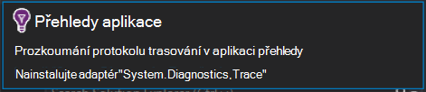

<properties
    pageTitle="Poznámky k verzi pro Visual Studio v článku rozšíření Developer analýzy"
    description="Nejnovější aktualizace Visual Studio nástrojů pro analýzu vývojář."
    services="application-insights"
    documentationCenter=""
    authors="acearun"
    manager="douge"/>
<tags
    ms.service="application-insights"
    ms.workload="tbd"
    ms.tgt_pltfrm="ibiza"
    ms.devlang="na"
    ms.topic="article"
    ms.date="06/09/2016"
    ms.author="acearun"/>

# Poznámky k verzi pro vývojáře analytických nástrojů
Co je nového: přehledy aplikace a HockeyApp analýzy ve Visual Studiu.
## Verze 7.0
### Trendy přehledy aplikace Visual Studio
Přehledy aplikace Visual Studio je nový nástroj ve Visual Studiu využívající můžete zjistit, jak funguje aplikace v čase. Začněte tím, na tlačítko na panelu nástrojů **Aplikace přehledy** nebo v okně aplikace přehledy hledání zvolte **Průzkum trendů Telemetrie**. Na **kartě zobrazení** klikněte na **Ostatní okna**a potom klikněte na **Trendy přehledy aplikace**. Vyberte jednu z pěti běžné dotazy na Začínáme. Můžete analyzovat různé sady dat založené na typech telemetrie, časový rozsah a jiné vlastnosti. Najít odchylky ve vašich datech, zvolte jednu z možností odchylky v rozevíracím seznamu **Typ zobrazení** . Možnosti filtrování v dolní části okna to snadný způsob zdokonalujte v na konkrétní podmnožiny vaší telemetrie.

### Výjimky v CodeLens
Výjimky telemetrie se nyní zobrazí v CodeLens. Pokud projektu jste připojili ke službě přehledy aplikace, zobrazí se počet výjimek, ke kterým došlo v obou metod ve výrobním za posledních 24 hodin. Z CodeLens můžete přejít na hledání a trendů prošetřit výjimky podrobněji.

### Základní ASP.NET podpory
Aplikace přehledy nyní podporuje ASP.NET Core RC2 projekty ve Visual Studiu. Aplikace přehledy můžete přidat do nových projektů ASP.NET Core RC2 v dialogovém okně **Nový projekt** jako následující snímek. Nebo můžete přidat do existujícího projektu, klikněte pravým tlačítkem myši na projekt v Průzkumníku řešení a pak klikněte na **Přidat aplikaci přehledy Telemetrie**.

ASP.NET Core RC2 projekty a ASP.NET 5 RC1 také podporují nový v okně diagnostické nástroje. Zobrazí se aplikace přehledy události, jako třeba žádosti o schůzku a výjimky z aplikace ASP.NET během ladění místně na počítači. Každou událost klikněte na **vyhledávání** a pokusí se přechod k podrobnostem pro další informace.

### HockeyApp aplikací univerzální Windows
Kromě beta rozdělení a uživatel zpětnou vazbu obsahuje HockeyApp symbolicated pád vytváření sestav pro aplikací univerzální Windows. Jsme zjednodušili dokonce přidat HockeyApp SDK: klikněte pravým tlačítkem myši na projektu univerzální Windows a potom klikněte na **Hockey aplikace - povolení selhat technologie pro analýzu**. To nainstaluje SDK nastaví zhroucení kolekce a ustanovení HockeyApp zdroje v cloudu, aniž byste museli nahrávání aplikace služby HockeyApp.

Dalšími novými funkcemi:

* Jsme provedli aplikace přehledy vyhledávání rychlejší a intuitivnější. Teď časový rozsah a filtry podrobností automaticky, použijí se při jejich výběru.
* Taky v aplikaci přehledy hledání teď není možnost Přejít na kód přímo z telemetrie žádost o.
* Vylepšení přihlášení HockeyApp jsme jste udělali.
* V diagnostické nástroje zobrazí se informace telemetrie výrobní výjimky.

## Verze 5,2
Jsme spokojení, ohlaste Úvod HockeyApp scénáře ve Visual Studiu. První integrace se rozdělení beta aplikací univerzální Windows a aplikace Windows formuláře z aplikace Visual Studio.

Normálnímu rozdělení beta dřívější verze aplikace do nahrajete HockeyApp pro distribuci vybrané podmnožiny zákazníků nebo testeři. Rozdělení beta, společně s HockeyApp zhroucení shromažďování a uživatel názory funkcemi, vám může poskytnout důležité informace o svoji aplikaci před provedením obecných vydání. Můžete tyto informace k odstranění problémů s aplikací, tak, aby se zabránilo nebo minimalizovat budoucí potíže, například hodnocení zhoršeným aplikace, záporné názory a tak dál.

Zjistěte, jak jednoduché je nahrát vytvoří pro rozdělení beta z aplikace Visual Studio.
### Aplikací univerzální Windows
Místní nabídka pro uzel projektu aplikací univerzální Windows nyní obsahuje možnost odeslat vaše sestavení HockeyApp.

Vyberte položku a HockeyApp nahrát dialogové okno. Budete potřebovat účet HockeyApp Nahrajte svůj Tvůrce dotazů. Pokud jste nový uživatel, nemusíte dělat starosti. Vytvoření účtu je jednoduchý proces.

Když jste připojeni, zobrazí se odeslání formuláře v dialogovém okně.

Vyberte obsah, který chcete nahrát (soubor .appxbundle nebo .appx) a pak zvolte možnosti vydání v průvodci. Pokud chcete můžete přidat poznámky k verzi na další stránce. Klikněte na **Dokončit** zahájit nahrávání.

Po dokončení nahrávání se zobrazí oznámení s potvrzením a odkaz v aplikaci portálu HockeyApp HockeyApp.

Je to! Právě jste nahráli Tvůrce dotazů pro rozdělení beta, kde můžete pouhými několika kliknutími.

Můžete spravovat aplikace v portálu HockeyApp spoustu způsobem. Jedná se o pozvat uživatele, zobrazení sestavy pád a zpětnou vazbu, změna podrobnosti a tak dál.

Najdete v článku [znalostní báze Knowledge HockeyApp](http://support.hockeyapp.net/kb/app-management-2) podrobné informace o správě aplikace.

### Windows formulářů aplikace
Místní nabídka pro uzel projektu formulář Windows nyní obsahuje možnost odeslat vaše sestavení HockeyApp.

Otevře se dialogové okno Odeslat HockeyApp se podobá té v aplikaci univerzální Windows.

Poznámka: nové pole v tomto průvodci určující verzi aplikace. Aplikací univerzální Windows informace vyplněné z manifestu. Aplikace Windows Forms bohužel nemají ekvivalent k této funkci. Je třeba zadat ručně.

Zbytek tok je podobný aplikací univerzální Windows: zvolit Tvůrce dotazů a uvolněním možnosti, přidejte vydání poznámky, nahrajte a Správa portálu HockeyApp.

Je jednoduchá – stačí. Vyzkoušejte si to a dejte nám vědět, co si myslíte.
## Verze 4.3
### Hledání telemetrie z místní ladění relací
V této verzi nyní vyhledáváte aplikace přehledy telemetrie vytvořený ve Visual Studiu ladění relace. Dřív můžete použít hledání jenom v případě, že aplikace registrovaný u aplikace přehledy. Aplikaci teď, musí mít v aplikaci přehledy SDK nainstalovaný vyhledejte místní telemetrie.

Pokud máte aplikaci ASP.NET s přehledy SDK aplikace, postupujte následujícím způsobem můžete hledat.

1. Ladění aplikace.
2. Otevřete aplikaci přehledy hledání v jednom z těchto způsobů:
    - Na **kartě zobrazení** klikněte na **Ostatní okna**a klikněte na **Hledat přehledy aplikace**.
    - Klikněte na tlačítko na panelu nástrojů **Aplikace přehledy** .
    - V Průzkumníku rozbalte **ApplicationInsights.config**a potom klikněte na **Hledat ladění relace telemetrie**.
3. Pokud ještě nemáte s přehledy aplikace, otevře se okno hledání v režimu telemetrie ladění relace.
4. Klikněte na ikonu **hledání** zobrazíte místní telemetrie.

## Verze 4.2
V této verzi jsme přidali funkcí, které usnadňují vyhledávání dat snadnější v kontextu události, možnost Přejít ke kódu z více dat událostí a umožňují prostředí odeslání protokolování dat pro přehledy aplikace. Tuto linku se aktualizuje každý měsíc. Pokud máte požadavky na zpětné vazby nebo funkcí odeslat do aidevtools@microsoft.com.
### Klikněte na bez protokolování prostředí
Pokud už používáte NLog, log4net nebo System.Diagnostics.Tracing, nemusíte bát, přesunutí všech zaznamenané trasování interpretace aplikace. Integrovali adaptéry protokolování aplikace přehledy v této verzi jsme s normálním konfigurací prostředí.
Pokud už máte jednu z těchto protokolování rámce nakonfigurovali, následující část popisuje, jak ho získat.
**Pokud jste už přidali přehledy aplikace:**
1. Klikněte pravým tlačítkem myši na uzel projektu a potom klikněte na **Aplikace přehledy**a klikněte na **Konfigurovat přehledy aplikace**. Ujistěte se, že se možnost přidat správné adaptér v okně konfigurace.
2. Můžete taky, když vytvoříte řešení, Všimněte si automaticky otevírané okno, které se zobrazí v horní pravém rohu obrazovky a klikněte na **Konfigurovat**.

Pokud máte nainstalován adaptér protokolování, spusťte aplikaci a ujistěte se, že se zobrazí data na kartě Nástroje pro diagnostiku takto:

### Přechod nebo vyhledání kódu, kde je vlastnost události telemetrie vyzařovaného
Nové verze uživatele můžete klikněte na libovolnou hodnotu v případě podrobných dat a to bude hledat odpovídající řetězec v aktuálním otevřít řešení. Výsledky se zobrazí ve Visual Studiu "Výsledky hledání" uveden, jak je ukázáno v následujícím příkladu:

### Pokud nejste přihlášení nové okno hledání
Jsme jste vylepšení vzhledu okna aplikace přehledy hledání můžete hledat data během je aplikace ve výrobním.

### Zobrazit všechny události telemetrie přidružené k události
Jsme přidali nová karta se předdefinované dotazy pro všechna data souvisejících s událostí telemetrie, že uživatel prohlíží vedle ouško podrobností o události. Žádost o například obsahuje pole s názvem **ID operace**. Všech událostí přidružený k tomuto požadavku má stejné hodnoty pro **ID operace**. Případě výjimky při operaci zpracování požadavku výjimku je uveden stejné ID operace jako žádost snadněji najít. Pokud se díváte na žádost o, klikněte na **všechny telemetrie pro tuto operaci** otevřete novou kartu, která se zobrazí nová výsledků hledání.

### V hledání historii zpět a vpřed
Teď můžete přejít přepínat mezi výsledky hledání.

## Verze 4.1
Tato verze obsahuje mnoho nových funkcí a aktualizace. Musíte mít nainstalovaný nainstalovat tuto verzi aktualizace 1.

### Přechod z výjimku metody v zdrojového kódu
Teď Pokud zobrazují výjimky z aplikace výrobní v okně aplikace přehledy hledání můžete přejít na metodu v kódu místo, kde výjimku dochází. Potřebujete mít načtena správný projekt a aplikace přehledy má na starosti zbývající! (Další informace o okna aplikace přehledy hledání najdete v tématu poznámky k verzi pro verze 4.0 v následujících částech.)

Jak to funguje? Hledání aplikací přehledy můžete použít i v případě, že řešení není otevřený. Oblasti trasování zásobníku zobrazí zprávu s informací, a počet položek v zásobníku nejsou k dispozici.

Pokud soubor informace jsou k dispozici, některé položky může být odkazy, ale na položku informace o řešení budou nadále zobrazovat.

Pokud kliknete na tlačítko hypertextový odkaz, budete přejdete do umístění vybrané metody v kódu. Může být rozdíl v číslo verze, ale funkce Přejít na správnou verzi kódu, chodily v novějších verzích.

### Zaznamenat nové vstupní body do pole Hledat v okně Průzkumník
Teď se dostanete Hledat v okně Průzkumník řešení.

### Zobrazí upozornění při publikování dokončení
Automaticky otevírané zobrazí se dialogové okno při projektu je publikován online, tak, aby aplikace přehledy data můžete zobrazit v výroby.

## Verze 4.0

### Hledání dat aplikace přehledy z aplikace Visual Studio
Podobně jako funkce Hledat ve přehledy aplikace portál, teď ve Visual Studiu můžete filtrovat a vyhledávat na typy událostí, nemovitostí s hodnotou a text a pak zkontrolovat jednotlivé události.

### Zobrazení dat pocházejících z místního počítače v diagnostické nástroje

Na stránce Visual Studio diagnostické nástroje můžete zobrazit telemetrie, kromě jiná ladění data. Je podporována pouze ASP.NET 4.5.

### Přidání SDK do projektu nejsou přitom přihlášení ke Azure

Už máte přihlásit k Azure přidání balíčků aplikací přehledy do projektu, prostřednictvím dialogového okna **Nového projektu** nebo z místní nabídky projektu. Pokud se přihlásíte, bude v SDK nainstalovali a nakonfigurovali telemetrie odešlete portálu jako před. Pokud nemáte přihlásit, SDK se přidají do vašeho projektu a vygeneruje telemetrie diagnostiky rozbočovače. Můžete nakonfigurovat ho později můžete podle potřeby.

### Podpora zařízení

Na *Connect();* 2015 abychom se [ohlásí,](https://azure.microsoft.com/blog/deep-diagnostics-for-web-apps-with-application-insights/) že naše zkušenosti karta Vývojář v mobilním zařízení je HockeyApp. HockeyApp umožňuje distribuovat beta sestavení do svého testeři, shromáždit a analyzovat všechny havaruje z aplikace a shromáždit názory přímo od zákazníků.
HockeyApp podporuje aplikace na ten platformě budete chtít vytvořit, ať, iOS, Android a Windows nebo řešení platformy, jako je Xamarin, Cordova nebo jednotky.

V budoucích verzích aplikace přehledy rozšíření jsme budete Představte integrovanější prostředí mezi HockeyApp a Visual Studia. Nyní můžete začít s HockeyApp jednoduše přidáním NuGet odkaz. Zobrazit [si přečtěte následující dokumentaci](http://support.hockeyapp.net/kb/client-integration-windows-and-windows-phone) pro další informace.
