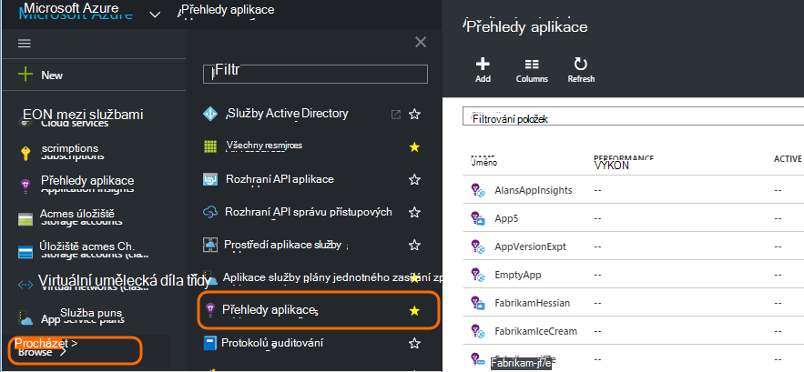
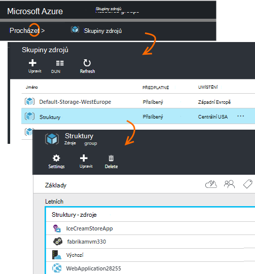
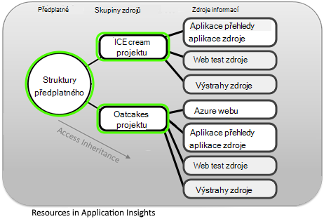
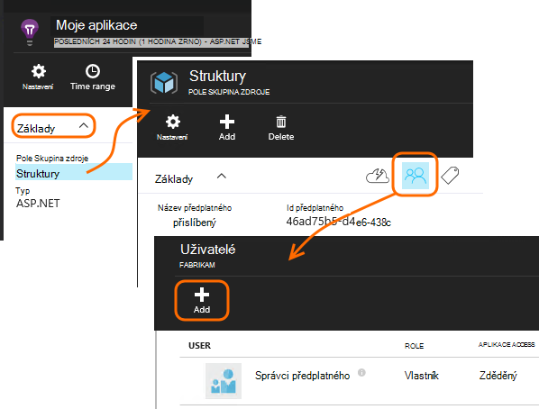
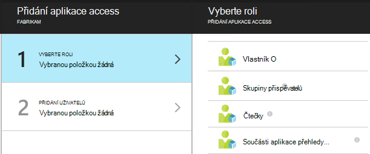
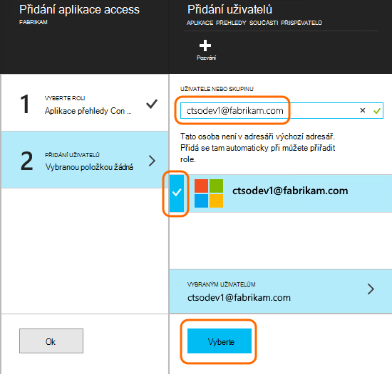

<properties
    pageTitle="Zdroje, role a řízení přístupu v aplikaci přehledy"
    description="Vlastníci, přispěvatelé a čtenáři přehledy vaší organizace."
    services="application-insights"
    documentationCenter=""
    authors="alancameronwills"
    manager="douge"/>

<tags
    ms.service="application-insights"
    ms.workload="tbd"
    ms.tgt_pltfrm="ibiza"
    ms.devlang="na"
    ms.topic="article"
    ms.date="05/07/2016"
    ms.author="awills"/>

# Zdroje, role a řízení přístupu v aplikaci přehledy

Můžete určit, kdo má čtení a aktualizovat přístup k datům ve Visual Studiu [Aplikace přehledy][start], pomocí [řízení přístupu na základě rolí v Microsoft Azure](../active-directory/role-based-access-control-configure.md).

> [AZURE.IMPORTANT] Přiřadíte přístup uživatelům v **pole Skupina zdroje nebo předplatné** , ke které patří prostředku aplikace – ne v samotné zdroje. Přiřazení role **přispěvatele component přehledy aplikace** . Díky jednotné řízení přístupu k webu testů a upozornění spolu s aplikací zdroje. [Další informace](#access).

## Zdroje, skupiny a předplatné

Nejdřív uvedeme pár definice:

* **Zdroje** - instanci služby Microsoft Azure. Aplikace přehledy zdroje shromažďuje, analyzuje a zobrazí telemetrickými daty odesílaným z aplikace.  Další typy Azure zdrojů zahrnutím webové aplikace, databáze a VMs.

    Pokud chcete zobrazit všechny zdroje, přejděte na [Portál Azure][portal], přihlaste se a klikněte na Procházet.

    

* [**Pole Skupina zdroje** ] [ group] -každý zdroj patří do jedné skupiny. Skupina je pohodlný způsob, jak spravovat související materiály, zejména pro řízení přístupu. Například do jedné skupině zdrojů může vložíte do webových aplikací, prostředek aplikace přehledy sledování aplikace a prostředek úložiště zachovat exportovaná data.

    

* [**Předplatné**](https://manage.windowsazure.com) - použití přehledy aplikací nebo jiných Azure zdrojů, přihlaste se k předplatnému Azure. Každé pole Skupina zdroje patří Azure předplatných, kde zvolte cena balíček a, pokud je předplatné organizace vyberte členy a jejich oprávnění.
* [**Účet Microsoft** ] [ account] – uživatelské jméno a heslo, které používáte pro přihlášení k Microsoft Azure předplatná, XBox Live, Outlook.com a další služby od Microsoftu.

## Řízení přístupu do skupiny prostředků

Je důležité pochopit, aby kromě zdroj, který jste vytvořili pro aplikaci, jsou taky samostatné skryté prostředky pro upozornění a webových testů. Jsou připojeny ke stejné [pole Skupina zdroje](#resource-group) jako aplikace. Můžete taky mají ukládat další služby Azure v umístění, třeba weby nebo úložiště.

Řízení přístupu k těmto zdrojům proto doporučujeme:

* Řízení přístupu na úrovni **pole Skupina zdroje nebo předplatného** .
* Přiřazení role **přispěvatele komponentě přehledy aplikace** uživatelům. Umožňuje upravovat webových testů, upozornění a zdroje aplikace přehledy bez povolení přístupu k dalším službám ve skupině.

## Zajistit přístup k jiným uživatelem

Musíte mít oprávnění vlastníka předplatné nebo skupina zdroje.

Uživatel musí mít [Účet Microsoft][account], nebo přístup ke svému [Účtu organizace Microsoft](..\active-directory\sign-up-organization.md). Osobám a taky skupin uživatelů v Azure Active Directory definované může poskytnout přístup.

#### Přejděte do skupiny zdrojů

Přidejte uživatele tam.

Nebo můžete přejít o druhé úrovně a přidejte uživatele k předplatnému.

#### Vyberte roli

Role | Ve skupině zdroje
---|---
Vlastník | Můžete změnit cokoliv včetně přístupu uživatelů
Skupiny přispěvatelů | Můžete něco upravit, včetně všech zdrojů
Přispěvatel přehledy součásti aplikace | Můžete upravovat aplikace přehledy zdrojů, webových testů a oznámení
Čtečky | Můžete zobrazit, ale ne provádět žádné změny

Vytvoření, odstranění a aktualizace "úpravy obsahuje:

* Zdroje informací
* Testuje web
* Upozornění
* Nepřetržitý exportu

#### Vyberte uživatele

Není-li uživatele, kterého chcete v adresáři, můžete pozvat kdokoliv pod svým účtem Microsoft.
(Pokud používají služby, jako třeba Outlook.com, Onedrivu, Windows Phone a XBox Live, mají svým účtem Microsoft.)

## Uživatelů a rolí

* [Řízení přístupu v Azure na základě rolí](../active-directory/role-based-access-control-configure.md)

<!--Link references-->

[account]: https://account.microsoft.com
[group]: ../resource-group-overview.md
[portal]: https://portal.azure.com/
[start]: app-insights-overview.md
