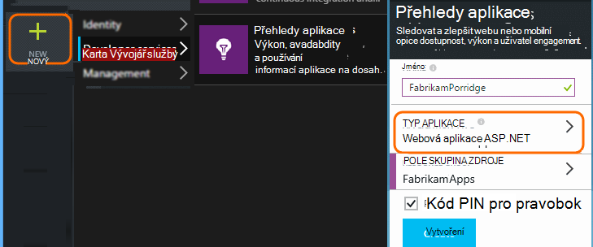
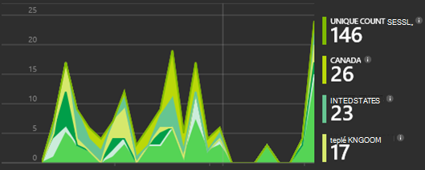

<properties 
    pageTitle="Návod: Sledování Microsoft Dynamics CRM s přehledy aplikace" 
    description="Pokud potřebujete telemetrie z Microsoft Dynamics CRM Online s použitím aplikace přehledy. Návod instalace získávání dat, vizualizace a export." 
    services="application-insights" 
    documentationCenter=""
    authors="mazharmicrosoft" 
    manager="douge"/>

<tags 
    ms.service="application-insights" 
    ms.workload="tbd" 
    ms.tgt_pltfrm="ibiza" 
    ms.devlang="na" 
    ms.topic="article" 
    ms.date="11/17/2015" 
    ms.author="awills"/>
 
# Návod: Povolení Telemetrie Microsoft Dynamics CRM Online s použitím aplikace přehledy

V tomto článku se dozvíte, jak získat telemetrickými daty z [Webu Microsoft Dynamics CRM Online](https://www.dynamics.com/) pomocí [Přehledy aplikace Visual Studio](https://azure.microsoft.com/services/application-insights/). Budete projdeme úplný postup přidání skript aplikace přehledy aplikaci, zaznamenání dat a vizualizaci dat.

>[AZURE.NOTE] [Procházet řešení vzorku](https://dynamicsandappinsights.codeplex.com/).

## Přidání aplikace přehledy nové nebo existující CRM Online instanci 

Sledování aplikace, přidejte SDK přehledy aplikace do aplikace. V SDK pošle telemetrie [přehledy aplikace portál](https://portal.azure.com), kde můžete použít naše výkonné analýzy a diagnostických nástrojů, nebo exportovat data k základnímu úložišti.

### Vytvoření zdrojů aplikace přehledy v Azure

1. Zřízení [účtu v Microsoft Azure](http://azure.com/pricing). 
2. Přihlaste se k [portálu Azure](https://portal.azure.com) a přidání nového prostředku přehledy aplikace. Toto je místo, kam zpracování a zobrazí data.

    

    Zvolte ASP.NET jako typ aplikace.

3. Otevřete kartu Rychlý Start a otevřete skript kód.

    

**Nechte stránku kód otevřenou** i v případě se na další krok v jiném okně prohlížeče. Musíte mít kód brzy bude k dispozici. 

### Vytvoření webového prostředku JavaScript v aplikaci Microsoft Dynamics CRM

1. Otevřete CRM Online instance a přihlaste se s oprávněními správce.
2. Otevřete Microsoft Dynamics CRM nastavení vlastních úprav přizpůsobení systému

    
    
    

    

3. Vytvořte zdroj JavaScript.

    

    Zadejte název, vyberte **skript (JScript)** a otevřete textový editor.

    
    
4. Zkopírujte kód z aplikace přehledy. Při kopírování zkontrolujte přeskočit skript značky. Označovat pod snímek:

    

    Tento kód obsahuje klíč přístrojového vybavení, který identifikuje prostředku přehledy aplikace.

5. Uložte a publikujte.

    

### Nástroje formuláře

1. V aplikaci Microsoft CRM Online otevření formuláře Klient

    

2. Otevřete formulář vlastnosti

    

3. Přidání zdroje JavaScript web, který jste vytvořili

    

    

4. Uložte a publikujte formulář.

## Metriky nezaznamenávají

Teď jste nastavili telemetrie zachycení pro formulář. Pokaždé, když se používá, data odeslána zdroji přehledy aplikace.

Tady jsou příklady data, která se zobrazí.

#### Ochrana aplikací

Výjimky prohlížeče:

Klikněte na graf a získejte další informace:

#### Použití

#### Prohlížeče

#### Zeměpisná poloha

#### Vnitřní stránky zobrazit požadavek

## Ukázkový kód

[Procházet ukázkový kód](https://dynamicsandappinsights.codeplex.com/).

## Power BI

I hlubší analýze můžete dělat, když [Exportovat data k Microsoft Power BI](app-insights-export-power-bi.md).

## Ukázka řešení Microsoft Dynamics CRM

[Tady je ukázka řešení implementovaná v aplikaci Microsoft Dynamics CRM] (https://dynamicsandappinsights.codeplex.com/).

## Víc se uč

* [Co je aplikace přehledy?](app-insights-overview.md)
* [Přehledy aplikace na webových stránkách](app-insights-javascript.md)
* [Další příklady a návody](app-insights-code-samples.md)

 
