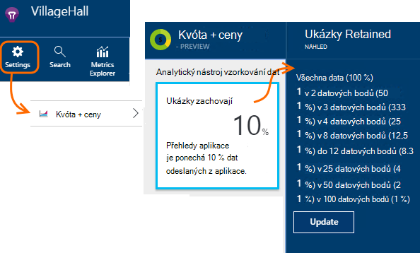

<properties 
    pageTitle="Analytický nástroj vzorkování telemetrie v aplikaci přehledy | Microsoft Azure" 
    description="Jak zajistit, aby objemu telemetrie pod kontrolou." 
    services="application-insights" 
    documentationCenter="windows"
    authors="vgorbenko" 
    manager="douge"/>

<tags 
    ms.service="application-insights" 
    ms.workload="tbd" 
    ms.tgt_pltfrm="ibiza" 
    ms.devlang="na" 
    ms.topic="article" 
    ms.date="08/30/2016" 
    ms.author="awills"/>

#  <a name="sampling-in-application-insights"></a>Analytický nástroj vzorkování v aplikaci přehledy

*Přehledy aplikace je v náhledu.*


Analytický nástroj vzorkování je funkce aplikace [Visual Studio aplikace přehledy](app-insights-overview.md) doporučené postupy snížit telemetrie přenosy a úložiště při zachování statistické správné analýzy dat aplikace. Filtr slouží k výběru položek, které se týkají tak, aby bylo možné přecházet mezi položkami při provádění diagnostiky vyšetřování.
Když metrických počty se zobrazují na portálu, jsou renormalized vzít v úvahu odběr minimalizovat žádný vliv na Statistika.

Analytický nástroj vzorkování sníží přenos, umožňuje nedovoluje měsíční kvóty dat a pomáhá zabránit omezení.

## <a name="in-brief"></a>Stručně řečeno:

* Analytický nástroj vzorkování zachová 1 v záznamech *n* a zahodí ostatních. Například ho zachovat 1 do 5 události, vzorkování 20 %. 
* Analytický nástroj vzorkování se stane automaticky, když aplikace odešle spoustu telemetrie, v ASP.NET web apps serveru.
* Můžete nastavit taky ručně, odběr buď na portálu na stránce ceny, nebo v SDK ASP.NET v souboru config taky snížení zatížení sítě.
* Pokud chcete mít jistotu, že sadu událostí se zachovají nebo vyřazené společně se odhlásíte vlastní události, ujistěte se, že budou mít stejnou hodnotu OperationId.
* Analytický nástroj vzorkování dělitel *n* je uvedená v jednotlivých záznamů ve vlastnosti `itemCount`, které v hledání se zobrazí v části popisný název "počet požadavku" nebo "počet událostí". Analytický nástroj vzorkování není v operaci, `itemCount==1`.
* Pokud jste napsali analýzy dotazů, byste měli [vzít v úvahu odběr](app-insights-analytics-tour.md#counting-sampled-data). Zejména místo jednoduše spočítat záznamů, měli byste použít `summarize sum(itemCount)`.


## <a name="types-of-sampling"></a>Typy analytický nástroj vzorkování


Existují tři způsoby alternativní odběr:

* **Adaptivní odběr** automaticky přizpůsobí objemu telemetrie odesílaným z SDK v aplikaci ASP.NET. Výchozí z SDK v 2.0.0-beta3. Aktuálně dostupné pro ASP.NET serverovou pouze telemetrie. 
* **Analytický nástroj vzorkování pevné rychlostí** snižuje objemu telemetrie odesláno ze serveru ASP.NET a od vašich uživatelů prohlížeče. Nastavení časového intervalu. Klienta a serveru synchronizuje jejich odběru tak, v hledání, můžete procházet mezi zobrazeními související stránky a požadavky.
* **Analytický nástroj vzorkování požití** snižuje objemu telemetrie zachovají službou aplikace přehledy rychlostí nastavené. Nedojde k omezení telemetrie přenosy, ale pomůže vám to v rámci měsíční kvóty. 

Analytický nástroj vzorkování požití je vypnutá, pokud Adaptivní nebo Pevná sazba analytický nástroj vzorkování operace.

## <a name="ingestion-sampling"></a>Analytický nástroj vzorkování požití

Tento formulář odběr pracuje v místě, kde telemetrie z webového serveru, prohlížečů a zařízení dosáhne koncového bodu služby přehledy aplikace. Přestože nemá zmenšit telemetrie přenosů z aplikace, snižte množství zpracování a zachovají (a účtovaná za) tak, že aplikace přehledy.

Pokud aplikace často přejde myší kvóta měsíční a nemám možnost použít jeden z typů na základě SDK odběru pomocí tohoto typu odběru. 

Nastavení četnosti v kvót a ceny zásuvné:



Podobně jako ostatní typy odběr zachová algoritmu telemetrie související položky. Třeba když jste podrobná telemetrie v hledání, byste měli zobrazíte žádost týkající se určitého výjimku. Metriky spočítá třeba požadavek sazba a výjimce sazba správně zachovány.

Datové body, které jsou zrušeny vzorků nejsou k dispozici v libovolné aplikaci přehledy funkci například [Průběžné Export](app-insights-export-telemetry.md).

Analytický nástroj vzorkování požití nemá pracovat během operace založené na SDK Adaptivní nebo pevnou sazeb odběr. Pokud vzorkování na SDK je menší než 100 %, je ignorován vzorkování požití, které nastavíte.

> [AZURE.WARNING] Hodnoty zobrazené na dlaždici označuje hodnota, která jste nastavili pro požití odběr. Pokud SDK odběr ho není představují skutečné vzorkování.


## <a name="adaptive-sampling-at-your-web-server"></a>Adaptivní odběru na webový server

Adaptivní odběr je k dispozici pro přehledy SDK aplikace pro ASP.NET v 2.0.0-beta3 a v novějších verzích a je standardně zapnutá. 


Adaptivní odběr ovlivňuje objemu telemetrie odesílaných z vaší webové aplikace pro server ke službě přehledy aplikace. Hlasitost automaticky upravit nedovoluje určené maximální rychlosti provoz.

Ho není pracují na zhoršeným objemu telemetrie, tak aplikaci ladění nebo nebudou mít vliv na web s málo používala.

Dosáhnout hlasitost cílové část telemetrie generovaného ignorován. Ale podobně jako ostatní typy odběr algoritmu zachová telemetrie související položky. Třeba když jste podrobná telemetrie v hledání, byste měli zobrazíte žádost týkající se určitého výjimky. 

Metriky spočítá třeba požadavek sazba a výjimce sazba se upraví tak, aby vyrovnávat vzorkování, aby zobrazovala přibližně správné hodnoty v Průzkumníku míru.

**Aktualizace projektu NuGet** balíčků nejnovější *předprodejní* verzi aplikace přehledy: klikněte pravým tlačítkem myši na projekt v Průzkumníku řešení, zvolte Správa balíčků NuGet, zaškrtněte **Zahrnout zkušební** a vyhledejte Microsoft.ApplicationInsights.Web. 

V [ApplicationInsights.config](app-insights-configuration-with-applicationinsights-config.md), můžete nastavit několik parametrů v `AdaptiveSamplingTelemetryProcessor` uzlů. Čísla uvedená jsou výchozí hodnoty:

* `<MaxTelemetryItemsPerSecond>5</MaxTelemetryItemsPerSecond>`

    Cílová rychlost adaptivní algoritmus cíle na **u každého hostitele serveru**. Pokud váš web appu získáte v mnoha hosts snížit tuto hodnotu tak, aby se v rámci cílová rychlost provozu na portálu přehledy aplikace.

* `<EvaluationInterval>00:00:15</EvaluationInterval>` 

    Interval, pro niž aktuální sazbu telemetrie opět hodnotit. Hodnocení se provádí jako klouzavého průměru. Můžete chtít zkrácení tento interval, pokud vaše telemetrie podléhá náhlé roztržení.

* `<SamplingPercentageDecreaseTimeout>00:02:00</SamplingPercentageDecreaseTimeout>`

    Při odběru procentuální hodnotu změny, jak brzy po jsme mohou menší procento vzorkování znovu k zaznamenání snižují data.

* `<SamplingPercentageIncreaseTimeout>00:15:00</SamplingPercentageIncreaseTimeout>`

    Při odběru procentuální hodnotu změny, jak brzy po jsme mohou zvýšit procento vzorkování znovu k zaznamenání další data.

* `<MinSamplingPercentage>0.1</MinSamplingPercentage>`

    Jako odběr procento liší, co je minimální hodnotu, kterou jsme akce můžete nastavit.

* `<MaxSamplingPercentage>100.0</MaxSamplingPercentage>`

    Jako odběr procento liší, co je maximální hodnota, kterou jsme akce můžete nastavit.

* `<MovingAverageRatio>0.25</MovingAverageRatio>` 

    Do výpočtu klouzavého průměru tloušťky přiřazené k poslední hodnotu. Použijte hodnota rovna nebo menší než 1. Nižšími hodnotami měnit algoritmu méně informace k náhlé.

* `<InitialSamplingPercentage>100</InitialSamplingPercentage>`

    Hodnota přiřazená po jenom spuštění aplikace. Není to snížit při ladění. 

### <a name="alternative-configure-adaptive-sampling-in-code"></a>Alternativní: Konfigurace adaptivní odběr kódu

Místo nastavení odběru v souboru config, můžete použít kód. To vám umožní určit zpětné funkci, která vyvolání pokaždé, když je znovu vyhodnocené četnosti. Můžete to, například pokud chcete zjistit, jaké vzorkování používá.

Odebrání `AdaptiveSamplingTelemetryProcessor` uzel ze souboru config.


*C#*

```C#

    using Microsoft.ApplicationInsights;
    using Microsoft.ApplicationInsights.Extensibility;
    using Microsoft.ApplicationInsights.WindowsServer.Channel.Implementation;
    using Microsoft.ApplicationInsights.WindowsServer.TelemetryChannel;
    ...

    var adaptiveSamplingSettings = new SamplingPercentageEstimatorSettings();

    // Optional: here you can adjust the settings from their defaults.

    var builder = TelemetryConfiguration.Active.TelemetryProcessorChainBuilder;
    
    builder.UseAdaptiveSampling(
         adaptiveSamplingSettings,

        // Callback on rate re-evaluation:
        (double afterSamplingTelemetryItemRatePerSecond,
         double currentSamplingPercentage,
         double newSamplingPercentage,
         bool isSamplingPercentageChanged,
         SamplingPercentageEstimatorSettings s
        ) =>
        {
          if (isSamplingPercentageChanged)
          {
             // Report the sampling rate.
             telemetryClient.TrackMetric("samplingPercentage", newSamplingPercentage);
          }
      });

    // If you have other telemetry processors:
    builder.Use((next) => new AnotherProcessor(next));

    builder.Build();

```

([Další informace o procesorech telemetrie](app-insights-api-filtering-sampling.md#filtering).)


<a name="other-web-pages"></a>
## <a name="sampling-for-web-pages-with-javascript"></a>Analytický nástroj vzorkování na webových stránkách s JavaScript

Můžete nakonfigurovat webových stránek pro odběr pevnou sazba z jakéhokoli serveru. 

Při [konfiguraci webové stránky pro přehledy aplikace](app-insights-javascript.md), upravit fragment kódu, který získáte z portálu přehledy aplikace. (V aplikacích ASP.NET fragment obvykle jsou uvedeny v _Layout.cshtml.)  Vložení řádku jako `samplingPercentage: 10,` před klávesu přístrojového vybavení:

    <script>
    var appInsights= ... 
    }({ 


    // Value must be 100/N where N is an integer.
    // Valid examples: 50, 25, 20, 10, 5, 1, 0.1, ...
    samplingPercentage: 10, 

    instrumentationKey:...
    }); 
    
    window.appInsights=appInsights; 
    appInsights.trackPageView(); 
    </script> 

Procento vzorkování zvolte procento, který je tomu vašemu nejbližší 100/N, kde N je celé číslo.  Odběr aktuálně nepodporuje hodnotám.

Pokud povolíte také pevnou sazeb odběru na serveru, klienty a serverem synchronizuje tak, v hledání, můžete procházet mezi zobrazeními související stránky a požadavky.


## <a name="fixed-rate-sampling-for-aspnet-web-sites"></a>Analytický nástroj vzorkování pevnou sazeb pro weby ASP.NET

Analytický nástroj vzorkování paušální snižuje přenosů z webového serveru a webových prohlížečů. Na rozdíl od adaptivní odběr snižuje telemetrie pevná sazbou sleduje vy. Také synchronizuje klienta a serveru odběr tak, aby se zachovají souvisejících položek – například tak, že když se podíváte na zobrazení stránky v hledání, můžete najít požádání související.

Analytický nástroj vzorkování algoritmus zachová související položky. Pro každou žádost HTTP události, ho a související události jsou zrušeny nebo přenášené informace. 

V Průzkumníku metriky jsou sazby třeba počty žádost a výjimce vynásobené faktor pro vzorkování, tak, aby byly přibližně správné.

1. Nejnovější *předprodejní* verzi aplikace přehledy **Aktualizovat balíčků NuGet vašeho projektu** . Klikněte pravým tlačítkem myši na projekt v Průzkumníku řešení, zvolte Správa balíčků NuGet, zaškrtněte **Zahrnout zkušební** a vyhledejte Microsoft.ApplicationInsights.Web. 

2. **Zakázání adaptivní odběr**: V [ApplicationInsights.config](app-insights-configuration-with-applicationinsights-config.md), odebrat nebo poznámky `AdaptiveSamplingTelemetryProcessor` uzel.

    ```xml

    <TelemetryProcessors>
    <!-- Disabled adaptive sampling:
      <Add Type="Microsoft.ApplicationInsights.WindowsServer.TelemetryChannel.AdaptiveSamplingTelemetryProcessor, Microsoft.AI.ServerTelemetryChannel">
        <MaxTelemetryItemsPerSecond>5</MaxTelemetryItemsPerSecond>
      </Add>
    -->
    

    ```

2. **Povolte modulu pevnou sazeb odběr.** Přidáte tento fragment [ApplicationInsights.config](app-insights-configuration-with-applicationinsights-config.md):

    ```XML

    <TelemetryProcessors>
     <Add  Type="Microsoft.ApplicationInsights.WindowsServer.TelemetryChannel.SamplingTelemetryProcessor, Microsoft.AI.ServerTelemetryChannel">

      <!-- Set a percentage close to 100/N where N is an integer. -->
     <!-- E.g. 50 (=100/2), 33.33 (=100/3), 25 (=100/4), 20, 1 (=100/100), 0.1 (=100/1000) -->
      <SamplingPercentage>10</SamplingPercentage>
      </Add>
    </TelemetryProcessors>

    ```

> [AZURE.NOTE] Procento vzorkování zvolte procento, který je tomu vašemu nejbližší 100/N, kde N je celé číslo.  Odběr aktuálně nepodporuje hodnotám.


### <a name="alternative-enable-fixed-rate-sampling-in-your-server-code"></a>Alternativní: povolení odběr pevnou sazeb v kódu serveru


Místo nastavení odběru parametru v souboru config, můžete použít kód. 

*C#*

```C#

    using Microsoft.ApplicationInsights.Extensibility;
    using Microsoft.ApplicationInsights.WindowsServer.TelemetryChannel;
    ...

    var builder = TelemetryConfiguration.Active.GetTelemetryProcessorChainBuilder();
    builder.UseSampling(10.0); // percentage

    // If you have other telemetry processors:
    builder.Use((next) => new AnotherProcessor(next));

    builder.Build();

```

([Další informace o procesorech telemetrie](app-insights-api-filtering-sampling.md#filtering).)


## <a name="when-to-use-sampling"></a>Kdy použít odběr?

Adaptivní odběru je automaticky zapnutá, pokud používáte 2.0.0-beta3 verze technologie ASP.NET SDK nebo novější. Bez ohledu na to SDK verzi používáte můžete použít požití odběru (v našem serveru).

Analytický nástroj vzorkování nemusíte u většiny aplikací malé a střední velikost. Nejužitečnější diagnostické informace a nejpřesnější statistiky jsou získány tak, že shromažďování dat o vašich aktivit uživatelů. 

 
Hlavních výhod odběru jsou:

* Přehledy služby kapky ("omezením") datové body aplikace aplikace odešle velmi vysoké sazba telemetrie stručně řečeno časový interval. 
* Abyste mohli do [kvóty](app-insights-pricing.md) datových bodů pro ceny osy. 
* Z kolekce telemetrie snížení zatížení sítě. 

### <a name="which-type-of-sampling-should-i-use"></a>Jaký typ odběr mám použít?


**Použijte požití odběr pokud:**

* Často absolvovat vaše měsíční kvóta telemetrie.
* Používáte verzi SDK, která nepodporuje odběr – například, Java SDK nebo ASP.NET verze dřívější než 2.
* Dostáváte velké množství telemetrie z vašich uživatelů webových prohlížečů.

**Použijte pevnou sazeb odběr pokud:**

* Používáte SDK přehledy aplikace pro verzi webové služby ASP.NET 2.0.0 nebo novější, a
* Má synchronizované odběr mezi klienta a serveru, takže, když jste šetřit událostí v [hledání](app-insights-diagnostic-search.md), můžete procházet mezi související události na klienta a serveru, jako jsou zobrazení stránky a požadavků http.
* Jste si jistí, procenta odpovídající odběr aplikace. Je třeba dostatečně vysoké, chcete-li získat přesné metriky, ale pod sazbu, která překračuje ceny kvóty a omezení omezení. 


**Použijte adaptivní odběr:**

V opačném doporučujeme adaptivní odběr. To je standardně v serverového SDK, verze 2.0.0-beta3 nebo novější. Ho nedojde k omezení přenosy do určité minimální sazbu, nebude to mít vliv minimum použít web.


## <a name="how-do-i-know-whether-sampling-is-in-operation"></a>Jak poznám, jestli odběr je v operaci?

Zjistit skutečná vzorkování bez ohledu na to, kde byly použity pomocí [technologie pro analýzu dotazu](app-insights-analytics.md) třeba takto:

    requests | where timestamp > ago(1d)
  	| summarize 100/avg(itemCount) by bin(timestamp, 1h) 
  	| render areachart 

V každém zachovají záznamu `itemCount` označuje počet původní záznamy, které představuje, roven 1 + počet předchozí vyřazené záznamů. 


## <a name="how-does-sampling-work"></a>Fungování analytický nástroj vzorkování

Pevná sazba a adaptivní odběr jsou funkce SDK verze technologie ASP.NET z 2.0.0 roku. Analytický nástroj vzorkování požití je funkce služby přehledy aplikace a může být do operace Jestliže v SDK neprovádí odběr. 

Analytický nástroj vzorkování algoritmus rozhoduje o telemetrie položek, které chcete přetáhnout a ty, které chcete zachovat (ať už jde v SDK nebo ve službě aplikace přehledy). Analytický nástroj vzorkování rozhodnutí vychází z několika pravidla, která mají zachovat všechny vzájemně souvisejících datových bodů beze změny zachování diagnostiky možností v přehledy aplikace, která je aktuální a ani za sníženou k sadám dat spolehlivé. Například pokud žádost o nezdařeném uložení aplikace odešle další telemetrie položky (například výjimky a přihlášení k lyncu tohoto požadavku na stopy), odběr nebude rozdělit tento žádosti a jiných telemetrie. Je buď zachová nebo vynechává vůbec. Jako výsledek když se podíváte na podrobnosti o požadavku v přehledy aplikace, vždycky uvidíte žádost spolu s jeho přidružený telemetrie položek. 

Pro aplikace, které definují "uživatel" (to znamená některé běžné webové aplikace), rozhodnutí odběr vychází z hash id uživatele, což znamená, že všechny telemetrie pro určitého uživatele se zachovají nebo nezobrazí. Pro typy aplikací, které nechcete definovat uživatelů (například webové služby) rozhodnutí odběr podle id operace žádost. Nakonec pro telemetrie položky, jejichž ani id uživatele ani operace nastavit (příklad telemetrie položek z asynchronní vláken s bez http kontextu) odběr jednoduše jsou zaznamenány procenta telemetrie položek každého typu. 

Při prezentování telemetrie zpět se upraví službu aplikace přehledy metriky tak, že odběr procentní použitého v době kolekce webů, pro chybějící datových bodů. Proto při pohledu telemetrie v aplikaci přehledy, uživatelé se vám zobrazuje statistické správné aproximacemi, které jsou velmi podobné reálných čísel.

Přesnost sbližování převážně závisí na procento nakonfigurované vzorkování. Přesnost taky zvyšuje aplikace, které zpracovat velké množství obecně podobné žádosti o mnoho uživatelů. Na druhé straně pro aplikací, které nefungují s významné zatížení, odběr nepotřebujete jako tyto aplikace obvykle při můžete odeslat jejich telemetrie nepřekročili kvóty, aniž by došlo ztrátou dat z omezení. 

Všimněte si, že aplikace přehledy není ukázky typů telemetrie metriky a relace od pro tyto typy snížení přesnost může být vysoce nežádoucích. 

### <a name="adaptive-sampling"></a>Analytický nástroj vzorkování adaptivní

Adaptivní odběr přidáte komponentu, která sleduje aktuální sazbu přenos z SDK a upraví procento vzorkování zkusit, abyste nepřekročili cílová maximální rychlost. Úprava přepočítá se v pravidelných intervalech a je založený na klouzavého průměru odchozí sazba přenos.

## <a name="sampling-and-the-javascript-sdk"></a>Analytický nástroj vzorkování a JavaScript SDK

Straně klienta (JavaScript) SDK podílí při výběru vzorků pevnou sazeb ve spojení s SDK straně serveru. Instrumentovaného stránky odešle pouze klientských telemetrie stejné uživatelů, pro které straně serveru provedena své rozhodnutí "vzorku." Tuto logiku slouží k zachování integrity relace uživatele přes tisk klienta a serveru strana. Z libovolné konkrétní telemetrie položky v aplikaci přehledy jako výsledek, můžete najít všechny další položky telemetrie pro tohoto uživatele nebo relace. 

*Moje klienta a serverovou telemetrie nezobrazovat koordinovaný vzorky podle popisu výše.*

* Povolte pevnou sazeb odběru na na serveru a klientských.
* Ujistěte se, že je SDK verze 2.0 nebo vyšší.
* Zaškrtněte políčko nastavit odběr procentní klienta a serveru.


## <a name="frequently-asked-questions"></a>Nejčastější dotazy 

*Proč není odběr jednoduché "shromažďovat X procent každého typu telemetrie"?*

 *  Při tomto výběrové by poskytnout velmi vysoké přesnosti v metriky aproximacemi, by přerušení možnost sladit dat diagnostiky jednoho uživatele, relace a žádost, což je důležité diagnostických nástrojů. Proto odběr funguje lépe s "všechny telemetrie kopírování položek určených pro X procenta uživatelů aplikace" nebo "shromáždit všechny telemetrie pro X Procento požadavků aplikace" použití logických operátorů. U položek telemetrie nejsou spojeny s žádostí o (například asynchronní zpracování na pozadí), je zpět na podzim "shromažďovat X procentuální hodnoty všech položek u jednotlivých typů telemetrie." 

*Můžete procento vzorkování v průběhu času mění?*

 * Ano, adaptivní odběr postupně měnit procento vzorkování podle aktuálně známé hlasitosti telemetrie.

 

*Pokud použiji odběr pevnou sazeb, jak poznám které odběr procento je nejvhodnější pro aplikace Moje?*

* Jedním ze způsobů je začínat adaptivní odběr, zjistěte, co ohodnotit vyrovná na (viz výše otázku) a přejděte na pevnou sazeb odběr pomocí tohoto kurzu. 

    Jinak budete muset uhodnout. Analyzovat vaše aktuální využití telemetrie v AI, dodržujte všechny omezení, která probíhá a odhadu objemu shromážděných telemetrie. Tyto tři vstupů společně s vaší vybrané ceny osy byste, kolik budete chtít zmenšit množství shromážděných telemetrie. Zvýšení počtu uživatelů nebo jiných shift objemu telemetrie však může neplatným vaší odhad.

*Co se stane, když konfigurace procento vzorkování příliš nízkou?*

* Procento příliš nízkou vzorkování (over-aggressive vzorkování) snižuje přesnost aproximacemi, pokud se aplikace přehledy snaží vyrovnání vizualizaci dat ke snížení hlasitosti data. Navíc diagnostiky prostředí může to mít negativní dopad, jak některé požadavky zřídka selhání nebo pomalé může odeberou se.

*Co se stane, když konfigurace procento vzorkování příliš velký?*

* Konfigurace moc vysoké odběr procentuální hodnotu (ne agresivní dostatečně) výsledkem na nedostatečná snížení hlasitosti shromážděných telemetrie. Pořád pozastavovat ztrátou dat telemetrie související s omezení a náklady na použití aplikace přehledy může být vyšší než jste plánované kvůli průměrných poplatky.

*Na jaké platformy použiju odběr?*

* Analytický nástroj vzorkování požití Pokud může dojít automaticky pro všechny telemetrie nad určitý objem, SDK neprovádí odběr. To vhodná, například pokud aplikace používá Java server nebo pokud používáte starší verzi ASP.NET SDK.

* Pokud používáte verze technologie ASP.NET SDK 2.0.0 a nad (hostované v Azure nebo na vlastní serveru), se zobrazí adaptivní odběr ve výchozím nastavení, ale můžete přepnout na pevnou sazeb ve výše uvedeném. S pevnou sazeb odběr prohlížeče SDK automaticky synchronizuje vzorek související události. 

*Existují určité méně častých události, které chci vždy najdete v článku. Jak je lze získat dřívější modulu odběr?*

 * Inicializace jiné instance aplikace TelemetryClient s novou TelemetryConfiguration (není výchozím aktivní). Pomocí a odesílat méně častých události.


## <a name="next-steps"></a>Další kroky

* [Filtrování](app-insights-api-filtering-sampling.md) můžete poskytnout lepší striktním kontrolu nad odešle vaše SDK.
